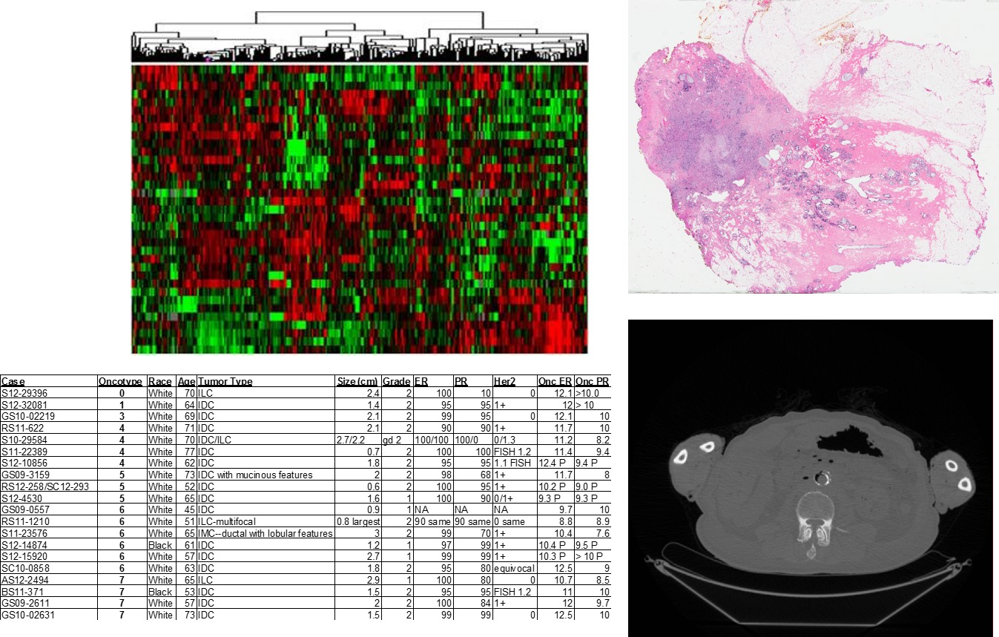
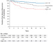
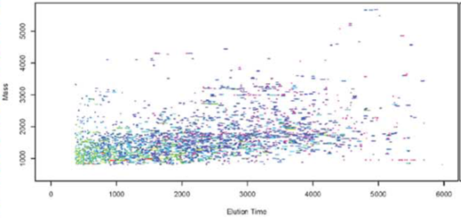
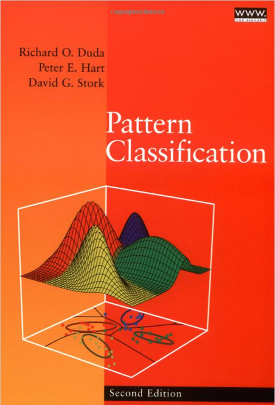
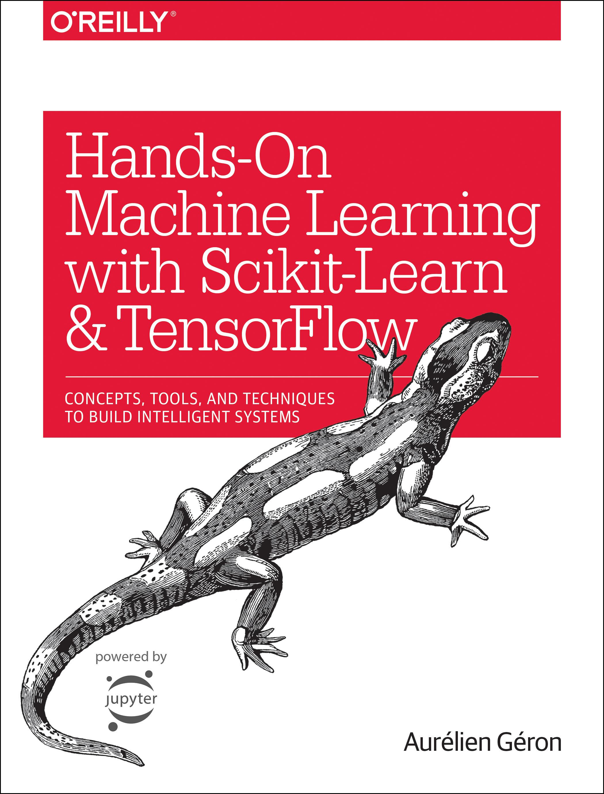

# 

## Welcome! 

## Instructor Information

Scott Doyle

PAS, BME, BMI

~~Downtown: 4205 JSMBS (M, W, F)~~ 
~~North: 215-J Bonner Hall (Tu, Th)~~ 
The Internet

<i class="fa fa-envelope"></i> scottdoy@buffalo.edu 
<i class="fa fa-phone"></i> ~~716.829.2005~~ 
<i class="fa fa-globe"></i> [***www.scottdoy.com***](http://www.scottdoy.com)

## Machine Learning

A Brief Introduction

## Machine Learning Definitions

**Machine Learning** (ML) uses **collected data** to do something useful.

<ul>
<li class="fragment">Find underlying patterns (**knowledge discovery**)</li>
<li class="fragment">Simplify a complex phenomenon (**model building**)</li>
<li class="fragment">Place data into categories (**classification**)</li>
<li class="fragment">Predict future data (**regression**)</li>
</ul>

## Machine Learning Definitions

The job of the ML expert is to:

<ul>
<li class="fragment">Understand and identify the **goal**</li>
<li class="fragment">Collect **data**</li>
<li class="fragment">Select an appropriate **model** or **algorithm**</li>
<li class="fragment">Evaluate the system in terms of **costs**</li>
</ul>

## Types of Machine Learning

**Supervised Learning**

Use **labeled datasets** to classify new, unseen data

 
**Unsupervised Learning**

Use **unlabeled data** to identify natural groups

**Semi-Supervised Learning**

Use **partially labeled** data 
to handle the process

 
**Reinforcement Learning**

An **agent** learns to complete a task **policy** of rewards

 

# 

## Data Definitions

The starting point for all ML algorithms is **data**.

So... what do we mean by "data"?

## Data Comes in Many Forms

{ width=70% }

## Data Comes from Many Places

|              |            |
|:-------------|-----------:|
| Symptoms     | Lab Tests  |
| Demographics | Imaging    |
| Cultures     | Sequencing |

Data quantifies a specific **subject** (e.g. patient) through a set of
**measurements**.

## Computational Pathology:  Expression of Disease State

Biological structure is **primary data**. 

We can quantify **biological structure**.

We can **model** relationships between **structure and disease**.

## Fundamental Hypothesis

Changes in genomic expression manifest as physical changes in tumor morphology

{ width=80% }

 
{ width=80% }

<small>
S. S. Badve et al., JCO (2008),
Paik et al., N Engl J Med (2004)
</small>

## Fundamental Hypothesis 

Changes in genomic expression manifest as physical changes in tumor morphology

{ width=80% }

<small>
S. S. Badve et al., JCO (2008),
Paik et al., N Engl J Med (2004)
</small>

## Data Fusion Improves Predictions

{ height=30% }

{ height=30% }

{ height=30% }

{ height=30% }

{ height=30% }

## Atoms to Anatomy Paradigm

{ width=100% }

{ height=356 width=456 }

{ height=356 width=456 }

{ height=356 width=456 }

{ height=356 width=456 }

{ height=356 width=456 }

{ height=356 width=456 }

#

## Example Problem

Fine Needle Aspirate Classification

## Example: Biomedical Image Analysis

{ width=80% }

 
{ width=80% }

## Fine Needle Aspirates

{ width=80% }

 
{ width=80% }

**Problem Statement** 

Predict whether a patient's tumor is benign or malignant, given an FNA image

## Building Informative Features

**Domain knowledge** identifies useful features.

Pathologists already distinguish **benign** from **malignant** tumors.

Our job is to convert **qualitative** features to **quantitative** ones.

## Building Informative Features

The pathologist lists **cell nuclei** features of importance:

1. Radius
2. Texture
3. Perimeter
4. Area
5. Smoothness

6. Compactness
7. Concavity
8. Concave Points
9. Symmetry
10. Fractal Dimension

**Feature extraction** results in 30 feature values per image.

## Selecting Features for the FNA

To begin, we collect **training samples** to build a model.

<ul>
<li class="fragment">Collect a lot of example images for each class</li>
<li class="fragment">Get our expert to label each image as "Malignant" or "Benign"</li>
<li class="fragment">Measure the features of interest (image analysis or by hand)</li>
<li class="fragment">Build a histogram of the measured feature</li>
</ul>

## Texture of the Nuclei

<iframe frameborder="0" seamless='seamless' scrolling=no src="plots/texture_mean.html"></iframe>

## Selecting New Features

The histograms are similar, with **significant overlap** between classes.

Our pathologist tells us that malignant nuclei are often **larger** than
benign nuclei, so we can build a second histogram for this new feature.

## Average Radius of the Nuclei

<iframe frameborder="0" seamless='seamless' scrolling=no src="plots/radius_mean.html"></iframe>

## Characteristics of Good Features

Better! In general, "good" features for ML are:

**Descriptive:** Similar within a class, and different between classes

**Relevant:** Features should make sense

**Invariant:** Not dependent on how you measure them

## Calculating Probabilities from Features

<iframe frameborder="0" seamless='seamless' scrolling=no src="plots/pdf_cdf.html"></iframe>

## Combinations of Features

**Combining features** often yields greater class separation.

We can visualize two features as a **scatter plot**.

Each point is an object,
and each axis is a dimension or a feature.

## Multivariate Distribution

<iframe frameborder="0" seamless='seamless' scrolling=no src="plots/scatter_histogram_plot.html"></iframe>

## Variance vs. Generalization

Linear boundaries do not model **variance** and miss obvious trends.

Complex boundaries fit training perfectly, but do not **generalize**.

In general, you want the **simplest** model with the best **performance**.

## Tradeoff: Variance vs. Generalization

Each of these decision boundaries makes errors!

There is always a tradeoff; we need to consider the **cost**.

Cost is defined by our goals and acceptable performance.

## Costs

It is important to recognize the difference between **cost** and **risk**. 

<ul>
<li class="fragment">Risk is the likelihood you have made an error.</li>
<li class="fragment">Cost is the penalty associated with making that error.</li>
</ul>

## Cost Weighting

Should we prioritize some kinds of errors over others?

Not all mistakes carry the same cost. For example:

- A patient is told they have a tumor when they do not (**false positive**)
- A patient is told they are cancer-free when they are not (**false negative**)

## In Summary

Machine learning turns raw data into **actionable** insights.

We will cover theory and implementation of popular methods.

<ul>
<li class="fragment">
How could you apply these methods to your own data?
</li>
<li class="fragment">
How could quantitative techniques help test hypotheses and generate novel experiments?
</li>
</ul>

# 

## Course Details

## Interactive Sessions

Interactive sessions every Tuesday 1:00pm -- 3:00pm (Zoom)

Two lectures per week, posted Tuesday and Thursday

Attendance is based on watching the recorded lectures OR attending the
interactive session and participating (you are free to do both)

## Course Resources: Textbooks

*Pattern Classification, 2nd Edition*

- Duda, Hart, and Stork (DHS)
- ISBN 978-0-471-05669-0

NOT required, but HIGHLY recommended if you are interested in the
material.

Also sold with a companion MATLAB book by Stork and Yom-Tov.

{width=60%}

## Course Resources: Textbooks

*Hands On Machine Learning with Scikit-Learn and Tensorflow*

- Aurélien Géron
- ISBN 978-1491962299

Very focused on applications in Python programming.
 

We will not use Tensorflow but we will make heavy use of Scikit-Learn.

{width=60%}

## Programming Expectations

This is **not** a programming class; it is a class that **uses**
programming.

Spend time designing algorithms, not debugging.

Programming is a tool to get what you want -- if you define what you
want up front, the programming almost doesn't matter. (Almost.)

## Programming Tools: MATLAB

Most of you probably have experience with ***MATLAB***.

<ul>
<li class="fragment">You should already know it</li>
<li class="fragment">Toolboxes implement most low-level algorithms</li>
<li class="fragment">It's what the BME Department supports</li>
<li class="fragment">If you are new, it's not hard to pick up</li>
</ul>

## Programming Tools: Python

***Python*** is a great alternative.

<ul>
<li class="fragment">It's free! It's cross-platform!</li>
<li class="fragment">Libraries extend the base Python, just like MATLAB Toolboxes</li>
<li class="fragment">"Anaconda" distribution is specifically for data science: [https://www.continuum.io/downloads](https://www.continuum.io/downloads)</li>
<li class="fragment">Can convert between MATLAB to Python relatively easily</li>
<li class="fragment">Most common language for academic / "hobby" ML</li>
</ul>

## Programming Tools: Other

Feel free to use any language you like for your
assignments (R, Lua, C++, Fortran...)

I will provide help where I can, but I am most familiar with MATLAB and Python.

## Programming Help

Here's a reasonable workflow when you get an error:

<ol>
<li class="fragment">Write down in English what you're trying to do.</li>
<li class="fragment">Google that sentence with "PYTHON" on the end.</li>
<li class="fragment">If that doesn't work, ask someone!</li>
</ol>

## Programming Help

*General:*
: Google is your friend!
: StackOverflow: ***[stackoverflow.com](http://www.stackoverflow.com)***

*MATLAB:*
: Mathworks Website: ***[mathworks.com](http://www.mathworks.com)***

*Python:*
: Beginner's Guide: ***[wiki.python.org/moin/SimplePrograms](http://wiki.python.org/moin/SimplePrograms)***
: Scientific Docs: ***[docs.scipy.org/doc/](http://docs.scipy.org/doc/)***

## Course Evaluation

You will be graded primarily on four components:

<ul>
<li class="fragment">**Participation**: Watch videos, attend Tuesdays, ask questions</li>
<li class="fragment">**Assignments**: 4 assignments per semester</li>
<li class="fragment">**Paper Presentation**: 15-minute formal presentation to the class</li>
<li class="fragment">**Final Project**: Due at the end of the semester</li>
</ul>

## Course Evaluation: Assignments

Assignments will be assessed on:

<ul>
<li class="fragment">Whether you did the assignment</li>
<li class="fragment">Writing up what you did, what happened, and your interpretation</li>
<li class="fragment">How well you implemented what you learned in class</li>
</ul>

The assignments **build on each other** (so don't delete it when you're done!)

## Course Evaluation: Presentations

Class presentations can be any of the following:

<ul>
<li class="fragment">**Paper Discussion**: Critical summary of a paper.</li>
<li class="fragment">**Assignment / Project Presentation**: Discuss the status of your project.</li>
<li class="fragment">**Research Discussion**: If you doing research outside of
class, tell us about it!</li>
</ul>

## Course Evaluation: Presentations

Presentations should be recorded and uploaded to the UBLearns site.

I will ask questions based on your presentation, and your answers will be part
of the evaluation.

Alternatively, you can give a presentation live during the Tuesday session
(please e-mail me!)

## Course Evaluation: Projects

Assignments build pieces of a classification system. 

The project just ties it all together with a formal writeup and hand-in.

<ul>
<li class="fragment">If you understand and complete the assignments, the project is a breeze.</li>
<li class="fragment">If you fall behind or don't grasp the assignments, it's less pleasant.</li>
</ul>

## Group Work Policy

You can group up for assignment and project following rules:

<ul>
<li class="fragment">Keep it to **3 people** or fewer.</li>
<li class="fragment">Your group **must stay the same** throughout the semester.</li>
<li class="fragment">Assignments must include group names **and contributions**.</li>
<li class="fragment">Groups are graded **together** on the assigments and project.</li>
</ul>

# 

## Course Topics Overview

## Expected Topics: Traditional ML

- Bayesian Decision Theory
- Nonmetric Methods: Decision Trees and Random Forests
- Linear Discriminants and Perceptrons
- Support Vector Machines
- Parametric and Non-Parametric Techniques
- Clustering and Expectation Maximization
- Component Analysis and Dimensionality Reduction
- Boosting and Classifier Ensembles

## Expected Topics: Deep Learning and AI

- Neural Networks
- CNNs
- RNNs
- Reinforcement Learning
- Ethics and Meta-issues with ML / AI

## (Un)Expected Topics

If you are interested in something, e-mail me and we can cover it.

## Course Content Overview: Background

*Linear Algebra:*
: Matrix Inner / Outer Products
: Derivatives, Determinants, Trace
: Eigenvectors / Eigenvalues

*Probability Theroy:*
: Discrete Random Variables, Dependence
: Expected Value, Standard Deviation
: Gaussian Distributions

*Information Theory:*
: Entropy
: Mutual Information
: Computational Complexity

# 
## Next Class

## Mathematical Background and Coding Intro

In the next lecture we will cover:

<ul>
<li>Machine Learning design philosophy and project setup</li>
<li class="fragment">Introduction to programming environment and resources</li>
<li class="fragment">Mathematical background and foundations</li>
</ul>
## Instructor Information

Scott Doyle

PAS, BME, BMI

~~Downtown: 4205 JSMBS (M, W, F)~~ 
~~North: 215-J Bonner Hall (Tu, Th)~~ 
The Internet

<i class="fa fa-envelope"></i> scottdoy@buffalo.edu 
<i class="fa fa-phone"></i> ~~716.829.2005~~ 
<i class="fa fa-globe"></i> [***www.scottdoy.com***](http://www.scottdoy.com)

## Thank You!

