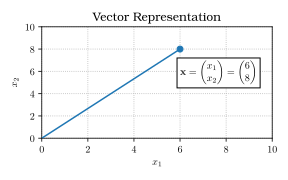
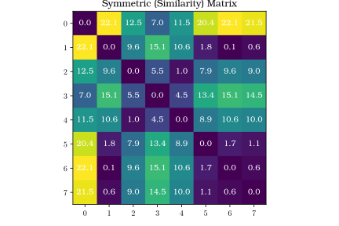
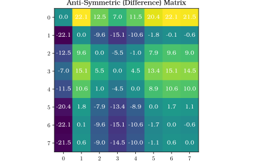

# 
## Presentation Formats and Advice
## Presentations: Overview

<ul>
<li class="fragment">Online sign-up sheet for scheduling presentations</li>
<li class="fragment">Up to **three** slots per class</li>
<li class="fragment">Each presentation should be **10 minutes**, plus questions</li>
</ul>

## Presentation: Goals

Presentations have two goals:

<ol> 
<li class="fragment">**Learn** about how the tools discussed in class are implemented in the real world;</li> 
<li class="fragment">**Share** that knowledge with the class; and</li> 
<li class="fragment">**Think critically** about published work.</li> 
</ol>

## Presentation Format: Introduction

<ul>
<li class="fragment">What is the domain, purpose, and central problem of the research?</li>
<li class="fragment">How is the current research improving upon state of the art?</li>
<li class="fragment">What is the proposed answer to the problem?</li>
<li class="fragment">**Why is the suggested approach valid or not valid?**</li>
</ul>

## Presentation Format: Methodology

<ul>
<li class="fragment">What is the data, and how is it organized, labeled, and processed?</li>
<li class="fragment">What features are extracted from the data prior to classification?</li>
<li class="fragment">**Can you think of other features that would work better?**</li>
<li class="fragment">**What would an "ideal" feature be, and how could you extract it?**</li>
</ul>

## Presentation Format: Experimental Design

<ul>
<li class="fragment">What is the experimental setup? Constraints? Variables? Controls?</li>
<li class="fragment">Is their design appropriate? What are its flaws and limitations?</li>
<li class="fragment">**Given this setup, will the hypothesis be conclusively answered?**</li>
</ul>

## Presentation Format: Results

<ul>
<li class="fragment">What was the outcome of the experiments?</li>
<li class="fragment">Were they reported properly (standard deviations, significance, etc.)?</li>
<li class="fragment">**Would you confirm or reject the hypothesis at this point?**</li>
</ul>

## Presentation Format: Discussion

<ul>
<li class="fragment">Do the authors address your concerns?</li>
<li class="fragment">Does the paper clearly set up the next set of experiments?</li>
<li class="fragment">**Are there any “incriminating” facts tucked away in the discussion section?**</li>
<li class="fragment">Do the authors come to the same set of conclusions that you did?</li>
</ul>

## Presentation Format: General

<ul>
<li class="fragment">Did you like the paper?</li>
<li class="fragment">Was it confusing, too simple, etc.?</li>
</ul>

<p class="fragment">
These are **guidelines**, feel free to tinker with the format to include
things you want to discuss.
</p>

# 
## Foundations and Background
## Goals of this Lecture

What you **should** be able to do at the end of this lecture:

<ul>
<li class="fragment">Understand / decipher basic mathematical notation</li>
<li class="fragment">Recall linear algebra up to and including eigenvalues / eigenvectors</li>
<li class="fragment">Understand random variables, dependence, conditional probability, normal (Gaussian) distributions, and the Central Limit Theorem</li>
</ul>

## Goals of this Lecture

What you **are not** expected to do:

<ul>
<li class="fragment">Be fluent in reading mathematical symbols and notations</li>
<li class="fragment">Derive functions and equations from first principles</li>
<li class="fragment">Understand every slide right away</li>
</ul>

<p class="fragment">For now we are focused on **application**.</p>

# 
## Mathematical Notation
## Vectors

A single object is characterized by the features in each
column. 

<p class="fragment">
Each feature / column is a **dimension** of that
patient.
</p>

<p class="fragment">
We can write this out as a \$d\$-dimensional **column vector** \$\\mathbf{x}\$, which can
be written as:
</p>

$$\mathbf{x} =
	\begin{pmatrix}
	x_{1} \\
	x_{2} \\
	\vdots \\
	x_{d}
	\end{pmatrix}$$

## There's a Reason It's Called a Vector

In our dataset, \$x_{1}\$ is the mean nuclei radius for this patient, \$x_{2}\$
is the mean texture, and so on. 

<p class="fragment">There are 30 features, so \$d=30\$.</p>

<p class="fragment">You can imagine the vector as **a point in \$d\$-dimensional space**.</p> 

## There's a Reason It's Called a Vector

For simplicity, let's pretend we have two features to describe the patient, so \$d=2\$:

$$\mathbf{x} =
    \begin{pmatrix}
    6 \\
    8
    \end{pmatrix}$$

## Representation of Vectors in Space

{ width=70% }

## Matrices

We can group several vectors together as a **matrix**. 

<p class="fragment">
We have \$n\$ patients' worth of feature vectors in our dataset. We can represent the whole
dataset as a matrix \$\\mathbf{M}\$:
</p>

<p class="fragment">
$$\mathbf{M} =
\begin{pmatrix}
m_{11} & \cdots & m_{1d} \\
\vdots & \ddots & \vdots \\
m_{n1} & \cdots & m_{nd}
\end{pmatrix}$$
</p>

## Matrices

$$\mathbf{M} =
	\begin{pmatrix}
	m_{11} & \cdots & m_{1d} \\
	\vdots & \ddots & \vdots \\
	m_{n1} & \cdots & m_{nd}
	\end{pmatrix}$$

This matrix is:

<ul>
<li class="fragment">\$n\\times d\$ dimension</li>
<li class="fragment">Rectangular (\$n\$ doesn't necessarily equal \$d\$)</li>
</ul>

## Uses of Matrices

Matrices can be used to represent all kinds of things, like transforms, rotations, gradient fields, etc.

<p class="fragment">For our FNA features, \$n=569\$ and \$d=30\$, so \$\\mathbf{M}\$ has dimensionality \$569\\times 30\$.</p>

<p class="fragment">When writing the dimensionality of a matrix, it is conventional to write "rows" x "columns":</p>

<ul>
<li class="fragment">A 3x2 matrix has three rows and two columns</li>
<li class="fragment">A 2x3 matrix has two rows and three columns.</li>
</ul>

## Vector and Matrix Transpose

The **transpose** of a vector or matrix basically "flips" the rows and columns.

<p class="fragment">
The transpose of column vector \$\\mathbf{x}\$ is a **row vector**, written as
\$\\mathbf{x}^{T}\$:
</p>

<p class="fragment">
\$\\mathbf{x}^{T} = (x_{1}, x_{2}, \\cdots, x_{d})\$
</p>

## Matrix Transpose

Similarly the transpose of \$\\mathbf{M}\$ is \$\\mathbf{M}^{T}\$:

<div class="l-double">
<div>
$$ \mathbf{M} =
	\begin{pmatrix}
	m_{11} & \cdots & m_{d1} \\
	\vdots & \ddots & \vdots \\
	m_{1n} & \cdots & m_{nd}
	\end{pmatrix}$$
</div>
<div>
$$ \mathbf{M}^{T} =
	\begin{pmatrix}
	m_{11} & \cdots & m_{n1} \\
	\vdots & \ddots & \vdots \\
	m_{1d} & \cdots & m_{dn}
	\end{pmatrix}$$

</div>
</div>

## Vector and Matrix Transpose

Mathematically, the \$ji\$-th entry of \$\\mathbf{M}^{T}\$ is
the \$ij\$-th entry of \$\\mathbf{M}\$.

Our FNA dataset \$\\mathbf{M}\$ goes from a \$569
\\times 30\$ matrix to a \$30 \\times 569\$ matrix
\$\\mathbf{M}^{T}\$.

<div class="l-double">
<div>
$$ \mathbf{M} =
	\begin{pmatrix}
	m_{11} & \cdots & m_{d1} \\
	\vdots & \ddots & \vdots \\
	m_{1n} & \cdots & m_{nd}
	\end{pmatrix}$$
</div>
<div>
$$ \mathbf{M}^{T} =
	\begin{pmatrix}
	m_{11} & \cdots & m_{n1} \\
	\vdots & \ddots & \vdots \\
	m_{1d} & \cdots & m_{dn}
	\end{pmatrix}$$

</div>
</div>

## Dimensionality Terminology

**Dimensionality** refers to the number of rows and columns in a vector or
matrix:

<ul>
<li class="fragment">A vector \$\\mathbf\{x\}$ with \$d\$ elements is a **\$d\$-dimensional vector**</li>
<li class="fragment">A matrix \$\\mathbf{M}\$ with \$n\$ rows and \$d\$ columns **has dimensions \$n\\times d\$**</li>
</ul>

<p class="fragment">
Informally the first axis is "rows", the second is "columns." 
</p>

<p class="fragment">
Third axis: "planes" or "pages".
</p>

<p class="fragment">
Beyond that: dimension number.
</p>

## Matrix Symmetry and Anti-Symmetry

A square (\$d\\times d\$) matrix is **symmetric** if \$m_{ij} = m_{ji}\$.

<p class="fragment">
An example of a symmetric matrix is a **similarity matrix**, where \$m_{ij}\$ is
the "distance" between \$i\$ and \$j\$ in your dataset.
</p>

<p class="fragment">
How would you calculate this?
</p>

## Python Implementation of Similarity Matrix

``` {python}

# Initialize
import numpy as np
import pandas as pd
from sklearn import preprocessing

# Load up the breast cancer dataset to use
DATAPATH = '/path/to/the/data.csv'
df = pd.read_csv(DATAPATH)

# Pull the data from the dataframe and scale it
simdata = df.iloc[:, 2:32:2].as_matrix()
simdata_scaled = preprocessing.scale(simdata)

# Set up the distance calculation
result = np.zeros((simdata_scaled.shape[0], simdata_scaled.shape[0]))
for i in range(simdata_scaled.shape[0]):
    for j in range(simdata_scaled.shape[0]):
        result[i,j] = np.abs(np.sum(simdata_scaled[i,:] - simdata_scaled[j,:]))

```

## Matrix Symmetry Heatmap

{ width=60% }

## Matrix Anti-Symmetry

A matrix is **anti-symmetric** if \$m_{ij} = -m_{ji}\$. 

<p class="fragment">
Similarity is typically positive. 
</p>

<p class="fragment">
A "signed" direction can be negative if the distance from \$i\\rightarrow j\$ is the
**negative** distance from \$j\\rightarrow i\$. 
</p>

<p class="fragment">
We will discuss these later when we talk about signed distance functions.
</p>

## Matrix Anti-Symmetry

{ width=60% }

## Matrix Negativity, Shape, Diagonality

A **non-negative** matrix has all elements greater than 0:

\$m_{ij}\\geq0\\quad\\forall i,j\$

<p class="fragment">A matrix is **square** if it has the same number of rows and columns: \$n=d\$.</p>

<p class="fragment">A square matrix is **diagonal** if all off-diagonal elements are \$0\$, and is written:</p> 

<p class="fragment">\$\\textrm{diag}(m_{11},m_{22},\\ldots,m_{dd})\$</p>

## Identity Matrix

An important matrix is the ***identity matrix***:

$$\mathbf{I} =
	\begin{pmatrix}
	1 & 0 & 0 \\
	0 & 1 & 0 \\
	0 & 0 & 1
	\end{pmatrix}$$

<p class="fragment">\$\\mathbf{I}\$ can be any size, but it MUST be square.</p>

<p class="fragment">
We can use this to enable operations between incompatible types (more on this
later, in the eigenvector section).
</p>

# 
## Matrix Operations
## Vector Addition and Subtraction

You can add and subtract vectors only if they both have the same
dimensionality. This results in **another vector**:

$$\mathbf{x} + \mathbf{y} =
	\begin{pmatrix}
	x_{1} + y_{1} \\
	x_{2} + y_{2} \\
	\vdots \\
	x_{d} + y_{d}
	\end{pmatrix}
=
	\begin{pmatrix}
	w_{1} \\
	w_{2} \\
	\vdots \\
	w_{d}
	\end{pmatrix}
= \mathbf{w}$$

## Vector Addition and Subtraction

You can add and subtract vectors only if they both have the same
dimensionality. This results in **another vector**:

$$\mathbf{x} - \mathbf{y} =
	\begin{pmatrix}
	x_{1} - y_{1} \\
	x_{2} - y_{2} \\
	\vdots \\
	x_{d} - y_{d}
	\end{pmatrix}
=
	\begin{pmatrix}
	z_{1} \\
	z_{2} \\
	\vdots \\
	z_{d}
	\end{pmatrix}
= \mathbf{z}$$

## Matrix Addition and Subtraction

This is similar to matrix addition and subtraction: \$\\mathbf{A}\$ and
\$\\mathbf{B}\$ must be the same size, and this results in a **matrix**:

$$\mathbf{A} + \mathbf{B} =
	\begin{pmatrix}
	a_{11}+b_{11} & \cdots & a_{1d}+b_{1d} \\
	\vdots & \ddots & \vdots \\
	a_{n1}+b_{n1} & \cdots & a_{nd}+b_{nd}
	\end{pmatrix} =
    \begin{pmatrix}
    c_{11} & \cdots & c_{1d} \\
    \vdots & \ddots & \vdots \\
    c_{n1} & \cdots & c_{nd}
    \end{pmatrix} = 
    \mathbf{C}$$

## Matrix Addition and Subtraction

This is similar to matrix addition and subtraction: \$\\mathbf{A}\$ and
\$\\mathbf{B}\$ must be the same size, and this results in a **matrix**:

$$\mathbf{A} - \mathbf{B} =
	\begin{pmatrix}
	a_{11}-b_{11} & \cdots & a_{1d} - b_{1d} \\
	\vdots & \ddots & \vdots \\
	a_{n1}-b_{n1} & \cdots & a_{nd} - b_{nd}
	\end{pmatrix} =
    \begin{pmatrix}
    e_{11} & \cdots & e_{1d} \\
    \vdots & \ddots & \vdots \\
    e_{n1} & \cdots & e_{nd}
    \end{pmatrix} = 
    \mathbf{E}$$

## Vector Multiplication: Inner Product

For **vectors**, there are two types of multiplication: **inner** and
**outer** products. 

<p class="fragment">
For inner products, the two vectors \$\\mathbf{x}\$ and
\$\\mathbf{y}\$ must be the same dimensionality, and result in a **scalar**.
</p>

<div class="fragment">

$$\mathbf{x}^{T}\mathbf{y} =
	\begin{pmatrix}
	x_{1} &
	x_{2} &
	\cdots &
	x_{d}
	\end{pmatrix}
	\begin{pmatrix}
	y_{1} \\
	y_{2} \\
	\vdots \\
	y_{d}
	\end{pmatrix}
=
	\sum_{i=1}^{d}x_{i}y_{i}
=
z$$
</div>

## Vector Multiplication: Inner Product

$$\mathbf{x}^{T}\mathbf{y} =
	\begin{pmatrix}
	x_{1} &
	x_{2} &
	\cdots &
	x_{d}
	\end{pmatrix}
	\begin{pmatrix}
	y_{1} \\
	y_{2} \\
	\vdots \\
	y_{d}
	\end{pmatrix}
=
	\sum_{i=1}^{d}x_{i}y_{i}
=
z$$

**Remember**: 
<p class="fragment">
For INNER products, the transpose sign is on the
INSIDE of the two vectors. 
</p>

<p class="fragment">
The left-hand vector is a ROW vector, the other is a COLUMN vector.
</p>

## Vector Multiplication: Outer Product

For outer products, the result of multiplication is a **matrix**. 

<p class="fragment">
For
\$d\$-dimensional \$\\mathbf{x}\$ and \$n\$-dimensional \$\\mathbf{y}\$:
</p>
<div class="fragment">
$$\mathbf{x}\mathbf{y}^{T} =
	\begin{pmatrix}
	x_{1} \\
	x_{2} \\
	\vdots \\
	x_{d}
	\end{pmatrix}
	\begin{pmatrix}
	y_{1} &
	y_{2} &
	\cdots &
	y_{n}
	\end{pmatrix}
=
	\begin{pmatrix}
	x_{1}y_{1} &
	\cdots &
	x_{1}y_{n} \\
	\vdots &
	\ddots &
	\vdots \\
	x_{d}y_{1} &
	\cdots &
	x_{d}y_{n}
	\end{pmatrix}
=
\mathbf{M}$$
</div>

## Vector Multiplication: Outer Product

$$\mathbf{x}\mathbf{y}^{T} =
	\begin{pmatrix}
	x_{1} \\
	x_{2} \\
	\vdots \\
	x_{d}
	\end{pmatrix}
	\begin{pmatrix}
	y_{1} &
	y_{2} &
	\cdots &
	y_{n}
	\end{pmatrix}
=
	\begin{pmatrix}
	x_{1}y_{1} &
	\cdots &
	x_{1}y_{n} \\
	\vdots &
	\ddots &
	\vdots \\
	x_{d}y_{1} &
	\cdots &
	x_{d}y_{n}
	\end{pmatrix}
=
\mathbf{M}$$

\$\\mathbf{M}\$ is a \$d\\times n\$ dimensional matrix. It does NOT have to be square,
so \$\\mathbf{x}\$ and \$\\mathbf{y}\$ can be unequal lengths.

<p class="fragment">
**Remember**: For OUTER products, the transpose sign is on the
OUTSIDE of the two vectors. 
</p>

<p class="fragment">So the left vector is column, the right one
is row.</p>

## Matrix Multiplication

Two matrices can be multiplied if they have the same **inner
dimension**. 
<p class="fragment">
If \$\\mathbf{A}\$ is an \$n\\times d\$ matrix and \$\\mathbf{B}\$ is a
\$d\\times m\$ matrix, then the "inner dimension" is \$d\$.
</p>

<p class="fragment">
The resulting matrix has the same dimensions as the **outer dimension**, or
\$n\\times m\$. This depends on \$\\mathbf{A}\$ and \$\\mathbf{B}\$, and does NOT have to
be square.
</p>

## Matrix Multiplication

$$
\begin{align*}
\mathbf{AB} & =
	\underbrace{
		\begin{pmatrix}
		a_{11} & a_{12} & a_{13} \\
		a_{21} & a_{22} & a_{23} \\
        a_{31} & a_{32} & a_{33} \\
        a_{41} & a_{42} & a_{43} 
		\end{pmatrix}
	}_{\text{Dim: }4\times 3}
	\overbrace{
		\begin{pmatrix}
		b_{11} & b_{12} \\
		b_{21} & b_{22} \\
		b_{31} & b_{32} 
		\end{pmatrix}
	}^{\text{Dim: }3\times 2} \\
    & =
	\underbrace{
        \begin{pmatrix}
        a_{11}b_{11} + a_{12}b_{21} + a_{13}b_{31} &
        a_{11}b_{12} + a_{12}b_{22} + a_{13}b_{32} \\
        a_{21}b_{11} + a_{22}b_{21} + a_{23}b_{31} &
        a_{21}b_{12} + a_{22}b_{22} + a_{23}b_{32} \\
        a_{31}b_{11} + a_{32}b_{21} + a_{33}b_{31} &
        a_{31}b_{12} + a_{32}b_{22} + a_{33}b_{32} \\
        a_{41}b_{11} + a_{42}b_{21} + a_{43}b_{31} &
        a_{41}b_{12} + a_{42}b_{22} + a_{43}b_{32}
        \end{pmatrix}
    }_{\text{Dim: }4\times 2}
\end{align*}
$$

## Matrix \$\\times\$ Vector Multiplication

If \$\\mathbf{M}\$ is a \$n\\times d\$ matrix, it can be multiplied by a vector
\$\\mathbf{x}\$ of dimension \$d\$ to yield a **vector**:

$$\mathbf{Mx} =
	\begin{pmatrix}
	m_{11} & \cdots & \cdots & m_{1d} \\
	\vdots & \vdots & \ddots & \vdots \\
	m_{n1} & \cdots & \cdots & m_{nd}
	\end{pmatrix}
	\begin{pmatrix}
	x_{1} \\
	\vdots \\
	\vdots \\
	x_{d}
	\end{pmatrix}
=
	\begin{pmatrix}
	m_{11}x_{1} + \cdots + m_{1d}x_{d} \\
	\vdots \\
	m_{n1}x_{1} + \cdots + m_{nd}x_{d}
	\end{pmatrix}
=\mathbf{y}$$


## Matrix \$\\times\$ Vector Multiplication

$$\mathbf{Mx} =
	\begin{pmatrix}
	m_{11} & \cdots & \cdots & m_{1d} \\
	\vdots & \vdots & \ddots & \vdots \\
	m_{n1} & \cdots & \cdots & m_{nd}
	\end{pmatrix}
	\begin{pmatrix}
	x_{1} \\
	\vdots \\
	\vdots \\
	x_{d}
	\end{pmatrix}
=
	\begin{pmatrix}
	m_{11}x_{1} + \cdots + m_{1d}x_{d} \\
	\vdots \\
	m_{n1}x_{1} + \cdots + m_{nd}x_{d}
	\end{pmatrix}
=\mathbf{y}$$

\$\\mathbf{y}\$ has a dimensionality equal to the **rows** of \$\\mathbf{M}\$, where
the \$i\$-th element is:

$$ y_{i} = \sum_{j=1}^{d}m_{ij}x_{j} $$

## Commutive Properties

For inner products, the order of the vectors doesn't matter: 

\$\\mathbf{x}^{T} \\mathbf{y}=\\mathbf{y}^{T} \\mathbf{x}\$

<p class="fragment">For pretty much everything else, multiplication is **NOT commutive!**</p>

<p class="fragment">For example, \$\\mathbf{Mx}\\neq\\mathbf{xM}\$<span
class="fragment"> (In fact, \$\\mathbf{xM}\$ is undefined!)</span>
</p>


<p class="fragment">In general, you should evaluate equations left-to-right.</p>

## Linear Algebra Sanity Check

This can be intimidating if you haven't worked with it for awhile.

<p class="fragment">
At the very least, you should know what **kind of object** you get from an
equation? (Scalar, Vector, or Matrix)
</p>

<p class="fragment">When attempting to figure out a paper or an equation, ask yourself:</p>

<ul>
<li class="fragment">What does each term represent in the equation?</li>
<li class="fragment">What is the dimensionality of each term?</li>
<li class="fragment">Can I group operations to work through one piece at a time?</li>
<li class="fragment">If I work through each operation, what do I get?</li>
</ul>

## Linear Algebra Sanity Check

For example, what does the following equation yield?

\$\\mathbf{x}^{T}\\mathbf{yM}\\mathbf{z}=\\textrm{??}\$

(Assume all the dimensions are correct, given the ordering.)

## Linear Algebra Sanity Check

\$\\mathbf{x}^T\\mathbf{yMz}=\\textrm{??}\$

- \$\\mathbf{x, y, z}\$ are vectors, and \$\\mathbf{M}\$ is a matrix.
- Assume the dimensions are all correct
	- \$\\mathbf{x}\$ and \$\\mathbf{y}\$ must be the same size
	- If \$\\mathbf{M}\$ is \$n\\times m\$, then \$\\mathbf{z}\$ must be \$m\$-dimensional
- \$\\mathbf{x}^{T}\\mathbf{y}\$ is an inner product, so that yields a **scalar**
- A scalar times a matrix yields another matrix of the **same dimensions**
- A matrix times a vector yields a **vector** with the **outer dimension**
  of the matrix (\$n\$, in this example)

## Linear Algebra Sanity Check (Matlab)

``` {matlab}

% First set up our vectors (must be equal size)
x = rand(3,1);
y = rand(3,1);

% Then the matrix (can be any dimension)
M = rand(4,5);

% Last vector size must match the matrix's second dimension (5)
z = rand(5,1);

% Now solve and output to console:
result = x' * y * M * z
```

``` {pre}

result =
    0.4332
    0.2973
    0.6395
    0.4119
```

## Vector Norms and Orthogonality

The **Euclidean Norm** of a vector is its **length**, calculated as:

$$ \|\mathbf{x}\| = \sqrt{\mathbf{x}^{T}\mathbf{x}} $$

<div class="fragment">
The angle between two vectors \$\\mathbf{x}\$ and \$\\mathbf{y}\$, called \$\\theta\$,
can be calculated as:

$$ \cos{\theta} = \frac{\mathbf{x}^{T}\mathbf{y}}{\|\mathbf{x}\|\|\mathbf{y}\|} $$
</div>

## Orthogonality and Colinearity

<div class="l-double">
<div>
**Vector Norm**

$$ \|\mathbf{x}\| = \sqrt{\mathbf{x}^{T}\mathbf{x}} $$
</div>
<div>
**Vector Angle**

$$ \cos{\theta} = \frac{\mathbf{x}^{T}\mathbf{y}}{\|\mathbf{x}\|\|\mathbf{y}\|} $$
</div>
</div>

Special Cases:

<ul>
<li class="fragment">
\$\\mathbf{x}^{T}\\mathbf{y} = 0\$: thus, \$\\cos{\\theta}=0\$ and \$\\theta=90^\\circ\$,
and \$\\mathbf{x}\$ and \$\\mathbf{y}\$ are **orthogonal** (at right angles).</li>
<li class="fragment">\$\\|\\mathbf{x}^{T}\\mathbf{y}\\|=\\|\\mathbf{x}\\|\\|\\mathbf{y}\\|\$: thus
\$\\cos{\\theta} = 1\$ and \$\\theta = 0^\\circ\$, and \$\\mathbf{x}\$ and \$\\mathbf{y}\$ are
**colinear** (same line).</li>
</ul>

## Linear Independence

Vectors are **linearly independent** if none can be written
as a combination of any two others.

<p class="fragment">
They are all orthogonal to one another.
</p>

<p class="fragment">
A set of \$d\$ linearly independent vectors **spans** a \$d\$-dimensional space.
</p>
<p class="fragment">
In other words, any vector in the space can be written as a combination of the
spanning vectors.
</p>

<p class="fragment">
Think of the Cartesian coordinate system: Each vector is drawn as a
**combination** of the \$x\$ and \$y\$ axes.
</p>

## Cartesian Coordinates

<div class="l-double">
<div>
{ width=80% }
</div>
<div>
$$\mathbf{x} = \begin{pmatrix}1\\0\end{pmatrix}\times 6 + \begin{pmatrix}0\\1\end{pmatrix}\times 8 =  \begin{pmatrix}6\\8\end{pmatrix}$$
</div>
</div>

## Vector and Matrix Derivatives

The derivative of a function \$f(\\mathbf{x})\$, which operates on a
\$d\$-dimensional vector \$\\mathbf{x}\$, is calculated component-by-component:

<div class="l-double">
<div>
<div class="fragment">
$$ \nabla f(\mathbf{x}) = \frac{\partial f(\mathbf{x})}{\partial \mathbf{x}} =
\begin{pmatrix}
\frac{\partial f(\mathbf{x})}{\partial x_{1}} \\
\frac{\partial f(\mathbf{x})}{\partial x_{2}} \\
\vdots \\
\frac{\partial f(\mathbf{x})}{\partial x_{d}}
\end{pmatrix}$$
</div>
</div>
<div>
<p class="fragment">
What we're getting here is the derivative of a function of \$\\mathbf{x}\$ with
respect to each dimension of \$\\mathbf{x}\$.
</p>

<p class="fragment">We can define matrix functions and their derivatives similarly.</p>
</div>
</div>

## Matrix Determinant

The determinant of \$\\mathbf{M}\$, denoted \$|\\mathbf{M}|\$, can be calculated for
any square matrix. Determinants are used for a lot of things:

<ul>
<li class="fragment">Finding eigenvalues and eigenvectors,</li>
<li class="fragment">To tell if the columns of the matrix are linearly independent,</li>
<li class="fragment">To tell if the inverse of a matrix exists,</li> 
<li class="fragment">For a whole bunch of other things (solving systems of equations...)</li>
</ul>

## Matrix Determinant

For a \$2\\times 2\$ matrix, the determinant is calculated as \$|\\mathbf{M}| =
m_{11}m_{22} - m_{21}m_{12}\$. For a \$3\\times 3\$ matrix, the determinant is
calculated by "sweeping":

<div class="fragment">
$$
\begin{align*}
|\mathbf{M}|
& =
\begin{vmatrix}
m_{11} & m_{12} & m_{13} \\
m_{21} & m_{22} & m_{23} \\
m_{31} & m_{32} & m_{33}
\end{vmatrix}\\
& =
m_{11}m_{22}m_{33} + m_{13}m_{21}m_{32} + m_{12}m_{23}m_{31}\\
& - m_{13}m_{22}m_{31} - m_{11}m_{23}m_{32} - m_{12}m_{21}m_{33}
\end{align*}
$$
</div>
<p class="fragment">
There are methods for finding larger matrices, including **expansion by
minors**, which we won't go over.
</p>

## Matrix Trace

The **trace** of a square matrix, \$\\textrm{Tr}\[\\mathbf{M}\]\$, is the sum of its diagonal
elements:

$$ \textrm{Tr}[\mathbf{M}] = \sum_{i=1}^{d}m_{ii} $$

## Determinant and Trace Properties

Properties of determinants and traces:

<ul>
<li class="fragment">\$|\\mathbf{M}| = |\\mathbf{M}^{T}|\$</li>
<li class="fragment">\$|\\mathbf{MN}| = |\\mathbf{M}||\\mathbf{N}|\$</li>
<li class="fragment">Trace and determinants are independent to rotations of the coordinate system</li>
<li class="fragment">If \$|\\mathbf{M}|=0\$, this means that the columns of the matrix are **NOT** linearly independent</li>
<li class="fragment">The determinant of a matrix must be nonzero for the **inverse** of the matrix to exist (more on this in a moment)</li>
</ul> 

## Eigenvectors & Eigenvalues

Given a \$d\\times d\$ square matrix \$\\mathbf{M}\$ as a transformation operation in
\$d\$-dimensional space, then the eigenvector represents the **direction** of
the transformation while the associated eigenvalue represents the
**magnitude** of the transformation.

<p class="fragment">
Check out a
demonstration here:
***[http://setosa.io/ev/eigenvectors-and-eigenvalues/](http://setosa.io/ev/eigenvectors-and-eigenvalues/)***
</p>

## Finding Eigenvectors

Given a \$d\\times d\$ **square** matrix \$\\mathbf{M}\$, we can write a linear
equation of the form:

\$\\mathbf{Mx}=\\lambda\\mathbf{x}\$

which can be rewritten as:

\$ \\left(\\mathbf{M} - \\lambda\\mathbf{I}\\right)\\mathbf{x} = \\mathbf{0},\$

where \$\\mathbf{0}\$ is the \$d\$-dimensional zero vector. Then solve for two
unknowns, \$\\mathbf{x}\$ and \$\\lambda\$. 

## Finding Eigenvectors

The solutions are denoted \$\\mathbf{e}\_i\$
and \$\\lambda_{i}\$, respectively, where the subscript \$i\$ indicates that there
may be multiple solutions.

If \$\\mathbf{M}\$ is real and symmetric, then there are \$d\$ solution vectors,
\$\\{\\mathbf{e}\_1, \\mathbf{e}\_2, \\cdots, \\mathbf{e}\_d\\}\$ with associated
eigenvalues \$\\{\\lambda\_1, \\lambda\_2, \\cdots, \\lambda\_d\\}\$.

## Finding Eigenvalues

Eigenvalues can be found by solving the **characteristic equation**:

\$|\mathbf{M}-\\lambda\\mathbf{I}| = \\lambda^{d} + a_1\\lambda^{d-1} + \\cdots +
a_{d-1}\\lambda + a_{d} = 0 \$

for each of its \$d\$ roots. For the \$i\$-th root, we solve a set of equations to
find the associated eigenvector \$\\mathbf{e}_{i}\$.

<p class="fragment">
**Explanation**: If you think of \$\\mathbf{M}\$ as a transformation operation in
\$d\$-dimensional space, then the eigenvector represents the **direction** of
the transformation while the associated eigenvalue represents the
**magnitude** of the transformation.
</p>

## Determinant / Trace and Eigenvalue / Eigenvector

The trace of a matrix is the sum of the eigenvalues, and the determinant is
their product:

$$ \textrm{Tr}[\mathbf{M}] = \sum_{i=1}^{d}\lambda_{i} \quad\text{and}\quad |\mathbf{M}|
= \prod_{i=1}^{d}\lambda_{i} $$

When we go over Principal Component Analysis and other clustering techniques, we
will revisit eigenvalues / eigenvectors.

# 

## Probability Theory

## Random Variables

A **variable**, denoted \$x\$, can be thought of as a placeholder. 

<p class="fragment">
It is **not**
an unknown value, but a concept (such as "average radius of a malignant
nucleus").
</p>

<p class="fragment">
We can obtain a value for \$x\$ by making an **observation** of the variable (by
measuring the radius of **one** nucleus).
</p>

## Random Variables

The variable is considered **random** if the possible values are drawn from a
probability distribution (more on this later).

<p class="fragment">
The random variable is **discrete** if it can take on any of a finite number
of possible countable values; if it can take on any real value in an interval
(or a set of intervals), then it is considered **continuous**.
</p>

## Random Variables (Examples)

A person's height and weight are **continuous random variables**.

<p class="fragment">
A dice roll and a coin flip are **discrete random variables**.
</p>

<div class="fragment">
Some entities are either continuous or discrete, depending on how they are
defined. For example, hair color:

<ul>
<li>"Discrete ('black', 'brown', 'red',...)</li>
<li>Continuous (measured by light wavelengths)</li>
</ul>
</div>

<p class="fragment">
What about the color of someone's hair in an image?
</p>

## Random Variables vs. Features

Random variables are how we model feature
values: as observations of a random process, drawn from some kind of
distribution.

<p class="fragment">
The nuclear radii in the same class
follow the **same distribution**, even if a single nucleus may be big or small.
</p>

<p class="fragment">Keep this in mind as we discuss the following sections.</p>

## Introduction to Probability

Let's call \$x\$ a discrete random variable, which can take on any of the finite
number \$m\$ of different values in the set \$\\mathcal{X}=\\{v_{1}, v_{2}, \\dots,
v_{m}\\}$.

<div class="fragment">
The probability that we observe value \$v_{i}\$ is given as:

\$ p_{i} = \\textrm{Pr}(x=v_{i}), \\textrm{for } i = 1, \\dots, m \$
</div>

## Properties of Probabilities

All probabilities **must** satisfy two conditions:

<ul>
<li class="fragment">
\$0 \\leq p_{i} \\leq 1\$ (i.e. there is no such thing as a "negative"
  probability, and no probability can be above 1, which is certainty)</li>
<li class="fragment">\$\\sum_{i=1}^{m}p_{i}=1\$ (i.e. the probability that we will observe SOME value
  is 1)</li>
  </ul>

<p class="fragment">We express the set of probabilities for all values of \$x\$ as \$P(x)\$.</p>

## Expected Values

The expected (mean or average) value of a random variable \$x\$ is defined by:

\$ \\textrm{E}[x] = \\mu = \\sum_{x\\in\\mathcal{X}} xP(x) \$

Similarly, for a function \$f (x)\$:

\$ \\textrm{E}[f(x)] = \\sum_{x\\in\\mathcal{X}}f(x)P(x) \$

## Second Moment and Variance

We can also define the **second moment**:

\$ \\textrm{E}[x^2] = \\sum_{x\\in\\mathcal{X}} x^2 P(x) \$

And the **variance**:

\$ \\textrm{Var}[x] = \\sigma^{2} = \\textrm{E}[(x-\\mu)^{2}] =
\\sum_{x\\in\\mathcal{X}}(x-\\mu)^{2}P(x) \$

where \$\\sigma\$ is the standard deviation.

## Standard Deviation and Variance

{ width=80% }

## Joint Probability for 2 Random Variables

Say we have two discrete random variables \$x\$ and \$y\$ which can take on values
in \$\\mathcal{X}=\\{v_{1}, v_{2}, \\cdots, v_{m}\\}\$ and \$\\mathcal{Y}=\\{w_{1},
w_{2}, \\cdots, w_{n}\\}\$, respectively.

As a simple example: \$\\mathcal{X}\$ is a person's hair color (black, brown,
blonde...) and \$\\mathcal{Y}\$ is a person's height (rounded to the nearest inch).

## Joint Probability for 2 Random Variables

For each pair of possible values of \$x\$ and \$y\$, we can define the **joint
probability mass function**, \$P(x,y)\$, representing the joint probability of
observing **specific** \$x\$ and \$y\$ values. Since these are probabilities:

\$ P(x,y)\\geq 0 \\qquad\\textrm{ and }\\qquad
\\sum_{x\\in\\mathcal{X}}\\sum_{y\\in\\mathcal{Y}}{P(x,y)} = 1 \$

This represents the connection between values of \$x\$ and \$y\$. In other words, we
can say that \$P(x=\\textrm{brown}, y=70)\$ is the probability of observing an
individual who has brown hair, **and** is 5'10" tall.

## Marginal Distributions

If we want to isolate the probability of observing a specific value for one of
these, we have to sum over all the values of the other:

\$ P_{x}(x) = \\sum_{y\\in\\mathcal{Y}}{P(x,y)} \$

\$ P_{y}(y) = \\sum_{x\\in\\mathcal{X}}{P(x,y)} \$

These are the **marginal distributions** and represent the probability of
observing a specific value of \$x\$ or \$y\$ no matter what the other variable is.

## Statistical Independence

**Statistical independence** means that the value of one variable does not
depend on another. Variables \$x\$ and \$y\$ are statistically independent if and
only if:

\$ P(x,y) = P_{x}(x)P_{y}(y) \$

In other words, the joint probability mass function is the product of the
marginal distributions for \$x\$ and \$y\$.

Since \$P_{x}(x)\$ does not depend on \$y\$, and \$P_{y}(y)\$ does not depend on \$x\$,
then each is contributing to the joint probability separately.

## Statistical Independence Example

In our example, the probability of observing someone with brown hair, regardless
of height, is \$P_{x}(x=\\textrm{brown})\$. The probability of someone being 5'10",
regardless of hair color, is \$P_{y}(y=70)\$.

## Statistical Independence Example

If these two variables are **independent** (which they probably are), then the
probability of BOTH of these things occurring is simply the product of the
probabilities of each:

\$ P(\\textrm{brown}, 70) = P_{x}(x=\\textrm{brown})P_{y}(y=70) \$

**Key idea:** If two random variables are statistically independent, then the
two variables have no impact on one another. The chance of observing a specific
set of two values is the chance of ONE of them multiplied by the chance of the
other.

## What Are The Chances?

{ width=30% }

## Statistical Independence Example

If they were **dependent**, it would mean that hair color and height are
somehow related (e.g., if someone with brown hair were **more** likely to be
5'10" tall than someone with blonde hair).

What about the variables in our dataset? Are "nuclear radius" and "nuclear area"
statistically independent? What about perimeter?

How can we check to see if two variables are independent?

## Expected Value of Joint Random Variables

The expected value of a function with two variables is defined as:

\$ \\textrm{E}[f(x,y)] = \\sum_{x\\in\\mathcal{X}}\\sum_{y\\in\\mathcal{Y}}f(x,y)P(x,y) \$

## Mean and Variance for Joint Random Variables

Similarly, the means and variances for each variable are:

\$ \\mu_{x} = \\textrm{E}[x] = \\sum_{x\\in\\mathcal{X}}\\sum_{y\\in\\mathcal{Y}}xP(x,y) \$

\$ \\mu_{y} = \\textrm{E}[y] = \\sum_{x\\in\\mathcal{X}}\\sum_{y\\in\\mathcal{Y}}yP(x,y) \$

\$ \\sigma_{x}^{2} = \\textrm{Var}[x] = \\textrm{E}[(x-\\mu_{x})^{2}] =
\\sum_{x\\in\\mathcal{X}}\\sum_{y\\in\\mathcal{Y}}(x-\\mu_{x})^{2}P(x,y) \$ 

\$ \\sigma_{y}^{2} = \\textrm{Var}[y] = \\textrm{E}[(y-\\mu_{y})^{2}]=
\\sum_{x\\in\\mathcal{X}}\\sum_{y\\in\\mathcal{Y}}(y-\\mu_{y})^{2}P(x,y) \$

## Measures of Dependence: Covariance

The **covariance** or **cross-moment** can be used to get another measure of
statistical independence. The covariance is defined as:

\$ \\sigma_{xy} = \\textrm{E}[(x-\\mu_{x})(y-\\mu_{y})] =
\\sum_{x\\in\\mathcal{X}}\\sum_{y\\in\\mathcal{Y}}(x-\\mu_{x})(y-\\mu_{y})P(x,y) \$

## Measures of Dependence: Covariance

The expected values and the covariance can be expressed in vector notation with
\$\\mathbf{x}\$:

\$ \\boldsymbol{\\mu} = \\textrm{E}[\\mathbf{x}] =
\\sum_{\\mathbf{x}\\in{\\mathcal{X}\\mathcal{Y}}}\\mathbf{x}P(\\mathbf{x})\$

\$\\boldsymbol{\\Sigma} =
\\textrm{E}[(\\mathbf{x}-\\boldsymbol{\\sigma})(\\mathbf{x}-\\boldsymbol{\\sigma})^{T}]\$

## Covariance, Correlation, and Independence

Covariance is a measure of how much two random variables change together.

- If \$\\sigma_{xy}=0\$, then the two variables do not change together. They are
  **uncorrelated**.
- If \$\\sigma_{xy}>0\$, then when one variable changes, the other changes in the
  **same** direction (if \$x\$ goes up, \$y\$ goes up).
- If \$\\sigma_{xy}<0\$, then when one variable changes, the other changes in the
  **opposite** direction (if \$x\$ goes up, \$y\$ goes down).

If \$|\\sigma_{xy}|\\approx 1\$, the variables are said to be **strongly
correlated**.

**Note**: Independent variables are always uncorrelated. Uncorrelated
variables are NOT always independent.


## Measures of Dependence: Correlation Coefficient

We define the **correlation coefficient** as a normalized covariance:

$$ \rho = \frac{\sigma_{xy}}{\sigma_{x}\sigma_{y}} $$

This value varies from -1 (maximal negative correlation) to +1 (maximal positive
correlation). A value of 0 indicates no correlation.

## Conditional Probability: Dependent Variables

If variables are dependent, then knowing the value of one random variable gives
us a better estimate of the other. We calculate the **conditional probability
of \$x\$ given \$y\$**:

$$ \textrm{Pr}[x=v_{i}|y=w_{j}]= \frac{\textrm{Pr}(x=v_{i}, y=w_{j})}{\textrm{Pr}(y=w_{j})} $$

$$ P(x|y) = \frac{P(x,y)}{P(y)} $$

## Conditional Probability: Independent Variables

If \$x\$ and \$y\$ are independent, then \$P(x,y)=P(x)P(y)\$, and we can write:

$$P(x|y) = \frac{P(x)P(y)}{P(y)} = P(x)$$

In other words, \$y\$ contains no information about the state of \$x\$, and the
probability of \$x\$ given \$y\$ is the same as just the probability of \$x\$.

## Conditional Probability: Joint Probability Redefined

If \$x\$ and \$y\$ are dependent, then we cannot simplify -- the likelihood of one
variable must include some information about the other.

If we rearrange the definition of conditional probability, we get:

\$ P(x,y) = P(x|y)P(y) = P(y|x)P(x) \$

We will use this in a moment to define **Bayes Rule**. But first...

## The Law of Total Probability

The **Law of Total Probability** states that if an event \$A\$ can happen \$m\$
different ways, \$A_{1}, A_{2}, \\dots, A_{m}\$, then the probability of the event
occurring is the sum of the probabilities of each subevent \$A_{i}\$.

**Example**: You want to go golfing (event \$A\$), but only in acceptable
weather. You are willing to golf if it's sunny (\$A_{1}\$) or overcast (\$A_{2}\$),
but not if it's raining or thunderstorming. The weather report says:

- 80% chance of sunshine: \$P(A_{1})=0.8\$
- 10% chance of overcast: \$P(A_{2})=0.1\$
- 5% chance of rain
- 5% chance of thunderstorms

## The Law of Total Probability

**What is the likelihood of you going golfing?**

\$P(A_{1}) + P(A_{2}) = 0.8 + 0.1 = 0.9\$

**Will you go golfing?**

It depends! Remember, a 90% chance of good weather does not mean that it WILL
be good weather! Every \$p_{i} < 1.0\$ has some likelihood of being wrong.

(In fact, a 90% chance of good weather is guaranteed to be wrong 10% of the
time!)

## Bayes Rule

Consider the case where the \$y\$ has a particular value. This can occur \$m\$
different ways: when \$x=v_{1}\$, \$x=v_{2},\\ldots, x=v_{m}\$.

We've already seen that \$P(y)\$ can be calculated by summing the joint
probability \$P(x,y)\$ over all values of \$x\$:

\$ P(y) = \\sum_{x\\in\\mathcal{X}}P(x,y) \$

From the definition of conditional probability, we have:

\$ P(x,y) = P(y|x)P(x) = P(x|y)P(y) \$

## Bayes Rule

<div class="l-double">
<div>
\$ P(y) = \\sum_{x\\in\\mathcal{X}}P(x,y) \$

</div>
<div>
\$ P(x,y) = P(y|x)P(x) = P(x|y)P(y) \$

</div>
</div>

We can rewrite these equations to get Bayes Rule:

$$ P(x|y) = \frac{P(y|x)P(x)}{\sum_{x\in\mathcal{X}}P(y|x)P(x)} $$

## Bayes Rule: In English

$$ P(x|y) = \frac{P(y|x)P(x)}{\sum_{x\in\mathcal{X}}P(y|x)P(x)} $$

We will cover Bayes Rule all on its own, because it's very important. But
quickly, here is another way of looking at it:

<div class="txt-left">
Posterior: \$P(x|y)\$, the probability of \$x\$ given \$y\$

Likelihood: \$P(y|x)\$, the probability of \$y\$ given \$x\$

Prior: \$P(x)\$, the probability of observing \$x\$, regardless of \$y\$

Evidence: \$\sum_{x\in\mathcal{X}}P(y|x)P(x)\$, a normalizing factor
</div>

## Bayes Rule: In Example

$$ P(x|y) = \frac{P(y|x)P(x)}{\sum_{x\in\mathcal{X}}P(y|x)P(x)} $$

Posterior \$P(x|y)\$:
: What is the probability that a nucleus is malignant, given its radius?

Likelihood \$P(y|x)\$:
: What is the probability this radius came from a malignant nucleus?

Prior \$P(x)\$:
: What is the likelihood of observing a malignant nucleus?

Evidence \$\\sum_{x\\in\\mathcal{X}}P(y|x)P(x)\$:
: What does our training set say about all radii, in all classes?

## Central Limit Theorem

An important concept is the **Central Limit Theorem (CLT)**:

<p class="fragment">
Usually, when independent random variables are added, their sum tends toward a
normal distribution even if the original variables themselves are not normally
distributed.
</p>

## Central Limit Theorem

$$ P(x) = \frac{1}{\sqrt{2\pi}\sigma}e^{-\frac{(x-\mu)^{2}}{2\sigma^{2}}} $$

This is important because the Gaussian is a very well-studied function and
reflects many phenomena in nature. We will come back to this again and again in
the course.

## Central Limit Theorem: Demos

This demo from Victor Powell's (defunct) blog illustrates the CLT very well:

[http://blog.vctr.me/posts/central-limit-theorem.html](http://blog.vctr.me/posts/central-limit-theorem.html)

You can also see this in a physical model as well, called a Galton Board:

[https://www.youtube.com/watch?v=6YDHBFVIvIs](https://www.youtube.com/watch?v=6YDHBFVIvIs)

## Normal Distribution

$$ P(x) = \frac{1}{\sqrt{2\pi}\sigma}e^{-\frac{(x-\mu)^{2}}{2\sigma^{2}}} $$

The curve is parameterized by its mean, \$\\mu\$, and variance, \$\\sigma^{2}\$. To
indicate that a function has a Gaussian distribution, we write \$p(x)
\\text{\\textasciitilde} N(\\mu,\\sigma^{2})\$.

Finally, with a change of variables we can subtract the mean and divide the
standard deviation to **standardize** the function to have \$\\mu=0\$
and \$\\sigma=1\$:

$$ p(u) = \frac{1}{\sqrt{2\pi}}e^{-\frac{u^{2}}{2}} $$

# 

## Final Words

## Don't Panic!

We reviewed (or introduced) a lot of new concepts today, don't feel overwhelmed.

We will continue to reinforce these concepts throughout the course, so hopefully
they will click later on.

If you feel stressed or just uncertain, please e-mail me with questions or feel
free to set up an appointment.

# 

## Next Lecture

## Next Lecture

Bayes Decision Theory

Minimum-Error-Rate Classification

Discriminant Functions and Decision Surfaces

Normal / Gaussian Densities, Distributions, and Parameters

## Thank You!
