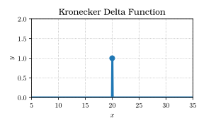
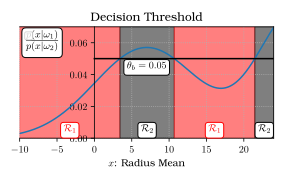
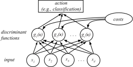
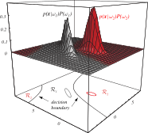

# 

## Announcements

## Looking for Group

If you are looking for people to group up with, you can use the following sheet:

[Spring 2021 - Looking for Group]()

# 

## Bayes Theorem

Probabilistic Classification

## Bayes Theorem

\$ P(x|y) = \\frac{P(y|x)P(x)}{\\sum_{x\\in\\mathcal{X}}P(y|x)P(x)} \$

<ul>
<li class="fragment">**Posterior**: \$P(x|y)\$, the probability of \$x\$ given \$y\$</li>
<li class="fragment">**Likelihood**: \$P(y|x)\$, the probability of \$y\$ given \$x\$</li>
<li class="fragment">**Prior**: \$P(x)\$, the probability of observing \$x\$, regardless of \$y\$</li>
<li class="fragment">**Evidence**: \$\\sum_{x\\in\\mathcal{X}}P(y|x)P(x)\$, a
normalizing factor</li>
</ul>

# 

## Introduction to Probability

## Getting Back to the FNA Dataset

Each object has a **class** associated with it, which we will call \$\\omega\$

<ul>
<li class="fragment">\$\\omega = \\omega_{1}\$ represents **Malignant**</li>
<li class="fragment">\$\\omega = \\omega_{2}\$ represents **Benign**</li>
</ul>

**Binary class**: Only have two possible values.

\$\\omega\$ is a **discrete random variable** representing those values.

## Notation Notes: Continuous vs. Discrete

Probabilies can be written as both
\$P(\\cdot)\$ and \$p(\\cdot)\$.

<ul>
<li class="fragment">\$P(\\cdot)\$ is a **discrete** variable, and is a **probability mass function**.</li>
<li class="fragment">\$p(\\cdot)\$ is a **continuous** variable, and is a **probability density function**.</li>
</ul>

## Continuous vs. Discrete Variables

The math behind \$P(\\cdot)\$ and \$p(\\cdot)\$ is different:

<ul>
<li class="fragment">**Discrete** probabilities are calculated using **sums**</li>
<li class="fragment">**Continuous** probabilities use **integrals** over the domain</li>
</ul>

Continuous variables have infinite possible values, so you cannot sum them all
across the domain.

Discrete values have discontinuities in the domain, so the integral is not fully
differentiable in the domain.

## Probability Preliminaries: Priors

\$P(x)\$ is the **Prior**, or ***a priori***, probability of observing a certain \$x\$, in
the absence of any other information.

<ul>
<li class="fragment">The prior for observing a "Malignant" image is
\$P(\\omega=\\omega_{1}) = P(\\omega_{1})\$.</li>

<li class="fragment">The prior for observing a "Benign" image is
\$P(\\omega_{2})\$.</li>
</ul>

## Probability Preliminaries: Priors

Recall that any set of probabilities must: 

<ul>
<li class="fragment">Sum to one: \$\\sum_{i=1}^{c}P(\\omega_{i}) = 1\$</li>
<li class="fragment">Be positive: \$P(\\omega_{i}) \\geq 0, \\forall i\\in\\{1,2,\\dots,c\\}\$</li>
</ul>

How do we find \$P(\\omega_{1})\$ and \$P(\\omega_{2})\$?

## What Do We Know Ahead of Time?

**Domain Knowledge**

If we know that there are twice as many benign patients
as there are malignant patients in the world, then we might say that:

\$P(\\omega_{2}) = 2P(\\omega_{1})\$

\$P(\\omega_{2})\\approx 66\\%\\qquad P(\\omega_{1})\\approx 33\\%\$

How do we decide whether a random patient is benign or malignant?

# 

## A Priori Decision Rules

Guessing Game

## Decision Rule Based on A Priori Data

Here we find our first **Decision Rule**:

If \$P(\\omega_{1}) > P(\\omega_{2})\$, decide \$\\omega_{1}\$;
otherwise, decide \$\\omega_{2}.\$

Since the priors are fixed, **we always decide the same class** for each
patient randomly drawn from our collection.

## Calculating the Error Rate

Of course, this doesn't work very well. 

Both types of patients **do** exist, so we will clearly be making mistakes.
 

How do we calculate our **error rate**?

## Error Rate Depends on the Prior

The error depends on the difference between \$P(\\omega_{1})\$ and \$P(\\omega_{2})\$:

<ul>
<li class="fragment">If \$P(\\omega_{1}) >> P(\\omega_{2})\$, the error will be small.</li>
<ul>
<li class="fragment">If \$P(\\omega_{1}) = 0.99\$ and
    \$P(\\omega_{2})=0.01\$, and you always choose \$\\omega_{1}\$, how often will you
    make a mistake?</li>
</ul>
<li class="fragment">If \$P(\\omega_{1}) \\approx P(\\omega_{2})\$, the error
will be close to 50%.</li>
<ul>
<li class="fragment">If \$P(\\omega_{1}) = 0.51\$ and
\$P(\\omega_{2})=0.49\$, and you always choose \$\\omega_{1}\$, how often will
you make a mistake?</li>
</ul>
</ul>

Keep in mind, this assumes your estimates of \$P(\\omega_{1})\$ and
\$P(\\omega_{2})\$ are accurate!

# 

## A Posteriori Decision Rules

Using Evidence to Make Decisions

## Improving Our Decision Rule

This is a bit boring: our "classifier" just gives us the same answer, forever!

We improve this rule through the use of **evidence**, or **features**.

Let's say that:

<ul>
<li class="fragment">A single feature is represented as the random variable
\$x\$</li>
<li class="fragment">A vector of \$d\$ features is \$\\mathbf{x}\$</li>
</ul>

Each feature is considered a **dimension** of the feature vector, so
\$\\mathbf{x}\\in\\mathbb{R}^{d}\$.

## Building our PDF

We want the probability of observing a particular
feature value given \$\\omega\$:

\$p(x|\\omega)\$

This is the **class-conditional probability density function** (PDF).

<ul>
<li class="fragment">Collect data samples</li>
<li class="fragment">For each data sample, measure our feature, and identify the class</li>
<li class="fragment">Place it into the \$\\omega_{1}\$ or \$\\omega_{2}\$ PDF for that feature.</li>
</ul>

## Class-Conditional PDF Example

<iframe frameborder="0" seamless='seamless' scrolling=no src="plots/radius_mean.html"></iframe>

## Class-Conditional PDF

\$p(x|\\omega_{i})\$ says that **if we know** the class label \$\\omega_{i}\$, what is
the probability of observing \$x\$?

The **difference** between \$p(x|\\omega_{1})\$ and \$p(x|\\omega_{2})\$ is the
difference in likelihood of observing feature value \$x\$ between the two
populations.

## Modifying Decision Rules Using PDFs

How do we use our PDFs to improve our decision rule?
 

We know \$P(\\omega_{i})\$ (our prior) and \$p(x|\\omega_{i})\$ (our PDF), for
both classes \$i\\in\\{1,2\\}\$.

If we have a **new image** and measure this feature, it gives us a location on the horizontal axis of our PDF.

## PDF with Specific Feature Value

<iframe frameborder="0" seamless='seamless' scrolling=no src="plots/radius_mean.html"></iframe>

## Modifying Decision Rules Using PDFs

Recall **joint probability**, \$P(y,x)\$: The probability that you observe a specific value of \$y\$ and a specific value of \$x\$. 

<ul>
<li class="fragment">Treat \$y\$ as the class variable (\$\\omega_{i}\$)</li>
<li class="fragment">Treat \$x\$ as the feature variable (which we also called \$x\$)</li>
</ul>

So the joint probability for our example problem is \$p(\\omega_{i},x)\$.

## Modifying Decision Rules Using PDFs

We can rewrite the joint probability in terms of conditionals and priors:

\$ p(\\omega_{i},x) = P(\\omega_{i}|x)p(x) = p(x|\\omega_{i})P(\\omega_{i}) \$

Which you can rearrange into **Bayes formula**:

\$ P(\\omega_{i}|x) = \\frac{p(x|\\omega_{i})P(\\omega_{i})}{p(x)} \$

This is the **posterior**, or the ***a posteriori***: It is the probability of
observing class \$\\omega_{i}\$ AFTER observing a specific feature value.

## Decision Theory with PDFs

\$ P(\\omega_{i}|x) = \\frac{p(x|\\omega_{i})P(\\omega_{i})}{p(x)} \$

The denominator, \$p(x)\$, is the "prior" for a particular feature value.

Remember from last lecture:

If an event can occur in many different ways, the probability of the event is
the sum over the probabilities of each of the different ways it can happen.

## Calculating the Denominator

In this case, the "event" is "observing a specific value of \$x\$".

The different ways it can happen are:

<ul>
<li class="fragment">You observe \$x\$ in a sample from \$\\omega_{1}\$</li>
<li class="fragment">You observe \$x\$ in a sample from \$\\omega_{2}\$</li>
</ul>

So the probability of observing a sample with feature value \$x\$ is the sum of
the likelihood of both of those scenarios:

\$ p(x) = \\sum_{i=1}^{c}p(x|\\omega_{i})P(\\omega_{i}) \$

This makes the posterior likelihood \$P(\\omega_{i}|x)\$ sum to 1 over all feature values.

In other words, we will **definitely** observe **some** class after
measuring \$x\$.

## Cumulative Probability Density

<iframe frameborder="0" seamless='seamless' scrolling=no src="plots/pdf_cdf.html"></iframe>

## A Posteriori Decision Rule

Now we can define our new **Decision Rule** in terms of our ***A Posteriori*** knowledge:

If \$P(\\omega_{1}|x)>P(\\omega_{2}|x)\$, decide \$\\omega_{1}\$; otherwise, decide \$\\omega_{2}.\$

Another way of writing this is:

\$\\omega^{\\star} = \\textrm{arg max}_{i}\\left[P(\\omega_{i}|x)\\right]\$

## A Posteriori Decision Rule

<iframe frameborder="0" seamless='seamless' scrolling=no src="plots/pdf_cdf.html"></iframe>

# 
## Calculating Error Rates

How Wrong Are We?

## Calculating Decision Error Rates

What is the probability of this decision rule being wrong?

\$P(\\textrm{error}|x)=
\\begin{cases}
P(\\omega_{1}|x)&\\textrm{if we decide } \\omega_{2} \\\\
P(\\omega_{2}|x)&\\textrm{if we decide } \\omega_{1}
\\end{cases} 
\$

This gives us the probability of error for a single value of \$x\$.

To get the
**total error**, we have to integrate over all possible values of \$x\$:

\$ P(\\textrm{error}) = \\int_{-\\infty}^{\\infty}P(\\textrm{error}|x)p(x)dx \$

We integrate over \$\\infty\$ because this accounts for literally **any** feature value.

## Bayes Decision Rule

Our decision rule is now:

\$ \\textrm{If } P(\\omega_{1}|x) > P(\\omega_{2}|x), \\textrm{decide } \\omega_{1}; \\textrm{otherwise, decide } \\omega_{2}.\$

Equivalently:

\$ \\textrm{If } p(x|\\omega_{1})P(\\omega_{1}) > p(x|\\omega_{2})P(\\omega_{2}), \\textrm{decide } \\omega_{1}; \\textrm{otherwise, decide } \\omega_{2}.\$

Under this rule, we can express the error as:

\$P(\\textrm{error}|x) = \\min{\\left[P(\\omega_{1}|x), P(\\omega_{2}|x)\\right]}\$

## Bayes Decision Rule

If \$p(x|\\omega_{1})P(\\omega_{1}) > p(x|\\omega_{2})P(\\omega_{2})\$ decide \$\\omega_{1}\$ otherwise, decide \$\\omega_{2}\$.

Two conditions to consider:

<ul>
<li class="fragment">If \$p(x|\\omega_{1}) = p(x|\\omega_{2})\$, the decision is entirely based on the priors.</li>
<li class="fragment">If \$P(\\omega_{1}) = P(\\omega_{2})\$, the decision is entirely based on the PDFs calculated from the feature values.</li>
</ul>

Bayes Rule combines these factors to minimize error.

## Loss and Risk

The error is the likelihood of making the wrong classification.

We can extend this to **risk** or **loss**, which is the "cost" of a wrong classification. 

<ul>
<li class="fragment">An **action**, \$\\alpha_{i}\$, is "what you do" if you
think the true label is \$\\omega_{i}\$.</li>
<li class="fragment">
A **loss function**, \$\\lambda(\\alpha_{i}|\\omega_{j})\$, describes the
loss incurred when taking action \$\\alpha_{i}\$ when the true class is
\$\\omega_{j}\$.
</li>
<li class="fragment">If \$i=j\$, the action corresponds with the true label
(therefore our action is correct).</li>
<li class="fragment">If \$i\\neq j\$, the action does not match the true label
(our action is incorrect).</li>
 </ul>

## Kronecker Delta Function

Recall the **Kronecker delta** or **impulse** function:

\$\\delta_{ij} =
	\\begin{cases}
	1 & \\quad \\textrm{if } i=j\\\\
	0 & \\quad \\textrm{otherwise}
	\\end{cases}\$

We can use this to define our loss function.

## Kronecker Delta Function

{ width=80% }

## Zero-One Loss Function

If we express our loss as a simple "Right" or "Wrong", then we have the
**zero-one loss** function:

\$ \\lambda(\\alpha_{i}|\\omega_{j}) =
\\begin{cases}
0 & \\textrm{if } i=j\\\\
1 & \\textrm{if } i\\neq j
\\end{cases}
\\quad\\textrm{for } i,j = 1,\\dots,c \$

Translation:

<ul>
<li class="fragment">If we make the right call, we incur no loss.</li>
<li class="fragment">If we make a mistake, we incur a loss of 1.</li>
</ul>

In this case, the zero-one loss is the inverse of the delta function, i.e. \$|1-d_{ij}|\$.

## Expected Loss, Conditional Risk

**Expected Loss** is the average loss for an action for all possible classes:
\$
\\begin{aligned}
R(\\alpha_{i}|\\mathbf{x}) \& = \\sum_{j=1}^{c}\\lambda(\\alpha_{i}|\\omega_{j})P(\\omega_{j}|\\mathbf{x}) \\\\
R(\\alpha_{i}|\\mathbf{x}) \& = \\sum_{j\\neq i} P(\\omega_{j}|\\mathbf{x}) \\\\
R(\\alpha_{i}|\\mathbf{x}) \& = 1 - P(\\omega_{i}|\\mathbf{x})
\\end{aligned}\$

This is also the **conditional risk**, because the risk "depends on"
the feature vector \$\\mathbf{x}\$.

## Expected Loss, Conditional Risk

\$
R(\\alpha_{i}|\\mathbf{x}) = 1 - P(\\omega_{i}|\\mathbf{x})
\$

We can take the action that minimizes risk by choosing the class that
maximizes \$P(\\omega_{i}|\\mathbf{x})\$. 

**This is the same as Bayes Rule:** You are taking the action associated with the
most "likely" class.

## Overall Risk

More generally, let's assume there are \$a\$ different actions that we can take, denoted \$\\alpha_{1}, \\alpha_{2}, \\dots, \\alpha_{a}\$.

Note that \$a\$ doesn't have to equal \$c\$, the number of classes!

<ul>
<li class="fragment">
Patients in classes \$\\omega_{1},\\omega_{2},\\omega_{3}\$ get
treatment \$\\alpha_{1}\$
</li>
<li class="fragment">
Patients in classes
\$\\omega_{4},\\omega_{5},\\omega_{6}\$ get treatment \$\\alpha_{2}\$
</li>
</ul>

## Overall Risk

Define a **decision rule** \$\\alpha(\\mathbf{x})\$ to be a decision rule that maps a \$d\$-dimensional feature vector \$\\mathbf{x}\$ to an action: \$\\mathbb{R}^{d}\\mapsto\{\\alpha_{1},\\alpha_{2},\\dots,\\alpha_{a}\}\$.

The **overall risk** for this rule over all \$\\mathbf{x}\$ is calculated as the integral:
\$ R = \\int R(\\alpha(\\mathbf{x}) | \\mathbf{x}) p(\\mathbf{x}) d\\mathbf{x} \$

The **Bayes Decision Rule**: we should take the action that minimizes the conditional risk:

\$\\alpha^{\\star}=\\textrm{arg min}\_{\\alpha_{i}} R(\\alpha_{i}|\\mathbf{x})
= \\textrm{arg min}\_{\\alpha_{i}} \\sum_{j=1}^{c}\\lambda(\\alpha_{i}|\\omega_{j})P(\\omega_{j}|\\mathbf{x})\$

## Making Decisions in Two-Class Problems

Let's simplify the problem problem to two classes, and assume only two possible actions:

<ul>
<li class="fragment">\$\\alpha_{1}\$: assign label \$\\omega_{1}\$</li>
<li class="fragment">\$\\alpha_{2}\$: assign label \$\\omega_{2}\$</li>
</ul>

\$\\lambda_{ij} = \\lambda(\\alpha_{i}|\\omega_{j})\$ is the loss 
incurred when \$\\alpha_{i}\$ is taken and the class is \$\\omega_{j}\$. 

The conditional risk, \$R(\\alpha_{i}|\\mathbf{x})\$, becomes: 

\$
\\begin{aligned}
R(\\alpha_{1}|\\mathbf{x}) \&= \\lambda_{11}P(\\omega_{1}|\\mathbf{x}) +
\\lambda_{12}P(\\omega_{2}|\\mathbf{x}) \\\\ 
R(\\alpha_{2}|\\mathbf{x}) \&=
\\lambda_{21}P(\\omega_{1}|\\mathbf{x}) + \\lambda_{22}P(\\omega_{2}|\\mathbf{x})
\\end{aligned}
\$

## Fundamental Rule in Two-Class Classification

The **Fundamental Rule** is that we can choose the class that has the smallest
risk:

Decide \$\\omega_{1}\$ if
\$R(\\alpha_{1}|\\mathbf{x}) < R(\\alpha_{2}|\\mathbf{x})\$ and decide \$\\omega_{2}\$
otherwise.

## Fundamental Rule in Two-Class Classification

We can rewrite this in terms of the **posteriors**:

Decide \$\\omega_{1}\$ if
\$(\\lambda_{21} - \\lambda_{11})P(\\omega_{1}|\\mathbf{x}) > (\\lambda_{12} -
\\lambda_{22})P(\\omega_{2}|\\mathbf{x})\$

## Fundamental Rule in Two-Class Classification

And finally, we can rewrite in terms of **Bayes Rule**:

Decide \$\\omega_{1}\$ if
\$(\\lambda_{21} - \\lambda_{11})p(\\mathbf{x}|\\omega_{1})P(\\omega_{1}) >
(\\lambda_{12} - \\lambda_{22})p(\\mathbf{x}|\\omega_{2})P(\\omega_{2})\$

## Fundamental Rule in Two-Class Classification

It makes sense that the loss for making a mistake is greater than the loss for
getting something correct.

In other words, if the true class is \$\\omega_{1}\$, then the loss for guessing
class \$\\omega_{2}\$, which is \$\\lambda_{21}\$, is greater than the loss for
guessing \$\\omega_{1}\$, or \$\\lambda_{11}\$.

This means that \$(\\lambda_{21} - \\lambda_{11})\$ and \$(\\lambda_{12} -
\\lambda_{22})\$ are positive.

If we make that assumption, we can write the relationship between the PDFs as:

\$\\frac{p(\\mathbf{x}|\\omega_{1})}{p(\\mathbf{x}|\\omega_{2})} >
\\frac{\\lambda_{12}-\\lambda_{22}}{\\lambda_{21}-\\lambda_{11}}\\frac{P(\\omega_{2})}{P(\\omega_{1})}\$

## Setting up Decision Thresholds

\$\\frac{p(\\mathbf{x}|\\omega_{1})}{p(\\mathbf{x}|\\omega_{2})} >
\\frac{\\lambda_{12}-\\lambda_{22}}{\\lambda_{21}-\\lambda_{11}}\\frac{P(\\omega_{2})}{P(\\omega_{1})}\$

**Why do we want to do this?**

We can set a threshold, \$\\theta_{a}\$, corresponding to a zero-one (symmetrical)
loss function. In this case, our errors are equally weighted.

## Visualizing Decision Thresholds

{ width=80% }

## Visualizing Decision Thresholds

If \$\\lambda_{21} > \\lambda_{12}\$, then when we guess \$\\omega_{2}\$ and are wrong,
the loss is greater than when we guess \$\\omega_{1}\$ and are wrong.

We might want to adjust our threshold to decrease the number of
samples we call \$\\omega_{2}\$.

In other words, we "prefer" to make the other mistake (taking action
\$\\alpha_{1}\$ when the class is \$\\omega_{2}\$).

In medicine, this is like preferring to **over** treat rather than **under**
treat a patient.

By adjusting our threshold from \$\\theta_{a}\$ to \$\\theta_{b}\$, we shrink region
\$\\mathcal{R}\_{2}\$ and enlarge region \$\\mathcal{R}\_{1}\$. In other words, we
classify more of \$x\$ as \$\\omega_{1}\$.

## Visualizing Decision Thresholds

{ width=80% }

## Comparing Decision Thresholds

{width=100%}

{width=100%}

# 

## Discriminant Functions

## Discriminant Functions

**Discriminant Functions** are a set of \$c\$ functions, one for each class,
that map a \$d\$-dimensional feature vector \$\\mathbf{x}\$ to a value.

For \$g_{i}(\\mathbf{x})\$, where \$i=1,\\dots,c\$, the classifier
assigns \$\\mathbf{x}\$ to class \$\\omega_{i}\$ if:

\$ g_{i}(\\mathbf{x}) > g_{j}(\\mathbf{x}) \\textrm{ for all } i\\neq j \$

## Discriminant Functions

{ width=80% }

## Bayes Classifier as Discriminant Functions

How do we get \$g_{i}(\\mathbf{x})\$? 

We can use any function, as long as the value is highest for the correct class.

For example, we can tie \$g_{i}(\\mathbf{x})\$ to the risk
associated with action \$\\alpha_{i}\$:

\$ g_{i}(\\mathbf{x}) = -R(\\alpha_{i}|\\mathbf{x}) \$

The action with the **lowest** risk has the **highest**
value for \$g(\\cdot)\$, and vice-versa.

The classifier will then assign the label corresponding to the
action that carries the lowest risk.

## Bayes Classifier as Discriminant Functions

If we assume a zero-one loss function, this generalizes to:

\$ g_{i}(\\mathbf{x}) = P(\\omega_{i}|\\mathbf{x}) \$

So in this case, the **highest** posterior probability yields the
**highest** discriminant function.

Thus, the classifier will always choose the class with the highest likelihood.

## Shifting the Discriminant Function

We can build different discriminant functions, which yield identical classifier
results:

\$
\\begin{aligned}
g_{i}(\\mathbf{x}) \&= P(\\omega_{i}|\\mathbf{x}) \\\\
g_{i}(\\mathbf{x}) \&= p(\\mathbf{x}|\\omega_{i})P(\\omega_{i}) \\\\
g_{i}(\\mathbf{x}) \&= \\ln{p(\\mathbf{x}|\\omega_{i})} + \\ln{P(\\omega_{i})}
\\end{aligned}
\$

The output of \$g_{i}(\\mathbf{x})\$ doesn't have any
restrictions on it; they don't all have to sum to 1, they don't have to all be
positive, etc.

If we replace \$g_{i}(\\mathbf{x})\$ with \$f(g_{i}(\\mathbf{x}))\$, where
\$f(\\cdot)\$ is monotonically increasing, then the classification results are the
same.

## Back to Decision Regions

{width=100%}

The goal of a decision rule is to divide the feature space into **decision
regions**, \$\\mathcal{R}\_{1},\\mathcal{R}\_{2},\\dots,\\mathcal{R}\_{c}\$.

If \$g_{i}(\\mathbf{x}) > g_{j}(\\mathbf{x})\$ for all \$j\\neq i\$, then \$\\mathbf{x}\$
falls in region \$\\mathcal{R}\_{i}\$ and is assigned to \$\\omega_{i}\$. 

The size of
the region, and samples assigned to that class, is driven by
the loss functions.

## Back to Decision Regions

{width=100%}

Regions are separated by **decision boundaries**. 

If, for any \$j\\neq
i\$, \$g_{i}(\\mathbf{x}) = g_{j}(\\mathbf{x})\$, then \$\\mathbf{x}\$ is on the
decision boundary of \$\\mathcal{R}\_{i}\$ and \$\\mathcal{R}\_{j}\$.

## Visualizing 2D Decision Spaces

This is all well and good for one feature, but how does it look with two?

## Visualizing 2D Decision Spaces

{ width=80% }

## Two-Class Discriminant Functions

When \$c=2\$ (two-class case), then we have just two functions, \$g_{1}\$ and
\$g_{2}\$.

Instead of finding which is greater, we can define a combined discriminant
function:

\$ g(\\mathbf{x}) \\equiv g_{1}(\\mathbf{x}) - g_{2}(\\mathbf{x}) \$

and now our decision is simply:

If \$g(\\mathbf{x})>0\$, decide \$\\omega_{1}\$; otherwise, decide \$\\omega_{2}\$.

## Two-Class Discriminant Functions

We can also create our alternative discriminant functions in this way:

\$ g(\\mathbf{x}) = P(\\omega_{1}|\\mathbf{x}) - P(\\omega_{2}|\\mathbf{x}) \$

\$ g(\\mathbf{x}) =
\\ln{\\frac{p(\\mathbf{x}|\\omega_{1})}{p(\\mathbf{x}|\\omega_{2})}} +
\\ln{\\frac{P(\\omega_{1})}{P(\\omega_{2})}} \$

These are equivalent to the previous examples with \$c\$ classes.

Since two-class problems are so common, you'll often see the
decision rule based on a positive or negative value for the discriminant
function.

# 

## Summary

## Bayes Probabilities and Decisions

Why is Bayes so useful?

<ul>
<li class="fragment">
Classification is **probabilistic**, allowing us to incorporate
**uncertainty** in the outcome.
</li>
<li class="fragment">
Bayes Theorem allows us to integrate prior knowledge about the system: risk,
cost, prior probabilities, and evidence.
</li>
<li class="fragment">
The math behind these equations holds for different distributions of PDFs, so
you don't need to assume any "form" of your distribution.
</li>
</ul>

We haven't gone into parameters yet, but assuming a Gaussian distribution makes
a lot of things easier.

# 

## Next Class

## Next Class

We have so far assumed that we have some way of modeling our feature data, going
from a histogram to a function \$p(x | \\omega_{i})\$.

In the next class, we will see how this modeling takes place by covering
**normal density** in univariate and multivariate cases.

We will also cover how to compute **decision surfaces**, or how to set
thresholds for your feature values to define your decision space.

Finally we'll talk a little about entropy and information content of a signal --
how much one signal (like a feature) tells you about another signal (like a
class label).

# 

## Thank you!

