# 
## Recap

## Recap: Discriminant Functions

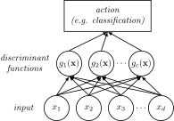{width=80%}

\$\\mathbf{x}\$ is assigned to \$\\omega\_{i}\$ if:

\$ g\_{i}(\\mathbf{x}) > g\_{i}(\\mathbf{x}) \\text{ for all } j\\neq i\$

Forms of discriminant functions:

\\begin{align}
    g\_{i}(\\mathbf{x}) \&= - R(\\alpha\_{i}|\\mathbf{x})\\\\
    g\_{i}(\\mathbf{x}) \&= P(\\omega\_{i}|\\mathbf{x})\\\\
    g\_{i}(\\mathbf{x}) \&= \\ln{p(\\mathbf{x}|\\omega\_{i})} + \\ln{P(\\omega\_{i})}\\\\
\\end{align}

## Recap: Discriminant Functions

If we assume that \$p(\\mathbf{x}|\\omega\_{i})\\sim
N(\\boldsymbol{\\mu}\_{i},\\boldsymbol{\\Sigma}\_{i})\$, then we can plug the multivariate normal (Gaussian) equation into the first term above, and we have:

\\begin{align}
    g\_{i}(\\mathbf{x}) \&= \\ln{p(\\mathbf{x}|\\omega\_{i})} + \\ln{P(\\omega\_{i})} \\\\
    \&= \\ln{ \\left[ \\frac{1}{ (2\\pi)\^{\\frac{d}{2}} |\\boldsymbol{\\Sigma}|\^{ \\frac{1}{2} } } \\exp{ \\left[ -\\frac{1}{2} (\\mathbf{x} - \\boldsymbol{\\mu})\^{T} \\boldsymbol{\\Sigma}\^{-1} (\\mathbf{x} - \\boldsymbol{\\mu}) \\right] } \\right]}  + \\ln{P(\\omega\_{i})} \\\\
    \&= -\\frac{1}{2}(\\mathbf{x}-\\boldsymbol{\\mu}\_{i})\^{T}\\boldsymbol{\\Sigma}\_{i}\^{-1}(\\mathbf{x}-\\boldsymbol{\\mu}\_{i}) - \\frac{d}{2}\\ln{2\\pi} - \\frac{1}{2}\\ln{|\\boldsymbol{\\Sigma}\_{i}}| + \\ln{P(\\omega\_{i})} \\\\
\\end{align}

## Recap: Uncorrelated, Equal-Variance Features

If the features are all uncorrelated AND have equal variances, then
\$\\boldsymbol{\\Sigma}\_{i} = \\sigma\^{2}\\mathbf{I}\$. That means we can
simplify \$|\\boldsymbol{\\Sigma}\_{i}|=\\sigma\^{2d}\$ and \$\\boldsymbol{\\Sigma}\_{i}\^{-1} =
(\\frac{1}{\\sigma\^{2}})\\mathbf{I}$: 

\\begin{align}
    g\_{i}(\\mathbf{x}) \&=
    -\\frac{1}{2}(\\mathbf{x}-\\boldsymbol{\\mu}\_{i})\^{T} \\boldsymbol{\\Sigma}\_{i}\^{-1}
    (\\mathbf{x}-\\boldsymbol{\\mu}\_{i}) \&- \\frac{d}{2}\\ln{2\\pi} \&-
    \\frac{1}{2}\\ln{ |\\boldsymbol{\\Sigma}\_{i}|} \&+ \\ln{P(\\omega\_{i})}\\\\
    \\\\
    \&= -\\frac{ (\\mathbf{x}-\\boldsymbol{\\mu}\_{i})\^{T} (\\mathbf{x} -
    \boldsymbol{\\mu}\_{i}) }{ 2 \\sigma\^{2}} \&- \\frac{d}{2}\\ln{2\\pi} \&- \\frac{1}{2}\\ln{\\sigma\^{2d}}\&+ \\ln{P(\\omega\_{i})}\\\\
    \\\\
    \&= -\\frac{1}{2\\sigma\^{2}} \\left[ \\mathbf{x}\^{T}\\mathbf{x} - 2\\boldsymbol{\\mu}\_{i}\^{T}\\mathbf{x} + \boldsymbol{\\mu}\_{i}\^{T}\\boldsymbol{\\mu}\_{i} \\right] \&- \\frac{d}{2}\\ln{2\\pi} \&- \\frac{1}{2}\\ln{\\sigma\^{2d}} \&+ \\ln{P(\\omega\_{i})}\\\\
\\end{align}

## Recap: Uncorrelated, Equal-Variance Features

We remove terms that don't depend on the class (everything with an \$i\$ in
it) to get:

\\begin{align}
g\_{i}(\\mathbf{x}) \&= 
-\\frac{1}{2\\sigma\^{2}} \\left[ \\mathbf{x}\^{T}\\mathbf{x} -
2\\boldsymbol{\\mu}\_{i}\^{T}\\mathbf{x} +
\\boldsymbol{\\mu}\_{i}\^{T}\\boldsymbol{\\mu}\_{i} \\right] -
\\frac{d}{2}\\ln{2\\pi} - \\frac{1}{2}\\ln{\\sigma\^{2d}} + \\ln{P(\\omega\_{i})} \\\\
\&= -\\frac{1}{2\\sigma\^{2}} \\left[ - 2\\boldsymbol{\\mu}\_{i}\^{T}\\mathbf{x} + \\boldsymbol{\\mu}\_{i}\^{T}\\boldsymbol{\\mu}\_{i} \\right] + \\ln{P(\\omega\_{i})} \\\\
\&= \\frac{1}{\\sigma\^{2}}\\boldsymbol{\\mu\_{i}}\^{T} \\mathbf{x} -
\\frac{1}{2\\sigma\^{2}}\\boldsymbol{\\mu}\_{i}\^{T}\\boldsymbol{\\mu}\_{i} + \\ln{P(\\omega\_{i})} \\\\
 \&= \\mathbf{w}\_{i}\^{T} \\mathbf{x} + w\_{i0} \\\\
\\end{align}

## Recap: Discriminants Where \$\\boldsymbol{\\Sigma}\_{i} = \\sigma\^{2}\\mathbf{I}\$

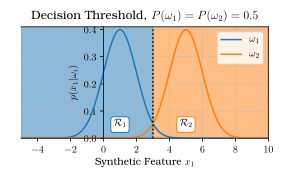{width=100%}

{width=80%}

# 
## Two-Class Discriminants

## Linear Discriminant Functions

In general, a linear discriminant function is one for which:

\$ g(\\mathbf{x}) = \\mathbf{w}\^{T}\\mathbf{x} + w\_{0} \$

In this expression, \$\\mathbf{w}\$ is the **weight vector** and \$w\_{0}\$ is the
**bias**.

(In this case, "bias" is not an error, it is just a systemic adjustment.)

Let's focus on the two-category case for now.

## Linear Discriminant Functions

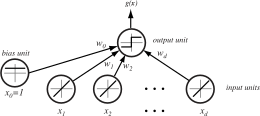{width=80%}

## Defining the Decision Surface

\$ g(\\mathbf{x}) = \\mathbf{w}\^{T}\\mathbf{x} + w\_{0} \$

Recall the two-class decision rule regarding discriminants:

**Decision Rule: Binary Discriminants**
: If \$g(\\mathbf{x})>0\$, decide \$\\omega\_{1}\$; otherwise decide \$\\omega\_{2}\$.

In other words, if the **inner product** \$\\mathbf{w}\^{T}\\mathbf{x} > -w\_{0}\$,
decide \$\\omega\_{1}\$.

## Defining the Decision Surface

The **decision surface** is given by \$g(\\mathbf{x}) = 0\$. If \$\\mathbf{x}\_{1}\$
and \$\\mathbf{x}\_{2}\$ are both on this surface, then:

\$ \\mathbf{w}\^{T}\\mathbf{x}\_{1} + w\_{0} =
\\mathbf{w}\^{T}\\mathbf{x}\_{2} + w\_{0} \$

\$ \\mathbf{w}\^{T}(\\mathbf{x}\_{1} - \\mathbf{x}\_{2}) = 0 \$

What does this look like graphically? Let's look at a 3D example...

## Visualizing Decision Surfaces

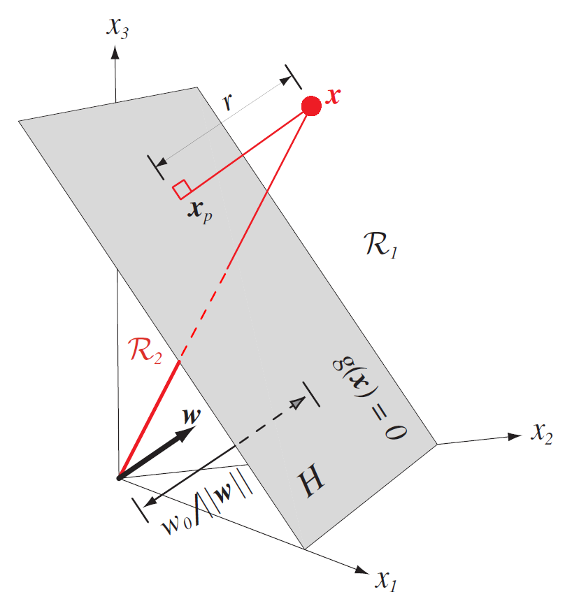{width=40%}

## Signed Distance to the Decision Hyperplane

{width=70%}

Thus, \$\\mathbf{w}\$ is normal to any vector **lying in** \$H\$, which splits the
decision space into two regions, \$\\mathcal{R}\_{1}\$ (which is on the "positive"
side of \$H\$) and \$\\mathcal{R}\_{2}\$ (on the "negative side").

## Signed Distance to the Decision Hyperplane

{width=70%}

We can calculate a distance from any vector \$\\mathbf{x}\$ to the hyperplane:

\$ \\mathbf{x} = \\mathbf{x}\_{p} + r \\frac{\\mathbf{w}}{||\\mathbf{w}||},\$

where \$\\mathbf{x}\_{p}\$ is the normal projection of \$\\mathbf{x}\$ onto \$H\$, and
\$r\$ is the straight-line distance between \$\\mathbf{x}\$ and \$H\$.

## Signed Distance to the Decision Hyperplane

{width=70%}

Since \$\\mathbf{x}\_{p}\$ lies on the hyperplane (since it's been projected onto
it), then \$g(\\mathbf{x}\_{p}) = 0\$ and:

\$ g(\\mathbf{x}) = \\mathbf{w}\^{T}\\mathbf{x} + w\_{0} = r||\\mathbf{w}||\$

Therefore, \$r = \\frac{g(\\mathbf{x})}{||\\mathbf{w}||}\$ and the **sign** of
\$r\$ is determined by the sign of \$g(\\mathbf{x})\$.

This means that \$r\$ can be negative if \$\\mathbf{x}\$ belongs to \$\\omega\_{2}\$ and
\$g(\\mathbf{x}) < 0\$. Thus it is a **signed distance**.

## Orientation of the Hyperplane to the Origin

If \$\\mathbf{x} = (0, \\ldots, 0)\^{T}\$ (ie. we're at the origin), then:

\$ g(\\mathbf{x}) = \\mathbf{w}\^{T}\\mathbf{x} + w\_{0} = w\_{0} \$

In this case, the value of \$g(\\mathbf{x})\$ is the **intercept**. In that case:

\$ r = \\frac{g(\\mathbf{x})}{||\\mathbf{w}||} = \\frac{w\_{0}}{||\\mathbf{w}||} \$

If \$w\_{0} > 0\$, then \$r > 0\$ and the origin is on the positive side of \$H\$, i.e.
in \$\\mathcal{R}\_{1}\$.

If \$w\_{0} = 0\$, then \$g(\\mathbf{x}) = \\mathbf{w}\^{T}\\mathbf{x} + w\_{0} =
\\mathbf{w}\^{T}\\mathbf{x}\$, and \$H\$ passes through the origin.

## Two-Category Summary

Here are the takeaway points for the two-class case:

- The linear discriminant divides the feature space by a decision surface \$H\$.
- The orientation of \$H\$ (its **slope**) is dictated by the weight vector \$\\mathbf{w}\$.
- The location of the surface (its **intercept**) is dictated by the bias term \$w\_{0}\$.
- The value of the discriminant function \$g(\\mathbf{x})\$ is the signed distance
from \$\\mathbf{x}\$ to \$H\$.
- The sign of \$g(\\mathbf{x})\$ determines the feature space region (and thus the class)
assigned to \$\\mathbf{x}\$.

## Extensions to Multiple Classes

That's all well and good, but what about extensions to the multicategory space?

For that, we have to go back to an earlier lecture on discriminant functions.

# 
## Multicategory Discriminant Functions

## Extensions from 2 to \$c\$ Class Problems

Another benefit of linear discriminants is that they extend seamlessly to multi-class situations.

To begin with, let's say we have a formula that divides our feature space into two regions, as we saw in the two-class case.

How could we use this to carve up our feature space into multiple class regions?

Let's start with **one-versus-all** classification: create \$c\$ discriminant
functions, each with its own hyperplane that divides the space such that
\$g\_{i}(\\mathbf{x})\$ delineates \$\\omega\_{i}\$ from all other classes.

## Ambiguous Regions

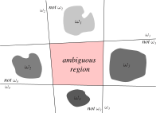{width=80%}

## Extensions to Multiclass Problems

That doesn't work...

What if we tried **one-versus-one** classification: create a bunch of
hyperplanes, denoted \$H\_{ij}\$ where \$i,j\\in\\{1,2,\\ldots,c\\}, i\\neq j\$.

This will give us a total of \$c(c-1)/2\$ hyperplanes, which divide the space into
a series of binary regions, where each plane separates a pair of classes.

## Target vs. Non-Target Discriminants

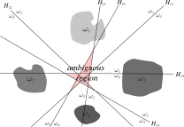{width=80%}

## Solution: Linear Machines for Multiclass Regions

Still no good... What are we doing wrong?

The problem here is that we are using the wrong tool for the job: we cannot
unambiguously divide the space into pairs of 2 regions. That strategy works fine
in the binary case (where there are only 2 regions to worry about), but fails to
generate unique solutions in the multiclass case.

This is where linear discriminants -- also called **linear machines** -- are able to pick up the slack.

## Linear Machine Definition

\$ g\_{i}(\\mathbf{x}) = \\mathbf{w}\_{i}\^{T}\\mathbf{x} + w\_{i0} \$

This divides the feature space up into \$c\$ decision regions, where
\$g\_{i}(\\mathbf{x})\$ is the largest discriminant if \$\\mathbf{x}\$ is in the region
\$\\mathcal{R}\_{i}\$. We also now have a series of weight vectors \$\\mathbf{w}\_{i}\$,
one for each class.

If \$g\_{i}(\\mathbf{x}) = g\_{j}(\\mathbf{x})\$, then it means the vector
\$\\mathbf{x}\$ lies on a portion of hyperplane \$H\_{ij}\$ which separates
\$\\mathcal{R}\_{i}\$ and \$\\mathcal{R}\_{j}\$.

The benefit of this is that **we are not necessarily creating planes that cut
across the entire feature space**.

## Linear Machines Create Isolated Regions

The hyperplane between classes \$i\$ and \$j\$ is defined as \$g\_{i}(\\mathbf{x}) =
g\_{j}(\\mathbf{x})\$, which can be rewritten as:

\\begin{align}
\\mathbf{w}\_{i}\^{T}\\mathbf{x}+w\_{i0} \&= \\mathbf{w}\_{j}\^{T}\\mathbf{x}+w\_{j0} \\\\
(\\mathbf{w}\_{i} - \\mathbf{w}\_{j})\^{T}\\mathbf{x} + (w\_{i0} - w\_{j0}) \&= 0 \\\\
\\end{align}

Just as before in the two-class case, we can see that \$\\mathbf{w}\_{i} -
\\mathbf{w}\_{j}\$ is normal to the hyperplane \$H\_{ij}\$ and the signed distance
from \$\\mathbf{x}\$ to \$H\_{ij}\$ is \$(g\_{i}(\\mathbf{x}) -
g\_{j}(\\mathbf{x}))/||\\mathbf{w}\_{i} - \\mathbf{w}\_{j}||\$.

Key point: Hyperplanes are not binary, since instead of positive or negative value, we have one of several possible values being the maximum. 

How does THIS look?

## Linear Machines in Multiclass Case

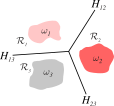{width=70%}

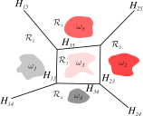{width=70%}

## Convexity of Linear Machines

{width=100%}

The decision regions are **convex**: If two points are in the same region,
i.e. \$\\mathbf{x}\_{1}\\in\\mathcal{R}\_{i}\$ and \$\\mathbf{x}\_{2}\\in\\mathcal{R}\_{i}\$,
then:

\$ \\lambda\\mathbf{x}\_{1}+(1-\\lambda)\\mathbf{x}\_{2} \\in \\mathcal{R}\_{i} \\text{ for } 0 \\geq \\lambda \\geq 1.\$

In other words, all points between \$\\mathbf{x}\_{1}\$ and \$\\mathbf{x}\_{2}\$ are
also in \$\\mathcal{R}\_{i}\$. This limits the complexity of the classifier, which
is always a good thing.

## Limitations of Linear Machines

Linear machines are most suitable for problems with **unimodal distributions**
\$p(\\mathbf{x}|\\omega\_{i})\$.

We also like problems where a straight line divides region \$\\mathcal{R}\_{i}\$
from region \$\\mathcal{R}\_{j}\$, and that we see each region appear in one "blob"
in the feature space.

But this isn't always true! We've already seen discontinuous regions appear in
previous problems. So how can we model those?

# 
## General Linear Discriminants

## Quadratic Discriminant Function

So far, we've been discussing linear discriminants.

This means that we assume that there's a straight line dividing
\$\\mathcal{R}\_{1}\$ from \$\\mathcal{R}\_{2}\$ and so on.

But is this always the case?

## Nonlinear Decision Regions

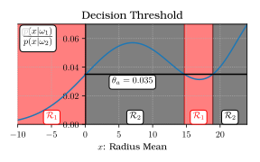{width=80%}

## Quadratic Discriminant Function

We can write \$g(\\mathbf{x})\$ as the sum of the \$d\$ components of the vector:

\$ g(\\mathbf{x}) = w\_{0} + \\mathbf{w}\^{T}\\mathbf{x} = w\_{0} + \\sum\_{i=1}\^{d} w\_{i}x\_{i} \$

In a non-continuous case, we may want to model **nonlinear** interactions
between dimensions. To do this, we add a term that combines **products of pairs
of components**:

\$ g(\\mathbf{x}) = w\_{0} + \\sum\_{i=1}\^{d}w\_{i}x\_{i} + \\sum\_{i=1}\^{d}\\sum\_{j=1}\^{d}w\_{ij}x\_{i}x\_{j} \$

## Quadratic Discriminant Function

\$ g(\\mathbf{x}) = w\_{0} + \\sum\_{i=1}\^{d}w\_{i}x\_{i} + \\sum\_{i=1}\^{d}\\sum\_{j=1}\^{d}w\_{ij}x\_{i}x\_{j} \$

Now the weight vector \$\\mathbf{w}\$ is a weight **matrix**, \$\\mathbf{W}\$,
which is also symmetric: since \$x\_{i}x\_{j} = x\_{j}x\_{i}\$, we can assume that
\$w\_{ij} = w\_{ji}\$.

We are no longer restricted to hyperplanes!

The above equation is a second-order equation, resulting in a
**hyperquadratic**.

## Polynomial Discriminant Functions

What about higher-order terms, like \$\\sum\_{i=1}\^{d} \\sum\_{j=1}\^{d}\\sum\_{k=1}\^{d}
w\_{ijk} x\_{i} x\_{j} x\_{k}\$?

These are essentially series expansions of an arbitrary \$g(\\mathbf{x})\$, so we
can just say:

\\begin{align}
g(\\mathbf{x}) \&= \\sum\_{i=1}\^{\\widehat{d}} a\_{i}y\_{i}(\\mathbf{x}) \\\\
g(\\mathbf{x}) \&= \\mathbf{a}\^{T}\\mathbf{y} \\\\
\\end{align}

where \$\\mathbf{a}\^{T}\$ is a \$\\widehat{d}\$-dimensional weight vector and the
functions \$y\_{i}\$ are arbitrary functions of \$\\mathbf{x}\$.

Essentially we are **projecting** \$\\mathbf{x}\$ into a higher-dimensional
space, from \$d\$ to \$\\widehat{d}\$.

## Polynomial Discriminant Functions

But... Why are we doing this?

In some cases, you may want to have a **nonlinear** or non-contiguous decision
space -- for example, you may have a situation where \$\\mathcal{R}\_{2}\$ should be
"inside" a larger region \$\\mathcal{R}\_{1}\$.

However, these are supposed to be "linear" machines, because the math behind
them requires that the hyperplanes be linear (can be approximated with a
straight line).

**So we cheat!** We can choose both \$\\widehat{d}\$ and the functions
\$y\_{i}(\\mathbf{x})\$ to approximate any discriminant function, so we can pick one
which is **nonlinear** in \$\\mathbf{x}\$ but is **linear** in \$\\mathbf{y}\$.

Now seems like a good time for an example.

## Diagram of Polynomial Discriminant Function

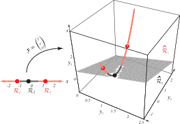{width=80%}

## Calculation of a Polynomial Discriminant Function

{width=100%}

Our discriminant function has the form:

\$g(x) = a\_{1} + a\_{2}x + a\_{3}x\^{2}\$

The discriminant function is characterized by:

\$\\mathbf{y} = (1, x, x\^{2})\^{T}\$

which projects the 1D data from \$x\$ onto the 3D curve in
\$\\mathbf{y}\$**-space**.

## Calculation of a Polynomial Discriminant Function

{width=100%}

The plane \$\\widehat{H}\$ corresponds to:

\$ g(\\mathbf{x}) = \\mathbf{a}\^{T}\\mathbf{y} = 0 \$

dividing \$\\mathbf{y}\$-space into \$\\widehat{\\mathcal{R}}\_{1}\$ and
\$\\widehat{\\mathcal{R}}\_{2}\$.

This in turn divides the corresponding \$\\mathbf{x}\$-space into arbitrary regions
\$\\mathcal{R}\_{1}\$ and \$\\mathcal{R}\_{2}\$.

## Calculation of a Polynomial Discriminant Function

{width=100%}

In this figure, \$\\widehat{H}\$ corresponds to \$\\mathbf{a} = (-1, 1, 2)\^{T}\$, and
so the resulting discriminant function resolves to:

\$ g(x) = -1 + x + 2x\^{2} \$

So \$g(x)>0\$ if \$x < -1\$ OR if \$x > 0.5\$.

Obviously we can create very complex decision regions in low-dimensional space
using these high-dimensional transforms!

## More Complex Polynomial Functions

{width=100%}

Here we have another case where:

\$\\mathbf{y} = (x\_{1}, x\_{2}, \\alpha x\_{1}x\_{2})\^{T}\$

The mapping is again from a 2D to a 3D space, but now the extra dimension is
proportional to \$x\_{1}x\_{2}\$.

This represents a hypersurface instead of a curve in 3D.

Note that the discriminant (and the hyperplane \$\\widehat{H}\$) is nonlinear in
\$\\mathbf{x}\$-space but still linear in \$\\mathbf{y}\$-space.

## Remember the Curse of Dimensionality

So when we go from \$\\mathbf{x}\$-space to \$\\mathbf{y}\$-space, we are projecting
**up** in dimensionality, from \$d\$ to \$\\widehat{d}\$. This is often easier said
than done.

For example, a complete discriminant function requires \$\\widehat{d} = (d + 1)
(d + 2) / 2\$ terms. So if \$d=50\$, then \$\\widehat{d} = 1,326\$!

Each of those dimensions has an associated component in the weight vector
\$\\mathbf{a}\$ which must be determined from training.

Generally speaking, we need to have at least as many samples (and typically many
more!) as we have dimensions.

This leads to a large burden on the training set, and a huge computational cost.

# 
## Augmented Vectors

## Getting Rid of Bias Terms

The mapping trick has a few advantages even if we aren't trying to build a
nonlinear discriminant in \$\\mathbf{x}\$-space.

We can include the bias term in the discriminant function by setting \$x\_{0} =
1\$:

\$ g(\\mathbf{x}) = w\_{0} + \\sum\_{i=1}\^{d}w\_{i}x\_{i} = \\sum\_{i=0}\^{d}w\_{i}x\_{i} \$

Basically we "absorb" the bias term \$w\_{0}\$ into the weight vector, and then add
a dimension to \$\\mathbf{x}\$, so we start the summation from \$0\$ instead of \$1\$.

## Augmented Vectors

This gives us the following mappings, which we call **augmented vectors**:

\$ \\mathbf{y}=
\\begin{bmatrix}
1\\\\
x\_{1}\\\\
\\vdots\\\\
x\_{d}
\\end{bmatrix} =
\\begin{bmatrix}
1\\\\
\\mathbf{x}
\\end{bmatrix}
\\qquad
\\mathbf{a}=
\\begin{bmatrix}
w\_{0}\\\\
w\_{1}\\\\
\\vdots\\\\
w\_{d}
\\end{bmatrix} =
\\begin{bmatrix}
w\_{0}\\\\
\\mathbf{w}
\\end{bmatrix}\$

## Augmented Vectors

So our new discriminant is in the form \$g(\\mathbf{x}) =
\\mathbf{a}\^{T}\\mathbf{y}\$, as it was before.

The \$d\$-dimensional \$\\mathbf{x}\$-space is now projected into \$d+1\$ dimensional
\$\\mathbf{y}\$-space.

This **preserves the distance relationships** of samples in \$d+1\$ space.

The \$\\mathbf{y}\$ vectors exist in \$d\$-dimensional subspace (the
\$\\mathbf{x}\$-space).

We reduced the problem of finding a weight vector \$\\mathbf{w}\$ AND a bias weight
\$w\_{0}\$ to finding just a single weight vector \$\\mathbf{a}\$.

This is actually useful! We'll see this later in neural networks as well.

# 
## Linearly Separable Cases

## Linearly Separable Cases

Let's recap: We have our linear discriminant function, \$g(\\mathbf{x}) =
\\mathbf{a}\^{T}\\mathbf{y}\$. We also have a set of \$n\$ training samples,
\$\\mathbf{y}, \\ldots, \\mathbf{y}\_{n}\$ labeled either as \$\\omega\_{1}\$ or
\$\\omega\_{2}\$.

A sample is correctly classified if:

\$ (\\mathbf{a}\^{T}\\mathbf{y}\_{i} > 0 \\textrm{ and } \\mathbf{y}\_{i} \\textrm{ is labeled } \\omega\_{1}) \\textrm{ or } (\\mathbf{a}\^{T}\\mathbf{y}\_{i} < 0 \\textrm{ and } \\mathbf{y}\_{i} \\textrm{ is labeled } \\omega\_{2}) \$

Our task, then, is to learn the weight vector \$\\mathbf{a}\$ that maximizes our
classifier's performance.

Just like any vector, the weight vector \$\\mathbf{a}\$ specifies a point in
**weight space**.

Let's assume we know that we can classify these samples perfectly (we have good,
robust features with very little error). In this case, the samples are said to
be **linearly separable**.

## Separating Vector

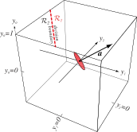{width=80%}

For a given sample \$\\mathbf{y}\_{i}\$, the equation \$\\mathbf{a}\^{T}\\mathbf{y}\_{i}
= 0\$ defines a hyperplane through the origin of weight space, with
\$\\mathbf{y}\_{i}\$ as a normal vector.

The location of the optimal solution vector is "constrained" by each training
sample.

The solution vector lies within the intersection of these half-planes.

## Normalization

It is useful to consider that if we knew which samples belong to \$\\omega\_{1}\$ or
\$\\omega\_{2}\$ (i.e. during training), then the actual sign of
\$\\mathbf{a}\^{T}\\mathbf{y}\_{i}\$ doesn't matter.

We just find a vector \$\\mathbf{a}\$ such that \$\\mathbf{a}\^{T}\\mathbf{y}\_{i}>0\$
for all samples, and flip the signs of those that belong to \$\\omega\_{2}\$.

We call this flip in sign "normalization" (not to be confused with
"regularization").

Thus we're looking for a weight vector \$\\mathbf{a}\$ that is on the positive side
of all possible hyperplanes defined by the training samples.

## Pre-Normalization

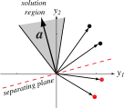{width=100%}

The red dotted line is one of the possible separating hyperplanes.

The solution vector is normal (and positive) to the hyperplane.

The grey region denotes the region of possible solution vectors, which we call the **solution space**.

Note that each of the possible solutions is orthogonal to one of \$\\mathbf{y}\_{i}\$.

## Post-Normalization

{width=100%}

Following "normalization", the sign of the cases labeled \$\\omega\_{2}\$ is
flipped.

Now we have a solution that corresponds to the discriminant function
\$g(\\mathbf{x}) = \\mathbf{a}\^{T}\\mathbf{y}\$.

Again, using what we have so far, the solution vector \$\\mathbf{a}\$ is not unique
-- any vector in the "solution region" is valid.

## Weight Space vs. Feature Space

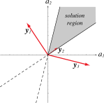{width=80%}

{width=80%}

## Selecting Optimal Solutions

{width=80%}

Which of these solutions is "best"?

We can specify that we want our chosen solution vector to be the one that
**maximizes the minimum distance** from samples to the separating hyperplane.

## Selecting Optimal Solutions

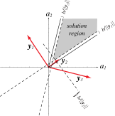{width=80%}

Thus, we want to obtain a solution vector for which:

\$\\mathbf{a}\^{T}\\mathbf{y}\_{i}\\geq b \\text{ for all } i\$

where \$b>0\$.

This is stronger than saying we want \$\\mathbf{a}\^{T}\\mathbf{y}\_{i}\\geq 0\$, since
now we have some **margin** that we're using to "insulate" the decision
region with a distance of \$\\frac{b}{||\\mathbf{y}\_{i}||}\$.

## Introducing a Margin Constraint

{width=80%}

{width=80%}

## We Still Need \$\\mathbf{a}\$!

This is all well and good, but we **still** haven't said how we should go
about actually finding \$\\mathbf{a}\$! We've just defined the criteria we'll use
to say what a "good" candidate for \$\\mathbf{a}\$ looks like.

To actually get a vector, and to have a method that's generalizable, we can't
find a closed-form solution. We have to use numerical optimization techniques.

# 
## Numerical Optimization

## How Should We Find \$\\mathbf{a}\$?

We need to find a solution to the set of linear inequalities
\$\\mathbf{a}\^{T}\\mathbf{y}\_{i} > 0\$ (or \$\\mathbf{a}\^{T}\\mathbf{y}\_{i} \\geq b\$).

We can define a criterion function \$J(\\mathbf{a})\$ that spits out a number which
is minimized when \$\\mathbf{a}\$ is an optimal solution vector.

This is a **scalar function optimization ** or **numerical optimization**
problem.

## Numerical Optimization

The basic strategy behind numerical optimization is:

1. You have a cost function (\$J(\\mathbf{a})\$) you want to minimize.
2. You have a (random?) set of parameters that define \$\\mathbf{a}\$.
3. On iteration 1, calculate the cost \$J(\\mathbf{a})\$ for your initial conditions.
4. On the next iteration, "nudge" your parameters and see how \$J(\\mathbf{a})\$
   changes.

	- If the cost goes up, go back and try a different "nudge".
	- If the cost goes down, keep "nudging" in the same direction.
	- If the cost is the same, stay where you are.

5. Repeat Step 4 until you reach convergence, where your cost function is barely
   changing.

## Numerical Optimization Demonstration

Some great examples of numerical optimization can be found here:

*An Interactive Tutorial on Numerical Optimization*:
: [http://www.benfrederickson.com/numerical-optimization/](http://www.benfrederickson.com/numerical-optimization/)

## Gradient Descent

A simple approach is to use **gradient descent**: start with a random weight
vector, \$\\mathbf{a}\_{1}\$, and find a better one iteratively using:

\$ \\mathbf{a}\_{k+1} = \\mathbf{a}\_{k}-\\eta\_{k}\\Delta J(\\mathbf{a}\_{k}) \$

where \$\\eta\_{k}\$ is the **learning rate**, i.e. how far you "jump down" the
gradient at iteration \$k\$, and \$\\Delta J(\\mathbf{a}\_{k})\$ is the change in the
cost.

Hopefully (!) this will converge to an optimal \$J(\\mathbf{a})\$.

## Basic Gradient Descent

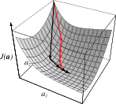{width=100%}

Set \$k=0\$ and initialize \$\\mathbf{a}, \\theta, \\eta\_{k}(\\cdot)\$
<ol>
<li class="fragment">\$k \\leftarrow k+1\$</li>
<li class="fragment">\$\\mathbf{a} \\leftarrow \\eta\_{k}\\Delta
J(\\mathbf{a})\$</li>
<li class="fragment">Repeat 1-2 until \$|\\eta\_{k}\\Delta J(\\mathbf{a})| < \\theta\$</li>
</ol>

## Questions to Consider for Gradient Descent

Once you dig into the details, there are a number of questions:

1. How far should we "nudge" our parameter set? (Setting the learning rate)
2. What form should our optimization function be?
3. How do we avoid getting stuck in local minima?
4. When should we stop "nudging"? (Identifying convergence)
5. How computationally complex is our algorithm?

# 
## Setting the Learning Rate

## Setting the Learning Rate

We need to specify the learning rate \$\\eta\$ such that it is reasonably fast
(i.e. not too small) but also will not overshoot (i.e. not too big).

I'll spare you the math, but using a second-order expansion around
\$\\mathbf{a}\_{k}\$ and some second partial derivatives, we can get:

\$ \\eta\_{k} = \\frac{|\\Delta J|\^{2}}{\\Delta J\^{T}\\mathbf{H}\\Delta J} \$

where \$\\mathbf{H}\$ is the **Hessian matrix**, which is the matrix of second
partial derivatives of \$J\$.

If the criterion function is quadratic everywhere, then \$\\eta\_{k}\$ is the same
for all \$k\$.

## Setting the Learning Rate: Not Trivial!

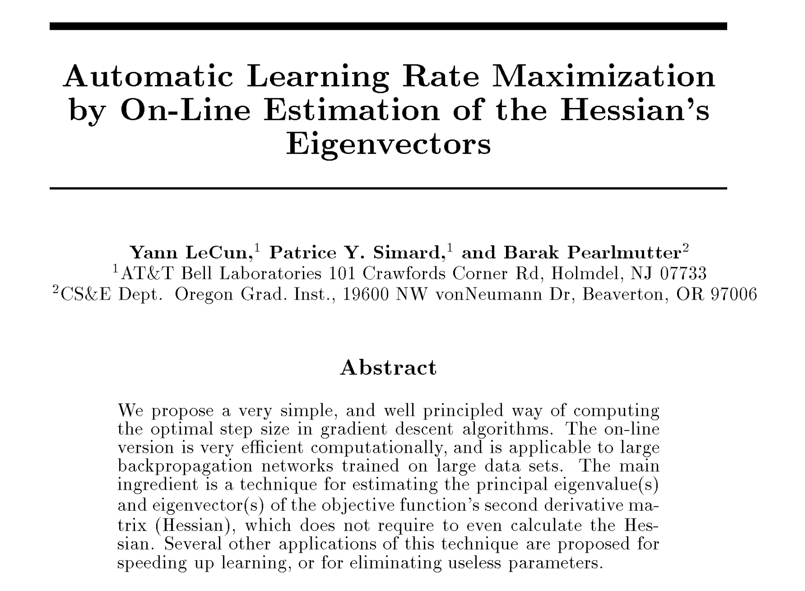{width=50%}

Link: [http://www.bcl.hamilton.ie/~barak/papers/nips92-lecun-nofigs.pdf](http://www.bcl.hamilton.ie/~barak/papers/nips92-lecun-nofigs.pdf)

# 
## Summary

## Discriminants in Low and High Dimensional Space

Linear discriminants divide space up into straight lines (hence the name), but
in real life sometimes data doesn't exactly follow straight lines.

Having multiple regions or classes means we need more **descriptive** methods
to model the feature space divisions.

By projecting data from \$d\$ to \$\\widehat{d}\$ dimensions, we can build **linear**
discriminants in \$\\widehat{d}\$ which are **nonlinear** in \$d\$.

This trick is used a few different ways, in both Support Vector Machines and
Neural Networks.

## Overall Idea

Where do we put our discriminating hyperplane? We use numerical
optimization:

1. You have a cost function you want to minimize (\$J(\\mathbf{a})\$).
2. You have a set of parameters (\$\\mathbf{a}\$) to start out with.
3. On iteration 1, test the parameters and calculate the cost (\$J(\\mathbf{a})\$).
4. On the next iteration, ``nudge'' your parameter set and see how the cost changes.
5. Repeat until convergence, where your cost function is barely changing.

## Linear Discriminants

Linear discriminants provide a preview of a lot of different concepts:

- Designing an optimally-spearating hyperplane
- Identifying the minimum distance between training points and clusters
- Projecting back and forth between different spaces

We will see these concepts again and again, particularly when we discuss
clustering and Support Vector Machines.

You can analyze your data using these concepts **without** performing
classification!

# 
## Next Class

## Next Class

This is obviously a big topic, so we'll have one more lecture on this.

We will cover:

- Different forms of the criterion / cost function
- How to "nudge" the parameters to improve the cost function
- When to stop optimizing, identifying convergence

## Next Class

We will discuss ways to decide on the "optimal" hyperplane, which may not
perfectly separate out the samples from each class.

We will also start to talk about Support Vector Machines.
