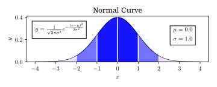
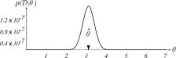
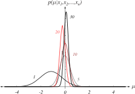
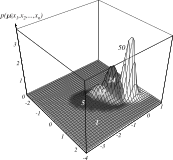

# 

## Recap

## Recap: Bayes Formula

The posterior probability is:

\$ P(\\omega\_{i} | \\mathbf{x}) = \\frac{p(\\mathbf{x}|\\omega\_{i})P(\\omega\_{i})}{\\sum\_{j=1}\^{c}p(\\mathbf{x}|\\omega\_{j}) P(\\omega\_{j})}\$

\$P(\\omega\_{i})\$: The prior probability of \$\\omega\_{i}\$

\$p(\\mathbf{x}|\\omega\_{i})\$: The class-conditional PDF

If we know these two quantities, then we have our decision rule:

If \$p(\\mathbf{x}|\\omega\_{1}) P(\\omega\_{1}) > p(\\mathbf{x}|\\omega\_{2})P(\\omega\_{2})\$, decide \$\\omega\_{1}\$
otherwise, decide \$\\omega\_{2}\$

## Recap: Estimation of Bayes Quantities

We are rarely given \$P(\\omega\_{i})\$ and \$p(\\mathbf{x}|\\omega\_{i})\$ directly.

Instead, we collect a **limited, random sampling** of \$\\mathbf{x}\$, which
constitutes our **training data**.

<ul>
<li class="fragment">In **supervised learning** our training data consists of
both the values of each observation of \$\\mathbf{x}\$ AND the corresponding class label \$\\omega\_{i}, i\\in\\{1,\\ldots,c\\}\$.</li>
<li class="fragment">In **unsupervised learning** we just have the values for \$\\mathbf{x}\$, but no class labels.</li>
</ul>

Training data is how we estimate \$P(\\omega\_{i})\$ and \$p(\\mathbf{x}|\\omega\_{i})\$.

## Recap: Figuring out Numbers: \$P(\\omega\_{i})\$, \$p(\\mathbf{x}|\\omega\_{i})\$

<iframe frameborder="0" seamless='seamless' scrolling=no src="plots/texture_mean.html"></iframe>

We can estimate \$P(\\omega\_{i})\$ simply as the proportion of our training data
with the class label \$\\omega\_{i}\$. 

Estimating \$p(\\mathbf{x}|\\omega\_{i})\$ is much
more difficult:

<ul>
<li class="fragment">Few samples for each class</li>
<li class="fragment">\$\\mathbf{x}\$ may be high-dimensional</li>
</ul>

If we can **make assumptions about the form of**
\$p(\\mathbf{x}|\\omega\_{i})\$, things are much easier.

## Recap: Normal Densities

{ width=80% }

## Recap: Normal Densities

The normal distribution is written as:

\$ p(x) \\sim N(\\mu,\\sigma\^{2}) = \\frac{1}{\\sqrt{2\pi}\\sigma}\\exp{\\left[-\\frac{1}{2}\\left(\\frac{x-\\mu}{\\sigma}\\right)\^{2}\\right]}\$

Its **parameters**, the mean and variance, are defined as:

\\begin{align}
\\mu\\equiv \\mathcal{E}\\left[x\\right] \&= \\int\_{-\\infty}\^{\\infty}(x)p(x)dx \\\\
\\sigma\^{2}\\equiv \\mathcal{E}\\left[(x-\\mu)\^{2}\\right]\&=\\int\_{-\\infty}\^{\\infty}(x-\\mu)\^{2}p(x)dx\\\\
\\end{align}

# 
## Parameter Estimation

## Benefits of Parameter Estimation

{width=80%}

We reduce the problem from estimating:

- An unknown function \$p(\\mathbf{x}|\\omega\_{i})\$ (difficult)
- Unknown parameters \$\\boldsymbol{\\mu}\_{i}\$ and \$\\boldsymbol{\\Sigma}\_{i}\$
  (easier)

## Benefits of Parameter Estimation

In general, we write a set of parameters as \$\\boldsymbol{\\theta}\_{i}\$, where
\$i\\in\\{1,\\ldots,c\\}\$ refers to the class.

If \$p(\\mathbf{x}|\\omega\_{i}) \\sim
N(\\boldsymbol{\\mu}\_{i},\\boldsymbol{\\Sigma}\_{i})\$, then
\$\\boldsymbol{\\theta}\_{i}=(\\boldsymbol{\\mu}\_{i}, \\boldsymbol{\\Sigma}\_{i})\$.

Note that "parameters" can refer to **any** set of parameters for a
statistical model, including the values governing how classifiers behave.

How do we find the parameters of these distributions?
 

## Two Approaches to Estimation: MLE vs. BAY

**Maximum Likelihood Estimation (MLE)**

<ul>
<li class="fragment">\$\\boldsymbol{\\theta}\_{i}\$ is a set of fixed, unknown quantities that we are trying to discover.</li>
<li class="fragment">The estimated values are those that maximize the probability of observing our training data.</li>
</ul>

**Bayesian Estimation (BAY)**

<ul>
<li class="fragment">\$\\boldsymbol{\\theta}\_{i}\$ is a set of random variables, each with a known prior distribution.</li>
<li class="fragment">Training data observations turn these priors into posterior densities.</li>
<li class="fragment">More training "sharpens" the density near the true values
of the parameters -- this is known as **Bayesian Learning**</li>

</ul>

# 
## Maximum Likelihood Estimation

## MLE: Principle

Suppose we have \$c\$ sets of training data for each class:
\$\\mathcal{D}\_{1},\\ldots,\\mathcal{D}\_{c}\$

Each sample in \$\\mathcal{D}\_{i}\$ is drawn independently according to probability
law \$p(\\mathbf{x}|\\omega\_{i})\$.

These samples are **independent and identically distributed** (i.i.d.) random
variables.

We're assuming that \$p(\\mathbf{x}|\\omega\_{i})\$ has some known parametric form
(e.g. it's a Gaussian), which means it's defined by the parameter set
\$\\boldsymbol{\\theta}\_{i}\$.

Therefore we write \$p(\\mathbf{x}|\\omega\_{i})\$ as \$p(\\mathbf{x}|\\omega\_{i},
\\boldsymbol{\\theta}\_{i})\$, where we have a different \$\\boldsymbol{\\theta}\$
(parameter set) for each class.

We can treat each class independently by assuming that samples in
\$\\mathcal{D}\_{i}\$ give no information about \$\\boldsymbol{\\theta}\_{j}\$ if \$i\\neq
j\$.

## Calculating the Optimal \$\\boldsymbol{\\theta}\$

So we now have \$c\$ problems, stated thusly:

> Use a set of training data \$\\mathcal{D}\$ drawn independently from the
> probability density \$p(\\mathbf{x}|\\boldsymbol{\\theta})\$ to estimate the
> unknown parameter vector \$\\boldsymbol{\\theta}\$.

Once we find the parameter values, we use those to model our distribution, and
then we can use that to create our PDFs.

## Likelihood of the Parameter Set

Suppose \$\\mathcal{D} = \\{\\mathbf{x}\_{1}, \\ldots, \\mathbf{x}\_{n}\\}\$.

Since these
samples are i.i.d., we can write:

\$ p(\\mathcal{D}|\\boldsymbol{\\theta}) = \\prod\_{k=1}\^{n}p(\\mathbf{x}\_{k}|\\boldsymbol{\\theta})\$

This is the **likelihood** of observing a particular \$\\mathcal{D}\$ given
parameter values \$\\boldsymbol{\\theta}\$.

This is equivalent to the product of the likelihoods of observing **each individual sample** \$\\mathbf{x}\_{k}\$ in the training set, given the parameter values \$\\boldsymbol{\\theta}\$.

## Calculating the Optimal \$\\boldsymbol{\\theta}\$

{width=100%}

- Each line represents the estimated \$p(\\mathbf{x}\_{k}|\\boldsymbol{\\theta})\$ for some training data (red).
- Each data point "suggests" a Gaussian with a mean centered on the data point.
- All "suggested" Gaussians have the same variance ("identically  distributed").

## Calculating the Optimal \$\\boldsymbol{\\theta}\$

{width=100%}

This is the combined likelihood:

\$p(\\mathcal{D}|\\boldsymbol{\\theta}) = \\prod\_{k=1}\^{n} p(\\mathbf{x}\_{k}|\\boldsymbol{\\theta})\$

This is a function of \$\\boldsymbol{\\theta}\$, not \$x\$.
 

The **maximum-likelihood estimate**
of \$\\boldsymbol{\\theta}\$ is the value \$\\widehat{\\theta}\$ that maximizes the likelihood of
producing the observed \$\\mathcal{D}\$.

## Finding the MLE Estimate of \$\\boldsymbol{\\theta}\$

{width=90%}

{width=90%}

Whenever we want to maximize something, we set the gradient to \$0\$.

If \$\\boldsymbol{\\theta} = (\\theta\_{1}\\ldots,\\theta\_{p})\^{t}\$, then the gradient operator is:

\$\\boldsymbol{\\nabla}\_{\\boldsymbol{\\theta}}\\equiv
\\begin{bmatrix}
\\frac{\\partial}{\\partial\\theta\_{1}}\\\\
\\vdots\\\\
\\frac{\\partial}{\\partial\\theta\_{p}}
\\end{bmatrix}\$

## Calculating the Optimal \$\\boldsymbol{\\theta}\$

{width=90%}

{width=90%}

Let's make things easier by converting to **log-likelihoods**:

\$ l(\\boldsymbol{\\theta}) \\equiv \\ln{p(\\mathcal{D}|\\boldsymbol{\\theta})} = \\sum\_{k=1}\^{n}\\ln{p(\\mathbf{x}\_{k}|\\boldsymbol{\\theta})} \$

We need the value of \$\\boldsymbol{\\theta}\$ such that: \$\\widehat{\\boldsymbol{\\theta}}=\\textrm{arg max}\_{\\boldsymbol{\\theta}}\\left[l(\\boldsymbol{\\theta})\\right]\$

## Calculating the Optimal \$\\boldsymbol{\\theta}\$

{width=90%}

{width=90%}

Set the gradient of \$l\$ to zero:

\$ \\boldsymbol{\\nabla}\_{\\boldsymbol{\\theta}} l = \\sum\_{k=1}\^{n}\\boldsymbol{\\nabla}\_{\\boldsymbol{\\theta}}\\ln{p(\\mathbf{x}\_{k}|\\boldsymbol{\\theta})} = \\mathbf{0}\$

This is a system of equations, one for each partial derivative.
 

## Calculating the Optimal \$\\boldsymbol{\\theta}\$

{width=90%}

{width=90%}

As with all gradient methods, you need to make sure the solution is a
**global maximum** and not a minimum, local solution, or inflection
point.

\$\\widehat{\\boldsymbol{\\theta}}\$ is only an **estimate**; to get the **true**
value, we'd have to collect \$n=\\infty\$ training points.

# 
## Gaussian Cases

## Motivation for Gaussian Cases

Central Limit Theorem: as 
\$n\\rightarrow\\infty\$, if the underlying distribution has a well-defined expected
value and variance, the arithmetic mean of the collected samples will be
normally distributed.

If you have a large \$n\$, it's a good guess for the parametric
distribution.

Let's examine the Gaussian cases under a few conditions, just like we did with
linear discriminants, with the goal of estimating
\$\\boldsymbol{\\theta}=(\\boldsymbol{\\mu}, \\boldsymbol{\\Sigma})\$.

**Note**: Some of the results in this section may seem obvious; however, this
is to illustrate the mathematical justification for what comes naturally.
(You'll see what I mean...)

## Case 1: Known \$\\boldsymbol{\\Sigma}\$, Unknown \$\\boldsymbol{\\mu}\$

Let's say you already know the variance of a random variable. How would you
estimate the mean? (What is the average radius of a nucleus?)

Restated: Given a random nucleus, what do we **expect** its radius to be?

<ul>
<li class="fragment">Our random variable is **radius**.</li>
<li class="fragment">You collect many measurements (training data) and calculate the expected value from that.</li>
<li class="fragment">We assume the expected value is normally distributed...</li>
<li class="fragment">... so you would calculate the **arithmetic mean**.</li>
</ul>

**Why does this give us the optimal estimate of \$\\boldsymbol{\\theta}\$?**

## Case 1: Known \$\\boldsymbol{\\Sigma}\$, Unknown \$\\boldsymbol{\\mu}\$

Consider a single sample \$\\mathbf{x}\_{k}\$. We are **assuming** we have the
covariance and need to find \$\\boldsymbol{\\mu}\$.

If \$p(\\mathbf{x}\_{k}|\\boldsymbol{\\mu})\$ is normally distributed,
and we are using the log-likelihood, we can write:

\$ l(\\boldsymbol{\\mu}) = \\ln{p(\\mathbf{x}\_{k}|\\boldsymbol{\\mu})} = -\\frac{1}{2}\\ln{\\left[(2\\pi)\^{d}|\\boldsymbol{\\Sigma}|\\right]} - \\frac{1}{2}(\\mathbf{x}\_{k} - \\boldsymbol{\\mu})\^{T}\\boldsymbol{\\Sigma}\^{-1}(\\mathbf{x}\_{k} - \\boldsymbol{\\mu}) \$

Our gradient function, then, is the derivative of that with respect to
\$\\boldsymbol{\\mu}\$:

\$ \\boldsymbol{\\nabla}\_{\\boldsymbol{\\mu}}\\ln{p(\\mathbf{x}\_{k}|\\boldsymbol{\\mu})} = \\boldsymbol{\\Sigma}\^{-1}(\\mathbf{x}\_{k} - \\boldsymbol{\\mu}) \$

## Case 1: Known \$\\boldsymbol{\\Sigma}\$, Unknown \$\\boldsymbol{\\mu}\$

\$ \\boldsymbol{\\nabla}\_{\\boldsymbol{\\mu}} \\ln{p(\\mathbf{x}\_{k}|\\boldsymbol{\\mu})} = \\boldsymbol{\\Sigma}\^{-1}(\\mathbf{x}\_{k} - \\boldsymbol{\\mu}) \$

Once again, we find our optimal mean \$\\widehat{\\boldsymbol{\\mu}}\$ by setting
this equal to zero:

\\begin{align}
\\sum\_{k=1}\^{n}\\boldsymbol{\\Sigma}\^{-1}(\\mathbf{x}\_{k} - \\widehat{\\boldsymbol{\\mu}}) \&= \\mathbf{0} \\\\
\\sum\_{k=1}\^{n}(\\mathbf{x}\_{k}) - \\sum\_{k=1}\^{n}(\\widehat{\\boldsymbol{\\mu}}) \&= \\mathbf{0}\\\\
\\sum\_{k=1}\^{n}(\\mathbf{x}\_{k}) - n\\widehat{\\boldsymbol{\\mu}} \&= \\mathbf{0}\\\\
\\widehat{\\boldsymbol{\\mu}} \&= \\frac{1}{n}\\sum\_{k=1}\^{n}\\mathbf{x}\_{k} 
\\end{align}

## Case 2: Unknown \$\\boldsymbol{\\Sigma}\$ and \$\\boldsymbol{\\mu}\$

More often, you won't know anything about the distribution ahead of time, so
you'll need to estimate both \$\\boldsymbol{\\Sigma}\$ and \$\\boldsymbol{\\mu}\$.

Let's start with the univariate case, so \$\\boldsymbol{\\theta}=(\\mu,\\sigma\^{2})\$.

## Case 2: Unknown \$\\boldsymbol{\\Sigma}\$ and \$\\boldsymbol{\\mu}\$

Here the log-likelihood of a single point \$x\_{k}\$ is:

\$ \\ln{p(x\_{k}|\\boldsymbol{\\theta})} = - \\frac{1}{2} \\ln{\\left[2\pi\\sigma\^{2}\\right]} - \\frac{1}{2\\sigma\^{2}} (x\_{k} - \\mu)\^{2} \$

And the derivative is:

\$ \\boldsymbol{\\nabla}\_{\\boldsymbol{\\theta}} \\ln{ p(x\_{k}|\\boldsymbol{\\theta}) } = \\begin{bmatrix}
\\frac{\\partial}{\\partial\\mu} \\ln{p(x\_{k}|\\boldsymbol{\\theta})}\\\\
\\frac{\\partial}{\\partial\\sigma} \\ln{p(x\_{k}|\\boldsymbol{\\theta})}
\\end{bmatrix} =
\\begin{bmatrix}
\\frac{1}{\\sigma\^{2}} (x\_{k} - \\mu)\\\\
-\\frac{1}{\\sigma\^{2}} + \\frac{(x\_{k} - \\mu)\^{2}}{2\\sigma\^{2}}
\\end{bmatrix}\$

This is a system of equations, one for each of the parameters we're interested
in. We set both of those to zero to solve for the optimal estimates.

## Case 2: Unknown \$\\boldsymbol{\\Sigma}\$ and \$\\boldsymbol{\\mu}\$

\$\\begin{bmatrix}
\\frac{1}{\\sigma\^{2}} (x\_{k} - \\mu)\\\\
-\\frac{1}{\\sigma\^{2}} + \\frac{(x\_{k} - \\mu)\^{2}}{2\\sigma\^{2}}
\\end{bmatrix}=\\mathbf{0}\$

\\begin{align}
\\sum\_{k=1}\^{n} \\frac{1}{\\widehat{\\sigma}\^{2}} (x\_{k} - \\widehat{\\mu}) \&= 0 \\\\
- \\sum\_{k=1}\^{n} \\frac{1}{\\widehat{\\sigma}\^{2}} + \\sum\_{k=1}\^{n} \\frac{(x\_{k} - \\widehat{\\mu})\^{2}}{\\widehat{\\sigma}\^{2}} \&= 0
\\end{align}

## Case 2: Unknown \$\\boldsymbol{\\Sigma}\$ and \$\\boldsymbol{\\mu}\$

We rearrange a bit, and end up with:

\\begin{align}
\\widehat{\\mu} \&= \\frac{1}{n} \\sum\_{k=1}\^{n} x\_{k} \qquad\\text{(just like before)} \\\\
\\widehat{\\sigma}\^{2} \&= \\frac{1}{n} \\sum\_{k=1}\^{n} (x\_{k} - \\widehat{\\mu})\^{2}
\\end{align}

Once again, \$\\widehat{\\sigma}\$ should look familiar!

## Case 2: Unknown \$\\boldsymbol{\\Sigma}\$ and \$\\boldsymbol{\\mu}\$

Extending to the multivariate case works the same way, with just more
manipulations.

Assuming you trust me (or if not, assuming you trust the textbook), the result
of these manipulations is:

\$ \\widehat{\\boldsymbol{\\mu}} = \\frac{1}{n} \\sum\_{k=1}\^{n} \\mathbf{x}\_{k} \$

\$ \\widehat{\\boldsymbol{\\Sigma}} = \\frac{1}{n} \\sum\_{k=1}\^{n} (\\mathbf{x}\_{k} - \\widehat{\\boldsymbol{\\mu}}) (\\mathbf{x}\_{k} - \\widehat{\\boldsymbol{\\mu}})\^{T} \$

(Reminder: \$(\\mathbf{x}\_{k} - \\widehat{\\boldsymbol{\\mu}}) (\\mathbf{x}\_{k} -
\\widehat{\\boldsymbol{\\mu}})\^{T}\$ is a matrix.)

## Problems with MLE

What can go wrong with Maximum Likelihood Estimation?

Refer back to our assumptions...

**Model**: If the model is **not** correct and the samples are **not**
normally distributed, we have to solve using a different formula and our
parameters might not even be correct.

**Sample Size**: If there are too few training samples for the Central Limit
Theorem to come into play, then we may not get an accurate estimate.

This is not just a problem with MLE, but a problem with ALL estimation
attempts -- so much so that we will look at model selection in another lecture.

## Statistical Bias (Side Note)

The MLE for \$\\sigma\^{2}\$ is **biased**, meaning that it systemically
underestimates the actual variance:

\$ \\mathcal{E} \\left[ \\frac{1}{2} \\sum\_{k=1}\^{n} (x\_{k} - \\widehat{\\mu})\^{2}\\right] = \\frac{n-1}{n} \\sigma\^{2} \\neq \\sigma\^{2} \$

In other words, our estimate (on the left) is a fraction of the true variance.

<ul>
<li class="fragment">For low \$n\$, this is significant: if \$n=10\$, then our estimate is \$0.9\$ of the true variance.</li>
<li class="fragment">For high \$n\$, the effect is small: if \$n=1*10e\^{6}\$, our estimate is \$0.9999\$ of the true variance.</li>
</ul>

## Statistical Bias (Side Note)

This is an **asymptotically unbiased** estimator: it gets less biased as
\$n\\rightarrow\\infty\$.

We can use an **absolutely unbiased** estimator called the **sample
covariance matrix**:

\$ \\mathbf{C} = \\frac{1}{n-1} \\sum\_{k=1}\^{n} (\\mathbf{x}\_{k} - \\widehat{\\boldsymbol{\\mu}}) (\\mathbf{x}\_{k} - \\widehat{\\boldsymbol{\\mu}})\^{T} \$

# 
## Bayesian Parameter Estimation

## Intuition for Bayes

In MLE, we assumed that \$\\boldsymbol{\\theta}\$ was fixed, we just didn't know
what it was.

In BAY, we assume that \$\\boldsymbol{\\theta}\$ is a random variable, just like
\$\\mathbf{x}\$, and that training data allows us to convert the distribution of
\$\\boldsymbol{\\theta}\$ into a posterior probability density.

## Intuition for Bayes

The results of MLE and BAY will very often be identical -- so why use Bayes?

<ul>
<li class="fragment">It is a fundamentally different approach to the assumptions we make about our data.</li>
<li class="fragment">BAY includes additional information that helps if we don't know the true model.</li>
<li class="fragment">BAY also explicitly incorporates the idea of uncertainty into the methods - we are not saying "This IS the value," we say "This value is drawn from THIS distribution."</li>
</ul>

## Class-Conditional Densities

\$ P(\\omega\_{i}|\\mathbf{x}) = \\frac{p(\\mathbf{x}|\\omega\_{i}) P(\\omega\_{i})}{\\sum\_{j=1}\^{c} p(\\mathbf{x}|\\omega\_{j}) P(\\omega\_{j})} \$

Recall the main components of Bayesian Classification:

\$P(\\omega\_{i}|\\mathbf{x})\$: **Posterior probability**, what we want to obtain.

\$p(\\mathbf{x}|\\omega\_{i})\$: **Class-conditional Density**, what we get from our training data values.

\$P(\\omega\_{i})\$: **Prior Probability**, what we get from the fraction of each class in our training.

How do we obtain these quantities? We estimate them using as much information as
we can about the problem -- our **prior knowledge**, and our **training data**.

## Assumptions and Notational Changes

We can rewrite Bayes to show its dependence on the training set \$\\mathcal{D}\$:

\$ P(\\omega\_{i}|\\mathbf{x},\\mathcal{D}) = \\frac{ p(\\mathbf{x}|\\omega\_{i},\\mathcal{D}) P(\\omega\_{i}|\\mathcal{D}) }{ \\sum\_{j=1}\^{c}p(\\mathbf{x}|\\omega\_{j},\\mathcal{D}) P(\\omega\_{j}|\\mathcal{D}) } \$

Assume prior probabilities are known ahead of time OR can be calculated
(fraction of \$\\mathcal{D}\$ belonging to each class); thus \$P(\\omega\_{i}) =
P(\\omega\_{i}|\\mathcal{D})\$.

## Assumptions and Notational Changes

As we did before, we break up the training set into \$c\$ class-based subsets,
\$\\mathcal{D}\_{1},\\ldots,\\mathcal{D}\_{c}\$.

Again, the samples in \$\\mathcal{D}\_{i}\$ have no useful information about
\$p(\\mathbf{x}|\\omega\_{j},\\mathcal{D})\$ if \$i\\neq j\$.

Therefore we can handle each class as an independent estimation problem:

> Use a set of training data \$\\mathcal{D}\$ drawn independently according to the
> fixed but unknown probability distribution \$p(\\mathbf{x})\$ to determine
> \$p(\\mathbf{x}|\\mathcal{D})\$.

In other words, we're trying to determine the probability of observing a feature
vector given the set of training we've already observed.

## Parameter Distribution

We're assuming that even though we don't know \$p(\\mathbf{x})\$, it has a
parametric form. So again, we are estimating the parameter vector
\$\\boldsymbol{\\theta}\$.

This is expressed by saying that the function
\$p(\\mathbf{x}|\\boldsymbol{\\theta})\$ is "completely known".

Information about \$\\boldsymbol{\\theta}\$ **without observing the samples**
(i.e. prior) is contained in a **known** density \$p(\\boldsymbol{\\theta})\$.

**After** we observe the training set, this gets converted to a
**posterior** density \$p(\\boldsymbol{\\theta}|\\mathcal{D})\$, which is hopefully
peaked around the true value of \$\\boldsymbol{\\theta}\$.

## Parameter Distribution

So we've connected \$p(\\mathbf{x})\$ (what we want) to \$\\boldsymbol{\\theta}\$ (the
parameter vector) by \$p(\\mathbf{x}|\\boldsymbol{\\theta})\$, and we've connected
the parameter vector to the training set by
\$p(\\boldsymbol{\\theta}|\\mathcal{D})\$.

In this way we can estimate \$p(\\mathbf{x})\$ by calculating
\$p(\\mathbf{x}|\\mathcal{D})\$, and we do THAT by integrating the **joint
density** \$p(\\mathbf{x}, \\boldsymbol{\\theta} | \\mathcal{D})\$ over the entire
parameter space for \$\\boldsymbol{\\theta}\$:

\\begin{align}
p(\\mathbf{x} | \\mathcal{D}) \&= \\int p(\\mathbf{x}, \\boldsymbol{\\theta} | \\mathcal{D}) d\\boldsymbol{\\theta} \\\\
p(\\mathbf{x} | \\mathcal{D}) \&= \\int p(\\mathbf{x} | \\boldsymbol{\\theta},
\\mathcal{D}) p(\\boldsymbol{\\theta} | \\mathcal{D}) d\\boldsymbol{\\theta}
\\end{align}

Since \$\\mathbf{x}\$ and \$\\mathcal{D}\$ are independent, we can drop the
\$\\mathcal{D}\$ in the first term, and write:

\$ p(\\mathbf{x} | \\mathcal{D}) = \\int p(\\mathbf{x} | \\boldsymbol{\\theta}) p(\\boldsymbol{\\theta} | \\mathcal{D}) d\\boldsymbol{\\theta} \$

## Parameter Distribution

\$ p(\\mathbf{x} | \\mathcal{D}) = \\int p(\\mathbf{x} | \\boldsymbol{\\theta}) p(\\boldsymbol{\\theta} | \\mathcal{D}) d\\boldsymbol{\\theta} \$

This equation links the class-conditional density \$p(\\mathbf{x} | \\mathcal{D})\$
to the posterior density for the parameter vector, \$p(\\boldsymbol{\\theta} |
\\mathcal{D})\$, and to the likelihood \$p(\\mathbf{x} | \\boldsymbol{\\theta})\$.

If \$p(\\boldsymbol{\\theta} | \\mathcal{D})\$ peaks sharply around a specific value
\$\\widehat{\\boldsymbol{\\theta}}\$, then the above equation becomes:

\$ p(\\mathbf{x}|\\mathcal{D}) \\approx p(\\mathbf{x} | \\widehat{\\boldsymbol{\\theta}})\$

As the number of samples increases, we will see this "peakiness" increase as
well.

## How Is Sample Size Related to Parameter Estimates?

{width=80%}

{width=60%}

# 
## Bayesian Parameter Estimation: General Case

## BAY: General Theory

The summary of the basic assumptions for BAY estimation are as follows:

<ul>
<li class="fragment">The **form** of the density \$p(\\mathbf{x} | \\boldsymbol{\\theta})\$ is assumed to be known, but the **value** of \$\\boldsymbol{\\theta}\$ is not.</li>
<li class="fragment">Our initial knowledge about \$\\boldsymbol{\\theta}\$ is contained in a **known** prior \$p(\\boldsymbol{\\theta})\$.</li>
<li class="fragment">The rest of our knowledge about \$\\boldsymbol{\\theta}\$ is contained in a set \$\\mathcal{D}\$ of training samples drawn independently according to the unknown probability density \$p(\\mathbf{x})\$.</li>
</ul>

## BAY: General Theory

We want to compute the posterior density \$p(\\boldsymbol{\\theta} | \\mathcal{D})\$,
because that lets us find \$p(\\mathbf{x} | \\mathcal{D})\$.

By Bayes formula we have:

\$ p(\\boldsymbol{\\theta} | \\mathcal{D}) = \\frac{p(\\mathcal{D} | \\boldsymbol{\\theta}) p(\\boldsymbol{\\theta})} { \\int p(\\mathcal{D} | \\boldsymbol{\\theta}) p(\\boldsymbol{\\theta}) d\\boldsymbol{\\theta}} \$

Since the samples themselves are **independent** (we assume), we can also
write:

\$ p(\\mathcal{D} | \\boldsymbol{\\theta}) = \\prod\_{k=1}\^{n} p(\\mathbf{x}\_{k} | \\boldsymbol{\\theta}) \$

## BAY: General Theory

\\begin{align}
p(\\mathbf{x} | \\mathcal{D}) \&= \\int p(\\mathbf{x} | \\boldsymbol{\\theta}) p(\\boldsymbol{\\theta} | \\mathcal{D}) d\\boldsymbol{\\theta} \\\\
p(\\boldsymbol{\\theta} | \\mathcal{D}) \&= \\frac{p(\\mathcal{D} | \\boldsymbol{\\theta}) p(\\boldsymbol{\\theta})} { \\int p(\\mathcal{D} | \\boldsymbol{\\theta}) p(\\boldsymbol{\\theta}) d\\boldsymbol{\\theta}}
\\end{align}

Suppose that \$p(\\mathcal{D} | \\boldsymbol{\\theta})\$ reaches a sharp peak when
\$\\boldsymbol{\\theta} = \\widehat{\\boldsymbol{\\theta}}\$.

Assuming \$p(\\boldsymbol{\\theta})\$ is not zero at
\$\\widehat{\\boldsymbol{\\theta}}\$, then \$p(\\boldsymbol{\\theta} | \\mathcal{D})\$
also peaks around that point.

Thus, \$p(\\mathbf{x} | \\mathcal{D}) \\approx p(\\mathbf{x} |
\\widehat{\\boldsymbol{\\theta}})\$, which is what we get using MLE.

However, the Bayesian equations encode much more information about the problem
-- including **uncertainty** in the estimates -- versus MLE.

# 
## Bayesian Parameter Estimation: Gaussian Case

## Preview of Gaussian BAY

This section may be a little confusing. All we're saying is the following:

<ol>
<li class="fragment">The distribution from which our samples are drawn is normal: \$p(x) \\sim N(\\mu,\\sigma\^{2})\$.</li>
<li class="fragment">The parameters that control that distribution, namely \$\\mu\$ and \$\\sigma\^{2}\$, are ALSO drawn from their OWN normal distribution: \$p(\\mu) \\sim N(\\mu\_{0}, \\sigma\_{0}\^{2})\$.</li>
<li class="fragment">In MLE, we calculated the gradient of the sample distribution, set it to zero, and solved for the parameters -- then, by looking at the training samples, we just plug in the values to obtain the estimates for \$\\mu\$ and \$\\sigma\^{2}\$.</li>
<li class="fragment">In BAY, we use Bayes law to see the relationship between the distributions of the samples and the distributions of the parameters, and then solve for the latter.</li>
</ol>

## Univariate Case: Known \$\\sigma\^{2}\$

Assume that \$p(x | \\mu) \\sim N(\\mu, \\sigma\^{2})\$ and we have a known
\$\\sigma\^{2}\$.

We also know the density \$p(\\mu)\$, which contains any prior knowledge about
\$\\mu\$ -- specifically, we know that it too is Gaussian: \$p(\\mu) \\sim
N(\\mu\_{0}, \\sigma\_{0}\^{2})\$.

In this setup, \$\\mu\_{0}\$ is our "best guess" as to the value of \$\\mu\$, and
\$\\sigma\_{0}\^{2}\$ represents the variance or "uncertainty" about our guess.

Now we have to start drawing values of \$\\mu\$ from \$p(\\mu)\$, where each value
completely determines the density for \$x\$. THEN, we take a bunch of samples of
\$x\$, \$\\mathcal{D} = \\{x\_{1}, \\ldots, x\_{n}\\}\$, which are governed by that
density.

## Bayes Law (Yet Again)

\\begin{align}
p(\\mu | \\mathcal{D}) \&= \\frac{ p(\\mathcal{D} | \\mu) p(\\mu) }{ \\int p(\\mathcal{D} | \\mu) p(\\mu) d\\mu} \\\\
p(\\mathbf{x}) \&= \\prod\_{i=1}\^{d}\\frac{1}{\\sqrt{2\pi}\\sigma\_{i}}\\exp{\\left[-\\frac{1}{2}\\left(\\frac{x\_{i}-\\mu\_{i}}{\\sigma\_{i}}\\right)\^{2}\\right]} \\\\
p(\\mu | \\mathcal{D}) \&= \\alpha \\prod\_{k=1}\^{n}
            p(x\_{k} | \\mu)
            p(\\mu)
\\end{align}

(Where \$\\alpha\$ is a normalization factor that depends just on \$\\mathcal{D}\$.)

So think about this carefully: Our prior guess about \$\\mu\$ is directly
influenced by our observed training samples \$x\_{k}\$.

## Bayes Law (Still Going)

\$p(\\mu | \\mathcal{D}) = \\alpha \\prod\_{k=1}\^{n}
            p(x\_{k} | \\mu)
            p(\\mu)
\$

Since we know that both \$p(x\_{k} | \\mu) \\sim N(\\mu, \\sigma\^{2})\$ and \$p(\\mu)
\\sim N(\\mu\_{0}, \\sigma\_{0}\^{2})\$, we can rewrite the above equation as:

\$ p(\\mu | \\mathcal{D}) =
\\alpha
\\prod\_{k=1}\^{n}
\\frac{ 1 }{ \\sqrt{2\pi} \\sigma\_{~} }
\\exp{ \\left[ -\\frac{1}{2} \\left( \\frac{ x\_{k} - \\mu\_{~} }{ \\sigma\_{~} } \\right)\^{2} \\right] }
\\frac{ 1 }{ \\sqrt{2\pi} \\sigma\_{0} }
\\exp{ \\left[ -\\frac{1}{2} \\left( \\frac{ \\mu - \\mu\_{0} }{ \\sigma\_{0} } \\right)\^{2} \\right] }
\$

## Warning: Lotsa Math

\\begin{align}
p(\\mu | \\mathcal{D}) \&=
\\alpha
\\prod\_{k=1}\^{n}
        \\frac{ 1 }{ \\sqrt{2\pi} \\sigma\_{~} }
        \\exp{ \\left[ -\\frac{1}{2} \\left( \\frac{ x\_{k} - \\mu\_{~} }{ \\sigma\_{~} } \\right)\^{2} \\right] }
        \\frac{ 1 }{ \\sqrt{2\pi} \\sigma\_{0} }
        \\exp{ \\left[ -\\frac{1}{2} \\left( \\frac{ \\mu - \\mu\_{0} }{ \\sigma\_{0} } \\right)\^{2} \\right] }
\\\\
p(\\mu | \\mathcal{D}) \&= \\alpha\^{\\prime} \\exp{ \\left[ -\\frac{1}{2} \\left( \\sum\_{k=1}\^{n} \\left( \\frac{ \\mu - x\_{k}}{ \\sigma } \\right)\^{2} + \\left( \\frac{ \\mu - \\mu\_{0} }{ \\sigma\_{0} } \\right)\^{2} \\right) \\right] } \\\\
p(\\mu | \\mathcal{D}) \&= \\alpha\^{\\prime\\prime} \\exp{ \\left[ -\\frac{1}{2} \\left[ \\left( \\frac{n}{\\sigma\^{2}} + \\frac{1}{\\sigma\_{0}\^{2}} \\right) \\mu\^{2} - 2 \\left( \\frac{1}{\\sigma\^{2}} \\sum\_{k=1}\^{n} x\_{k} + \\frac{\\mu\_{0}}{\\sigma\_{0}\^{2}} \\right) \\mu \\right] \\right] }
\\end{align}

Factors independent of \$\\mu\$ are collected into the constants \$\\alpha\$,
\$\\alpha\^{\\prime}\$, and \$\\alpha\^{\\prime\\prime}\$.

The takeaway message from this derivation is that \$p(\\mu | \\mathcal{D})\$ is an
exponential function of a quadratic function of \$\\mu\$. In other words, \$p(\\mu |
\\mathcal{D})\$ is a **normal density**.

## What Does That Mean?

As we increase our training set size, \$p(\\mu | \\mathcal{D})\$ will always be
normal.

\$p(\\mu | \\mathcal{D})\$ is called a **reproducing density**, meaning it
reproduces the same form as the sampling is increased.

\$p(\\mu)\$ is a **conjugate prior**, meaning that it has the same form as the
associated prior.

If we write the parameters as \$p(\\mu | \\mathcal{D}) \\sim N(\\mu\_{n},
\\sigma\_{n}\^{2})\$, then we can simplify.

## Simplifying

\$ p(\\mu | \\mathcal{D}) = \\alpha\^{\\prime\\prime} \\exp{ \\left[ -\\frac{1}{2} \\left[ \\left( \\frac{n}{\\sigma\^{2}} + \\frac{1}{\\sigma\_{0}\^{2}} \\right) \\mu\^{2} - 2 \\left( \\frac{1}{\\sigma\^{2}} \\sum\_{k=1}\^{n} x\_{k} + \\frac{\\mu\_{0}}{\\sigma\_{0}\^{2}} \\right) \\mu \\right] \\right] } \$

Let:

\\begin{align}
\\frac{ 1 }{ \\sigma\_{n}\^{2} } \&= \\frac{ n }{ \\sigma\^{2} } + \\frac{ 1 }{ \\sigma\_{0}\^{2} }\\\\
\\frac{\\mu\_{n}}{\\sigma\_{n}\^{2}} \&= \\frac{n}{\\sigma\^{2}}\\widehat{\\mu\_{n}} + \\frac{ \\mu\_{0} }{ \\sigma\_{0}\^{2} }
\\end{align}

where \$\\widehat{\\mu\_{n}}\$ is the sample mean, \$\\frac{ 1 }{ n } \\sum\_{k=1}\^{n}
x\_{k}\$. 

Thus:

\$ p(\\mu | \\mathcal{D}) = \\frac{ 1 }{ \\sqrt{2\pi} \\sigma\_{n} } \\exp{\\left[ -\\frac{1}{2} \\left( \\frac{ \\mu - \\mu\_{n} }{ \\sigma\_{n} } \\right)\^{2} \\right]} \$

## Keep Solving

Solving for \$\\mu\_{n}\$ and \$\\sigma\_{n}\^{2}\$ yields:

\\begin{align}
\\mu\_{n} \&= \\left( \\frac{ n\\sigma\_{0}\^{2} }{ n\\sigma\_{0}\^{2} + \\sigma\^{2} } \\right) \\widehat{\\mu\_{n}} + \\frac{ \\sigma\^{2} }{ n\\sigma\_{0}\^{2} + \\sigma\^{2} }\\mu\_{0} \\\\
\\sigma\_{n}\^{2} \&= \\frac{ \\sigma\_{0}\^{2} \\sigma\^{2} }{ n\\sigma\_{0}\^{2} + \\sigma\^{2} }
\\end{align}

Okay! So... what? We're trying to estimate the parameters of our sample
distribution, and those parameters have their OWN distributions, e.g. \$p(\\mu |
\\mathcal{D})\$.

The above equations show how the "parameters of the parameters" are related to
the sample count \$n\$ and the mean and variance of the training samples.

After \$n\$ samples, \$\\mu\_{n}\$ is our best guess for \$\\mu\$, and \$\\sigma\_{n}\^{2}\$
is our uncertainty.

## More Samples is Always Better (Pretty Much)

\$ \\sigma\_{n}\^{2} = \\frac{ \\sigma\_{0}\^{2}\\sigma\^{2} }{ n\\sigma\_{0}\^{2} + \\sigma\^{2} } \$

If this is our "uncertainty", what happens as \$n\\rightarrow\\infty\$?

**Our uncertainty goes towards zero!** More samples means less uncertainty
about our guess.

## More Samples is Always Better (Pretty Much) 

\$ \\mu\_{n} = \\left( \\frac{ n\\sigma\_{0}\^{2} }{ n\\sigma\_{0}\^{2} + \\sigma\^{2} } \\right) \\widehat{\\mu\_{n}} + \\frac{ \\sigma\^{2} }{ n\\sigma\_{0}\^{2} + \\sigma\^{2} } \\mu\_{0} \$

If this is our "best guess", what happens as \$n\\rightarrow\\infty\$?

It is a linear combination of \$\\widehat{\\mu\_{n}}\$ (the sample mean) and
\$\\mu\_{0}\$ (our best **prior** guess for \$\\mu\$).

As long as \$\\sigma\_{0}\^{2} \\neq 0\$, then \$\\mu\_{n}\$ approaches the sample mean as
\$n\\rightarrow\\infty\$.

## Putting it All Together

Our goal all along has been to obtain the probability of observing a sample
value given the training set (associated with a particular class).

The message is our class-conditional probability is normally
distributed:

\$ p(x | \\mathcal{D}) \\sim N(\\mu\_{n}, \\sigma\^{2} + \\sigma\_{n}\^{2}) \$

In other words, we treat the "conditional mean" \$\\mu\_{n}\$ as if it was the mean
of the class-conditional distribution, and the known variance is adjusted to
account for the fact that there is some additional uncertainty about the value
of the true mean.

## ... Okay, Sure!

If you didn't follow any of the math (and aren't planning on it), here are the
main takeaway points:

<ul>
<li class="fragment">The samples \$x\$ are assumed to come from \$N(\\mu,\\sigma\^{2})\$.</li>
<li class="fragment">The mean is our "best guess" for a probable value, while the variance is our "uncertainty".</li>
<li class="fragment">In Bayesian parameter estimation, we assume that these parameters ALSO come from a normal distribution, with their own means and variances.</li>
<li class="fragment">By collecting training samples, we can improve our guess by reducing the amount of uncertainty involved in our estimate.</li>
<li class="fragment">When the size of the training set is very high, Bayesian parameter estimation will give similar results to Maximum Likelihood Estimation.</li>
</ul>

# 
## Parting Words

## Methods Overview: MLE vs. BAY

**Maximum Likelihood Estimation (MLE)**

- \$\\boldsymbol{\\theta}\_{i}\$ is a set of fixed, unknown quantities that we are
  trying to discover.
- The estimated values are those that maximize the probability of observing our
  training data.

**Bayesian Estimation (BAY)**

- \$\\boldsymbol{\\theta}\_{i}\$ is a set of random variables, each with a known
  prior distribution.
- Training data observations turn these priors into posterior densities.
- More training "sharpens" the density near the true values of the parameters --
  this is known as **Bayesian Learning**

## MLE vs. BAY

As always, no single algorithm will have all the properties you want.

MLE makes some assumptions on the data and has some specific considerations:

<ol>
<li class="fragment">**Efficiency**: MLE uses differential calculus, BAY uses multidimensional integration.</li>
<li class="fragment">**Interpretability**: MLE gives a **single** parameter set, BAY gives a **distribution**.</li>
<li class="fragment">**Model Confidence**: Incorrect assumptions about the underlying distribution will cause MLE to give a bad estimate.</li>
<li class="fragment">**Bias**: Use MLE if you are okay with using an unbiased estimate of the variance. BAY explicitly encodes the bias-variance tradeoff through the uncertainty in its estimates.</li>
</ol>

## MLE vs. BAY

Breaking down into direct comparisons:

<ul>
<li class="fragment">**Computational Efficiency**: MLE is simpler, using differential calculus, while BAY uses multidimensional integration which might be complicated.</li>
<li class="fragment">**Interpretability**: MLE results in single straight answers, while BAY gives a distribution. Thus MLE might be easier to interpret, but BAY incorporates more information.</li>
<li class="fragment">**Model Confidence**: If you are wrong in your model assumption, MLE will give a bad estimate, while BAY explicitly encodes for uncertainty.</li>
<li class="fragment">**Bias-Variance**: MLE allows you to manually correcting for bias-variance, while BAY explicitly encodes the bias-variance tradeoff through the uncertainty in its estimates.</li>
<li class="fragment">**Overall**: MLE is simpler, BAY uses more information.</li>
</ul>

## Bayesian Specifics

These techniques for parameter estimation require a clear understanding of prior
assumptions and a good use of existing data.

If your estimates seem to be performing worse than they should be, check both:
Make sure the assumptions are valid (statistical analysis), and that your data
are clean (plotting and quality control).

We will cover additional topics in the chapter (component analysis,
dimensionality reduction, and Markov models) in some lectures after Spring
Break.

# 
## Next Class

## Next Class: Nonparametric Techniques

We keep assuming we "know" our distributions, e.g. that they are Gaussian, Uniform, etc... but do we?

If the underlying distribution seems too complicated (high-dimensional, multi-modal), then we may need to throw away our precious Gaussians and look for something else.

There is a whole class of non-parametric techniques for density estimation, and
a few methods -- e.g. nearest-neighbor rules -- that bypass underlying densities
completely.
