# 
## Recap Last Lectures

## Recap: Nature of Training Samples

A training set \$\\mathcal{D}\$ is a **limited random sampling** of the feature space.

**Supervised Learning**
: \$\\mathcal{D} = \\{\\mathbf{x}\_{i}, y\_{i}\\}\$, where \$y\_{i} \\in \\{\\omega\_{1}, \\omega\_{2}, \\ldots, \\omega\_{c}\\}\$ is the \$i\$-th class label.

**Unsupervised Learning**
: \$\\mathcal{D} = \\{\\mathbf{x}\_{i}\\}\$, where we just have the values for \$\\mathbf{x}\$, but no class label.

## Recap: Supervised Classification

We've seen several approaches to classification using class labels:

<ul>
<li class="fragment">**Bayes:** Use \$\\mathcal{D}\$ to predict \$p(\\omega\_{i}|\\mathbf{x})\$</li>
<li class="fragment">**Decision Tree:** Split \$\\mathcal{D}\$ using optimal feature thresholds</li>
<li class="fragment">**Linear Discriminants / SVMs:** Build a set of functions
\$g\_{i}(\\mathbf{x})\$ such that the predicted label is \$\\hat{y} =
\\omega\_{j}\$, where \$j=\\textrm{arg max}\_{i}\\left[g\_{i}(\\mathbf{x})\\right]\$</li>
<li class="fragment">**\$k\$-Nearest Neighbor:** Predicted label \$\\hat{y}\$ is the most-common label of the \$k\$-nearest neighbors of \$\\mathbf{x}\$ according to the feature space</li>
</ul>

## Recap: Parametric Methods

\$\\mathcal{D}\$ may come from an underlying **parameterized** distribution:

<ul>
<li class="fragment">**Normal:** \$\\mathbf{\\theta} = (\\mu, \\Sigma)\$ (mean, covariance / variance)</li>
<li class="fragment">**Log-normal:** \$\\mathbf{\\theta} = (\\sigma, \\mu)\$ (shape, log-scale)</li>
<li class="fragment">**Binomial:** \$\\mathbf{\\theta} = (n,p)\$ (trials, success probability)</li>
<li class="fragment">**Gamma:** \$\\mathbf{\\theta} = (k,\\theta)\$ or \$(\\alpha, \\beta)\$ or \$(k,\\mu)\$ (shape, scale/rate/mean)</li>
<li class="fragment">**Weibull:** \$\\mathbf{\\theta} = (k,\\lambda,\\theta)\$ (shape, scale, location)</li>
<li class="fragment">**Poisson:** \$\\mathbf{\\theta} = (\\lambda)\$ (mean / variance)</li>
</ul>

## Recap: Parametric Methods

<iframe frameborder="0" seamless='seamless' scrolling=no src="plots/radius_mean.html"></iframe>

## Recap: Choosing your Distribution

Each of these has its own form!

Choose the one that:

<ul>
<li class="fragment">Describes your data</li>
<li class="fragment">Has the fewest parameters</li>
<li class="fragment">Makes intuitive sense, given the source of the feature</li>
<li class="fragment">(Is the Normal Distribution)</li>
</ul>

## Recap: Nonparametric methods

What if:

<ul>
<li class="fragment">... we don't know what our parametric form should be?</li>
<li class="fragment">... our samples don't come from a single distribution?</li>
<li class="fragment">... we have way too few samples to even estimate our parameters?</li>
</ul>

In these cases, we need non-parametric methods.

## Recap: Two Methods for Finding Densities

{width=100%}

## Recap: Parzan Windows Width

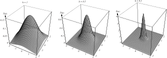{width=100%}

## Recap: Parzen Windows Width

{ width=100% }

## Recap: Classification With Parzen Windows

{width=60%}

{width=60%}

Classification using Parzen Windows. If \$h\$ is small, we risk over-training. If
\$h\$ is large, we will provide greater generalizability at the possible expense
of accuracy.

## Recap: Classification with \$k\$NN

{width=80%}

Classification with \$k\$NN is so simple, it essentially "skips" the consideration
of densities and just labels samples by counting the neighbors that belong to
each class.

## Recap: Classification with \$k\$NN

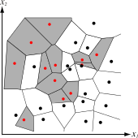{width=80%}

{width=80%}

# 
## Clustering: Mixture Densities

## Clustering Introduction

In almost all situations, gathering class labels is **hard**.

We are often presented with datasets having many unlabeled samples:

<ul>
<li class="fragment">Uploaded photos (Facebook, Google+, the NSA)</li>
<li class="fragment">Recorded telephone audio (Call centers, speech therapy, the NSA again)</li>
<li class="fragment">Recorded video segments (Security firms, video game cameras, also the NSA)</li>
</ul>

For some kinds of problems, you can **crowd-source** labeling.

## Cost of Acquiring Labels

{height=80%}

{height=80%}

## Cost of Acquiring Labels

{width=100%}

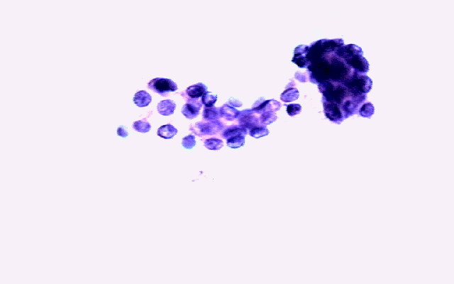{width=100%}

## Why Use Unlabeled Data?

Without labels, can we learn about categories?

<ul>
<li class="fragment">You can cluster, and then perform "hands-on" labeling.</li>
<li class="fragment">You can get a "free" look at the data before doing labeling, to get an "unbiased" look at the structure of the feature space.</li> 
<li class="fragment">You can perform "weak" supervised classification, a.k.a. **semi-supervised** learning</li>
</ul>

## Semi-Supervised Learning

From Zhou, Z. "A Brief Introduction to Weakly Supervised Learning":

<ul>
<li class="fragment">**Incomplete Supervision:** Only a small subset of the available data is labeled</li>
<li class="fragment">**Inexact Supervision:** Only coarse-level annotations are provided</li>
<li class="fragment">**Inaccurate Supervision:** Labels may be incorrectly assigned</li>
</ul>

## Known Knowns, Known Unknowns

As ever, we start with some basic assumptions:

<ul>
<li class="fragment">We know the number of classes, \$c\$.</li>
<li class="fragment">We know the priors, \$P(\\omega\_{j})\$, for \$j=1,\\\cdots,c\$.</li>
<li class="fragment">We know the form of \$p(\\mathbf{x}|\\omega\_{j},\\mathbf{\\boldsymbol{\\theta}}_{j})\$ (e.g. Gaussian).</li>
<li class="fragment">We do NOT know the parameter vectors \$\\boldsymbol{\\theta\_{1}}, \\cdots, \\boldsymbol{\\theta\_{c}}\$.</li>
<li class="fragment">We do NOT know the actual category labels for the samples.</li>
</ul>

## Mixture Densities

We can start by modeling the observed density, \$p(\\mathbf{x}|\\boldsymbol{\\theta})\$, as a mixture of \$c\$ different class densities:

\$ p(\\mathbf{x}|\\boldsymbol{\\theta})=\\sum\_{j=1}\^{c}p(\\mathbf{x}|\\omega\_{j},\\boldsymbol{\\theta}\_{j})P(\\omega\_{j}) \$

... where \$\\boldsymbol{\\theta}=\\left(\\boldsymbol{\\theta}\_{1}, \\cdots, \\boldsymbol{\\theta}\_{c}\\right)\^{T}\$.

In this form, \$p(\\mathbf{x}|\\boldsymbol{\\theta})\$ is known as a **mixture density**.

Conditional densities \$p(\\mathbf{x}|\\omega\_{j},\\boldsymbol{\\theta}\_{j})\$ are the **component densities**.

Priors \$P(\\omega\_{j})\$ are the **mixing parameters**.

## Component Densities and Mixing Parameters

{width=80%}

## Component Densities and Mixing Parameters

{width=80%}

## Identifiability of a Density

\$ p(\\mathbf{x}|\\boldsymbol{\\theta})=\\sum\_{j=1}\^{c}p(\\mathbf{x}|\\omega\_{j},\\boldsymbol{\\theta\_{j}})P(\\omega\_{j}) \$

Our unknown is our set of parameters \$\\boldsymbol{\\theta}\$, so that's what we
want to estimate.

Once we have our parameter sets, we can "un-mix" the density, figure out what
classes are the largest contributors at each point of \$\\mathbf{x}\$, and then
classify new points accordingly.

One valid question: if we have an infinite number of samples, and we know the
underlying form of \$p(\\mathbf{x}|\\boldsymbol{\\theta})\$, then is
\$\\boldsymbol{\\theta}\$ unique?

A density \$p(\\mathbf{x}|\\boldsymbol{\\theta})\$ is **identifiable** if
\$\\boldsymbol{\\theta}\\neq\\boldsymbol{\\theta}\^{\\prime}\$ implies that there exists
an \$\\mathbf{x}\$ such that \$p(\\mathbf{x}|\\boldsymbol{\\theta})\\neq
p(\\mathbf{x}|\\boldsymbol{\\theta}\^{\\prime})\$.

# 
## Maximum Likelihood Estimation

## Maximum Likelihood Estimates

Suppose \$p(\\mathbf{x}|\\boldsymbol{\\theta})\$ gives us a set
\$\\mathcal{D}=\\{\\mathbf{x}\_{1},\\cdots,\\mathbf{x}\_{n}\\}\$

The likelihood of observing a specific \$\\mathcal{D}\$ is the joint density:

\$ p(\\mathcal{D}|\\boldsymbol{\\theta})=\\prod\_{k=1}\^{n}p(\\mathbf{x}\_{k}|\\boldsymbol{\\theta}) \$

## Maximizing our Dataset Probability

If we're looking to find \$\\hat{\\boldsymbol{\\theta}}\$ which maximizes
\$p(\\mathcal{D}|\\boldsymbol{\\theta})\$, we have to do the whole log-likelihood /
gradient thing:

\$ l=\\sum\_{k=1}\^{n}\\ln{p(\\mathbf{x}\_{k}|\\boldsymbol{\\theta})} \$

\$\\nabla\_{\\boldsymbol{\\theta}\_{i}}l=\\sum\_{k=1}\^{n}\\frac{1}{p(\\mathbf{x}\_{k}|\\boldsymbol{\\theta})}\\nabla\_{\\boldsymbol{\\theta}\_{i}}\\left[\\sum\_{j=1}\^{c}p(\\mathbf{x}\_{k}|\\omega\_{j},\\boldsymbol{\\theta}\_{j})P(\\omega\_{j})\\right] \$

## Maximum Likelihood Estimates

If we introduce the posterior probability, we can write in terms of the
component densities:

\$ P(\\omega\_{i}|\\mathbf{x}\_{k},\\boldsymbol{\\theta})=\\frac{p(\\mathbf{x}\_{k}|\\omega\_{i},\\boldsymbol{\\theta}\_{i})P(\\omega\_{i})}{p(\\mathbf{x}\_{k}|\\boldsymbol{\\theta})} \$

Then we can rewrite the previous derivative as:

\$\\nabla\_{\\boldsymbol{\\theta}\_{i}}l	= \\sum\_{k=1}\^{n}P(\\omega\_{i}|\\mathbf{x}\_{k},\\boldsymbol{\\theta}) \\nabla\_{\\boldsymbol{\\theta}\_{i}}\\ln{p(\\mathbf{x}\_{k}|\\omega\_{i},\\boldsymbol{\\theta}\_{i})} \$

As always, we set this to zero and solve for the class-specific parameters
\$\\boldsymbol{\\theta}\_{i}\$.

# 
## Normal Mixtures: Estimating \$\\boldsymbol{\\mu}\$

## Normal Mixtures and Additional Assumptions

We've already assumed we know the form of the density (namely, that it's
Gaussian).

There are four parameters that we may not know:

<ul>
<li class="fragment">\$\\boldsymbol{\\mu}\_{i}\$, the multivariate mean;</li>
<li class="fragment">\$\\boldsymbol{\\Sigma}\_{i}\$, the covariance matrix;</li>
<li class="fragment">\$P(\\omega\_{i})\$, the prior probability; and</li>
<li class="fragment">\$c\$, the total number of classes.</li>
</ul>

Just like linear discriminants, for simplicity we start by assuming that we know three of
these: \$\\boldsymbol{\\Sigma}\_{i}\$, \$P(\\omega\_{i})\$, and \$c\$.

## Case 1: Unknown Mean Vectors

Once again, we take the log-likelihood of the Gaussian for simplicity:

\$ \\ln{p(\\mathbf{x}|\\omega\_{i},\\boldsymbol{\\mu}\_{i})}=-\\ln{\\left[(2\pi)\^{\\frac{d}{2}} |\\boldsymbol{\\Sigma}\_{i}|\^{\\frac{1}{2}} \\right]} -\\frac{1}{2}(\\mathbf{x}-\\boldsymbol{\\mu}\_{i})\^{T}\\boldsymbol{\\Sigma}\_{i}\^{-1}(\\mathbf{x}-\\boldsymbol{\\mu}\_{i}) \$

... take the derivative...

\$ \\nabla\_{\\boldsymbol{\\mu}\_{i}}\\ln{p(\\mathbf{x}|\\omega\_{i},\\boldsymbol{\\mu}\_{i})}=\\boldsymbol{\\Sigma}\_{i}\^{-1}(\\mathbf{x}-\\boldsymbol{\\mu}\_{i}) \$

... and drop it into the old MLE equation for finding
\$\\hat{\\boldsymbol{\\theta}}\$, which, to refresh your memory, is:

\$ \\sum\_{k=1}\^{n}P(\\omega\_{i}|\\mathbf{x}\_{k},\\boldsymbol{\\theta})\\nabla\_{\\boldsymbol{\\theta}\_{i}}\\ln{p(\\mathbf{x}\_{k}|\\omega\_{i},\\boldsymbol{\\theta}\_{i})}=0 \$

## Case 1: Unknown Mean Vectors

Thus we have:

\$ \\sum\_{k=1}\^{n}P(\\omega\_{i}|\\mathbf{x}\_{k},\\hat{\\boldsymbol{\\mu}})\\boldsymbol{\\Sigma}\_{i}\^{-1}(\\mathbf{x}\_{k}-\\hat{\\boldsymbol{\\mu}\_{i}})=0 \$

If we multiply by \$\\boldsymbol{\\Sigma}\_{i}\$ and moving around terms, we are left
with:

\$ \\hat{\\boldsymbol{\\mu}}_{i} = \\frac{\\sum\_{k=1}\^{n}P(\\omega\_{i}|\\mathbf{x}\_{k},\\hat{\\boldsymbol{\\mu}})\\mathbf{x}\_{k}}{\\sum\_{k=1}\^{n}P(\\omega\_{i}|\\mathbf{x}\_{k},\\hat{\\boldsymbol{\\mu}})} \$

**In other words**, \$\\hat{\\boldsymbol{\\mu}}_{i}\$ is a weighted average of the
samples.

The weight for the \$k\$th sample is an estimate of how likely it is that
\$\\mathbf{x}\_{k}\$ belongs to the \$i\$th class.

Does this equation give us \$\\hat{\\boldsymbol{\\mu}}_{i}\$?

## Explicit Solution or Iterative Estimates?

Unfortunately, we can't solve \$\\hat{\\boldsymbol{\\mu}}_{i}\$ explicitly.

What we CAN do is perform an iterative search: Select an initial value for
\$\\hat{\\boldsymbol{\\mu}}_{i}(0)\$, then solve:

\$ \\hat{\\boldsymbol{\\mu}}_{i}(j+1)=\\frac{\\sum\_{k=1}\^{n}P(\\omega\_{i}|\\mathbf{x}\_{k},\\hat{\\boldsymbol{\\mu}}(j))\\mathbf{x}\_{k}}{\\sum\_{k=1}\^{n}P(\\omega\_{i}|\\mathbf{x}\_{k},\\hat{\\boldsymbol{\\mu}}(j))} \$

This is essentially a **gradient ascent** method, meaning that eventually we
will converge to a point where
\$\\hat{\\boldsymbol{\\mu}}\_{i}(j+1)\\approx\\hat{\\boldsymbol{\\mu}}\_{i}(j)\$

As with all iterative approaches, once the gradient is zero, we are only ensured
that we've reached a **local** maximum.

## Example Solution for Finding \$\\boldsymbol{\\mu}\_{i}\$

Let's say we have the following two-component, one-dimensional normal mixture:

\$ p(x|\\mu\_{1},\\mu\_{2})=\\underbrace{\\frac{1}{3\\sqrt{2\pi}}\\exp\\left[-\\frac{1}{2}(x-\\mu\_{1})\^{2}\\right]}\_{\\omega\_{1}} +\\underbrace{\\frac{2}{3\\sqrt{2\pi}}\\exp\\left[-\\frac{1}{2}(x-\\mu\_{2})\^{2}\\right]}\_{\\omega\_{2}} \$

We pull a set of \$k=25\$ samples sequentially from this mixture.

These samples are used to calculate the log-likelihood function:

\$ l(\\mu\_{1},\\mu\_{2})=\\sum\_{k=1}\^{n}\\ln{p(x\_{k}|\\mu\_{1},\\mu\_{2})} \$

## Example Solution for Finding \$\\boldsymbol{\\mu}\_{i}\$: Illustration

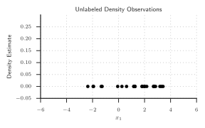{ width=80% }

## Example Solution for Finding \$\\boldsymbol{\\mu}\_{i}\$: Illustration

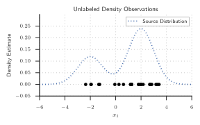{ width=80% }

## Example Solution for Finding \$\\boldsymbol{\\mu}\_{i}\$: Illustration

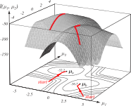{ width=80% }

## Unlabeled Densities: Importance of Sample Size

As ever, it's important to have a significant number of samples to estimate your
parameters.

What would it look like if we had insufficient samples for this problem?

## Unlabeled Densities: Few Samples

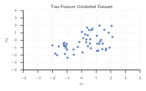{width=80%}

## Unlabeled Densities: More Samples

{width=80%}

## Unlabeled Densities: Lots of Samples

{width=80%}

# 
## Normal Mixtures: Estimating \$\\boldsymbol{\\Sigma}\$

## Case 2: Unconstrained Covariance

If no constraints are placed on \$\\boldsymbol{\\Sigma}\_{i}\$, then we have a
problem...

Let's say our two-component mixture is given like so:

\$ p(x|\\mu,\\sigma\^{2}) = \\underbrace{\\frac{1}{2\\sqrt{2\pi}\\sigma}\\exp\\left[-\\frac{1}{2}\\left(\\frac{x-\\mu}{\\sigma}\\right)\^{2}\\right]}\_{\\textrm{First Component}} + \\underbrace{\\frac{1}{2\\sqrt{2\pi}}\\exp\\left[-\\frac{1}{2}x\^{2}\\right]}\_{\\textrm{Second Component}} \$

In other words, the second component has \$\\mu=0\$, \$\\sigma=1\$.

Now let's set the mean of the first component to \$\\mu=x\_{1}\$. For
\$p(x\_{1}|\\mu,\\sigma\^{2})\$, the first term's exponential goes to 0, and so we
have:

\$ p(x\_{1} | \\mu, \\sigma\^{2}) = \\frac{1}{2\\sqrt{2\pi}\\sigma} + \\frac{1}{2\\sqrt{2\pi}}\\exp\\left[-\\frac{1}{2}x\_{1}\^{2}\\right] \$

## Case 2: Unconstrained Covariance

For \$x\_{k}\\neq\\mu\$, the first term's exponential remains. Thus:

\$ p(x\_{k} | \\mu,\\sigma\^{2}) \\geq \\frac{1}{2\\sqrt{2\pi}}\\exp\\left[-\\frac{1}{2}x\_{k}\^{2}\\right] \$

The joint probability for \$x\_{1},\\cdots,x\_{n}\$ is the product of all of the
above, so with some rearranging we have:

\$ p(x\_{1},\\cdots,x\_{n} | \\mu,\\sigma\^{2}) \\geq \\left[\\frac{1}{\\sigma}+\\exp\\left[-\\frac{1}{2}x\_{1}\^{2}\\right]\\right]\\frac{1}{(2\\sqrt{2\pi})\^{n}}\\exp\\left[-\\frac{1}{2}\\sum\_{k=2}\^{n}x\_{k}\^{2}\\right] \$

## All Parameters Unknown: Exploding Equations with Small Variance

\$ p(x\_{1},\\cdots,x\_{n} | \\mu,\\sigma\^{2}) \\geq \\left[\\frac{1}{\\sigma}+\\exp\\left[-\\frac{1}{2}x\_{1}\^{2}\\right]\\right]\\frac{1}{(2\\sqrt{2\pi})\^{n}}\\exp\\left[-\\frac{1}{2}\\sum\_{k=2}\^{n}x\_{k}\^{2}\\right] \$

What's wrong with this equation? Specifically, look at \$\\sigma\$...

If \$\\sigma\$ is small, the equation explodes. That is to say, the MLE solution is
**singular**.

## Fixing Exploding Equations

So how do we get around this? Put some constraints on \$\\boldsymbol{\\Sigma}\_{i}\$!

Recall the likelihood equation when finding \$\\boldsymbol{\\mu}\_{i}\$:

\$ \\ln{p(\\mathbf{x}|\\omega\_{i},\\boldsymbol{\\mu}\_{i})}=-\\ln{\\left[(2\pi)\^{\\frac{d}{2}} |\\boldsymbol{\\Sigma}\_{i}|\^{\\frac{1}{2}} \\right]}  -\\frac{1}{2}(\\mathbf{x}-\\boldsymbol{\\mu}\_{i})\^{T}\\boldsymbol{\\Sigma}\_{i}\^{-1}(\\mathbf{x}-\\boldsymbol{\\mu}\_{i}) \$

Just like before, we want to differentiate and set to zero, but this time we
have to differentiate with respect to both \$\\boldsymbol{\\mu}\_{i}\$ **and**
\$\\boldsymbol{\\Sigma}\_{i}\$.

## Solving for Everything

Remember the relation we had previously:

\$ \\sum\_{k=1}\^{n}\\hat{P}(\\omega\_{i}|\\mathbf{x}\_{k},\\hat{\\boldsymbol{\\theta}})\\nabla\_{\\boldsymbol{\\theta}\_{i}}\\ln{p(\\mathbf{x}\_{k}|\\omega\_{i},\\hat{\\boldsymbol{\\theta}}_{i}) = 0} \$

I am skipping a lot of the math, but we end up with the following:

\\begin{align}
\\hat{P}(\\omega\_{i}) \&= \\frac{1}{n}\\sum\_{k=1}\^{n}\\hat{P}(\\omega\_{i}|\\mathbf{x}\_{k},\\hat{\\boldsymbol{\\theta}}) \\\\
\\hat{\\boldsymbol{\\mu}\_{i}} \&= \\frac{\\sum\_{k=1}\^{n}\\hat{P}(\\omega\_{i}|\\mathbf{x}\_{k},\\hat{\\boldsymbol{\\theta}})\\mathbf{x}\_{k}}{\\sum\_{k=1}\^{n}\\hat{P}(\\omega\_{i}|\\mathbf{x}\_{k},\\hat{\\boldsymbol{\\theta}})} \\\\
\\hat{\\boldsymbol{\\Sigma}\_{i}} \&= \\frac{\\sum\_{k=1}\^{n}\\hat{P}(\\omega\_{i}|\\mathbf{x}\_{k},\\hat{\\boldsymbol{\\theta}})(\\mathbf{x}\_{k}-\\hat{\\boldsymbol{\\mu}}\_{i})(\\mathbf{x}\_{k}-\\hat{\\boldsymbol{\\mu}}\_{i})\^{t}}{\\sum\_{k=1}\^{n}\\hat{P}(\\omega\_{i}|\\mathbf{x}\_{k},\\hat{\\boldsymbol{\\theta}})}
\\end{align}

## Explanations for Everything

Okay, so what do those mean?

<table>
<tr>
<td>
	\$\\hat{P}(\\omega\_{i}) = \\frac{1}{n}\\sum\_{k=1}\^{n}\\hat{P}(\\omega\_{i}|\\mathbf{x}\_{k},\\hat{\\boldsymbol{\\theta}})\$
</td>
<td>
    The likelihood of \$\\omega\_{i}\$ is the fraction of samples from
    \$\\omega\_{i}\$
</td>
</tr>
<tr>
<td>\$\\hat{\\boldsymbol{\\mu}\_{i}} =
\\frac{\\sum\_{k=1}\^{n}\\hat{P}(\\omega\_{i}|\\mathbf{x}\_{k},\\hat{\\boldsymbol{\\theta}})\\mathbf{x}\_{k}}{\\sum\_{k=1}\^{n}\\hat{P}(\\omega\_{i}|\\mathbf{x}\_{k},\\hat{\\boldsymbol{\\theta}})}\$</td>
<td>\$\\hat{\\boldsymbol{\\mu}}\_{i}\$ is the mean of those samples in
\$\\omega\_{i}\$</td>
</tr>
<tr>
<td>\$\\hat{\\boldsymbol{\\Sigma}\_{i}} =
\\frac{\\sum\_{k=1}\^{n}\\hat{P}(\\omega\_{i}|\\mathbf{x}\_{k},\\hat{\\boldsymbol{\\theta}})(\\mathbf{x}\_{k}-\\hat{\\boldsymbol{\\mu}}_{i})(\\mathbf{x}\_{k}-\\hat{\\boldsymbol{\\mu}}\_{i})\^{T}}{\\sum\_{k=1}\^{n}\\hat{P}(\\omega\_{i}|\\mathbf{x}\_{k},\\hat{\\boldsymbol{\\theta}})}\$</td>
<td>\$\\hat{\\boldsymbol{\\Sigma}}_{i}\$ is the corresponding covariance matrix</td>
</tr>
</table>

If \$\\hat{P}(\\omega\_{i} | \\mathbf{x}\_{k}, \\hat{\\boldsymbol{\\theta}})\$ is between
\$0.0\$ and \$1.0\$, then all samples play a role in the estimates (not just those
belonging to \$\\omega\_{i}\$).

## One More Equation

One final point: Above we've written
\$\\sum\_{k=1}\^{n}\\hat{P}(\\omega\_{i}|\\mathbf{x}\_{k},\\hat{\\boldsymbol{\\theta}})\$ a
lot.

For each of the above three equations, we can substitute Bayes equation here:

\\begin{align}
	\\hat{P}(\\omega\_{i}|\\mathbf{x}\_{k},\\hat{\\boldsymbol{\\theta}}) \&= \\frac{ p(\\mathbf{x}\_{k}|\\omega\_{i},\\hat{\\boldsymbol{\\theta}}\_{i})\\hat{P}(\\omega\_{i}) }{ \\sum\_{j=1}\^{c}p(\\mathbf{x}\_{k}|\\omega\_{j},\\hat{\\boldsymbol{\\theta}}\_{j})\\hat{P}(\\omega\_{j}) }\\\\
	 \&= \\frac{ |\\boldsymbol{\\hat{\\Sigma}}\_{i}| \^{-\\frac{1}{2}} \\exp\\left[-\\frac{1}{2}(\\mathbf{x}\_{k}-\\hat{\\boldsymbol{\\mu}}\_{i})\^{T}\\hat{\\boldsymbol{\\Sigma}}\_{i}\^{-1}(\\mathbf{x}\_{k}-\\hat{\\boldsymbol{\\mu}}\_{i})\\right]\\hat{P}(\\omega\_{i})}{ \\sum\_{j=1}\^{c}|\\hat{\\boldsymbol{\\Sigma}}\_{j}|\^{-\\frac{1}{2}}\\exp\\left[-\\frac{1}{2}(\\mathbf{x}\_{k}-\\hat{\\boldsymbol{\\mu}}\_{j})\^{T}\\hat{\\boldsymbol{\\Sigma}}\_{j}\^{-1}(\\mathbf{x}\_{k}-\\hat{\\boldsymbol{\\mu}}\_{j})\\right] \\hat{P}(\\omega\_{j})}
\\end{align}

## Explicit Description of Our Parameter Set

\$\\hat{P}(\\omega\_{i}|\\mathbf{x}\_{k},\\hat{\\boldsymbol{\\theta}}) = \\frac{|\\boldsymbol{\\hat{\\Sigma}}\_{i}|\^{-\\frac{1}{2}}\\exp\\left[-\\frac{1}{2}(\\mathbf{x}\_{k}-\\hat{\\boldsymbol{\\mu}}\_{i})\^{T}\\hat{\\boldsymbol{\\Sigma}}\_{i}\^{-1}(\\mathbf{x}\_{k}-\\hat{\\boldsymbol{\\mu}}\_{i})\\right]\\hat{P}(\\omega\_{i})}{\\sum\_{j=1}\^{c}|\\hat{\\boldsymbol{\\Sigma}}\_{j}|\^{-\\frac{1}{2}}\\exp\\left[-\\frac{1}{2}(\\mathbf{x}\_{k}-\\hat{\\boldsymbol{\\mu}}\_{j})\^{T}\\hat{\\boldsymbol{\\Sigma}}\_{j}\^{-1}(\\mathbf{x}\_{k}-\\hat{\\boldsymbol{\\mu}}\_{j})\\right]\\hat{P}(\\omega\_{j})}\$

Much simpler, right?

This is just to illustrate that now, we DO have an explicit way to calculate each of our unknown parameters given our sample set.

## Okay, So Now What?

Once again, we can take an iterative approach to solving for our parameter sets:

\$ \\hat{\\boldsymbol{\\mu}}_{i}(j+1)=\\frac{\\sum\_{k=1}\^{n}P(\\omega\_{i}|\\mathbf{x}\_{k},\\hat{\\boldsymbol{\\mu}}(j))\\mathbf{x}\_{k}}{\\sum\_{k=1}\^{n}P(\\omega\_{i}|\\mathbf{x}\_{k},\\hat{\\boldsymbol{\\mu}}(j))} \$

# 
## \$k\$-Means Clustering

## Mahalanobis Distance

\$\\require{color}
\\hat{P}(\\omega\_{i}|\\mathbf{x}\_{k},\\hat{\\boldsymbol{\\theta}}) = \\frac{|\\boldsymbol{\\hat{\\Sigma}}\_{i}|\^{-\\frac{1}{2}}\\exp\\left[-\\frac{1}{2}
            \\colorbox{lightblue}{\$(\\mathbf{x}\_{k}-\\hat{\\boldsymbol{\\mu}}\_{i})\^{T}\\hat{\\boldsymbol{\\Sigma}}\_{i}\^{-1}(\\mathbf{x}\_{k}-\\hat{\\boldsymbol{\\mu}}\_{i})\$}
\\right]\\hat{P}(\\omega\_{i})}{\\sum\_{j=1}\^{c}|\\hat{\\boldsymbol{\\Sigma}}\_{j}|\^{-\\frac{1}{2}}\\exp\\left[-\\frac{1}{2}(\\mathbf{x}\_{k}-\\hat{\\boldsymbol{\\mu}}\_{j})\^{T}\\hat{\\boldsymbol{\\Sigma}}\_{j}\^{-1}(\\mathbf{x}\_{k}-\\hat{\\boldsymbol{\\mu}}\_{j})\\right]\\hat{P}(\\omega\_{j})}
\$

The value of
\$\\hat{P}(\\omega\_{i}|\\mathbf{x}\_{k},\\hat{\\boldsymbol{\\theta}})\$ is high
if the **squared Mahalanobis distance** \$\\colorbox{lightblue}{\$(\\mathbf{x}\_{k}-\\hat{\\boldsymbol{\\mu}}\_{i})\^{T}\\hat{\\boldsymbol{\\Sigma}}\_{i}\^{-1}(\\mathbf{x}\_{k}-\\hat{\\boldsymbol{\\mu}}\_{i})\$}\$
is small.

Intuitively, this just means that if a sample is close to the centroid of a class cluster, then the likelihood of it belonging to the associated class is high.

## Calculating Probabilities Via Distance to Centroids

If we replace the Mahalanobis with the squared Euclidean distance \$\|\\mathbf{x}\_{k}-\\hat{\\boldsymbol{\\mu}}\_{i}\|\^{2}\$, we can find the mean \$\\hat{\\boldsymbol{\\mu}}\_{m}\$ nearest to \$\\mathbf{x}\_{k}\$.

Thus we can approximate \$\\hat{P}(\\omega\_{i}|\\mathbf{x}\_{k},\\hat{\\boldsymbol{\\theta}})\$ as:

\$ \\hat{P}(\\omega\_{i}|\\mathbf{x}\_{k},\\hat{\\boldsymbol{\\theta}}) \\simeq
\\begin{cases}
1 \& \\quad \\textrm{if }i=m \\\\
0 \& \\quad \\textrm{otherwise.} \\\\
\\end{cases}\$

Then we can plug this into the equation we got before and solve for \$\\hat{\\boldsymbol{\\mu}}\_{1},\\cdots,\\hat{\\boldsymbol{\\mu}}\_{c}\$.

We can "initialize" by selecting \$c\$ class centroids at random from the unlabeled data, and then iterating.

## Algorithm for \$k\$-Means Clustering

<pre id="hello-world-code" style="display:hidden;">
\begin{algorithm}
\caption{\$k\$-Means Clustering}
\begin{algorithmic}
\INPUT Initialize \$n\$, \$c\$, \$\\boldsymbol{\\mu}\_{1}, \\ldots, \\boldsymbol{\\mu}\_{c}\$
\REPEAT
    \STATE Classify \$n\$ samples according to nearest \$\\boldsymbol{\\mu}\_{i}\$
    \STATE Recompute \$\\boldsymbol{\\mu}\_{i}\$
\UNTIL{no change in \$\\boldsymbol{\\mu}_{i}\$}
\RETURN \$\\boldsymbol{\\mu}\_{1}, \\ldots, \\boldsymbol{\\mu}\_{c}\$
\end{algorithmic}
\end{algorithm}
</pre>

## \$k\$-Means Example: Hill-climbing

{width=80%}

## Comparing \$k\$-Means and MLE

{width=80%}

{width=80%}

Comparison of MLE and \$k\$-Means. Since the overlap between the components is
relatively small, we arrive at basically the same answers for \$\\mu\_{1}\$ and
\$\\mu\_{2}\$.

## \$k\$-Means In Sample Space

{width=80%}

## \$k\$-Means In Sample Space

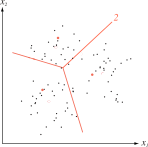{width=80%}

## \$k\$-Means In Sample Space

{width=80%}

## \$k\$-Means Summary

\$k\$-Means is a staple of unsupervised clustering methods.

It is simple and relatively fast, operating in \$O(ndcT)\$ time where \$n\$ is the
number of patterns, \$d\$ is the number of features, \$c\$ is the number of clusters
and \$T\$ is the number of iterations.

It typically finishes in a small number of iterations.

## \$k\$-Means Caveats

When does it fail?

<ul>
<li class="fragment">If we are wrong about our number of classes, we will converge on two means that don't mean anything.</li>
<li class="fragment">If the clusters are too close to one another, there may not be enough samples to properly "ascend" to the true value of \$\\mu\$.</li>
</ul>

Remember: **everything** is dependent on your features!

# 
## Evaluating Clusters

## How Well Did We Cluster?

So far, we've been talking about **clusters** and **classes** as being
synonymous, but that's clearly not the case.

An underlying density with multiple modes could represent the same class, while
a unimodal density may represent multiple classes (i.e. it's a bad feature for
discrimination).

We make assumptions about the form of the data, but clearly we could estimate
perfectly valid parameter sets and completely miss the underlying structure of
the data.

## Examples of Misleading Parameters

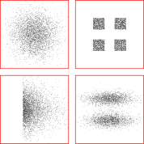{width=80%}

## Similarity Measures

If we are interested in finding **subclasses** in our unlabeled data, we have
to define what we mean.

Finding "clusters" seems like a good place to start, but how do we define a
cluster?

We need a way to say that samples in one cluster are more similar to each other
than they are to samples in another cluster.

We also need a way to evaluate a given partitioning of the dataset, to say that
Clustering Result A is better or worse than Clustering Result B.

We can even start by using a distance metric to define our clusters in the first
place!

## Examples of Distance Thresholding: High Threshold

{width=70%}

Clustering with a high threshold means that almost everything is put into the
same cluster. In graph theory, this would be called a **fully connected**
graph and is akin to **under-training**.

## Examples of Distance Thresholding: Medium Threshold

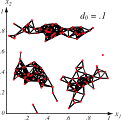{width=70%}

Clustering with an intermediate threshold can reveal structure in your data, but
it is up to the designer to say whether this is the **correct** structure.

## Examples of Distance Thresholding: Low Threshold

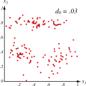{width=70%}

Clustering with a low threshold forces only the closest points to be associated
with the same cluster. This is akin to **over-training**.

## Choosing a Similarity Metric: Invariance to Transforms

Generally speaking, we assume the correct distance metric is Euclidean (the
shortest distance between two points is a straight line).

However, this is only justified if the space is **isotropic** (distances in
one dimension are equivalent to those in another) and the data is evenly spread.

Euclidean distance is robust to **rigid** transformations of the feature space
(rotation and translation).

It is NOT robust to arbitrary linear transformations which distort distance
relationships.

## Rotation's Effect on Cluster Groupings

{width=40%}

## Choosing a Similarity Metric: Normalization

We can try to counteract the effects of non-isotropy in our feature space
through **normalization**, where we translate and scale the data to have a
zero mean and unit variance.

We can also rotate the coordinate space so that the axes coincide with the
eigenvectors of the covariance matrix; this is part of **principal
component analysis (PCA)** which we will cover shortly.

However, normalization has its own problems...

## Normalization Sometimes Ruins Our Clusters

{width=80%}

Normalization can take a well-separated dataset with two processes (left) and
smoosh it together so we end up with a single cloud (right).

# 
## Parting Words

## Benefits of Unsupervised Methods

Question: Will supervised methods always out-perform unsupervised methods?

As always, **it depends!** Having more information (like labels) is better,
but over-fitting is always a danger.

Over-fitting isn't just fine-tuning your decision hyperplanes, it is also when
you choose \$c\$ to be too high, or if you pick too many mixtures for each of your
densities.

Sometimes, clustering can give you insight above and beyond what you
**thought** you knew!

<ul>
<li class="fragment">If you think you have two classes, and you find three clusters, what does that mean?</li>
<li class="fragment">If you have five classes and you find two clusters, what does THAT mean?</li>
</ul>

# 
## Next Class

## Similarity Metric Selection

In most situations, the choice of similarity metric / distance function will be
arbitrary.

In the literature, Euclidean distance metric is usually assumed, unless you have
reason to believe otherwise.

With non-linear datasets, this may NOT true... but that's for next class.

We will also look at evaluating our clusters by calculating **criterion
functions**: sum-of-squared-error, minimum variance, scatter matrices, trace /
determinant criterions, and invariant criterions.

(We may not look at all of those, but enough to give you the idea.)

