# 
## Recap Last Lecture

## Recap: Rationale for Deep Networks

In theory, neural networks can replicate any function (decision surface), no
matter how complicated. "In theory".

In reality, this would require an unreasonable number of:

<ul>
<li class="fragment">**Input nodes**, to describe increasingly large data types;</li>
<li class="fragment">**Input samples**, to accurately describe a complex, varied class space;</li>
<li class="fragment">**Hidden nodes**, to capture the nonlinear relationship between the inputs and desired outputs;</li>
<li class="fragment">**Hours**, to fully train a network on all this data;</li>
<li class="fragment">**Dollars**, to buy the hardware required for such a massive undertaking.</li>
</ul>

Surely, there must be a better way?

## Recap: Deep Learning

Deep learning, the stacking of several hidden layers together, is enabled by a
few insights:

<ul>
<li class="fragment">You can design the network such that it is **differentiable end-to-end**; in other words, you can train each layer with gradient descent via backpropagation, and learn an optimal set of weights.</li>
<li class="fragment">You don't need to have **fully connected layers** -- you can replace those layers with other, sparser layers that look at a limited input space, or certain "aspects" of the data, and learn weights that tie those regions together.</li>
<li class="fragment">Nowadays, you have **ridiculously large datasets** from which you can pull training data. This will expose your network to sufficient amount of variability across a very complex class space while avoiding overfitting.</li>
</ul>

## Recap: Schematic of Fully-Connected Networks

{width=90%}

## Recap: Scalability of Traditional Neural Nets

As we increase pixel sizes, this number of inputs balloons very quickly: a
200x200 color image would result in 120,000 weights, and so on.

Moreover, each of these must be mapped to hidden units -- so our weight vector
is 120,000 multiplied by some (likely larger) number of hidden units.

And that's all for one layer, and for a dataset of just 200x200x3 images, which
are quite small.

## Recap: CNN Rationale

**Convolutional Neural Networks** are specifically-designed to operate on
image data. This enables a few assumptions and tricks:

<ul>
<li class="fragment">Image inputs are **geographically important**, meaning that image features from one part of the image don't have to be connected to those in another part of the image.</li>
<li class="fragment">In the case of color images (3D), hidden nodes can be arranged as a **3D volume** instead of a single "layer", allowing the same part of the image to be analyzed in different ways (i.e. using different filter parameters).</li>
<li class="fragment">As the data is processed, we can reduce the number of nodes at each layer by downsampling the image (pooling). We can still recognize the image content, even as it is reduced to a very small size.</li>
</ul>

## Recap: Schematic of Convolutional Nets

{width=100%}

## Recap: CNN Layers

There are several types of layers in CNNs which process the input data:

<ul>
<li class="fragment">**Convolutional Layers**: A kernel is convolved with the input. The height and width of the output is a function of the filter parameters (padding, kernel size, and stride), while the depth of the output is a hyperparameter of the layer.</li>
<li class="fragment">**Rectified Linear Units**: A type of activation function, ReLU layers take the form of \$\\max(0,x)\$. This prevents gradients from getting unmanagable (exploding or vanishing).</li>
<li class="fragment">**Pooling Layers**: Downsamples the input volume in the height and width dimensions. This reduces the number of neurons / parameters that must be learned, without reducing the expressive power of the network.</li>
<li class="fragment">**Fully-Connected Layers**: Same type of layer as in traditional nets, where each neuron is fully connected to each element of the input.</li>
</ul>

## Recap: Example of Convolutional Nets Operating on an Image

{width=70%}

# 
## Practical Concerns and Design Hints

## Tips and Tricks

What follows are some general rules of thumb to get you started using CNNs.

Feel free to experiment with alternate approaches! These are not set in stone.

## Tip: Fewer, Smaller CONV Layers

If you have three 3x3 [CONV] layers on each other, the third layer will have a
7x7 "view" of the input volume. Compare that with a single [CONV] layer with a
7x7 receptive field. **The three 3x3 [CONV] layers are better.**

<ul>
<li class="fragment">The three [CONV] layers will have non-linearities sandwiched in-between them, which the 7x7 [CONV] layer won't have. This gives them more expressive power.</li>
<li class="fragment">If all volumes have \$C\$ channels, then the 7x7 [CONV] layer contains \$(C \\times (7 \\times 7 \\times C) = 49C\^{2}\$ parameters, but the three 3x3 layers will have \$3 \\times (C \\times (3 \\times 3 \\times C)) = 27C\^{2}\$ parameters.</li>
</ul>

## Tip: When in Doubt, Steal!

Every month, people are testing their architectures against some benchmark
datasets like ImageNet.

**Unless you are interested specifically in deep learning architecture
design**, most of these small, incremental tweaks should not be of central
interest to you.

<ul>
<li class="fragment">If you're using SVMs to determine outcome in patient data, you wouldn't try to write a paper about a new type of SVM kernel function.</li>
<li class="fragment">If you are writing about a new type of genomic pathway, you don't also need to discuss a small change to your PCR protocol.</li>
<li class="fragment">Similarly, if you're trying to identify a tumor region in an image of tissue, you don't need to also invent a new type of nonlinearity or convolutional layer.</li>
</ul>

## Tip: When in Doubt, Steal!

So if that's the case, what architecture should you choose?

<ul>
<li class="fragment">Use whatever is available for your software stack;</li>
<li class="fragment">Use whatever has worked for other researchers looking at the same or similar problems;</li>
<li class="fragment">Use whatever is currently working the best on benchmark datasets.</li>
</ul>

While your application may not be able to use the same weights, at least the
architecture will be taken care of.

## Hyperparameter Adjustment

Okay, so we can pick a certain order of layer stacking. We have a pile of images
sitting on the hard drive, and we have labels associated with each image.

So now we need to format our data and set up our layer **hyperparameters**:
that is, the sizes and operations at each layer, which are NOT learned by
gradient descent.

Here are some guidelines for adjustments.

## Input Layer

Your input layer -- i.e. the image dimensions -- should be divisible by 2.

You'll typically see 32, 64, 96, 224, 384, and 512.

**Why these sizes?** That's a great question!

<ul>
<li class="fragment">Even numbers help to make the convolutional math work out.</li>
<li class="fragment">Smaller images require less memory, so older / simpler nets typically use smaller sizes.</li>
<li class="fragment">Larger images are used to hold more complex scenes / classes, within reason.</li>
<li class="fragment">More inputs require more nodes for processing, which increases dataset size requirements and training time limits.</li>
</ul>

## Convolutional Layers

Layers should use small, odd-numbered filter sizes (\$\\mathbf{F}=3\$, \$\\mathbf{F}=5\$), with a
stride of \$\\mathbf{S}=1\$, and padding \$\\mathbf{P}\$ should be used so that the convolutional
layer does not alter the spatial size of the output. Recall that for any \$\\mathbf{F}\$:

\$ \\mathbf{P} = \\frac{(\\mathbf{F} - 1)}{2}\$

will preserve input size.

Larger filters, e.g. \$\\mathbf{F}=7\$, are only seen on the first convolutional
layer, if at all.

## Pooling Layers

By far the most common pooling layer performs **max-pooling** with receptive
field \$\\mathbf{F}=2\$ and stride \$\\mathbf{S}=2\$. Increasing these numbers means
that you are aggressively downsampling your data, which leads to too much
information loss.

## Sizing Concerns

This approach means that CONV layers always preserve input sizes, meaning that
they are just responsible for learning image features (and not image
downsizing).

The POOL layers are the only ones concerned with downsampling the image.

If you don't do this -- if you use \$\\mathbf{S}>1\$ or \$\\mathbf{P}=0\$ -- you have
to keep track of the volume as it changes size throughout the network. 

 Depending on the software you're using, if you
make a mistake, your system will likely give you an error when it tries to run
the network.

## Questions and Answers

**Stride of 1 in CONV**: Smaller strides tend to work better in practice, and
prevent CONV layers from downsampling.

**Padding**: Padding keeps the volumes from changing as a result of the
convolution operation, but also allows you to "retain" information at the
boundary instead of seeing it reduced at each convolutional pass.

**Memory**: GPUs are great for performing backpropagation calculations, but
have relatively little onboard memory. Filtering a \$224\\times224\\times3\$ image
with a typical architecture can lead to several millions of activations per
image. If you have to compromise, do it at the beginning in the first CONV
layer by using larger filter sizes and strides.

## Calculating Memory Requirements

Memory in CNNs is taken up by three sources:

<ul>
<li class="fragment">**Activations**: Intermediate volume sizes have a number of activations plus an equal number of gradients to keep track of.</li>
<li class="fragment">**Parameters**: These numbers hold the network parameters, the gradients during backprop, and also a step size / learning rate.</li>
<li class="fragment">**Miscellaneous**: Image batch sizes, augmented images / parameters, etc.</li>
</ul>

You can get a rough estimate of these values, multiply by 4 to get the number of
bytes needed, then divide by 1024 to get KB, MB, and GB. Then compare that to
your GPU's memory size (typically 4, 6, or 12 if you've got good
hardware).

To reduce memory, the first thing you should look at is reducing the batch size,
which in turn reduces your activations.

# 
## Design of Convolutional Network Architectures

## Standard Layer Configurations

The order and number of layers in a CNN (CONV, POOL, RELU, FC) defines the
**architecture** of the network. Some famous architectures have been given
names by the folks who designed them and proved their effectiveness over
competing architectures.

How does the architecture affect the processing of the network?

## Effect of Architecture on Processing

- <small>\$\\left[INPUT\\right] \\rightarrow \\left[FC\\right]\$</small>

    Regular linear classifier (linear discriminant)

- <small>\$\\left[INPUT\\right] \\rightarrow \\left[CONV\\right] \\rightarrow \\left[RELU\\right] \\rightarrow \\left[FC\\right]\$</small>

    Most basic kind of convolutional network

- <small>\$\\left[\\textrm{INPUT}\\right] \\rightarrow \\left[\\left[CONV\\right] \\rightarrow \\left[RELU\\right] \\rightarrow \\left[POOL\\right]\\right]*2 \\rightarrow \\left[FC\\right] \\rightarrow \\left[RELU\\right] \\rightarrow \\left[FC\\right]\$</small>

    Here there is a convolutional layer paired with each pooling layer, followed
    by a fully-connected "head" section.

- <small>\$\\left[INPUT\\right] \\rightarrow \\left[\\left[\\left[CONV\\right]
  \\rightarrow \\left[RELU\\right]\\right]\*2 \\rightarrow POOL\\right]\*3
  \\rightarrow \\ \\left[\\left[FC\\right] \\rightarrow \\left[RELU\\right]\\right]\*2 \\rightarrow\\left[FC\\right] \$</small>

    By allowing multiple convolutions to take place before the destructive
    pooling operation, we can ensure that deeper, more informative features get
    learned.

# 
## Specific CNN Architectures

## LeNet

Developed in the 1990's, LeNet was used for handwriting digit analysis on the
MNIST dataset.

## LeNet: Diagram

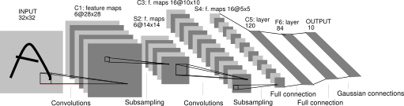{width=100%}

## AlexNet

Won the ImageNet ILSVRC 2012 challenge; larger and deeper than LeNet, with
multiple stacked CONV layers.

## AlexNet: Diagram

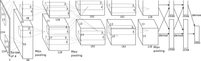{width=100%}

## GoogLeNet

GoogLeNet won the ILSVRC 2014 challenge. The team developed an "inception"
module, which reduced the number of parameters in the network from 60M (in
AlexNet) to 4M.

They also replaced the FC layers with "average pooling" layers.

## GoogLeNet: Inception module

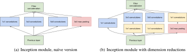{width=100%}

## GoogLeNet: Diagram

{width=10%}

## VGGNet

The second-place team in ILSVRC 2014 was the VGGNet, which
showed that the depth of the network is a critical component of performance.
This network uses a lot more parameters (140M), and therefore memory and
computation, but later iterations removed some of these parameters.

## VGGNet: Diagram

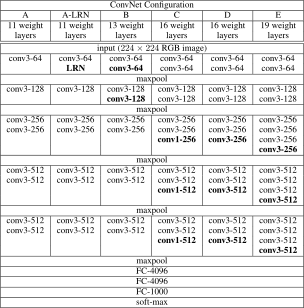{width=40%}

## ResNet

Deeper nets seem to work better, so won't we get increasing performance if we
just keep slamming layers together?

It turns out that each time a gradient is "propagated"
down through a very long set of layers, the value of the gradient decreases.
This is called the **vanishing gradient** problem.

To solve this, ResNet uses **skip connections**: In a normal network, the
activation at a layer is \$y=f(x)\$, where \$f(x)\$ is our nonlinear function that
is differentiated during backpropagation. In a skip connection, this is
redefined as: \$y=f(x) + x\$, which allows the gradient to be preserved as it
travels back through the network.

## ResNet: Skip Connections

{width=60%}

## ResNet: Diagram

{width=20%}

# 
## What does a CNN "See"?

## So... What's it... Doing?

A huge elephant in the room when discussing CNNs is: What is actually going on
at each of these layers? How does it actually work?

To answer this, folks have tried to look at what's going on at different points
in the "process".

For example, Mahendran and Vedaldi (2014) showed that you can "invert" the
representations of the image at layers in the CNN by using a natural image as a
prior and then presenting random noise to the network. Then you look at the
outputs of the layers.

## Example Inverted Images

{width=100%}

## Example Inverted Images

{width=100%}

## Intermediate Layer Representations

{width=80%}

{width=80%}

## AlexNet Architecture

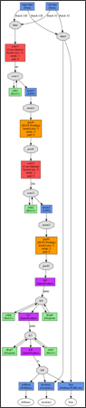{width=10%}

## Intermediate Layer Activations

{width=45%}
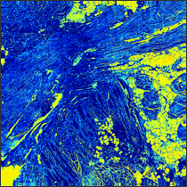{width=45%}

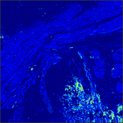{width=45%}
{width=45%}

## Artistic Style vs. Content

So with that understanding, Gatys, et al. (2015) realized that you can separate
the "content" of the image (represented at deeper layers as objects and
locations) from the "pixel values" or "style" of the image (represented at
shallow layers, right after the first convolutional layers).

Essentially you can pull the textures from one image, the content from another,
and mix them!

## Artistic Style Framework

{width=60%}

## Artistic Style Examples

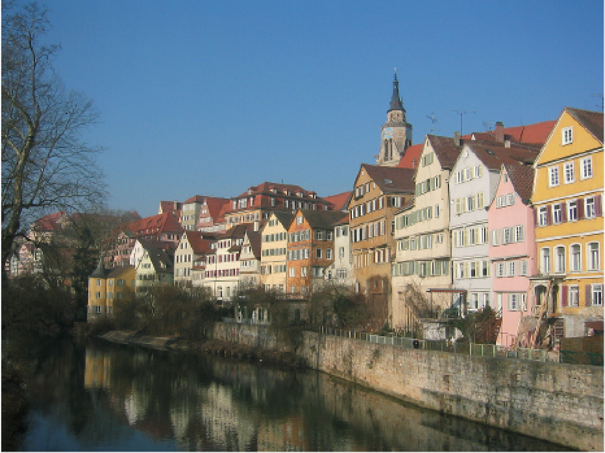{width=60%}

## Artistic Style Examples

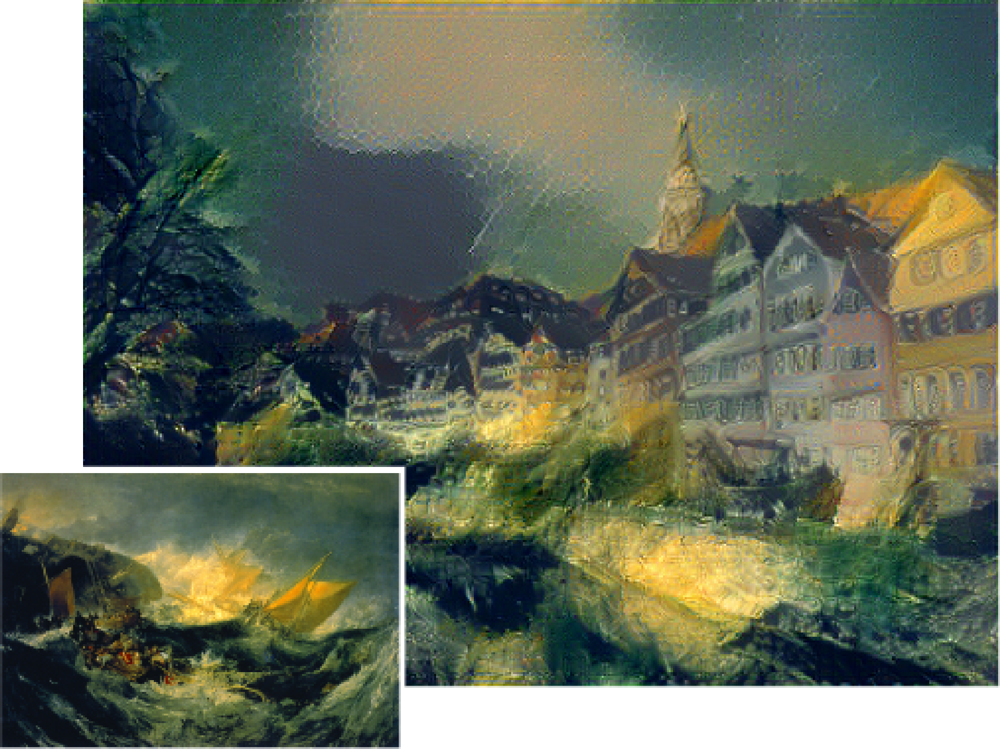{width=60%}

## Artistic Style Examples

{width=60%}

## Artistic Style Examples

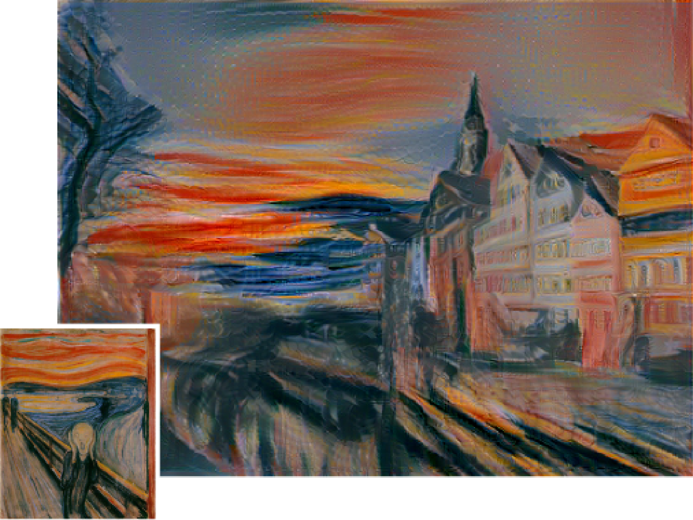{width=60%}

## Artistic Style Examples

{width=60%}

## Artistic Style Examples

{width=60%}

## Artistic Style At Home!

One of the great things about recent research is the availability of open source
tools for implementing these techniques.

With just a bit of set-up, you can implement these techniques on your own
datasets. For example, check out
**[https://github.com/ebenolson/pydata2015](https://github.com/ebenolson/pydata15)**.

## Kyoshi!

{width=40%}

## Artistic Kyoshi!

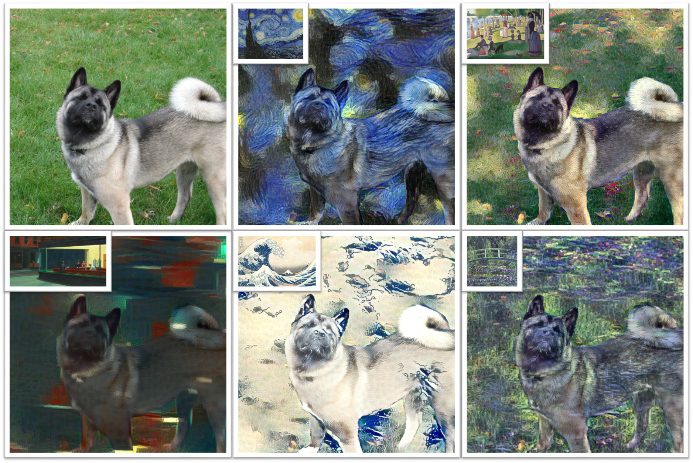{width=50%}

## Deep Dreaming and Beyond

Finally, you can do some really crazy stuff when you start looking at these
networks in detail and examining / manipulating their outputs...

[Google's Deep Dream (Pt. 1)](http://googleresearch.blogspot.com/2015/06/inceptionism-going-deeper-into-neural.html)

[Google's Deep Dream (Pt. 2)](http://googleresearch.blogspot.com/2015/07/deepdream-code-example-for-visualizing.html)

# 
## Next Class

## Keep Reading!

CNNs are extremely popular, and there are new architectures and tweaks coming
out all the time.

Keep an eye on developments in this field, but remember to **keep it simple**!

Don't use a fancy new classifier just because you can, use it if you benefit
from it!

## Variational Autoencoders and Generative Networks

There are two other CNN architectures I'd like to cover:

<ul>
<li class="fragment">**Variational Autoencoders:** These learn image structure from unlabeled samples, providing a way to do dimensionality reduction and comparison in an "image space" defined by a CNN.</li>
<li class="fragment">**Generative Adversarial Networks:** These networks are similar to  DeepDream, where they are able to create images based on their "understanding" of the image space.</li>
</ul>

After this we will move on to non-image sequence datasets using **Recurrent
Neural Networks (RNNs)**.

