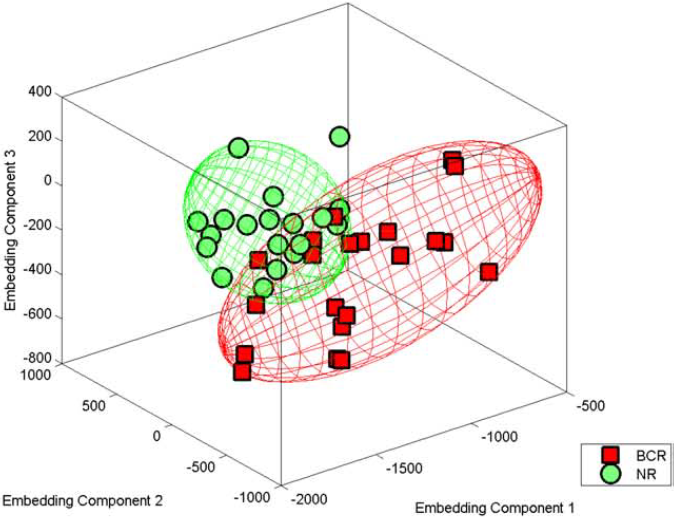
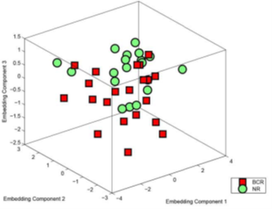
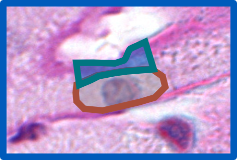
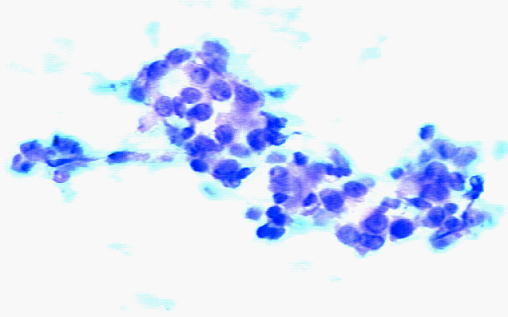

# 

## Welcome! 

## Instructor Information

Scott Doyle

PAS, BME, BMI

Downtown: 4205 JSMBS (M, W, F) 
North: 215-J Bonner Hall (Tu, Th)

<i class="fa fa-envelope"></i> scottdoy@buffalo.edu 
<i class="fa fa-phone"></i> 716.829.2005 
<i class="fa fa-globe"></i> [***www.scottdoy.com***](http://www.scottdoy.com)

## Machine Learning

A Brief Introduction

## Machine Learning Definitions

**Machine Learning** (ML) uses **collected data** to do something useful.

<ul>
<li class="fragment">Find underlying patterns (**knowledge discovery**)</li>
<li class="fragment">Simplify a complex phenomenon (**model building**)</li>
<li class="fragment">Place data into categories (**classification**)</li>
<li class="fragment">Predict future data (**regression**)</li>
</ul>

## Machine Learning Definitions

The job of the ML expert is to:

<ul>
<li class="fragment">Understand and identify the **goal**</li>
<li class="fragment">Collect **data**</li>
<li class="fragment">Select an appropriate **model** or **algorithm**</li>
<li class="fragment">Evaluate the system in terms of **costs**</li>
</ul>

## Types of Machine Learning

**Supervised Learning**

Use **labeled datasets** to classify new, unseen data

 
**Unsupervised Learning**

Use **unlabeled data** to identify natural groups

**Semi-Supervised Learning**

Use **partially labeled** data 
to handle the process

 
**Reinforcement Learning**

An **agent** learns to complete a task **policy** of rewards

 

# 

## Data Definitions

The starting point for all ML algorithms is **data**.

So... what do we mean by "data"?

## Data Comes in Many Forms

{ width=70% }

## Data Comes from Many Places

|              |            |
|:-------------|-----------:|
| Symptoms     | Lab Tests  |
| Demographics | Imaging    |
| Cultures     | Sequencing |

Data quantifies a specific **subject** (e.g. patient) through a set of
**measurements**.

## Computational Pathology:  Expression of Disease State

Biological structure is **primary data**. 

We can quantify **biological structure**.

We can **model** relationships between **structure and disease**.

## Fundamental Hypothesis

Changes in genomic expression manifest as physical changes in tumor morphology

{ width=80% }

 
{ width=80% }

<small>
S. S. Badve et al., JCO (2008),
Paik et al., N Engl J Med (2004)
</small>

## Fundamental Hypothesis 

Changes in genomic expression manifest as physical changes in tumor morphology

{ width=80% }

<small>
S. S. Badve et al., JCO (2008),
Paik et al., N Engl J Med (2004)
</small>

## Data Fusion Improves Predictions

{ height=30% }

{ height=30% }

{ height=30% }

{ height=30% }

{ height=30% }

## Atoms to Anatomy Paradigm

{ width=100% }

{ height=356 width=456 }

{ height=356 width=456 }

{ height=356 width=456 }

{ height=356 width=456 }

{ height=356 width=456 }

{ height=356 width=456 }

#

## Example Problem

Fine Needle Aspirate Classification

## Example: Biomedical Image Analysis

{ width=80% }

 
{ width=80% }

## Fine Needle Aspirates

{ width=80% }

 
{ width=80% }

**Problem Statement** 

Predict whether a patient's tumor is benign or malignant, given an FNA image

## Building Informative Features

**Domain knowledge** identifies useful features.

Pathologists already distinguish **benign** from **malignant** tumors.

Our job is to convert **qualitative** features to **quantitative** ones.

## Building Informative Features

The pathologist lists **cell nuclei** features of importance:

1. Radius
2. Texture
3. Perimeter
4. Area
5. Smoothness

6. Compactness
7. Concavity
8. Concave Points
9. Symmetry
10. Fractal Dimension

**Feature extraction** results in 30 feature values per image.

## Selecting Features for the FNA

To begin, we collect **training samples** to build a model.

<ul>
<li class="fragment">Collect a lot of example images for each class</li>
<li class="fragment">Get our expert to label each image as "Malignant" or "Benign"</li>
<li class="fragment">Measure the features of interest (image analysis or by hand)</li>
<li class="fragment">Build a histogram of the measured feature</li>
</ul>

## Texture of the Nuclei

<iframe frameborder="0" seamless='seamless' scrolling=no src="plots/texture_mean.html"></iframe>

## Selecting New Features

The histograms are similar, with **significant overlap** between classes.

Our pathologist tells us that malignant nuclei are often **larger** than
benign nuclei, so we can build a second histogram for this new feature.

## Average Radius of the Nuclei

<iframe frameborder="0" seamless='seamless' scrolling=no src="plots/radius_mean.html"></iframe>

## Characteristics of Good Features

Better! In general, "good" features for ML are:

**Descriptive:** Similar within a class, and different between classes

**Relevant:** Features should make sense

**Invariant:** Not dependent on how you measure them

## Calculating Probabilities from Features

<iframe frameborder="0" seamless='seamless' scrolling=no src="plots/pdf_cdf.html"></iframe>

## Combinations of Features

**Combining features** often yields greater class separation.

We can visualize two features as a **scatter plot**.

Each point is an object,
and each axis is a dimension or a feature.

## Multivariate Distribution

<iframe frameborder="0" seamless='seamless' scrolling=no src="plots/scatter_histogram_plot.html"></iframe>

## Variance vs. Generalization

Linear boundaries do not model **variance** and miss obvious trends.

Complex boundaries fit training perfectly, but do not **generalize**.

In general, you want the **simplest** model with the best **performance**.

## Tradeoff: Variance vs. Generalization

Each of these decision boundaries makes errors!

There is always a tradeoff; we need to consider the **cost**.

Cost is defined by our goals and acceptable performance.

## Costs

It is important to recognize the difference between **cost** and **risk**. 

<ul>
<li class="fragment">Risk is the likelihood you have made an error.</li>
<li class="fragment">Cost is the penalty associated with making that error.</li>
</ul>

## Cost Weighting

Should we prioritize some kinds of errors over others?

Not all mistakes carry the same cost. For example:

- A patient is told they have a tumor when they do not (**false positive**)
- A patient is told they are cancer-free when they are not (**false negative**)

## In Summary

Machine learning turns raw data into **actionable** insights.

We will cover theory and implementation of popular methods.

<ul>
<li class="fragment">
How could you apply these methods to your own data?
</li>
<li class="fragment">
How could quantitative techniques help test hypotheses and generate novel experiments?
</li>
</ul>

# 

## Course Assessments

## Course Resources: Textbooks

*Pattern Classification, 2nd Edition*

- Duda, Hart, and Stork (DHS)
- ISBN 978-0-471-05669-0

NOT required, but HIGHLY recommended if you are interested in the
material.

Also sold with a companion MATLAB book by Stork and Yom-Tov.

{width=60%}

## Course Resources: Textbooks

*Hands On Machine Learning with Scikit-Learn and Tensorflow*

- Aurélien Géron
- ISBN 978-1491962299

Very focused on applications in Python programming.
 

We will not use Tensorflow but we will make heavy use of Scikit-Learn.

{width=60%}

## Programming Expectations

This is **not** a programming class; it is a class that **uses**
programming.

Spend time designing algorithms, not debugging.

Programming is a tool to get what you want -- if you define what you
want up front, the programming almost doesn't matter. (Almost.)

## Programming Tools: MATLAB

Most of you probably have experience with ***MATLAB***.

<ul>
<li class="fragment">You should already know it</li>
<li class="fragment">Toolboxes implement most low-level algorithms</li>
<li class="fragment">It's what the BME Department supports</li>
<li class="fragment">If you are new, it's not hard to pick up</li>
</ul>

## Programming Tools: Python

***Python*** is a great alternative.

<ul>
<li class="fragment">It's free! It's cross-platform!</li>
<li class="fragment">Libraries extend the base Python, just like MATLAB Toolboxes</li>
<li class="fragment">"Anaconda" distribution is specifically for data science: [https://www.continuum.io/downloads](https://www.continuum.io/downloads)</li>
<li class="fragment">Can convert between MATLAB to Python relatively easily</li>
<li class="fragment">Most common language for academic / "hobby" ML</li>
</ul>

## Programming Tools: Other

Feel free to use any language you like for your
assignments (R, Lua, C++, Fortran...)

I will provide help where I can, but I am most familiar with MATLAB and Python.

## Programming Help

Here's a reasonable workflow when you get an error:

<ol>
<li class="fragment">Write down in English what you're trying to do.</li>
<li class="fragment">Google that sentence with "PYTHON" on the end.</li>
<li class="fragment">If that doesn't work, ask someone!</li>
</ol>

## Programming Help

*General:*
: Google is your friend!
: StackOverflow: ***[stackoverflow.com](http://www.stackoverflow.com)***

*MATLAB:*
: Mathworks Website: ***[mathworks.com](http://www.mathworks.com)***

*Python:*
: Beginner's Guide: ***[wiki.python.org/moin/SimplePrograms](http://wiki.python.org/moin/SimplePrograms)***
: Scientific Docs: ***[docs.scipy.org/doc/](http://docs.scipy.org/doc/)***

## Course Evaluation

You will be graded primarily on four components:

<ul>
<li class="fragment">**Participation**: Show up to class, ask questions, and answer them</li>
<li class="fragment">**Assignments**: 4-5 assignments per semester</li>
<li class="fragment">**Paper Presentation**: 15-minute formal presentation to the class</li>
<li class="fragment">**Final Project**: Due at the end of the semester</li>
</ul>

## Course Evaluation: Assignments

Assignments will be assessed on:

<ul>
<li class="fragment">Whether you did the assignment</li>
<li class="fragment">Writing up what you did, what happened, and your interpretation</li>
<li class="fragment">How well you implemented what you learned in class</li>
</ul>

The assignments **build on each other** (so don't delete it when you're done!)

## Course Evaluation: Presentations

Class presentations can be any of the following:

<ul>
<li class="fragment">**Paper Discussion**: Critical summary of a paper.</li>
<li class="fragment">**Assignment / Project Presentation**: Discuss the status of your project.</li>
<li class="fragment">**Research Discussion**: If you doing research outside of
class, tell us about it!</li>
</ul>

## Course Evaluation: Projects

Assignments build pieces of a classification system. 

The project just ties it all together with a formal writeup and hand-in.

<ul>
<li class="fragment">If you understand and complete the assignments, the project is a breeze.</li>
<li class="fragment">If you fall behind or don't grasp the assignments, it's less pleasant.</li>
</ul>

## Group Work Policy

You can group up for assignment and project following rules:

<ul>
<li class="fragment">Keep it to **3 people** or fewer.</li>
<li class="fragment">Your group **must stay the same** throughout the semester.</li>
<li class="fragment">Assignments must include group names **and contributions**.</li>
<li class="fragment">Groups are graded **together** on the assigments and project.</li>
</ul>

# 

## Course Topics Overview

## Expected Topics: Traditional ML

- Bayesian Decision Theory
- Nonmetric Methods: Decision Trees and Random Forests
- Linear Discriminants and Perceptrons
- Support Vector Machines
- Parametric and Non-Parametric Techniques
- Clustering and Expectation Maximization
- Component Analysis and Dimensionality Reduction
- Boosting and Classifier Ensembles

## Expected Topics: Deep Learning and AI

- Neural Networks
- CNNs
- RNNs
- Reinforcement Learning
- Ethics and Meta-issues with ML / AI

## (Un)Expected Topics

If you are interested in something, e-mail me and we can cover it.

## Course Content Overview: Background

*Linear Algebra:*
: Matrix Inner / Outer Products
: Derivatives, Determinants, Trace
: Eigenvectors / Eigenvalues

*Probability Theroy:*
: Discrete Random Variables, Dependence
: Expected Value, Standard Deviation
: Gaussian Distributions

*Information Theory:*
: Entropy
: Mutual Information
: Computational Complexity

# 
## Next Class

## Mathematical Background and Coding Intro

On **Thursday** we will cover:

<ul>
<li>Machine Learning design philosophy and project setup</li>
<li class="fragment">Introduction to programming environment and resources</li>
<li class="fragment">Mathematical background and foundations</li>
</ul>
## Instructor Information

Scott Doyle

PAS, BME, BMI

Downtown: 4205 JSMBS (M, W, F) 
North: 215-J Bonner Hall (Tu, Th)

<i class="fa fa-envelope"></i> scottdoy@buffalo.edu 
<i class="fa fa-phone"></i> 716.829.2005 
<i class="fa fa-globe"></i> [***www.scottdoy.com***](http://www.scottdoy.com)

## Thank You!

