# 
## Announcements

## First Assignment

First assignment instructions will be up by the end of the day!

**Due date: Tuesday, Feb. 25**

Goal: Choose a dataset and perform some preliminary, exploratory analysis of the data.

Use either public datasets or your own research data (with permission of your PI).

## Dataset Sources

<ul>
<li>UC Irvine Machine Learning Repository ([https://archive.ics.uci.edu/ml/index.php](https://archive.ics.uci.edu/ml/index.php))</li>
<li>R Datasets on Github ([https://vincentarelbundock.github.io/Rdatasets/](https://vincentarelbundock.github.io/Rdatasets/))</li>
<li>Kaggle Datasets: ([https://www.kaggle.com/datasets](https://www.kaggle.com/datasets))</li>
<li>Awesome Lists: Public Datasets ([https://github.com/caesar0301/awesome-public-datasets](https://github.com/caesar0301/awesome-public-datasets))</li>
<li>Yahoo! Webscope Datasets ([https://webscope.sandbox.yahoo.com/](https://webscope.sandbox.yahoo.com/))</li>
<li>Reddit: /r/datasets ([https://www.reddit.com/r/datasets](https://www.reddit.com/r/datasets))</li>
</ul>

## First Assignment: Dataset Selection Tips

Things you should look for:

<ul>
<li class="fragment">**Well-documented**: How was it collected? Who owns it? Are there any publications that use this dataset?</li>
<li class="fragment">**Good Size**: How many classes and observations are there? What is the distribution across the classes? How many features are there relative to the number of observations?</li>
<li class="fragment">**Annotated**: Are there labels? Who provided them? Are the labels assigned by an expert? Are they noisy, approximate, or exact?</li>
<li class="fragment">**Feature Types**: What are the format of the features? (HINT: Look for features that are **continuous**, not **categorical** or **binary**!)</li>
</ul>

Datasets of unlabeled data (e.g. text corpora and raw images) ***should be avoided***.

## PDF Lectures

PDF versions of the previous lectures are up on UBLearns.

These lectures may not look as well-formatted as the
website, but they should be understandable.

## Link to Lecture Page

A link to the lecture page has been added to [scottdoy.com](scottdoy.com).

# 

## Normal (Gaussian) Distribution

Simple, Common Model Parametric Model 

## Revisiting the Normal Density

The **normal** or **Gaussian** density is a good model for a lot of phenomena, so we will discuss it in some length.

<ul>
<li class="fragment">**Univariate:** "One Variable" (a one-dimensional function)</li>
<li class="fragment">**Multivariate:** "Multiple Variable" (more than one dimensions)</li>
</ul>

## Normal Density Diagram

{width=80%}

## Normal Density Formula

The normal distribution:

\$ p(x) = \\frac{1}{\\sqrt{2\\pi}\\sigma}\\exp{\\left[-\\frac{1}{2}\\left(\\frac{x-\\mu}{\\sigma}\\right)^{2}\\right]}\$

This is a **parameterized** distribution.
 

What does that mean?

## Definition of Parameters

**Parameters** are places in a function where you can plug in different numbers and get different "versions" of the distribution.

The set of parameters \$\\boldsymbol{\\theta}$ are all you need to replicate a parametric function.

The normal density is parameterized by the **mean** and **standard deviation**:

\$ p(x) \\sim N(\\mu,\\sigma^{2}) \$

## Normal Density Parameters

The mean, \$\\mu\$, is defined as the expected value of \$x\$:

\$ \\mu \\equiv \\mathcal{E}\\left[x\\right]=\\int_{-\\infty}^{\\infty}xp(x)dx \$

The variance (standard deviation squared) is:

\$\\sigma^{2} \\equiv \\mathcal{E}\\left[(x-\\mu)^{2}\\right] =
\\int_{-\\infty}^{\\infty} (x-\\mu)^{2} p(x)dx\$

## Using the Normal Distribution

Why is the normal in particular so useful? According to Wikipedia:

> Of all probability distributions over the reals with a specified mean \$\\mu\$
> and variance \$\\sigma^{2}\$, the normal distribution $N(\\mu, \\sigma^{2})\$ is the
> one with maximum entropy.

Okay... so then what does **maximum entropy** mean?

# 

## Information Entropy

## Definition of Entropy

Entropy is a measure of **randomness** in a sequence.

If our random variable \$x\$ can take on one of \$m\$ values,
\$\\{v_{1},v_{2},\\ldots,v_{m}\\}\$, and value \$v_{i}\$ has an associated
probability \$P_{i}\$, then the measure of randomness is given as:

\$ H = -\\sum_{i=1}^{m}P_{i}\\log_{2}P_{i} \$

In this discrete case, entropy is measured in **bits** using the base 2
logarithm.

In the continuous case, entropy is measured in **nats** using the natural
logarithm, and would be calculated using an integral instead of a sum.

## Example of Entropy

Example: Let’s say \$x\\in\\{0,1,\\ldots,7\\}\$, and each value is equally likely.

There are eight digits, so the probability of any individual value appearing, \$p_{i}\$, is \$\\frac{1}{8}\$.

In this case, the entropy is calculated as:

\$ H=-\\sum_{i=0}^{7}\\frac{1}{8}\\log_{2}\\left[\\frac{1}{8}\\right] =
\\log_{2}\\left[2^{3}\\right] = 3 \\textrm{ bits} \$

Indeed, in base 2 (binary) we need a minimum of 3 bits to encode all possible
values:

\$
\\underbrace{000}\_{0} \\quad \\underbrace{001}\_{1}\\quad\\underbrace{010}\_{2}\\quad\\underbrace{011}\_{3}\\quad\\underbrace{100}\_{4}\\quad\\underbrace{101}\_{5}\\quad\\underbrace{110}\_{6}\\quad\\underbrace{111}\_{7}
\$

## Entropy and the Normal Distribution

If each of our values \$\\{v_{1},v_{2},\\ldots,v_{m}\\}\$ is **equally likely** to
appear, they are said to be drawn from a **uniform distribution**.

Since each observation holds no information about the next, the uniform
distribution has the **maximum entropy** of all distributions with a given
mean and variance.

## Why is Maximum Entropy a Good Thing?

There are a lot of mathy ways to say this, but the reason we want a probability
distribution with maximum entropy is that it means we are making **as few
assumptions as possible** about the data.

For example: If I know that the average nuclei radius is \$10\\mu m\$,
it's reasonable to assume that an \$8\\mu m\$ nucleus is **just as
likely** as a \$12\\mu m\$ one.

## Central Limit Theorem 

Recall the **Central Limit Theorem:**

> If a random variable is observed a large number of times, and the variable has
> a known mean and standard deviation, the average of the observations will
> approximate a normal distribution.

## Entropy and the Normal Distribution

In many cases, we can safely assume that **feature values** are drawn from a uniform
distribution.

The Central Limit Theorem tells us that because of this, the probability distribution over a large
number of samples can be modeled as a normal distribution.

So all of this means that \$p(x|\\omega_{j})\$ takes the form:

\$ p(x|\\omega_{j}) =
\\frac{1}{\\sqrt{2\\pi}\\sigma}\\exp{\\left[-\\frac{1}{2}\\left(\\frac{x-\\mu}{\\sigma}\\right)^{2}\\right]}\$

# 

## Multivariate Normal Distributions

## Multivariate Normal Distribution

So far, we have been talking about a single variable or feature, \$x\$. But what
if we have multiple features?

If we have a \$d\$-dimensional feature vector
\$\\mathbf{x}=(x_{1},x_{2},\\ldots,x_{d})^{T}\$, and each component is
**statistically independent**, then the probability of observing \$\\mathbf{x}\$
is the product of the probabilities of observing each individual event:

\$ p(\\mathbf{x}) = \\prod_{i=1}^{d}p(x_{i}) \$

## Multivariate Normal Distribution

Since **each component** of \$\\mathbf{x}\$ can be modeled as a normally-distributed
random variable, then \$p(\\mathbf{x})\$ is the product of \$d\$ Gaussians:

\$ p(\\mathbf{x}) = \\prod_{i=1}^{d}\\frac{1}{\\sqrt{2\\pi}\\sigma_{i}}\\exp{\\left[-\\frac{1}{2}\\left(\\frac{x_{i}-\\mu_{i}}{\\sigma_{i}}\\right)^{2}\\right]} \$

We can simplify this by distributing the product inside:

\$ p(\\mathbf{x}) = \\frac{1}{(2\\pi)^{\\frac{d}{2}} \\prod_{i=1}^{d} \\sigma_{i}}
\\exp{\\left[-\\frac{1}{2}
\\sum_{i=1}^{d} \\left(\\frac{x_{i}-\\mu_{i}}{\\sigma_{i}}\\right)^{2}
\\right]}\$

## Multivariate Normal Distribution

\$ p(\\mathbf{x}) = \\frac{1}{(2\\pi)^{\\frac{d}{2}} \\prod_{i=1}^{d} \\sigma_{i}}
\\exp{\\left[-\\frac{1}{2}
\\sum_{i=1}^{d} \\left(\\frac{x_{i}-\\mu_{i}}{\\sigma_{i}}\\right)^{2}
\\right]}\$

We can simplify even further by replacing the red components with the covariance
matrix \$\\boldsymbol{\\Sigma}$ and mean vector \$\\boldsymbol{\\mu}$.

## Review of Covariance

Remember: for two random variables \$x_{i}\$ and \$x_{j}\$, we can calculate the
covariance or “cross-moment” to measure statistical independence:

\$ \\sigma_{ij} = \\mathcal{E}\\left[(x_{i}-\\mu_{i})(x_{j}-\\mu_{j})\\right] \$

"Covariance" is a measure of how much two random variables change together. If
the covariance is zero, i.e. \$\\sigma_{ij}=0\$, then the two variables do not
change together and they are **uncorrelated**.

When \$i=j\$, the "co"-variance is just the variance (how much the variable
changes from the mean), which we've defined as:

\$ \\sigma_{ii} = \\mathcal{E}\\left[(x_{i}-\\mu_{i})(x_{i}-\\mu_{i})\\right] =
\\mathcal{E}\\left[(x_{i}-\\mu_{i})^{2}\\right] \$

## Covariance Matrix

The covariance matrix \$\\boldsymbol{\\Sigma}\$ just collects each of the
covariances. It is a square matrix whose \$ij\$-th element is \$\\sigma_{ij}\$:

\$ \\boldsymbol{\\Sigma} =
\\begin{bmatrix}
\\sigma_{11} & \\sigma_{12} & \\cdots & \\sigma_{1d} \\\\
\\sigma_{21} & \\sigma_{22} & \\cdots & \\sigma_{2d} \\\\
\\vdots & \\vdots & \\ddots & \\vdots \\\\
\\sigma_{d1} & \\sigma_{d2} & \\cdots & \\sigma_{dd}
\\end{bmatrix}\$

## Covariance Matrix

If we assume each dimension in \$\\mathbf{x}\$ is **uncorrelated**, then
\$\\sigma_{ij}=0\$ for all \$i\\neq j\$, so the matrix becomes a diagonal matrix:

\$ \\boldsymbol{\\Sigma} =
\\begin{bmatrix}
\\sigma_{11} \& 0 \& \\cdots \& 0 \\\\
0 \& \\sigma_{22} \& \\cdots \& 0 \\\\
\\vdots \& \\vdots \& \\ddots \& \\vdots \\\\
0 \& 0 \& \\cdots \& \\sigma_{dd}
\\end{bmatrix} \$

## Inverse of the Covariance Matrix

The **inverse** of a matrix \$\\mathbf{M}\$ is one where \$\\mathbf{MM}^{-1} = \\mathbf{I}\$ (the identity matrix).

Hence, we can easily calculate \$\\boldsymbol{\\Sigma}^{-1}\$ as:

\$ \\boldsymbol{\\Sigma}^{-1} =
\\begin{bmatrix}
\\frac{1}{\\sigma_{11}} \& 0 \& \\cdots \& 0 \\\\
0 \& \\frac{1}{\\sigma_{22}} \& \\cdots \& 0 \\\\
\\vdots \& \\vdots \& \\ddots \& \\vdots \\\\
0 \& 0 \& \\cdots \& \\frac{1}{\\sigma_{dd}}
\\end{bmatrix} \$

**Note**: The inverse of a matrix is not usually just 1 divided by each element. It just works out because \$\\boldsymbol{\\Sigma}\$ is diagonal, in the case where all dimensions are uncorrelated.

## Calculating the Covariance Determinant

Finally, the determinant of \$\\boldsymbol{\\Sigma}\$ is the product of the
variances:

\$ |\\boldsymbol{\\Sigma}| = \\sigma_{11}\\sigma_{22}\\cdots\\sigma_{dd} \$

The rest of the terms disappear because they all contain zeroes.

## Simplified Multivariate Normal Equation

Thus we can rewrite this:

\$ p(\\mathbf{x}) = \\frac{1}{(2\\pi)^{\\frac{d}{2}} \\prod_{i=1}^{d}
\\sigma_{i}}
\\exp{\\left[-\\frac{1}{2}
\\sum_{i=1}^{d} \\left(\\frac{x_{i}-\\mu_{i}}{\\sigma_{i}}\\right)^{2}
\\right]}
\$

... like this:

\$ p(\\mathbf{x}) = \\frac{1}{(2\\pi)^{\\frac{d}{2}} |\\boldsymbol{\\Sigma}|^{\\frac{1}{2}}}
\\exp{\\left[-\\frac{1}{2} (\\mathbf{x}-\\boldsymbol{\\mu})^{T}
\\boldsymbol{\\Sigma}\^{-1} (\\mathbf{x}-\\boldsymbol{\\mu})
\\right]}
\$

## Explanation of Multivariate Normal Distribution

\$ p(\\mathbf{x}) = \\frac{1}{(2\\pi)^{\\frac{d}{2}} |\\boldsymbol{\\Sigma}|^{\\frac{1}{2}}}
\\exp{\\left[-\\frac{1}{2} (\\mathbf{x}-\\boldsymbol{\\mu})^{T}
\\boldsymbol{\\Sigma}\^{-1} (\\mathbf{x}-\\boldsymbol{\\mu})
\\right]}
\$

This function combines multiple normally-distributed random variables
(components of \$\\mathbf{x}\$), each of which has its own mean and variance.

In terms of expected values, the mean and covariance can be written as:

\$ \\boldsymbol{\\mu} \\equiv \\mathcal{E}\\left[\\mathbf{x}\\right] =
\\int\\mathbf{x}p(\\mathbf{x})d\\mathbf{x} \$

\$ \\boldsymbol{\\Sigma} \\equiv
\\mathcal{E}\\left[(\\mathbf{x}-\\boldsymbol{\\mu})(\\mathbf{x}-\\boldsymbol{\\mu})^{T}\\right]
= \\int
(\\mathbf{x}-\\boldsymbol{\\mu})(\\mathbf{x}-\\boldsymbol{\\mu})^{T}p(\\mathbf{x})d\\mathbf{x}
\$

## Multivariate Normal Distribution

\$ p(\\mathbf{x}) = \\frac{1}{(2\\pi)^{\\frac{d}{2}} |\\boldsymbol{\\Sigma}|^{\\frac{1}{2}}}
\\exp{\\left[-\\frac{1}{2} (\\mathbf{x}-\\boldsymbol{\\mu})^{T}
\\boldsymbol{\\Sigma}\^{-1} (\\mathbf{x}-\\boldsymbol{\\mu})
\\right]}
\$

How many components does \$\\boldsymbol{\\mu}\$ have?

\$d\$, which is the same as \$\\mathbf{x}\$

What are the values of these components?

\$\\mu_{i} = \\mathcal{E}\\left[x_{i}\\right]\$

What is the dimensionality of \$\\boldsymbol{\\Sigma}\$?

<ul>
<li class="fragment">\$\\mathbf{x}-\\boldsymbol{\\mu}=\$ a \$d\$-dimensional vector</li>
<li class="fragment">\$(\\mathbf{x}-\\boldsymbol{\\mu})(\\mathbf{x}-\\boldsymbol{\\mu})^{T}=\\mathbf{M}\$, a \$d\\times d\$ dimensional vector</li>
</ul>

## Visualizing Multivariate Distributions

<iframe frameborder="0" seamless='seamless' scrolling=no src="plots/scatter_histogram_plot.html"></iframe>

# 

## Transforms of Normal Distributions

## Linear Transforms

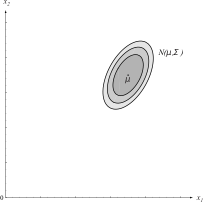{width=100%}

Linear transforms of normal distribuion are also normally distributed.

## Linear Transforms

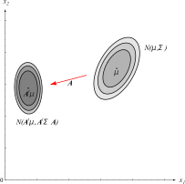{width=100%}

If \$\\mathbf{A}\$ is a \$d\$-by-\$k\$ transformation matrix and
\$\\mathbf{y}=\\mathbf{A}^{T}\\mathbf{x}\$ is a \$k\$-component vector, then:

\$ p(\\mathbf{y}) \\sim
N(\\mathbf{A}^{T} \\boldsymbol{\\mu},\\mathbf{A}^{T} \\boldsymbol{\\Sigma}\\mathbf{A}) \$

This results in another normal distribution.

## Projections of Normals onto a Line

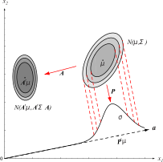{width=100%}

If \$k=1\$, then \$\\mathbf{A}\$ is a unit-length vector \$\\mathbf{a}\$, and so
\$y=\\mathbf{a}^{T}\\mathbf{x}\$ is a scalar (dot product!) that represents the
projection of \$\\mathbf{x}\$ onto the line represented by \$\\mathbf{a}\$.

Now \$p(y)\$ is a univariate normal distribution with a mean of
\$\\mathbf{a}^{T}\\boldsymbol{\\mu}\$ and a variance of a
\$\\mathbf{a}^{T}\\boldsymbol{\\Sigma}\\mathbf{a}\$.

## Whitening Transform

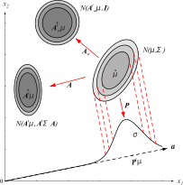{width=100%}

The "whitening" transform, \$\\mathbf{A}_{w}\$ is a special projection that makes
an arbitrary distribution \$p(\\mathbf{x})\$ into a spherical one (i.e. its
covariance matrix is the identiy matrix).

Define \$\\boldsymbol{\\Phi}\$ as the matrix whose columns are the eigenvectors of
\$\\boldsymbol{\\Sigma}\$, and \$\\boldsymbol{\\Lambda}\$ is a diagonal matrix of
corresponding eigenvalues.

## Whitening Transform

{width=100%}

\$ \\mathbf{A}_{w} = \\boldsymbol{\\Phi}\\boldsymbol{\\Lambda}^{\\frac{1}{2}} \$

The resulting distribution \$p(\\mathbf{w})\$ has a covariance equal to 1 along each component.

Why would we do this?
 

**Feature scaling:** It can help to get all features into a similar arrangement such as a spherical multivariate distribution.

# 

## Gaussian Discriminant Functions

## Discriminant Functions Revisited

Remember how we created a bunch of forms of the discriminant function?

The idea is that as long as the equation gives us **higher values** for the
desired class, the form can be anything we want.

One of the forms was a natural log of the probabilities:

\$ g_{i}(\\mathbf{x}) = \\ln{p(\\mathbf{x}|\\omega_{i})} + \\ln{P(\\omega_{i})} \$

## Discriminant Functions Simplified

\$ g_{i}(\\mathbf{x}) = \\ln{p(\\mathbf{x}|\\omega_{i})} + \\ln{P(\\omega_{i})} \$

If we assume that \$p(\\mathbf{x}|\\omega\_{i}) \\sim N(\\boldsymbol{\\mu}\_{i},\\boldsymbol{\\Sigma}\_{i})\$, then we can plug the
multivariate normal distribution function into the above equation:

\$ g_{i}(\\mathbf{x}) = \\ln{\\left[\\frac{1}{
(2\\pi)^{\\frac{d}{2}} 
|\\boldsymbol{\\Sigma}|^{\\frac{1}{2}}
}\\exp{\\left[-\\frac{1}{2}(\\mathbf{x}-\\boldsymbol{\\mu})^{T}
\\boldsymbol{\\Sigma}\^{-1} (\\mathbf{x}-\\boldsymbol{\\mu}) 
\\right]}\\right]} + \\ln{P(\\omega_{i})}
\$

\$ g_{i}(\\mathbf{x}) =
-\\frac{1}{2}(\\mathbf{x}-\\boldsymbol{\\mu}\_{i})^{T}
\\boldsymbol{\\Sigma}\_{i}\^{-1} (\\mathbf{x}-\\boldsymbol{\\mu}\_{i}) -
\\frac{d}{2}\\ln{2\\pi} -
\\frac{1}{2}\\ln{|\\boldsymbol{\\Sigma}|} + 
\\ln{P(\\omega_{i})} \$

## Discriminant Functions Revisited

Let's examine our discriminant functions under two conditions:

<ol>
<li class="fragment">All classes and features are assumed to have the **same
variance** (\$\\boldsymbol{\\sigma_{i}}=\\sigma^{2}\\boldsymbol{I}\$), and</li>
<li class="fragment">Classes and features have **arbitrary variances**.</li>
</ol>

In the first case, we can make some simplifying assumptions to help us draw
decision boundaries.

In the second, we cannot assume anything about the form of the discriminant
functions.

# 

## Equal Variances 

## Discriminant Function When \$\\boldsymbol{\\Sigma}_{i} = \\sigma^{2}\\boldsymbol{I}\$

In the equal variances case, components of \$\\mathbf{x}\$ are independent and have the same variance, \$\\sigma^{2}\$.

Each class falls into a **hypersphere** in \$d\$ dimensions, and each class is clustered around the corresponding mean vector \$\\boldsymbol{\\mu}_{i}\$.

(Think of each class as a perfectly round blob in \$d\$-dimensional space.)

## Discriminant Function When \$\\boldsymbol{\\Sigma}_{i} = \\sigma^{2}\\boldsymbol{I}\$

Here's our discriminant function again:

\$ g_{i}(\\mathbf{x}) = -\\frac{1}{2}(\\mathbf{x}-\\boldsymbol{\\mu}\_{i})\^{T} \\boldsymbol{\\Sigma}\_{i}\^{-1}(\\mathbf{x}-\\boldsymbol{\\mu}\_{i})-\\frac{d}{2}\\ln{2\\pi}-\\frac{1}{2}\\ln{|\\boldsymbol{\\Sigma}|}+\\ln{P(\\omega_{i})} \$

Since \$\\boldsymbol{\\Sigma}\_{i}=\\sigma\^{2}\\mathbf{I}\$, the determinant is just
\$|\\boldsymbol{\\Sigma}\_{i}|=\\sigma\^{2d}\$ and the inverse is
\$\\boldsymbol{\\Sigma}\_{i}\^{-1}=(\\frac{1}{\\sigma\^{2}})\\mathbf{I}\$.

\$ g_{i}(\\mathbf{x}) = -\\frac{(\\mathbf{x}-\\boldsymbol{\\mu}\_{i})\^{T} (\\mathbf{x}-\\boldsymbol{\\mu}\_{i})}{2\\sigma^{2}}-\\frac{d}{2}\\ln{2\\pi}-\\frac{1}{2}\\ln{|\\boldsymbol{\\Sigma}|}+\\ln{P(\\omega_{i})} \$

## Discriminant Function When \$\\boldsymbol{\\Sigma}_{i} = \\sigma^{2}\\boldsymbol{I}\$

\$ g_{i}(\\mathbf{x}) = -\\frac{(\\mathbf{x}-\\boldsymbol{\\mu}\_{i})\^{T} (\\mathbf{x}-\\boldsymbol{\\mu}\_{i})}{2\\sigma^{2}}-\\frac{d}{2}\\ln{2\\pi}-\\frac{1}{2}\\ln{|\\boldsymbol{\\Sigma}|}+\\ln{P(\\omega_{i})} \$

Terms independent of \$i\$ can be dropped, so the discriminant function reduces
to:

\$ g_{i}(\\mathbf{x}) = -\\frac{(\\mathbf{x}-\\boldsymbol{\\mu}\_{i})\^{T} (\\mathbf{x}-\\boldsymbol{\\mu}\_{i})}{2\\sigma\^{2}} +\\ln{P(\\omega_{i})} \$

Expanding \$(\\mathbf{x}-\\boldsymbol{\\mu}\_{i})^{T} (\\mathbf{x}-\\boldsymbol{\\mu}\_{i})\$ gives:

\$ g_{i}(\\mathbf{x}) = - \\frac{1}{2\\sigma^{2}}
\\left[\\mathbf{x}^{T}\\mathbf{x} -2\\boldsymbol{\\mu}\_{i}^{T} \\mathbf{x}
+\\boldsymbol{\\mu}\_{i}^{T} \\boldsymbol{\\mu}\_{i}\\right] + \\ln{P(\\omega_{i})} \$

## Discriminant Function When \$\\boldsymbol{\\Sigma}_{i} = \\sigma^{2}\\boldsymbol{I}\$

\$ g_{i}(\\mathbf{x}) = -\\frac{1}{2\\sigma^{2}}\\left[\\mathbf{x}^{T}\\mathbf{x} -2\\boldsymbol{\\mu}\_{i}^{T}\\mathbf{x} +\\boldsymbol{\\mu}\_{i}^{T}\\boldsymbol{\\mu}\_{i}\\right] + \\ln{P(\\omega_{i})} \$

We can ignore \$\\mathbf{x}^{T}\\mathbf{x}\$ since it doesn't change with \$i\$, so we
can rewrite the above as:

\$ g_{i}(\\mathbf{x}) = \\frac{1}{2\\sigma^{2}}\\left[2\\boldsymbol{\\mu}\_{i}^{T}\\mathbf{x} -\\boldsymbol{\\mu}\_{i}^{T}\\boldsymbol{\\mu}\_{i}\\right] + \\ln{P(\\omega_{i})} \$

## Discriminant Function When \$\\boldsymbol{\\Sigma}_{i} = \\sigma^{2}\\boldsymbol{I}\$

With a change of variables, we can simplify further:

\$ g_{i}(\\mathbf{x}) = \\mathbf{w}\_{i}^{T} \\mathbf{x} + w_{i0}\$, where

\$ \\mathbf{w}_{i} = \\frac{1}{\\sigma^{2}}\\boldsymbol{\\mu}\_{i} \$

\$ w_{i0} = -\\frac{1}{2\\sigma^{2}}\\boldsymbol{\\mu}\_{i}\^{T} \\boldsymbol{\\mu}\_{i} +\\ln{P(\\omega_{i})} \$

We call \$w_{i0}\$ the **bias** or **threshold** for the \$i\$-th category.

What do these functions look like?

## Discriminant Function When \$\\boldsymbol{\\Sigma}_{i} = \\sigma^{2}\\boldsymbol{I}\$

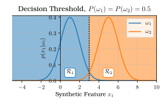{ width=80% }

## Discriminant Function When \$\\boldsymbol{\\Sigma}_{i} = \\sigma^{2}\\boldsymbol{I}\$

{width=80%}

## Discriminant Function When \$\\boldsymbol{\\Sigma}_{i} = \\sigma^{2}\\boldsymbol{I}\$

{width=100%}

The decision hyperplane is where:

\$g_{i}(\\mathbf{x})=g_{j}(\\mathbf{x})\$

\$ \\mathbf{w}\_{i}\^{T} \\mathbf{x} + w_{i0} = \\mathbf{w}\_{j}\^{T} \\mathbf{x} + w_{j0}\$

<small>

\$ \\frac{1}{2\\sigma^{2}}
\\left[2\\boldsymbol{\\mu}\_{i}^{T} \\mathbf{x}
-\\boldsymbol{\\mu}\_{i}^{T}\\boldsymbol{\\mu}\_{i}\\right] +
\\ln{P(\\omega_{i})} = \\frac{1}{2\\sigma^{2}}
\\left[2\\boldsymbol{\\mu}\_{j}^{T} \\mathbf{x} -\\boldsymbol{\\mu}\_{j}^{T} \\boldsymbol{\\mu}\_{j}\\right] + \\ln{P(\\omega_{j})}\$

</small>

We want to find the point, \$\\mathbf{x}_{0}\$, where this
is true.

## Discriminant Function When \$\\boldsymbol{\\Sigma}_{i} = \\sigma^{2}\\boldsymbol{I}\$

{width=100%}

By rearranging the equation, we get:

<small>
\$ \\mathbf{x}\_{0} = \\frac{1}{2}(\\boldsymbol{\\mu}\_{i} +
\\boldsymbol{\\mu}\_{j}) - 
\\frac{\\sigma\^{2}}{||\\boldsymbol{\\mu}\_{i}-\\boldsymbol{\\mu}\_{j}||\^{2}} \\ln{\\frac{P(\\omega_{i})}{P(\\omega_{j})}}(\\boldsymbol{\\mu}\_{i}-\\boldsymbol{\\mu}\_{j}) \$
</small>

## Discriminant Function When \$\\boldsymbol{\\Sigma}_{i} = \\sigma^{2}\\boldsymbol{I}\$

\$ \\mathbf{x}\_{0} = \\frac{1}{2}(\\boldsymbol{\\mu}\_{i} +
\\boldsymbol{\\mu}\_{j}) - 
\\frac{\\sigma\^{2}}{||\\boldsymbol{\\mu}\_{i}-\\boldsymbol{\\mu}\_{j}||\^{2}} \\ln{\\frac{P(\\omega_{i})}{P(\\omega_{j})}}(\\boldsymbol{\\mu}\_{i}-\\boldsymbol{\\mu}\_{j}) \$

If \$P(\\omega_{i})=P(\\omega_{j})\$, then
\$\\ln{\\frac{P(\\omega_{i})}{P(\\omega_{j})}}=0\$ and
\$\\mathbf{x}\_{0}=\\frac{1}{2}(\\boldsymbol{\\mu}\_{i}+\\boldsymbol{\\mu}\_{j})\$; in
other words, it is located halfway between the means.

If \$P(\\omega_{i})\\neq P(\\omega_{j})\$, then the decision boundary shifts towards
the mean with the lower prior.

Why does this happen?

## Discriminant Function When \$\\boldsymbol{\\Sigma}_{i} = \\sigma^{2}\\boldsymbol{I}\$

{width=100%}

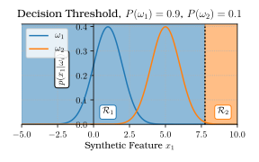{width=100%}

## Discriminant Function When \$\\boldsymbol{\\Sigma}_{i} = \\sigma^{2}\\boldsymbol{I}\$

{width=100%}

## Discriminant Function When \$\\boldsymbol{\\Sigma}_{i} = \\sigma^{2}\\boldsymbol{I}\$

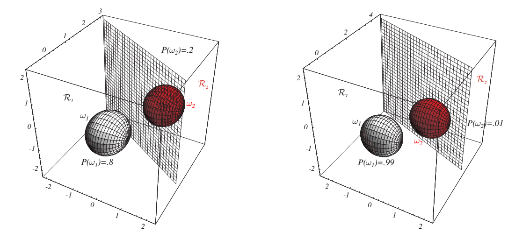{width=100%}

# 

## Arbitrary Variances

## Arbitrary \$\\boldsymbol{\\Sigma}_{i}\$

If the covariance matrices for the classes are **different** and
**arbitrary**, then we can only drop one term from the general discriminant
function:

\$ g_{i}(\\mathbf{x}) = \\mathbf{x}^{T} \\mathbf{W}\_{i}\\mathbf{x} +
\\mathbf{w}\_{i}\^{T} \\mathbf{x} + w_{i0} \$

\$ \\mathbf{W}_{i} = -\\frac{1}{2}\\boldsymbol{\\Sigma}\_{i}\^{-1} \$

\$ \\mathbf{w}_{i} = \\boldsymbol{\\Sigma}\_{i}\^{-1}\\boldsymbol{\\mu}\_{i} \$

\$ w_{i0} =
-\\frac{1}{2}\\boldsymbol{\\mu}\_{i}\^{T}\\boldsymbol{\\Sigma}\_{i}\^{-1}\\boldsymbol{\\mu}\_{i}-\\frac{1}{2}\\ln{|\\boldsymbol{\\Sigma}\_{i}|}+\\ln{P(\\omega_{i})}
\$

## Arbitrary \$\\boldsymbol{\\Sigma}_{i}\$

In this case, decision surfaces are **hyperquadratic** and can take on all
kinds of crazy shapes.

They don't even need to be continuous regions.

## Arbitrary \$\\boldsymbol{\\Sigma}_{i}\$

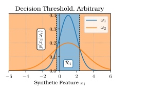{ width=80% }

## Arbitrary \$\\boldsymbol{\\Sigma}_{i}\$

{width=100%}

## Arbitrary \$\\boldsymbol{\\Sigma}_{i}\$

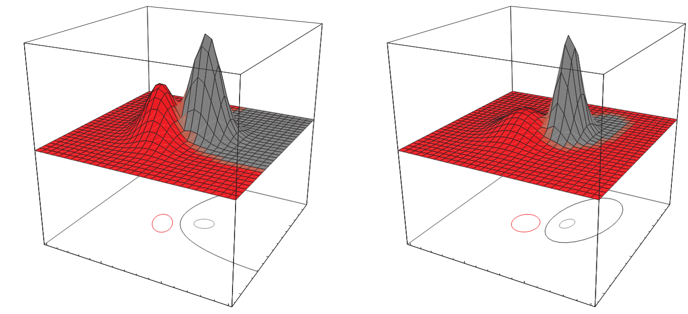{width=100%}

## Arbitrary \$\\boldsymbol{\\Sigma}_{i}\$

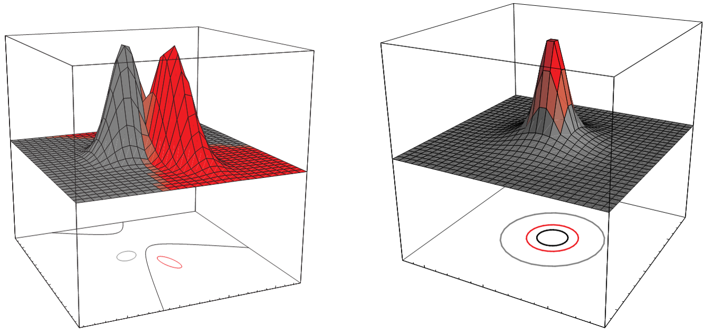{width=100%}

## Extensions to Additional Classes

The theory holds when you extend to additional classes, although the decision
boundaries can get fairly complex.

Note: If you have these kinds of problems, you must be sure your training set is
very good (lots of samples, good fit between samples and model, etc.)

Always remember the tradeoff of generalization vs. complexity!

## Arbitrary \$\\boldsymbol{\\sigma}_{i}\$

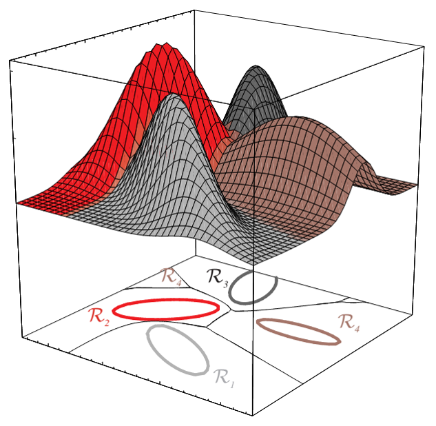{width=45%}

# 

## Parting Words

## Bayesian Theory Wrap-Up

Bayes forms the basis for a lot of "ideal" classifier problems.

Use this when the following conditions are met:

<ul>
<li class="fragment">You can obtain a reasonably large set of labeled training data to estimate \$p(x|\\omega)\$</li>
<li class="fragment">You can estimate the distribution that characterizes \$p(x|\\omega)\$ (it doesn't HAVE to be normal, but it helps)</li>
<li class="fragment">You know what your prior \$P(\\omega)\$ is for each class, or you can assume them to be non-informative</li>
<li class="fragment">You have a relatively small number of features in your dataset</li>
</ul>

## Bayesian Theory Wrap-Up

Bayes gives you a very good statistical understanding of classifier performance.

If you get errors, look at your PDFs and associated feature values!

You can easily troubleshoot your system by checking your PDFs.

# 

## Next Class

## Non-Metric Methods

What happens when our features are not numbers, but attribute-value pairs like
"color" or "taste"?

These are not "metrics", meaning you can't put them in a specific order or
calculate a meaningful distance between them

There's no such thing as a distance value between "chocolate" and "vanilla".

We can address this problem using Non-Metric methods like Decision Trees.

Tree-building methods: CART, ID3, C4.5

# 

## Thank You!
