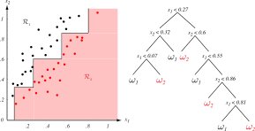
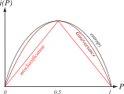
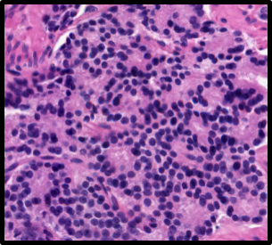
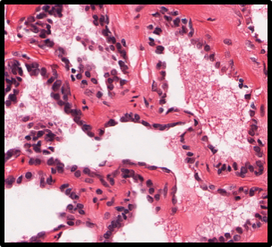
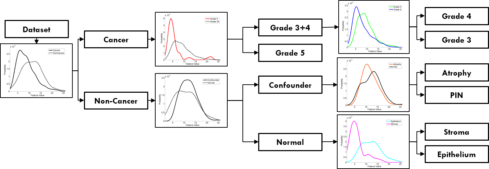
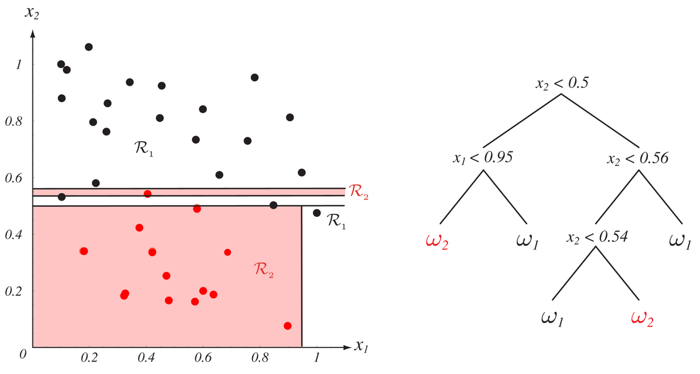

# 
## Definitions of Metrics

## What is a Metric?

Let's say we have a set of points called \$\\mathcal{X}\$.

We define a function called a ***distance function***:

\$\$ d: \\mathcal{X} \\times \\mathcal{X} \\mapsto [0,\\infty) \$\$

This function says that you can take two points in \$\\mathcal{X}\$ and map them to
a point on the number line from 0 to an arbitrarily large number.

## Metric Conditions

We call \$d\$ a ***metric*** if, for all points \$\\mathbf{x,y,z}\\in\\mathcal{X}\$,
ALL of the following conditions are satisified:

**Non-negativity**: Distances cannot be less than
zero.

\$\$d(\\mathbf{x,y}) \\geq 0\$\$

**Identity of Indiscernibles**: If two points have a distance of 0, then they are (effectively) the same point.

\$\$d(\\mathbf{x,y})=0\\iff\\mathbf{x}=\\mathbf{y}\$\$

## Metric Conditions

**Symmetry**: The distance from \$\\mathbf{x}\$ to \$\\mathbf{y}\$ should be
the same as the distance from \$\\mathbf{y}\$ to \$\\mathbf{x}\$

\$\$d(\\mathbf{x,y}) = d(\\mathbf{y,x})\$\$

**Triangle Inequality**: A straight path between two points \$\\mathbf{x}\$
and \$\\mathbf{z}\$ should be the shortest path, compared to a "detour" through
point \$\\mathbf{y}\$)

\$\$d(\\mathbf{x,z}) \\leq d(\\mathbf{x,y}) + d(\\mathbf{y,z})\$\$

## Discrete Metric

\$\$ d(\\mathbf{x,y}) = \\begin{cases}
1 & \\text{if } \\mathbf{x\\neq y}\\\\
0 & \\text{if } \\mathbf{x=y}
\\end{cases}\$\$

## Euclidean Metric

\$ d(\\mathbf{x,y}) = \\sqrt{(x\_{1}-y\_{1})\^{2}+\\cdots+(x\_{d}-y\_{d})\^{2}} \$

## Taxicab Metric:

\$\$ d(\\mathbf{x,y}) = \\sum\_{i=1}\^{d}|x\_{i}-y\_{i}| \$\$

## Illustration of Distances

{width=45%}

## Metric vs. Nonmetric Features

**Metric features** are those which can be:

<ul>
<li class="fragment">Ordered -- One is numerically higher, bigger, or greater than another</li>
<li class="fragment">Distanced -- You can calculate a distance metric between two objects</li>
</ul>

**Nonmetric** or **nominal** features cannot be ordered, and there is no
"distance" between them.

## Metric vs. Nonmetric Features

{width=80%}

{width=80%}

Example: Animal teeth can be small and fine, they can exist in one line or
multiple rows, they can be tusks, and some animals have no teeth.

There is no sense of distance between "tusks" and "beaks".

## Metric vs. Nonmetric Features

Objects in nonmetric features can be represented by **property d-tuples**. 

For example, an animal might
be a \$d\$-tuple characterizing the animal's teeth: (size, type, use). 

Thus, to
describe two different animals:

- walrus = (large, tusk, dominance)
- seal = (small, cusped, chewing)

How do we classify a set of objects represented by tuples?

# 
## Decision Trees

## Elaborate if/than/else Questions

For each object, ask a series of questions to try and identify it.

These can be "yes/no", "true/false", or "value(property)\$\\in\${values}" questions.

<ul>
<li class="fragment">How do we ***choose*** these questions?</li>
<li class="fragment">What is the ***smallest number*** of questions we can ask to reach a conclusion?</li>
<li class="fragment">When can we ***stop*** asking questions; i.e. when have we reached the true label?</li>
<li class="fragment">What is the correct ***order*** in which to ask these questions?</li>
</ul>

## Decision Tree Example

{width=70%}

## Decision Tree Terminology

Links or **branches** correspond to specific values from the node.

Starting from the **root node**, the link is followed to the **descendent
node** based on its value.

Links must be **distinct** and **exhaustive**:

<ul>
<li class="fragment">Only one link can be followed.</li>
<li class="fragment">There must be a link for each possible value</li>
</ul>

When a **leaf** node is reached, there are no more questions and the object is
classified.

## Decision Tree Example and Terminology

{width=100%}

Objects can be represented by their property-value sets:

\$\\mathbf{x}=\${"sweet", "yellow", "thin", "medium"}

**Banana:** is (yellow AND thin), which is all we need to find a leaf for \$\\mathbf{x}\$

## Decision Tree Example and Terminology

{width=100%}

Categories are defined by node paths:

<ul>
<li class="fragment">Apples are: (green AND medium) OR (red AND medium)</li>
<li class="fragment">Apples are also: (medium AND NOT yellow)</li>
</ul>

Easily incorporates knowledge from human experts (assuming the problem is simple
and training set is small).

# 
## Training: Classification and Regression Trees (CART)

## CART Training: Preliminaries

Assume we have training data \$\\mathcal{D}\$ and a pre-determined set of **nodes** or features.

Each node splits the training set into smaller subsets: \$\\mathcal{D} = \\{\\mathcal{D}\_{1}, \\mathcal{D}\_{2}\\}\$.

If all the subsets have the same label, then we can stop splitting because the node is **pure**; otherwise, the node is **impure**.

## CART

This is part of the CART approach (Classification And Regression Trees).

At any node, you can either:

<ul>
<li class="fragment">Declare this node a leaf and stop splitting (Leads to an imperfect result if  the node is impure); or</li>
<li class="fragment">Continue with a different property and grow the tree further.</li>
</ul>

## CART

Six questions arise from this approach:

<ol>
<li class="fragment">How many branches do we extend from a node?</li>
<li class="fragment">Which property is tested at a node?</li>
<li class="fragment">When do we declare a node to a leaf?</li>
<li class="fragment">Can we “prune” a tree to make it smaller?</li>
<li class="fragment">If a node is declared a leaf, and the leaf is impure, what category label should be assigned?</li>
<li class="fragment">How can we handle missing data?</li>
</ol>

# 
## Number of Branches

## Number of Splits at Each Node

The number of branches descending from a node is its **branching factor**, \$B\$.

\$B\$ can be selected by the designer, but any node with \$B>2\$ can be replaced with a series of nodes with \$B=2\$ to make it a **binary tree**.

We will focus on binary trees, which are easier to train and understand. However, \$B>2\$ may be more computationally efficient in practice.

## Non-Binary Splits (\$B\\geq 2\$)

{width=60%}

## Binary Splits (\$B=2\$)

{width=60%}

# 
## Query Selection

## Query Selection and Node Impurity

We call a split a **query**, denoted \$T\$. We want to select our queries such that:

<ul>
<li class="fragment">The overall tree is simple and compact (minimize the overall number of nodes); and</li>
<li class="fragment">The data reaching the immediate descendent nodes should be as ***pure*** as possible.</li>
</ul>

First, ***simplicity***: We should use the fewest number of possible queries.

## Complex Tree (Not Simple or Compact)

{width=60%}

## Simple Tree (Simple and Compact)

{width=60%}

## Node Impurity Definition

When deciding whether to split a node, we should quantify node "impurity".

Define a function \$i(N)\$, which returns some measure of impurity at node \$N\$:

<ul>
<li class="fragment">\$i(N)=0\$: all samples that reach \$N\$ have the same label</li>
<li class="fragment">\$i(N)>>0\$: all classes are equally mixed</li>
</ul>

## Measures of Node Impurity: Entropy

The most common impurity is **Entropy / Information Impurity:**

\$\$ i(N) = - \\sum\_{j}\\widehat{P}(\\omega\_{j})\\log\_{2}{\\widehat{P}(\\omega\_{j})} \$\$

Here, $\\widehat{P}(\\omega\_{j})\$ refers to the fraction of training patterns in category \$\\omega\_{j}\$ at node \$N\$.

## Max and Min of Entropy Impurity

\$\$ i(N) = - \\sum\_{j}\\widehat{P}(\\omega\_{j})\\log\_{2}{\\widehat{P}(\\omega\_{j})} \$\$

Given this, when is \$i(N)\$ at a maximum, and when is it at a minimum?

<ul>
<li class="fragment">Entropy is a measure of ***randomness*** in a sequence.</li>
<li class="fragment">Coin flips are entirely random; the Fibonacci sequence is not random.</li>
</ul>

What are the values of \$\\widehat{P}(\\omega\_{1})\$ and
\$\\widehat{P}(\\omega\_{2})\$, and when are they **most informative** or
**least informative**?

## When is Entropy Impurity Maximum?

If there are two classes, and node \$N\$ contains **equal numbers** of points
from each class, then \$\\widehat{P}(\\omega\_{1}) = \\widehat{P}(\\omega\_{2}) = 0.5\$

\\begin{align}
i(N) &= - \\sum\_{j}\\widehat{P}(\\omega\_{j})\\log\_{2}{\\widehat{P}(\\omega\_{j})}\\\\
&= -\\left[ \\widehat{P}(\\omega\_{1})\\log\_{2}{\\widehat{P}(\\omega\_{1})} + \\widehat{P}(\\omega\_{2})\\log\_{2}{\\widehat{P}(\\omega\_{2})}\\right]\\\\
&= -\\left[ 0.5\\log\_{2}{0.5} + 0.5\\log\_{2}{0.5} \\right]\\\\
&= -\\left[ 0.5(-1) + 0.5(-1) \\right]\\\\
&= 1
\\end{align}

## When is Entropy Impurity Minimum?

If there are two classes, and node \$N\$ contains **only points from one
class**, \$\\omega\_{1}\$, then \$\\widehat{P}(\\omega\_{1}) = 1.0,
\\widehat{P}(\\omega\_{2}) = 0.0\$

\\begin{align}
i(N) &= - \\sum\_{j}\\widehat{P}(\\omega\_{j})\\log\_{2}{\\widehat{P}(\\omega\_{j})}\\\\
&= -\\left[ \\widehat{P}(\\omega\_{1})\\log\_{2}{\\widehat{P}(\\omega\_{1})} + \\widehat{P}(\\omega\_{2})\\log\_{2}{\\widehat{P}(\\omega\_{2})}\\right]\\\\
&= -\\left[ 1.0\\log\_{2}{1.0} \\right]\\\\
&= -\\left[ 1.0(0) \\right]\\\\
&= 0
\\end{align}

## Measures of Node Impurity: Variance (Two-Class)

**Variance Impurity:**

\$\$ i(N) = \\widehat{P}(\\omega\_{1})\\widehat{P}(\\omega\_{2}) \$\$

This is most useful in the two-category case; if the node is pure, then either \$\\widehat{P}(\\omega\_{1})\$ or \$\\widehat{P}(\\omega\_{2})\$ is \$0\$, and therefore \$i(N)=0\$.

## Measures of Node Impurity: Gini (Multi-Class)

***Gini Impurity:***

\$\$ i(N) = \\sum\_{i\\neq j}\\widehat{P}(\\omega\_{i})\\widehat{P}(\\omega\_{j}) = \frac{1}{2}\\left[1-\\sum\_{j}\\widehat{P}\^{2}(\\omega\_{j})\\right]\$\$

This is the extension of Variance Impurity to the multi-class case.

We simply sum over the product of priors of every unique pair of \$\\omega\_{i}\$
and \$\\omega\_{j}\$.

## Measures of Node Impurity: Misclassification

***Misclassification Impurity:***

\$\$ i(N) = 1-\\max\_{j}{\\widehat{P}(\\omega\_{j})} \$\$

This is the minimum probability that a training pattern would be misclassified
at \$N\$.

## Node Impurity as a Function of Classes

{width=80%}

## Selecting a Specific Query to Test

So we have two criteria: a ***simple*** tree that leads to nodes with ***minimum impurity***.

Therefore, given node \$N\$, what split \$s\$ should we use for query \$T\$?

## Selecting a Specific Query to Test

Since we're trying to minimize impurity (i.e. maximize purity) at the descendent nodes, we can calculate the ***impurity gradient***:

\$\$\\Delta i(s) = i(N)-\\widehat{P}_{L}i(N\_{L})-(1 - \\widehat{P}\_{L})i(N\_{R})\$\$

\$N\_{L}, N\_{R}\$ are the left and right descendent nodes and \$i(N\_{L}), i(N\_{R})\$
are their impurities.

\$\\widehat{P}\_{L}\$ is the fraction of patterns / data at node \$N\$ that go to
\$N\_{L}\$ when query \$T\$ is used.

Thus, we seek the split \$s\^{\\star}=\\max\_{s}{\\Delta i(s)}\$.

If we are using entropy impurity, this is equivalent to ***maximizing
information gain***.

## Local vs. Global Query Selection

\$\$ \\Delta i(s) = i(N) - \\widehat{P}\_{L}i(N\_{L}) - (1 - \\widehat{P}\_{L})i(N\_{R}) \$\$

For binary trees, this is a one-dimensional optimization problem.

This is a ***local, greedy*** strategy: we select the optimal \$s\$ at each \$N\$ separately.

This is NOT guaranteed to be ***globally optimal***, and will not necessarily yield a small tree.

However, it is a straightforward method that reaches a solution in a reasonable amount of time.

## Differences in Impurity Functions

The selection of impurity function can affect the selection of a split.

Imagine that at node \$N\$ there are 100 points, 90 of which are from \$\\omega\_{1}\$ and 10 of which are in \$\\omega\_{2}\$.

Now you have to evaluate a proposed split that will create two new nodes (binary
tree), where the left node contains 30 points (20 from \$\\omega\_{1}\$, and 10 from
\$\\omega\_{2}\$), and the right contains 70 points (70 from \$\\omega\_{1}\$, and 0
from \$\\omega\_{2}\$).

What are the ***Misclassification*** and ***Gini*** impurities?

## Differences in Impurity Functions

***Misclassification Impurity***

\\begin{align}
i\_{MI}(N) &= 1 - \\max\_{j}\\widehat{P}(\\omega\_{j})\\\\
 &= 1 - 0.9 = 0.1 \\\\
i\_{MI}(N\_{R}) &= 1 - 1 = 0 \\\\
i\_{MI}(N\_{L}) &= 1 - 0.66 = 0.33 \\\\
\\Delta i\_{MI}(N) &= i(N) - \\widehat{P}\_{L} i(N\_{L}) - (1 - \\widehat{P}\_{L}) i(N\_{R})\\\\
&= 0.1 - 0.3 * 0.3 - (1-0.3) * 0\\\\
&= \\mathbf{0}
\\end{align}

## Differences in Impurity Functions

***Gini Impurity***

\\begin{align}
i\_{GI}(N) &= \frac{1}{2}\\left[1-\\sum\_{j}\\widehat{P}\^{2}(\\omega\_{j})\\right]\\\\
 &= \frac{1}{2}\\left[1 - (0.9\^{2} + 0.1\^{2})\\right] = 0.09 \\\\
i\_{GI}(N\_{R}) &= 0.5 \\left[1 - (1.0\^{2} + 0\^{2})\\right] = 0 \\\\
i\_{GI}(N\_{L}) &= 0.5 \\left[1 - (0.66\^{2} + 0.33\^{2})\\right] = 0.22 \\\\
\\Delta i\_{GI}(N) &= i(N) - \\widehat{P}\_{L} i(N\_{L}) - (1 - \\widehat{P}\_{L}) i(N\_{R})\\\\
&= 0.09 - 0.33 * 0.22 - (1-0.3) * 0\\\\
&= \\mathbf{0.0234}
\\end{align}

## Twoing Criterion for Multiple Classes

The goal in the multiclass case is to identify ***groups*** of the \$c\$ classes.

If our set of categories is
\$\\mathcal{C}=\\{\\omega\_{1},\\omega\_{2},\ldots,\\omega\_{c}\\}\$, we want a split that
creates ***supercategories***
\$\\mathcal{C}\_{1}=\\{\\omega\_{1i},\\omega\_{2i},\ldots,\\omega\_{ik}\\}\$ and
\$\\mathcal{C}\_{2} = \\mathcal{C}-\\mathcal{C}\_{1}\$.

Our impurity criterion is now the ***change*** in impurity: \$\\Delta
i(s,\\mathcal{C}\_{1})\$. Thus, we find the split \$s\^{\ast}(\\mathcal{C}\_{1})\$ that
maximizes the impurity gradient, given \$\\mathcal{C}\_{1}\$.

Then we find the supercategory \$\\mathcal{C}\_{1}\^{\\ast}\$ that maximizes \$\\Delta
i(s\^{\\ast}(\\mathcal{C}\_{1}), \\mathcal{C}\_{1})\$, meaning that we are searching
for both the optimal split AND the optimal supercategories.

***This has many applications in biomedical data!***

## Supercategories in Prostate Cancer

{width=80%}

{width=80%}

{width=80%}

{width=80%}

{width=80%}

{width=80%}

{width=80%}

## Supercategories in Prostate Cancer

{width=90%}

# 
## Stop Splitting

## When to Stop?

What happens if we keep splitting until each leaf only contains one data point?

<ul>
<li class="fragment">We've ***over-trained*** our tree!</li>
<li class="fragment">This is a classifier with ***high complexity*** and ***low generalizability***.</li>
</ul>

## Under-Training Scenario

What happens if we stop splitting our training set too early?

<ul>
<li class="fragment">We've ***under-trained*** our tree!</li>
<li class="fragment">This is a classifier with ***low complexity*** and ***low accuracy***.</li>
</ul>

## When to Stop Splitting

So we need to know how to stop splitting - How should we do this?

<ol>
<li class="fragment">Cross-validation</li>
<li class="fragment">Threshold the impurity gradient</li>
<li class="fragment">Set a global criterion function that measures complexity vs. accuracy</li>
</ol>

## Cross-Validation Criterion

We separate \$\\mathcal{D}\$ into ***training***, \$\\mathcal{D}\_{1}\$, and ***validation***, \$\\mathcal{D}\_{2}=\\mathcal{D}-\\mathcal{D}\_{1}\$.

Use \$\\mathcal{D}\_{1}\$ to build a tree, then evaluate performance with \$\\mathcal{D}\_{2}\$.

Continue splitting the tree until performance peaks on $\\mathcal{D}\_{2}\$.

Consider this method if you have a LOT of training data, and you are reasonably sure that $\\mathcal{D}\_{2}\$ generalizes well to the entire feature space.

## Threshold Impurity

Keep splitting until the best splits do not change the impurity:

\$\$ \\max\_{s}{\\Delta i(s)}\\leq \\beta \$\$

This allows us to use all of \$\\mathcal{D}\$ to train the tree (without splitting off a validation set).

Leaf nodes can exist at different levels in the tree, allowing for varieties of class complexity.

Need to select \$\\beta\$ appropriately?

## Global Criterion Function

To balance accuracy and complexity, we can define an overall ***complexity function*** to minimize:

\$\$ \\alpha \\ast \\left[\\textrm{size}\\right] + \\sum\_{\\textrm{nodes}}i(N) \$\$

where \$\\left[\\textrm{size}\\right]\$ is the number of nodes or links, and \$\\alpha\$ is a positive constant.

We keep splitting the tree until this function is minimized.

If we are using entropy impurity, this is related to the ***minimum description length (MDL)***, which we'll talk about later when we discuss classifier evaluation.

The first term penalizes having too many nodes or links, while the second term penalizes leaf nodes with a high degree of impurity.

Again, we have a ***parameter*** in \$\\alpha\$ that we need to set.

# 
## Pruning Trees

## The Horizon Effect

Building a tree from the ground up requires us to decide whether to split ***at the current node***.

We cannot incorporate information about descendent nodes – the so-called ***horizon effect***.

In ***pruning***, we build an "exhaustive" tree, and try to merge pairs of neighboring leaves together – the inverse of splitting.

Pairs are merged if they yield an acceptable (small) increase in impurity, and the common antecedent node is declared a leaf.

## Pruning Uses All Features

Pruning uses ***all training***, and avoids the horizon effect by working backwards.

For large training sets and complex problems, this can be computationally prohibitive.

For small training sets, pruning is generally preferred, but is ***sensitive to training data***!

## Pruning Sensitivity to Training

{width=90%}

## Example of Pruning and Volatility

{width=90%}

# 
## Classifying a Leaf

## Leaf Class Assignment

This rule is easy:

<ul>
<li class="fragment">A ***pure*** leaf is assigned to the class of all its data points.</li>
<li class="fragment">An ***impure*** leaf is assigned to the ***dominant class***, i.e.  the class that has the most samples at that node.</li>
</ul>

# 
## Missing Attributes

## Missing Attributes

We sometimes encounter ***deficient patterns***, or data points with some during training or classification.

If we throw out the deficient patterns at the start, we end up wasting a lot of valuable data!

## Calculating Splits with Missing Data

For training, we can just ignore the missing attributes.

To handle classification, we can also calculate “surrogate” splits that approximate the primary.

If a pattern is deficient, we use the best split that does not include the missing attributes.

## Missing Attributes

{width=70%}

# 
## Handling Multiple Features

## Combinations of Features

Sometimes it can be more efficient to use linear combinations of features to define splits.

This can help create trees with ***simple decision planes***, which are probably more realistic. It's easy to see this in the two-variable case.

## Combinations of Features: Multivariate Trees

{width=80%}

## Combinations of Features: Multivariate Trees

{width=80%}

# 
## Other Training Methods

## Interactive Dichotomizer 3 (ID3)

ID3: used with nominal / unordered inputs.

Every split has a branching factor \$B\_{j}\$, which is the number of attribute bins of variable \$j\$ used for splitting -- not often binary.

The number of levels is equal to the number of input variables.

The algorithm continues until all nodes are pure, and there are no more variables.

This can be followed up by pruning.

## C4.5

C4.5, a successor to ID3, is a popular method for decision trees.

Improvements to ID3:

<ul>
<li class="fragment">Handles real-valued inputs (like CART)</li>
<li class="fragment">Ignores missing attributes for calculating gain and entropy, and attributes with different costs</li>
<li class="fragment">Employs multi-way splits (like ID3)</li>
<li class="fragment">Uses pruning based on the statistical significance method</li>
</ul>

## Differences Between C4.5 and CART

C4.5 does not pre-compute “surrogate” splits, as in CART.

<li class="fragment">If a node \$N\$ with branching factor \$B\$ requires the missing data during classification, C4.5 will follow EACH of the links down to the \$B\$ leaf nodes.</li>

<li class="fragment">The classification label is based on the labels of the \$B\$ leaf nodes, weighted by the decision probabilities at \$N\$ of the training data.</li>

<li class="fragment">During pruning, C4.5 “collapses” redundant rules from the root node to a leaf.</li>

## Pruning in C4.5

The leftmost leaf in this tree has an associated rule:

**IF:**
\$\$\\begin{bmatrix}
(0.04x\_{1} + 0.16x\_{2} < 0.11)\\\\
\\textrm{AND }(0.27x\_{1}-0.44x\_{2} < -0.02)\\\\
\\textrm{AND }(0.96x\_{1}-1.77x\_{2} < -0.45)\\\\
\\textrm{AND }(5.43x\_{1}-13.33x\_{2} < -6.03)
\\end{bmatrix}\$\$

**THEN:**
\$\$\\mathbf{x}\\in\\omega\_{1}\$\$

{height=80%}

## Pruning in C4.5

This rule can be simplified as:

**IF:**
\$\$\\begin{bmatrix}
(0.04x\_{1} + 0.16x\_{2} < 0.11)\\\\
\\textrm{AND }(5.43x\_{1}-13.33x\_{2} < -6.03)
\\end{bmatrix}\$\$

**THEN:**
\$\$\\mathbf{x}\\in\\omega\_{1}\$\$

Note that unlike the leaf merging strategy of CART, the rule-based method can
collapse nodes near the root.

{height=80%}

# 
## Parting Words

## Advantages of Decision Trees

<ul>
<li class="fragment">Simple to understand and to interpret, and can be visualised</li>
<li class="fragment">Requires little preparation (normalization, cleaning, etc.)</li>
<li class="fragment">Cost of predicting is low</li>
<li class="fragment">Handles both numerical and categorical data</li>
<li class="fragment">Handles multiple classes</li>
</ul>

## Disadvantages of Decision Trees

<ul>
<li class="fragment">Trees can be overly complex and may not generalise well (overfitting)</li>
<li class="fragment">Can be dependent on small variations in the data (brittle)</li>
<li class="fragment">Creating an ***optimal*** tree is computationally difficult</li>
<li class="fragment">Trees can be biased if some classes are very rare</li>
</ul>

## Which Decision Tree is Best?

The general components of decision tree design are:

<ul>
<li class="fragment">Feature processing</li>
<li class="fragment">Impurity measure for deciding on optimal splits</li>
<li class="fragment">Stopping criterion for growing the tree</li>
<li class="fragment">Pruning method</li>
</ul>

Each algorithm has attributes that may be
well-suited to your dataset.

As with everything in ML, you should experiment, see
what works and what doesn't.

Remember that there is no such thing as a
"best" classifier for all situations.

# 
## Next Class

<ul>
<li class="fragment">Extensions of Decision Trees: Randomized Decision Trees</li>
<li class="fragment">Random Forests Algorithm, an early classifier ensemble algorithm</li>
</ul>

# 

## Thank You!
