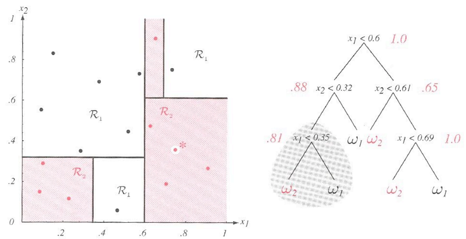
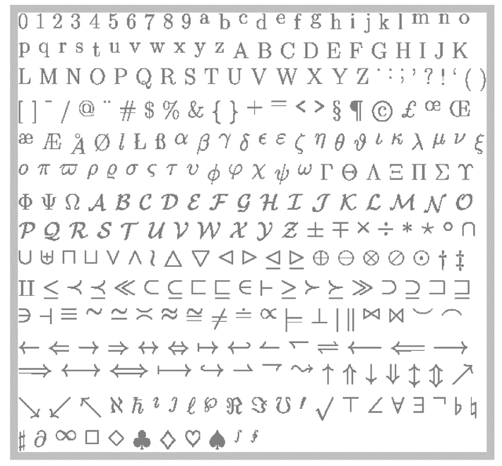

# 
## Problems with Decision Trees

## When Do Decision Trees Perform Badly?

Decision Trees are sensitive to the training set!

<ul>
<li class="fragment">In cases where there are few training samples, the measure of impurity,
splitting, and so on are extremely dependent on just a few data points.</li>
<li class="fragment">This is what we mean when we refer to **variance**.</li>
</ul>

## DTs are Sensitive to Training

{width=90%}

## DTs are Sensitive to Training

{width=90%}

## Decision Trees Rely on Smaller Problems

Decision Trees depend on a **small** number of highly **relevant** features.

<ul>
<li class="fragment">For highly complex datasets that require a large number of attribute:value pairs, the process of growing / splitting / pruning trees can be overly complex.</li>
<li class="fragment">These problems are quite common in biomedical applications, when there could be **thousands** of input variables and **tens of thousands** of training samples.</li>
</ul>

## Example Problem: Character Recognition

{width=90%}

The goal in Amit and Geman's "Shape Quantization" paper was to describe binary glyphs (left) under various deformations using trees.

Each of the training images was broken down into sub-images of \$4\\times 4\$ pixels to create a set of glyph "parts".

At each pixel, there was a binary split: was the pixel black or white?

## Example Problem: Character Recognition

{width=90%}

This image space is obviously very large for all of the glyphs on the previous slide.

Training a single tree to recognize all of these image subtypes is computationally intractable and time-expensive.

How can we deal with these large, complex datasets?

# 
## Classifier Ensembles

Bagging Estimators

## Bootstrap Aggregation (Bagging)

Bootstrap aggregation or "bagging": multiple classifiers are trained on **samples** of the training set.

The classification is some combination (average, weighted average, majority vote, etc.) of each individual classifier's guess.

This **reduces variance** (sensitivity to training data)

## Intuition to Bagging

{width=80%}

Take training \$\\mathcal{D}\$ of size \$n\$ and create \$m\$ new subsets, \$\\mathcal{D}\_{i}\$, each of size \$n\^{\\prime}\$.

## Intuition to Bagging

{width=80%}

Take training \$\\mathcal{D}\$ of size \$n\$ and create \$m\$ new subsets, \$\\mathcal{D}\_{i}\$, each of size \$n\^{\\prime}\$.

These subsets are created by uniformly sampling **with replacement** from \$\\mathcal{D}\$; so a sample may appear in multiple subsets.

Each \$\\mathcal{D}\_{i}\$ is a "bootstrap" sample.

 
## Intuition to Bagging

{width=80%}

We then build \$m\$ classifiers, where the \$i\$-th classifier is trained on bootstrap sample \$\\mathcal{D}\_{i}\$.

The final classification result is some combination of each \$m\$ classifier
outputs (like a vote).

## Intuition to Bagging

Bagging has the greatest benefit on classifiers where the training is **highly dependent** on the specific samples used.

Leo Brieman, who developed the technique, called these "unstable" classifiers.

> "If perturbing the learning set can cause significant changes in the predictor
> constructed, then bagging can improve accuracy."

Reasoning: If you resample the training set (with replacement) over and over again, the small pertubations that cause a large change in the classifier will be "lost" in the aggregated (bagged) classifier.

## How Does Bagging Work? (Technical)

It seems reasonable that if you have a "sensitive" training set, then taking an aggregate of multiple samples (i.e. "trials") will give a more stable answer.

Can we prove this? (Yes, we can.)

## How Does Bagging Work? (Technical)

Our training \$\\mathcal{D}\$ is made up of samples \$(\\mathbf{x}, y)\$ drawn from some underlying distribution which we'll call \$P\$.

The classifier takes both the target feature vector (the one we want to predict a class label for) and the training set: \$\\varphi(\\mathbf{x},\\mathcal{D})\$.

The **aggregated classifier** is the "expected" classifier over the distribution \$P\$:

\$\$\\varphi\_{A}(\\mathbf{x},P)=\\mathcal{E}\_{\\mathcal{D}}\\left[\\varphi(\\mathbf{x},\\mathcal{D})\\right]\$\$

where \$\\mathcal{E}\_{\\mathcal{D}}\$ is the expected classifier over the entire training set \$\\mathcal{D}\$.

In other words: \$\\varphi\_{A}(\\mathbf{x}, P)\$ is the "average" classifier we get from the training distribution; it's the one that's most likely to occur in a single observation of \$P\$.

## How Does Bagging Work? (Technical)

Let's say \$\\mathbf{X}, Y\$ are two random variables where:

<ul>
<li class="fragment">\$\\mathbf{X}\$ is the random variable for the data points</li>
<li class="fragment">\$Y\$ is the variable for the class labels.</li>
</ul>

We can write the expected **error** of the classifier trained on a single training set as the difference between the true labels and the classifier output:

\$\$ e = \\mathcal{E}\_{\\mathcal{D}}\\left[\\mathcal{E}\_{\\mathbf{X},Y}\\left[Y - \\varphi(\\mathbf{X},\\mathcal{D})\\right]\^{2}\\right]\$\$

The error on the **aggregated** classifier is:

\$\$ e\_{A} = \\mathcal{E}\_{\\mathbf{X}, Y}\\left[Y - \\varphi\_{A}(\\mathbf{X},P)\\right]\^{2} \$\$

## How Does Bagging Work? (Technical)

\\begin{align}
e = \\mathcal{E}\_{\\mathcal{D}}\\left[\\mathcal{E}\_{\\mathbf{X},Y}\\left[Y - \\varphi(\\mathbf{X},\\mathcal{D})\\right]\^{2}\\right] && e\_{A} = \\mathcal{E}\_{\\mathbf{X}, Y}\\left[Y - \\varphi\_{A}(\\mathbf{X},P)\\right]\^{2} \\\\
\\textrm{Error of a single, fully-trained classifier} && \\textrm{Error of an aggregate classifier} \\\\
\\end{align}

To show that bagging (training multiple classifiers on subsets of \$\\mathcal{D}\$) reduces classification error versus a single classifier trained only on \$\\mathcal{D}\$, we must show that \$e \\geq e\_{A}\$.

## Sidenote: Variance

Variance is the expected difference between a random variable and its mean, squared.

According to the [Algebraic formula for the variance](https://en.wikipedia.org/wiki/Algebraic\_formula\_for\_the\_variance):

\\begin{align}
\\textrm{Var}\\left[\\mathbf{X}\\right] &= \\mathcal{E}\\left[(\\mathbf{X}-\\mathcal{E}\\left[\\mathbf{X}\\right])\^{2}\\right]\\\\
&= \\mathcal{E}\\left[(\\mathbf{X}\^{2}-2\\mathbf{X}\\mathcal{E}\\left[\\mathbf{X}\\right] + (\\mathcal{E}\\left[\\mathbf{X}\\right])\^{2}\\right]\\\\
&= \\mathcal{E}\\left[\\mathbf{X}\^{2}\\right] - 2\\mathcal{E}\\left[\\mathbf{X}\\right]\\mathcal{E}\\left[\\mathbf{X}\\right] + (\\mathcal{E}\\left[\\mathbf{X}\\right])\^{2}\\\\
&= \\mathcal{E}\\left[\\mathbf{X}\^{2}\\right] - 2(\\mathcal{E}\\left[\\mathbf{X}\\right])\^{2} + (\\mathcal{E}\\left[\\mathbf{X}\\right])\^{2}\\\\
&= \\mathcal{E}\\left[\\mathbf{X}\^{2}\\right] - (\\mathcal{E}\\left[\\mathbf{X}\\right])\^{2} \\\\
\\end{align}

Variance is always greater than or equal to zero. Thus, \$\\mathcal{E}\\left[\\mathbf{X}\^{2}\\right] \\geq
(\\mathcal{E}\\left[\\mathbf{X}\\right])\^{2}\$.

## How Does Bagging Work? (Technical)

Since \$\\mathcal{E}\\left[\\mathbf{X}\^{2}\\right] \\geq (\\mathcal{E}\\left[\\mathbf{X}\\right])\^{2}\$, we can compare the average single-classifier error with the average aggregated-classifier error by treating \$Y-\\varphi(\\cdot)\$ as the random variable:

\\begin{align}
e = \\mathcal{E}\_{\\mathcal{D}}\\left[\\mathcal{E}\_{\\mathbf{X},Y}\\left[Y - \\varphi(\\mathbf{X},\\mathcal{D})\\right]\^{2}\\right] \\sim \\mathcal{E}\\left[\\mathbf{X}\^{2}\\right]\\\\
e\_{A} = \\mathcal{E}\_{\\mathbf{X}, Y}\\left[Y - \\varphi\_{A}(\\mathbf{X},P)\\right]\^{2} \\sim (\\mathcal{E}\\left[\\mathbf{X}\\right])\^{2}
\\end{align}

Thus:

\$\$ e \\geq e\_{A} \$\$

**Takeaway**: The predicted error on a single predictor should always be
greater than or equal to the error on the aggregated predictor.

## When Bagging Does Not Help

There are three situations in which bagging doesn't improve accuracy:

<ol>
<li class="fragment">If changes in \$\\mathcal{D}\$ do not cause a large change in \$\\varphi(\\mathbf{X},\\mathcal{D})\$, then the two sides of the inequality will be nearly equal and performance will be about the same.</li>
<li class="fragment">If the predictor is already close to optimal, then bagging can't improve things any more.</li>
<li class="fragment">If the classifiers are very poor, there's a limit to how much bagging can help.</li>
</ol>

There is actually a crossover point between instability and stability where
bagged classifiers actually do **worse**.

## Stability vs. Instability

{width=60%}

## Randomizing Everything in Random Forests

In addition to collecting bootstrap samples, we can also select random features.

The reasoning is similar: perturbations in the feature space can cause fluctuations in the performance of the classifier, and so by randomizing over the feature sets we can "smooth out" this variance.

In this case we rely on the fact that each feature adds at least **some** descriminatory information to the system.

# 
## Combining Multiple Trees

## Growing a Forest

Suppose we train a group of trees, \$T\_{1}, \\ldots, T\_{N}\$. Our label of classification is now denoted:

\$ \\widehat{Y}\_{A} = \\textrm{arg max}\_c
\\left[P(Y=c|T\_{1},\\ldots,T\_{N})\\right] \$

The probability is conditional upon all of the trees, which is a very difficult parameter set to estimate properly.

For complex problems, estimating the parameters for a classifier like this is computationally intractable.

## Averaging Across Trees

Let \$\\mu\_{T\_{n}}(\\mathbf{x})\$ be the leaf that \$\\mathbf{x}\$ arrives at
when it's evaluated by tree \$T\_{n}\$. 

Then the arithmetic average of the
distributions at the leaves is the average across all of the \$N\$ trees:

\$\$ \\bar{\\mu}(\\mathbf{x}) = \\frac{1}{N}\\sum\_{n=1}\^{N}\\mu\_{T\_{n}}(\\mathbf{x})\$\$

The mode of \$\\bar{\\mu}(\\mathbf{x})\$ is the class assigned to the data point of
\$\\mathbf{x}\$; this allows our new classifier to be:

\$ \\widehat{Y}\_{S} = \\textrm{arg max}\_{c}\\left[\\bar{\\mu}\_{c}\\right] \$

## Assumption for All Ensemble Classifiers

We have to assume that while we are building decently-accurate trees, they are
**minimally correlated**, meaning they make **independent** errors.

If we have a set of trees \$T\_{1},\\ldots,T\_{N}\$ and tree \$T\_{i}\$ makes an error,
that error should be extremely unlikely to appear in any other tree \$T\_{j}\$.

Thus the error is "lost" or averaged out when we calculate our aggregated
classification label.

We will see this idea again in a later lecture on classifier ensembles.

## Experimental Validation

Brieman offers a number of characteristics of Random Forests:

<ol>
<li class="fragment">The accuracy it achieves is comparable to other popular ensemble methods (Adaptive Boosting or AdaBoost was the main competitor at the time)</li>
<li class="fragment">It is relatively robust to noise and outliers</li>
<li class="fragment">It's faster than alternative methods</li>
<li class="fragment">It gives internal measures of error estimates, strength (certainty in classification), correlation, and variable importance</li>
<li class="fragment">It can be easily parallelized</li>
</ol>

## Experimental Validation

{width=45%}

# 
## Parting Words

## Classifier Ensembles

Classifier ensembles are a "meta" topic.

Ensembles can be used with ANY classifier, not just decision trees.

Random Forests (like most classifiers) utilize the "averaging" effect of randomized selection to handle
unstable situations, where the classifier is overly sensitive to the training.

# 
## Next Class

## Next Class

We will look more closely at discriminants and perceptrons - what they are and
how to work with them under various conditions.

This will provide an introduction to a very popular classifier, Support Vector
Machines.

In terms of traditional classifier algorithms, these three - Bayes, Decision
Trees, and SVMs - are the most well-studied.

Everything else is useful under certain situations.

