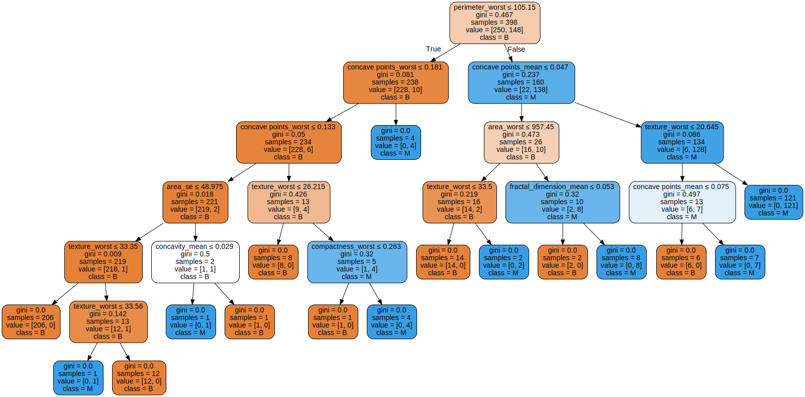
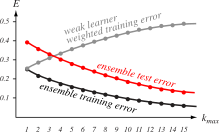
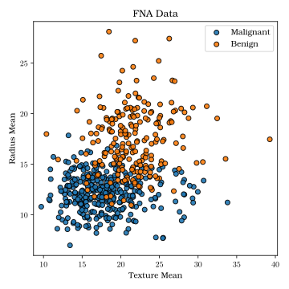
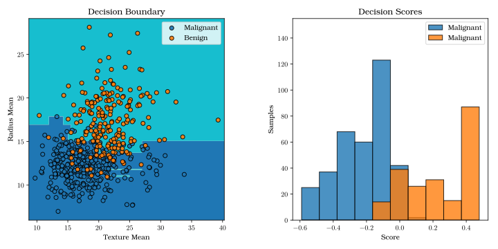
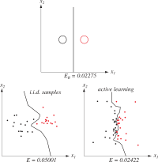
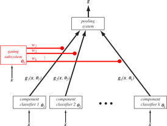
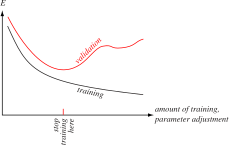
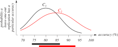
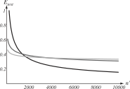
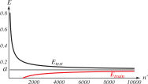

# 
## Recap

## Recap: So Far, Two Approaches to Classification

<iframe frameborder="0" seamless='seamless' scrolling=no src="plots/radius_mean.html"></iframe>

{width=100%}

## Recap: Choosing a Classifier

Good data (descriptive features, low noise, high \$N\$) means that **any classifier
will do a decent job**. 

However, some are more suited to different situations than
others.

**Bayesian Decision Theory**
: Large \$N\$
: Metric (numeric) features
: Probabilistic classification

**Decision Trees**
: Smaller (but still significant!) \$N\$
: Nonmetric (categorical) features
: Binary / All-or-nothing classification (except with Random Forests)

## Recap: Bayesian Decision Theory

Posterior probability:

\$ P(\\omega\_{j}|\\mathbf{x}) = \\frac{p(\\mathbf{x}|\\omega\_{j})P(\\omega\_{j})}{p(\\mathbf{x})}\$

\$ p(\\mathbf{x}) = \\sum\_{j=1}\^{c}p(\\mathbf{x}|\\omega\_{j})P(\\omega\_{j}) \$

## Recap: Bootstrap Aggregation (Bagging)

<ul>
<li class="fragment">Bootstrap aggregation ("bagging"): Multiple classifiers trained on **sub-samples** of training data</li>
<li class="fragment">The classification is some combination (average, weighted average, majority vote, etc.) of each individual classifier's guess</li>
<li class="fragment">This **reduces variance** (sensitivity to training data)</li>
</ul>

## Recap: Bagging

{width=80%}

# 
## Classifier Ensembles

## Bagging

In bagging, training subsets of \$\\mathcal{D}\$ are created by drawing \$n\^{\\prime}<n\$ samples with replacement.

Each **component** classifier casts a "vote" for the classification of a sample point, and the final classification is the result of this vote.

Each component classifier can be the same type, although the learned parameter values may vary (since they are created using different training sets).

This increases the **stability** of the final classifier by averaging over the differences incurred by using different training sets.

## Boosting

In **boosting**, the goal is to increase the **accuracy of the final classifier**.

In this case, we use component classifiers, each of which is the "most informative" out of all possible component classifiers.

So we are less concerned about reducing "noise" or increasing stability; here, we want to combine different aspects of the dataset (represented by classifiers) to reach the right decision.

## Bagging vs. Boosting Example

**Bagging**
: Giving a patient's file to 5 general practice doctors, and getting them to vote on the patient's disease.

**Boosting**
: Getting a pathologist, radiologist, and geneticist to deliberate and decide on the patient's disease.

## Boosting

Two-category problem with three component classifiers: \$C\_{1}, C\_{2}, C\_{3}\$

Each \$C\_{i}\$ is trained on training sets \$\\mathcal{D}\_{1}, \\mathcal{D}\_{2}, \\mathcal{D}\_{3}\$.

We select \$\\mathcal{D}\_{2}\$ such that half of its
samples are **misclassified** by \$C\_{1}\$.

\$\\mathcal{D}\_{3}\$ contains samples where \$C\_{1}\$ and \$C\_{2}\$ disagree.

## Boosting Example

{width=60%}

## Practical Considerations

How should we select samples for \$\\mathcal{D}\_{1}\$?

Ideally, \$n\_{1}\\simeq n\_{2}\\simeq n\_{3} \\simeq \\frac{n}{3}\$.

If the problem is easy, then \$C\_{1}\$ has a very high accuracy, and boosting does not help.

If the problem is hard, then \$C\_{1}\$ performs badly and \$C\_{2}\$ will have too many samples.

Several runs of boosting are required to ensure that all of \$\\mathcal{D}\$ is
used across all component classifiers.

# 
## Adaptive Boosting

## Variations on Boosting

**AdaBoost**: A type of boosting where you design how many "weak learners" (component classifiers) you add to the system.

Each component classifier is trained with data selected according to its
**weight**:

<ul>
<li class="fragment">
A sample misclassified by \$C\_{i}\$ is "hard" to classify: increase weight.
</li>
<li class="fragment">
A sample correctly classified by \$C\_{i}\$ is "easy" to classify: decrease
weight.
</li>
</ul>

Samples with higher weights are **more** likely to be included in \$D\_{i+1}\$.

If the samples and labels in \$\\mathcal{D}\$ are denoted \$\\mathbf{x}\^{i}\$ and \$y\_{i}\$, and \$W\_{k}(i)\$ is the \$k\$th discrete distribution over the training, then the algorithm is...

## Adaptive Boosting

<pre id="hello-world-code" style="display:hidden;">
\begin{algorithm}
\caption{AdaBoost}
\begin{algorithmic}
\INPUT Initialize \$D\$, \$k\_\{max\}\$, \$W\_\{1\}(i)=1/n\$ for \$i=1,...,n\$, \$k = 0\$
\REPEAT
    \STATE \$k=k+1\$
    \STATE Train \$C\_\{k\}\$ by sampling \$D\$ according to \$W\_\{k\}(i)\$
    \STATE \$E\_\{k\}=\$ error of \$C\_\{k\}\$ measured on \$D\$ adjusted by \$W\_\{k\}(i)\$
    \STATE \$a\_\{k\} = 0.5 *\$ ln[\$(1-E\_\{k\})/E\_\{k\}\$]
    \IF{\$h\_\{k\}(x^\{i\})=y\_\{i\}\$ (correct classification)}
        \STATE \$W\_\{k+1\} = W\_\{k\}(i) / Z\_\{k\} * e^\{-a\_\{k\}\}\$
    \ELSE
        \STATE \$W\_\{k+1\} = W\_\{k\}(i) / Z\_\{k\} * e^\{a\_\{k\}\}\$
    \ENDIF
\UNTIL{\$k=k\_\{max\}\$}
\RETURN \$C\_\{k\}\$ and \$a\_\{k\}\$ for \$k=1,...,k\_\{max\}\$ (i.e. the
ensemble and weights)
\end{algorithmic}
\end{algorithm}
</pre>

## Explanation of AdaBoost Algorithm

\$E\_{k}\$ is the error with respect to \$W\_{k}(i)\$; this means that \$0<E\_{k}<1\$.

Thus \$\\alpha\_{k}=\\frac{1}{2}\\ln{\\left[(1-E\_{k})/E\_{k}\\right]}\$ ranges
 from:

<ul>
<li class="fragment">\$-\\infty\$ when \$E\_{k}=1.0\$ to</li>
<li class="fragment">\$0\$ when \$E\_{k}=0.5\$ to</li>
<li class="fragment">\$\\infty\$ when \$E\_{k}=0.0\$</li>
</ul>

## Explanation of AdaBoost Algorithm

If a component classifier has **low error**, then \$\\alpha\_{k}\$ is **high** (positive).

- **Incorrect** samples are adjusted by a **high** amount (\$e\^{\\alpha}\$).
- **Correct** samples are adjusted by a **low amount** (\$e\^{-\\alpha}\$).

Translation: If the classifier is good, then errors are rare and we should try to add them to the training set.

## Explanation of AdaBoost Algorithm

If a component classifier has **high error**, then \$\\alpha\_{k}\$ is **low** (negative).

- **Incorrect** samples are adjusted by a **low** amount (\$e\^{\\alpha}\$).
- **Correct** samples are adjusted by a **high** amount (\$e\^{-\\alpha}\$).

Translation: If the classifier is bad, the correct samples are more valuable, so they are weighted more.

## Alphas and Adjustments

{width=80%}

## Output of AdaBoost and Its Error

The final classification of a point \$\\mathbf{x}\$ is based on a weighted sum of the outputs:

\$ g(\\mathbf{x})=\\left[\\sum\_{k=1}\^{k\_{max}}\\alpha\_{k}h\_{k}(\\mathbf{x})\\right]\$

The magnitude of \$g(\\mathbf{x})\$ is the result of the different weights assigned to the component classifiers (and their signs), while the classification result is simply the sign of \$g(\\mathbf{x})\$.

How should we set our stopping criteria? That is, how many
component classifiers should we collect (\$k\_{max}\$)?

## AdaBoost Error

The training error for \$C\_{k}\$ can be written as \$E\_{k}=1/2-G\_{k}\$ for some \$G\_{k}>0\$ (since we're using a distribution to modulate our training error).

Then the ensemble error is simply the product:

\$ E=\prod\_{k=1}\^{k\_{max}}\\left[2\\sqrt{E\_{k}(1-E\_{k})}\\right]=\prod\_{k=1}\^{k\_{max}}\\sqrt{1-4G\_{k}\^{2}}\$

Thus if we keep increasing \$k\_{max}\$, by adding more component classifiers, our error on the training set should be arbitrarily low!

## Alphas and Adjustments

{width=80%}

## Wait... "Arbitrarily Low"?

"Arbitrarily low" usually means over-training.

However, this doesn't happen often with AdaBoost.

<ul>
<li class="fragment">We rarely get arbitrarily low error on **testing** data, so generalization usually isn't perfect.</li>
<li class="fragment">Our component classifiers **must do better than chance**!</li>
<li class="fragment">Our component classifiers **must be (relatively) independent**!</li>
</ul>

You can't set \$k\_{max}\$ arbitrarily high with all of these conditions.

Nonetheless, AdaBoost is a very powerful algorithm that has been used and modified in a number of different applications.

## Adaboost Example: Sklearn Dataset

{width=50%}

## Adaboost Example: Sklearn Dataset

{width=100%}

## Adaboost Example: FNA Dataset

{width=50%}

## Adaboost Example: FNA Dataset

{width=100%}

# 
## Active Learning

## Learning with Queries / Active Learning

A lot of data is partially-labeled or expensive to label.

We want to maximize label **effectiveness** -- thus we must choose which of the unlabeled samples is
**most informative**.

This is called "learning with queries", "active learning",
"interactive learning", or "cost-based learning".

## Active Learning Types

Two main types of Active Learning:

**Confidence-based**
: A pattern is informative if two discriminant functions are nearly equal: \$g\_{i}(\\mathbf{x})\\approx g\_{j}(\\mathbf{x})\$.

**Voting-based** 
: A pattern is informative if component classifiers "disagree" on the class.

## Alphas and Adjustments

{width=50%}

# 
## Combining Classifiers

## Creating Component Classifiers

AdaBoost provides a way of combining classifiers, but there are others!

These are **mixture-of-expert** models, ensemble, modular, or pooled classifiers.

Assume each output is produced by a **mixture model** of \$k\$ component classifiers.

## Testing and Training Learning Graphs

{width=40%}

Each model has a parameter set \$\\boldsymbol{\\theta}\_{i}\$. 

Each
estimate of the category membership for a sample \$\\mathbf{x}\$ is
\$g\_{ir}(\\mathbf{x})=P(\\omega\_{r}|\\mathbf{x},\\boldsymbol{\\theta}\_{i}**\$.

## Designing a Component Classifier

How do we choose \$k\$?

<ul>
<li class="fragment">Use prior knowledge about the system</li>
<li class="fragment">Use cross-validation to empirically estimate</li>
<li class="fragment">Just over-estimate</li>
</ul>

# 
## Classifier Evaluation

## How Did You Do?

When presenting a classifier, the most basic question is: 

**How good is it?**

There are several ways to answer this question...

## Errors in Classification

Several classifiers (e.g. Bayes) gives a probability: \$p(\\omega\_{i}|\\mathbf{x})\$.

We then **threshold** that probability, based on our risk
assessment. This gives us a "hard" classification label.

## Errors in Classification

<iframe frameborder="0" seamless='seamless' scrolling=no src="plots/pdf_cdf.html"></iframe>

## Confusion Matrix

Assume we have two possible classification outputs (Positive or Negative), and each of those can be right or wrong. This gives us the following table, known as a **Confusion Matrix**.

|                       | **Class: Positive** | **Class: Negative** |
|-----------------------|---------------------|---------------------|
| **Predict: Positive** | True Positive       | False Positive      |
| **Predict: Negative** | False Negative      | True Negative       |

## Evaluation Metrics

From the confusion matrix, you can calculate a lot of **performance metrics**:

Accuracy: \$\\frac{TP+TN}{TP+FP+TN+FN}\$

Precision (Positive Predictive Value, PPV): \$\\frac{TP}{TP + FP}\$ 

Sensitivity (True Positive Rate, TPR): \$\\frac{TP}{TP + FN} = \\frac{TP}{P}\$ 

Specificity (True Negative Rate, TNR): \$\\frac{TN}{TN + FP} = \\frac{TN}{N}\$

Negative Predictive Value (NPV): \$\\frac{TN}{TN + FN}\$

F1 Score: \$\\frac{2TP}{2TP + FP + FN}\$

## Sensitivity and Specificity

How can we quantify the **certainty** of a probabilistic classifier?

By setting our probability threshold, we can maximize sensitivity OR
specificity:

**High Sensitivity:**
: TP is close to P (all positive samples)
: You correctly identified all positive samples
: Maximize by **calling everything positive**

**High Specificity:**
: TN is close to N (all negative samples)
: You correctly identified all negative samples
: Maximize by **calling everything negative**

## Receiver Operating Characteristic Curves

Clearly we need a way to take the probability of classification into account.

The **Receiver Operating Characteristics (ROC)** curve is a plot of the True Positive Rate (Sensitivity)
against the False Positive Rate (1 - Specificity).

The **Area Under the (ROC) Curve** (AUC) is a measurement of how well
the classifier performs in terms of the tradeoff between the two.

## ROC Example

{width=50%}

# 
## Bias and Variance

## Determining Bias and Variance

Bias and variance are unavoidable; it is necessary to compensate for them.

We do this through **resampling**, e.g. in cross-validation.

The goal of these techniques is to determine the **generalization performance**.

## Training vs. Testing

In the simplest form, split \$\\mathcal{D}\$ into two parts: a **training** and **testing** set.

Training set is used to create the classifier (estimate parameters, set
cut-points, etc.)

**After** training is done, evaluate performance on the test set.

## Training vs. Testing

You must be careful about training on your test set! This includes:

<ul>
<li class="fragment">Using your testing data to create model parameters directly; or</li>
<li class="fragment">Training to minimize test error on a **single** test set.</li>
</ul>

## Training vs. Validation vs. Testing

If you have a lot of data you can use a **validation** set, which is used **while** you're training.

This way, you can be sure that you don't even look at your testing data until you are completely done creating your classifier.

## Validation Error vs. Training Error

{width=80%}

## Cross-Validation

**Cross-validation** is useful if your training \$\\mathcal{D}\$ has variance, outliers, or noise. 

You want to measure how your classifier changes based on which samples it trains on.
 

<ul>
<li class="fragment">**High Variance** means that your classifier changes a lot depending on the training data, which means your model may be **overfitting**.</li>
<li class="fragment">**Low Variance** means that your classifier doesn't change much, which is good as long as you ALSO have low bias.</li> 
</ul>

## \$k\$-fold Cross-Validation

Some considerations:

**Class Distribution**
: What should the class distribution look like for each of the \$k\$ subsets? 
: Equal numbers of classes in each subset?
: Match the distribution of the overall dataset?

**Folds**
: What should our \$k\$ be? 
: High \$k\$ means each classifier will be trained on more samples
: Low \$k\$ means we get a larger testing set in each round

## Leave-One-Out Cross-Validation

If we set \$k = |\\mathcal{D}|\$, each testing subset has one sample.

We train on \$|\\mathcal{D}| - 1\$ samples.
 

What are the advantages of this approach? Disadvantages?

## LOO Cross-Validation

**Advantages**
: Trains on as much data as possible -- useful if you don't have much data
: Shows how the model adapts to tiny changes in training

  

**Disadvantages**
: Hard to see outliers affect the model (they are
  grouped with a lot of data)
: May lead to overfitting (the model doesn't change much)

## Estimation of Accuracy

When the "accuracy" of a system is 90%, how sure are we that it's not 89% or 91% or 70% instead?

Accuracy is a statistics, so **it has a distribution**.

## Estimations of Accuracy

We also want to calculate the **mean** and **standard deviation** of our performance metrics.

We can do this through multiple independent runs of cross-validation.

This will give a distribution of performance values, which can be reported.

Think of this as quality assurance!

## Comparing Classifiers Using Jackknife Estimates

{width=80%}

## Predicting Performance from Learning Curves

In practice, \$\\mathcal{D}\$ is far smaller than the (infinite) true dataset.

We can predict eventual accuracy using **learning curves**, which plot test
error against the size of the training set.

These are typically described by a power-law function of the form:

\$ E\_{test} = a + \\frac{b}{n\^{\\prime\\alpha}} \$

\$ E\_{train} = a - \\frac{c}{n\^{\\prime\\beta}} \$

Here, \$a\$ is the error with a theoretically infinite sample size; ideally, it is
equal to the Bayes error (optimum).

## Learning Rate Graph

{width=80%}

## Testing and Training Learning Graphs

{width=80%}

# 
## Parting Words

## Classifier Evaluation is Important!

A lot of papers focus on "benchmark" datasets and evaluating new classifiers against others using a standard set of metrics.

"Is your method better than state-of-the-art (SOTA)?"

**Error is not the only consideration!** In some cases, reducing costs / time / resources may be just as important.

## Train / Test Splits

Bias, variance, and over-training must be accounted for.

Creating train / validation / testing splits is basic, standard practice for machine learning work.

# 
## Next Class

## Linear Discriminants

We will return to a basic classification techniques: **Linear Discriminants**.

These are useful when your data is linearly separable, and is an introduction to more complex methods like **support vector machines**.

These also form the basis for **neural networks**, which we will discuss in the second half of the course.

