# 

## Recap

## Recap: Linear Machines

General form of a linear machine: 

\$ g\_{i}(\\mathbf{x}) = \\mathbf{w}\_{i}\^{T}\\mathbf{x} + w\_{i0} \$

## Geometric Interpretation of Linear Machine

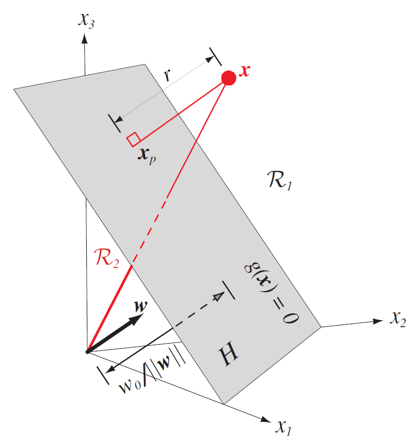{width=40%}

## Higher-dimensional Representations

We can generalize this to a higher-dimensional space by a change of variables:

\\begin{align}
g(\\mathbf{x}) \&= \\sum\_{i=1}\^{\\widehat{d}} a\_{i}y\_{i}(\\mathbf{x}) \\\\
g(\\mathbf{x}) \&= \\mathbf{a}\^{T}\\mathbf{y} \\\\
\\end{align}

where \$\\mathbf{a}\^{T}\$ is a \$\\widehat{d}\$-dimensional weight and \$y\_{i}\$ are
arbitrary functions of \$\\mathbf{x}\$.

## Sidebar: Where Did the Bias Term Go?

We can include the bias term in the discriminant function by setting \$x\_{0} = 1\$:

\$ g(\\mathbf{x}) = w\_{0} + \\sum\_{i=1}\^{d}w\_{i}x\_{i} = \\sum\_{i=0}\^{d}w\_{i}x\_{i} \$

Basically we "absorb" the bias term \$w\_{0}\$ into the weight vector, and then add a dimension to \$\\mathbf{x}\$, so we start the summation from \$0\$ instead of \$1\$.

## Sidebar: Augmented Vectors

This gives us the following mappings, which we call **augmented vectors**:

\$ \\mathbf{y}=
\\begin{bmatrix}
1\\\\
x\_{1}\\\\
\\vdots\\\\
x\_{d}
\\end{bmatrix} =
\\begin{bmatrix}
1\\\\
\\mathbf{x}
\\end{bmatrix}
\\qquad
\\mathbf{a}=
\\begin{bmatrix}
w\_{0}\\\\
w\_{1}\\\\
\\vdots\\\\
w\_{d}
\\end{bmatrix} =
\\begin{bmatrix}
w\_{0}\\\\
\\mathbf{w}
\\end{bmatrix}\$

We reduced the problem of finding a weight vector \$\\mathbf{w}\$ AND a bias weight \$w\_{0}\$ to finding just a single weight vector \$\\mathbf{a}\$.

## Recap: Calculation of a Polynomial Discriminant Function

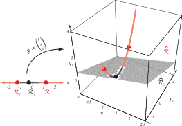{width=100%}

Our discriminant function has the form:

\$g(x) = a\_{1} + a\_{2}x + a\_{3}x\^{2}\$

The discriminant function is characterized by:

\$\\mathbf{y} = (1, x, x\^{2})\^{T}\$

which projects the 1D data from \$x\$ onto the 3D curve in
\$\\mathbf{y}\$-space.

## Recap: How Should We Find \$\\mathbf{a}\$?

We need to find a solution to the set of linear inequalities \$\\mathbf{a}\^{T}\\mathbf{y}\_{i} > 0\$ (or \$\\mathbf{a}\^{T}\\mathbf{y}\_{i} \\geq b\$).

We can define a criterion function \$J(\\mathbf{a})\$ that spits out a number which is minimized when \$\\mathbf{a}\$ is an optimal solution vector.

This is a **scalar function optimization** or **numerical optimization** problem.

# 
## Linearly Separable Cases

## How Do We Find \$\\mathbf{a}\$?

To set up numerical optimization, we need to define our criterion function.

To define our criterion function, let's consider an ideal dataset of **linearly separable** training samples.

## Linearly Separable Cases

Linear discriminant function: \$g(\\mathbf{x}) = \\mathbf{a}\^{T}\\mathbf{y}\$.

Set of \$n\$ training samples: \$\\mathbf{y}, \\ldots, \\mathbf{y}\_{n}\$ labeled either as \$\\omega\_{1}\$ or \$\\omega\_{2}\$.
 

In the binary class case, a sample is correctly classified if:

\$ (\\mathbf{a}\^{T}\\mathbf{y}\_{i} > 0 \\textrm{ and } \\mathbf{y}\_{i} \\textrm{ is labeled } \\omega\_{1}) \\textrm{ or } (\\mathbf{a}\^{T}\\mathbf{y}\_{i} < 0 \\textrm{ and } \\mathbf{y}\_{i} \\textrm{ is labeled } \\omega\_{2}) \$

We need to find the weight vector \$\\mathbf{a}\$ that maximizes our classifier's performance.

If training samples are **linearly separable**, the best classifier is perfect: ALL samples should be correctly classified.
 

## Weight Vector

{width=80%}

Weight vector \$\\mathbf{a}\$ specifies a point in **weight space**, the space of all possible weight vectors.

For a sample \$\\mathbf{y}\_{i}\$, the equation \$\\mathbf{a}\^{T}\\mathbf{y}\_{i} = 0\$ defines a hyperplane through the origin of weight space, with \$\\mathbf{y}\_{i}\$ as a normal vector.

## Weight Vector

{width=80%}

The optimal solution vector is "constrained" by each training sample.

The solution vector lies within the intersection of these half-planes.

## Normalization

There's a trick to finding the optimal weight vector, called **normalization**.

It's mathematically easier to find a weight vector where \$\\mathbf{a}\^{T}\\mathbf{y}\_{i} > 0\$ for **all** samples.

We can do this by simply flipping the signs of \$\\mathbf{y}\$ for one of the classes.
 

Then we looking for a weight vector \$\\mathbf{a}\$ that is on the *positive* side of all possible hyperplanes defined by the training samples.

## Pre-Normalization

{width=100%}

The red dotted line is one of the possible separating hyperplanes.

The solution vector is normal (and positive) to the hyperplane.

The grey region denotes the region of possible solution vectors, which we call the **solution space**.

Note that each of the possible solutions is orthogonal to one of \$\\mathbf{y}\_{i}\$.

## Post-Normalization

{width=100%}

Following "normalization", the sign of the cases labeled \$\\omega\_{2}\$ is
flipped.

Now we have a solution that corresponds to the discriminant function
\$g(\\mathbf{x}) = \\mathbf{a}\^{T}\\mathbf{y}\$.

Again, using what we have so far, the solution vector \$\\mathbf{a}\$ is not unique
-- any vector in the "solution region" is valid.

## Selecting Optimal Solutions

{width=80%}

Which of these solutions is "best"?

The solution vector should **maximize the minimum distance** from training samples to the separating hyperplane.

## Selecting Optimal Solutions

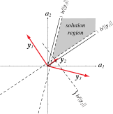{width=80%}

Thus, we want to obtain a solution vector for which:

\$\\mathbf{a}\^{T}\\mathbf{y}\_{i}\\geq b \\text{ for all } i\$

where \$b>0\$ is some **margin** factor.

This is stronger than saying we want \$\\mathbf{a}\^{T}\\mathbf{y}\_{i}\\geq 0\$, since now we have some margin that we're using to "insulate" the decision region with a distance of \$\\frac{b}{||\\mathbf{y}\_{i}||}\$.

## Introducing a Margin Constraint

{width=80%}

{width=80%}

## We Still Need \$\\mathbf{a}\$!

We've defined the criteria for \$\\mathbf{a}\$, but we still need to use numerical optimization to get it.

If there is not a "closed-form" solution (we can't simply "solve for \$\\mathbf{a}\$"), we have to use a kind of hot-and-cold approach.

# 
## Numerical Optimization 

## Numerical Optimization

The basic strategy behind numerical optimization is:

1. You have a cost function (\$J(\\mathbf{a})\$) you want to minimize.
2. You have a (random?) set of parameters that define \$\\mathbf{a}\$.
3. On iteration 1, calculate the cost \$J(\\mathbf{a})\$ for your initial conditions.
4. On the next iteration, "nudge" your parameters and see how \$J(\\mathbf{a})\$ changes.

	- If the cost goes up, go back and try a different "nudge".
	- If the cost goes down, keep "nudging" in the same direction.
	- If the cost is the same, stay where you are.

5. Repeat Step 4 until you reach convergence, where your cost function is barely changing.

## Numerical Optimization Demonstration

Some great examples of numerical optimization can be found here:

*An Interactive Tutorial on Numerical Optimization*:
: [http://www.benfrederickson.com/numerical-optimization/](http://www.benfrederickson.com/numerical-optimization/)
  
## Basic Gradient Descent

{width=100%}

Set \$k=0\$ and initialize \$\\mathbf{a}, \\theta, \\eta\_{k}(\\cdot)\$
<ol>
<li class="fragment">\$k \\leftarrow k+1\$</li>
<li class="fragment">\$\\mathbf{a} \\leftarrow \\eta\_{k}\\Delta
J(\\mathbf{a})\$</li>
<li class="fragment">Repeat 1-2 until \$|\\eta\_{k}\\Delta J(\\mathbf{a})| < \\theta\$</li>
</ol>

## Recap: Questions to Consider for Gradient Descent

Once you dig into the details, there are a number of questions:

1. How far should we "nudge" our parameter set? (Setting the learning rate)
2. What form should our optimization function be?
3. How do we avoid getting stuck in local minima?
4. When should we stop "nudging"? (Identifying convergence)
5. How computationally complex is our algorithm?

# 
## Setting the Learning Rate

## Setting the Learning Rate

The learning rate \$\\eta\$ should be reasonably fast
(i.e. not too small) but will not overshoot (i.e. not too big).

If you know the derivatives of your criterion function \$J(\\cdot)\$, you can
try to calculate the "optimal" learning rate:

\$ \\eta\_{k} = \\frac{||\\Delta J||\^{2}}{\\Delta J\^{T}\\mathbf{H}\\Delta J} \$

where \$\\mathbf{H}\$ is the **Hessian matrix**, which is the matrix of second
partial derivatives of \$J\$.

However, this is rarely so straightforward...

## Setting the Learning Rate: Not Trivial!

{width=50%}

# 
## Form of the Optimization Function

## Choosing a Form for \$J(\\mathbf{a})\$: Piecewise Constant Function

What function should we create for \$J(\\mathbf{a})\$?

Let's say \$J(\\mathbf{a}; \\mathbf{y}\_{1},\\cdots,\\mathbf{y}\_{n})\$ be the number
of misclassified samples.

If \$\\mathbf{a}\$ leads to more misclassifications, this
means a higher value for \$J(\\mathbf{a})\$. If all samples are correctly
classified, then \$J(\\mathbf{a})=0\$.

However, this is difficult to optimize because it's **piecewise constant**: If the number of misclassified samples
doesn't change, then \$\\Delta J(\\mathbf{a}) = 0\$, and we don't go anywhere.

## \$J(\\mathbf{a})\$: Piecewise Constant Function

{width=50%}

## \$J\_{p}(\\mathbf{a})\$: Perceptron Criterion Function

Alternatively, we could use the **Perceptron criterion function**:

\$ J\_{p}(\\mathbf{a}) = \\sum\_{\\mathbf{y}\\in\\mathcal{Y}}(-\\mathbf{a}\^{T}\\mathbf{y}) \$

where \$\\mathcal{Y}\$ is the set of misclassifications due to \$\\mathbf{a}\$.

If \$\\mathcal{Y} = \\emptyset\$ (there are no misclassifications), then
\$J\_{p}(\\mathbf{a}) = 0\$ and we're done.

## \$J\_{p}(\\mathbf{a})\$: Perceptron Criterion Function

\$ J\_{p}(\\mathbf{a}) = \\sum\_{\\mathbf{y}\\in\\mathcal{Y}}(-\\mathbf{a}\^{T}\\mathbf{y}) \$

Remember: We want a
solution vector such that \$\\mathbf{a}\^{T}\\mathbf{y}>0\$ for all samples.

This means that \$\\mathbf{a}\^{T}\\mathbf{y} \\leq 0\$ only if \$\\mathbf{y}\$ is
misclassified; in other words, there are samples in \$\\mathcal{Y}\$.

During optimization, \$J\_{p}(\\mathbf{a})\$ is never negative and is only 0
when \$\\mathbf{a}\$ is a solution vector or on the decision boundary (i.e.
\$\\mathcal{Y}\$ is empty).

Geometrically, this is proportional to the sum of the distances from
misclassified samples to the decision boundary.

## \$J\_{p}(\\mathbf{a})\$: Perceptron Criterion Function

{width=50%}

## Updating \$\\mathbf{a}\$ Using the PCF

To find \$\\Delta J\_{p}\$, we're calculating \$\\frac{\\partial J\_{p}}{\\partial
a\_{j}}\$ for each component in \$\\mathbf{a}\$, so:

\$ \\Delta J\_{p} = \\sum\_{\\mathbf{y}\\in\\mathcal{Y}}(-\\mathbf{y}) \$

So our update rule is now:

\$ \\mathbf{a}\_{k+1} = \\mathbf{a}\_{k} + \\eta\_{k}\\sum\_{\\mathbf{y}\\in\\mathcal{Y}}(\\mathbf{y}) \$

In other words: We add some multiple of the sum of the misclassified samples to
the present weight vector to get the next weight vector.

This is called the **batch Perceptron algorithm** since we can use batches of
samples.

## Batch Perceptron Algorithm

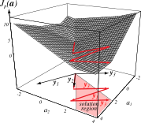{width=100%}

Set \$k=0\$ and initialize \$\\mathbf{a}, \\theta, \\eta\_{k}(\\cdot)\$
<ol>
<li>\$k \\leftarrow k+1\$</li>
<li>\$\\mathbf{a} \\leftarrow \\mathbf{a} + \\eta\_{k}\\sum\_{\\mathbf{y}\\in\\mathcal{Y}\_{k}}(\\mathbf{y})\$</li>
<li>Repeat 1-2 until \$|\\eta\_{k}\\sum\_{\\mathbf{y}\\in\\mathcal{Y}\_{k}}(\\mathbf{y})| < \\theta\$</li>
</ol>

## Batch Perceptron Algorithm

{width=100%}

<ul>
<li class="fragment">Start with \$\\mathbf{a}\_{k}=\\mathbf{0}\$: All three
samples are misclassified, so you add \$\\mathbf{y}\_{1}+\\mathbf{y}\_{2}+\\mathbf{y}\_{3}\$.</li>
<li class="fragment">Then sample \$\\mathbf{y}\_{3}\$ is misclassified, so that is added.</li>
<li class="fragment">Then \$\\mathbf{y}\_{1}\$, and \$\\mathbf{y}\_{3}\$ again.</li>
<li class="fragment">After that, the vector lands in the solution region, so the process ends.</li>
</ul>

## Convergence Properties

To examine whether this process will converge, we look at a few simplifications.

Instead of building a set \$\\mathcal{Y}\$ of all misclassified samples, let's look
at each sample in sequence and modify the weights for each individual
misclassified sample.

We'll assume that learning rate \$\\eta\_{k}\$ is constant for all \$k\$,
a.k.a. the **fixed-increment** case.

To investigate convergence behavior, we simply cycle through the samples
and keep modifying the weight until the algorithm converges.

## Representation of Fixed-Increment

{width=70%}

Set \$k=0\$ and initialize \$\\mathbf{a}\$
<ol>
<li class="fragment">\$k \\leftarrow k+1\$</li>
<li class="fragment">if \$\\mathbf{y}\^{k}\\in\\mathcal{Y}\$ then:</li>
<ul>
<li class="fragment">\$\\mathbf{a}\\leftarrow\\mathbf{a} + \\mathbf{y}\^{k}\$ </li>
</ul>
<li class="fragment">Repeat until \$|\\mathcal{Y}=\\emptyset\$</li>
</ol>

## Representation of Fixed-Increment

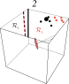{width=70%}

Set \$k=0\$ and initialize \$\\mathbf{a}\$
<ol>
<li>\$k \\leftarrow k+1\$</li>
<li>if \$\\mathbf{y}\^{k}\\in\\mathcal{Y}\$ then:</li>
<ul>
<li>\$\\mathbf{a}\\leftarrow\\mathbf{a} + \\mathbf{y}\^{k}\$ </li>
</ul>
<li>Repeat until \$|\\mathcal{Y}=\\emptyset\$</li>
</ol>

## Representation of Fixed-Increment

{width=70%}

Set \$k=0\$ and initialize \$\\mathbf{a}\$
<ol>
<li>\$k \\leftarrow k+1\$</li>
<li>if \$\\mathbf{y}\^{k}\\in\\mathcal{Y}\$ then:</li>
<ul>
<li>\$\\mathbf{a}\\leftarrow\\mathbf{a} + \\mathbf{y}\^{k}\$ </li>
</ul>
<li>Repeat until \$|\\mathcal{Y}=\\emptyset\$</li>
</ol>

## Representation of Fixed-Increment

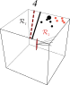{width=70%}

Set \$k=0\$ and initialize \$\\mathbf{a}\$
<ol>
<li>\$k \\leftarrow k+1\$</li>
<li>if \$\\mathbf{y}\^{k}\\in\\mathcal{Y}\$ then:</li>
<ul>
<li>\$\\mathbf{a}\\leftarrow\\mathbf{a} + \\mathbf{y}\^{k}\$ </li>
</ul>
<li>Repeat until \$|\\mathcal{Y}=\\emptyset\$</li>
</ol>

## Representation of Fixed-Increment

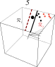{width=70%}

Set \$k=0\$ and initialize \$\\mathbf{a}\$
<ol>
<li>\$k \\leftarrow k+1\$</li>
<li>if \$\\mathbf{y}\^{k}\\in\\mathcal{Y}\$ then:</li>
<ul>
<li>\$\\mathbf{a}\\leftarrow\\mathbf{a} + \\mathbf{y}\^{k}\$ </li>
</ul>
<li>Repeat until \$|\\mathcal{Y}=\\emptyset\$</li>
</ol>

## Representation of Fixed-Increment

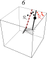{width=70%}

Set \$k=0\$ and initialize \$\\mathbf{a}\$
<ol>
<li>\$k \\leftarrow k+1\$</li>
<li>if \$\\mathbf{y}\^{k}\\in\\mathcal{Y}\$ then:</li>
<ul>
<li>\$\\mathbf{a}\\leftarrow\\mathbf{a} + \\mathbf{y}\^{k}\$ </li>
</ul>
<li>Repeat until \$|\\mathcal{Y}=\\emptyset\$</li>
</ol>

## Representation of Fixed-Increment

{width=70%}

Set \$k=0\$ and initialize \$\\mathbf{a}\$
<ol>
<li>\$k \\leftarrow k+1\$</li>
<li>if \$\\mathbf{y}\^{k}\\in\\mathcal{Y}\$ then:</li>
<ul>
<li>\$\\mathbf{a}\\leftarrow\\mathbf{a} + \\mathbf{y}\^{k}\$ </li>
</ul>
<li>Repeat until \$|\\mathcal{Y}=\\emptyset\$</li>
</ol>

## Representation of Fixed-Increment

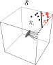{width=70%}

Set \$k=0\$ and initialize \$\\mathbf{a}\$
<ol>
<li>\$k \\leftarrow k+1\$</li>
<li>if \$\\mathbf{y}\^{k}\\in\\mathcal{Y}\$ then:</li>
<ul>
<li>\$\\mathbf{a}\\leftarrow\\mathbf{a} + \\mathbf{y}\^{k}\$ </li>
</ul>
<li>Repeat until \$|\\mathcal{Y}=\\emptyset\$</li>
</ol>

## Representation of Fixed-Increment

{width=70%}

Set \$k=0\$ and initialize \$\\mathbf{a}\$
<ol>
<li>\$k \\leftarrow k+1\$</li>
<li>if \$\\mathbf{y}\^{k}\\in\\mathcal{Y}\$ then:</li>
<ul>
<li>\$\\mathbf{a}\\leftarrow\\mathbf{a} + \\mathbf{y}\^{k}\$ </li>
</ul>
<li>Repeat until \$|\\mathcal{Y}=\\emptyset\$</li>
</ol>

## Fixed-Increment Single-Sample Perceptron

This is a very simple approach which is
guaranteed to move the hyperplane in the correct direction.

Recall that we **assume the samples are linearly separable**; if that is true,
the system will converge.

The speed
with which it converges is dependent on the separation of the samples.

## Variable Increment with Margins

We can add a **variable increment** \$\\eta\_{k}\$ and a **margin** \$b\$, so we
obtain misclassifications whenever the hyperplane fails to exceed the margin and
update a variable amount.

In this case the update rule is:

\$\\begin{array}{cl}
a\_{1} \& \\quad\\text{arbitrary} \\\\
a\_{k+1} = a\_{k} + \\eta\_{k}\\mathbf{y}\^{k} \& \\quad k\\geq 1\\\\
\\end{array}\$

And now \$\\mathbf{a}\_{k}\^{T}\\mathbf{y}\^{k}\\leq b\$ for all \$k\$.

## Variable-Increment Perceptron with Margin

Set \$k=0\$ and initialize \$\\mathbf{a},\\theta,b,\\eta(\\cdot)\$

<ol>
<li>\$k \\leftarrow k+1\$</li>
<li>if \$\\mathbf{a}\^{T}\\mathbf{y}\^{k}\\leq b\$ then:</li>
<ul>
<li>\$\\mathbf{a}\\leftarrow\\mathbf{a} + \\eta\_{k}\\mathbf{y}\^{k}\$ </li>
</ul>
<li>Repeat until \$\\mathbf{a}\^{T}\\mathbf{y}\^{k}>b\$ for all \$k\$</li>
</ol>

## Convergence

We know the samples are linearly separable if:

\$ \\eta\_{k}\\geq 0 \$

\$ \\lim\_{m\\rightarrow\\infty}\\sum\_{k=1}\^{m}\\eta\_{k}=\\infty \$

\$ \\lim\_{m\\rightarrow\\infty}\\frac{\\sum\_{k=1}\^{m}\\eta\_{k}\^{2}}{(\\sum\_{k=1}\^{m}\\eta\_{k})\^{2}} = 0 \$

These conditions are satisfied if \$\\eta\_{k}\$ is a positive constant OR if it
decreases as \$\\frac{1}{k}\$.

Then \$\\mathbf{a}\_{k}\$ converges to a solution vector satisfying
\$\\mathbf{a}\^{T}\\mathbf{y}\_{i} > b\$ for all \$i\$.

# 
## Relaxation Procedures

## Generalization to Other Functions

We specified a Perceptron criterion to be one that is easily optimized.

What if we are dealing with a criterion function for which second-order
optimization is NOT possible?

Then we generalize the minimization approach via **relaxation procedures**.

In addition to \$J\_{p}(\\mathbf{a})\$, we can define a similar criterion:

\$ J\_{q}(\\mathbf{a}) = \\sum\_{\\mathbf{y}\\in\\mathcal{Y}}(\\mathbf{a}\^{T}\\mathbf{y})\^{2} \$

This is the **squared error criterion**.

## \$J\_{q}(\\mathbf{a})\$: Squared Error Criterion

{width=50%}

## Perceptron Criterion vs. Squared Error

{width=100%}

{width=100%}

## Modification of Squared Error Criterion

Both the perceptron criterion and the squared error criterion rely on
misclassified samples.

The gradient of \$J\_{p}(\\mathbf{a})\$ is not smooth, while \$J\_{q}(\\mathbf{a})\$ is,
providing an easier search space.

However, there are still some problems:

<ul>
<li class="fragment">It might converge to a point on the boundary, e.g. \$\\mathbf{a} = \\mathbf{0}\$ (a "degenerate" solution)</li>
<li class="fragment">The value can be dominated by the longest sample vectors (e.g. outliers).</li>
</ul>

To avoid these, we use a modified **batch relaxation with margin** criterion:

\$ J\_{r}(\\mathbf{a}) = \\frac{1}{2} \\sum\_{\\mathbf{y}\\in\\mathcal{Y}} \\frac{(\\mathbf{a}\^{T}\\mathbf{y}-b)\^{2}}{||\\mathbf{y}||\^{2}} \$

## \$J\_{r}(\\mathbf{a})\$: Batch Relaxation with Margin

{width=50%}

## Batch Relaxation with Margin

\$ J\_{r}(\\mathbf{a}) = \\frac{1}{2}\\sum\_{\\mathbf{y}\\in\\mathcal{Y}}\\frac{(\\mathbf{a}\^{T}\\mathbf{y}-b)\^{2}}{||\\mathbf{y}||\^{2}} \$

In this case, \$\\mathcal{Y}\$ is the set of samples for which
\$\\mathbf{a}\^{T}\\mathbf{y} \\leq b\$ (they are misclassified).

\$J\_{r}(\\mathbf{a})\$ is never negative, and is zero only when
\$\\mathbf{a}\^{T}\\mathbf{y} > b\$ (all training samples are correctly classified).

## Batch Relaxation with Margin

The gradient of \$J\_{r}\$ is given by:

\$ \\Delta J\_{r} = \\sum\_{\\mathbf{y}\\in\\mathcal{Y}}\\frac{\\mathbf{a}\^{T}\\mathbf{y} - b}{||\\mathbf{y}||\^{2}}\\mathbf{y}\$

And the update rule is:

\$\\begin{array}{cl}
a\_{1} \& \quad\\text{arbitrary} \\\\
a\_{k+1} = a\_{k} + \\eta\_{k}\\sum\_{\\mathbf{y}\\in\\mathcal{Y}} \\frac{b-\\mathbf{a}\^{T}\\mathbf{y}}{||\\mathbf{y}||\^{2}}\\mathbf{y} \& k\\geq 1 \\\\
\\end{array}\$

## Batch Relaxation with Margin

Each update moves \$\\mathbf{a}\_{k}\$ a fraction, \$\\eta\$, of the distance towards
the hyperplane.

The value of \$\\eta\$ determines how fast we converge:

<ul>
<li class="fragment">If \$\\eta\$ is too small \$(<1)\$, convergence will take needlessly long (under-relaxation)</li>
<li class="fragment">If \$\\eta\$ is too large \$(1<\\eta<2)\$, we will over-shoot the solution (over-relaxation)</li>
</ul>

## Under- and Over-Relaxation

{width=70%}

# 
## Minimum Squared Error

## Sample Usage and Simplifying Equations

So far, we have considered \$\\mathcal{Y}\$, the set of misclassified samples.

However, we want to use ALL samples to train, not just a fraction of them!

Instead of trying to find \$\\mathbf{a}\$ such that \$\\mathbf{a}\^{T}\\mathbf{y}\_{i} >
0\$, we will now try to make \$\\mathbf{a}\^{T}\\mathbf{y}\_{i}=b\_{i}\$, where \$b\_{i}\$
are arbitrary positive constants.

Instead of trying to solve linear **inequalities**, we are now solving linear
**equations** -- which is a better-understood problem.

## Solving Linear Equations

Let's convert to matrix notation. 

Let \$\\mathbf{Y}\$ be the \$n\$-by-\$\\widehat{d}\$
matrix (\$\\widehat{d} = d + 1\$), where the \$i\$-th row is \$\\mathbf{y}\_{i}\^{T}\$.

Also, let \$\\mathbf{b}\$ (the margin vector) be \$(b\_{1}, \\ldots, b\_{n})\^{T}\$.

Then we want to find the weight vector \$\\mathbf{a}\$ such that:

\$\\begin{pmatrix}
y\_{10} \& y\_{11} \& \\cdots \& y\_{1\\widehat{d}}\\\\
\\vdots \& \\vdots \& \\ddots \& \\vdots\\\\
y\_{n0} \& y\_{n1} \& \\cdots \& y\_{n\\widehat{d}}
\\end{pmatrix}
\\begin{pmatrix}
a\_{0}\\\\
a\_{1}\\\\
\\vdots\\\\
a\_{\\widehat{d}}
\\end{pmatrix}=
\\begin{pmatrix}
b\_{1}\\\\
b\_{2}\\\\
\\vdots\\\\
b\_{n}
\\end{pmatrix}\$

\$\\mathbf{Y}\\mathbf{a} = \\mathbf{b}\$

## Minimizing Error

\$ \\mathbf{Y}\\mathbf{a} = \\mathbf{b}\$

We want \$\\mathbf{a}\$, so can't we just divide everything by \$\\mathbf{Y}\$?

Recall that the inverse of a matrix, \$\\mathbf{Y}\^{-1}\$, can only be written for
nonsingular, **square** matrices.

But \$\\mathbf{Y}\$ is an \$n\$-by-\$\\widehat{d}\$ matrix, and \$n\\neq\\widehat{d}\$.

## Minimizing Error

Since we want to solve \$\\mathbf{Y}\\mathbf{a} = \\mathbf{b}\$, the optimal
\$\\mathbf{a}\$ would be the one for which \$\\mathbf{Ya-b=0}\$.

So let's define the **error vector** as:

\$ \\mathbf{e=Ya-b}\$

Now we have a function we can try to minimize!

## Sum-of-Squared-Error Criterion Function

Thus, we have our new criterion function:

\$ J\_{s}(\\mathbf{a}) = ||\\mathbf{Ya-b}||\^{2} = \\sum\_{i=1}\^{n}(\\mathbf{a}\^{T}\\mathbf{y}\_{i}-b\_{i})\^{2} \$

This is the **sum-of-squared-error** criterion, which is a traditional
optimization problem.

As before, we find the gradient as:

\$ \\Delta J\_{s} = \\sum\_{i=1}\^{n} 2 (\\mathbf{a}\^{T}\\mathbf{y}\_{i} - b\_{i})\\mathbf{y}\_{i} = 2\\mathbf{Y}\^{T}(\\mathbf{Ya-b}) \$

When our error function is zero, \$\\mathbf{e=Ya-b=0}\$, which means that both our
criterion and our gradient are zero.

## Sum-of-Squared-Error Criterion Function

Setting \$\\Delta J\_{s}\$ to zero yields the **necessary condition**:

\$ \\mathbf{Y}\^{T}\\mathbf{Ya}=\\mathbf{Y}\^{T}\\mathbf{b} \$

which replaces the original problem and allows us to find \$\\mathbf{a}\$ much more
easily.

## Solving for \$\\mathbf{a}\$

Why is it easier to find \$\\mathbf{a}\$ with \$\\mathbf{Y}\^{T}\\mathbf{Ya} =
\\mathbf{Y}\^{T}\\mathbf{b}\$ versus \$\\mathbf{Ya=b}\$?

The matrix \$\\mathbf{Y}\^{T}\\mathbf{Y}\$ is square and **often** nonsingular.

Thus, we know an inverse matrix \$(\\mathbf{Y}\^{T}\\mathbf{Y})\^{-1}\$ **does**
exist, so we can solve for \$\\mathbf{a}\$:

\\begin{align}
\\mathbf{a} \&= (\\mathbf{Y}\^{T}\\mathbf{Y})\^{-1}\\mathbf{Y}\^{T}\\mathbf{b} \\\\
\\mathbf{a} \&= \\mathbf{Y}\^{\\dagger}\\mathbf{b}
\\end{align}

Here, \$\\mathbf{Y}\^{\\dagger}\$ is an \$n\$-by-\$\\widehat{d}\$ matrix
\$\\mathbf{Y}\^{\\dagger}\\equiv(\\mathbf{Y}\^{T}\\mathbf{Y})\^{-1}\\mathbf{Y}\^{T}\$ called
the **pseudoinverse**. If \$\\mathbf{Y}\$ is square and nonsingular,
\$\\mathbf{Y}\^{\\dagger}\$ coincides with \$\\mathbf{Y}\^{-1}\$.

Thus, a **minimum squared error (MSE)** solution exists, and \$\\mathbf{a} =
\\mathbf{Y}\^{\\dagger}\\mathbf{b}\$ is an MSE solution to \$\\mathbf{Ya=b}\$.

## Some Properties of the MSE Solution

The MSE solution \$\\mathbf{a}=\\mathbf{Y}\^{\dagger}\\mathbf{b}\$ clearly depends on
the margin vector \$\\mathbf{b}\$, which we haven't defined yet. We can actually
choose different \$\\mathbf{b}\$ and get solutions with different properties.

Let's look at an example...

## Example MSE Solution

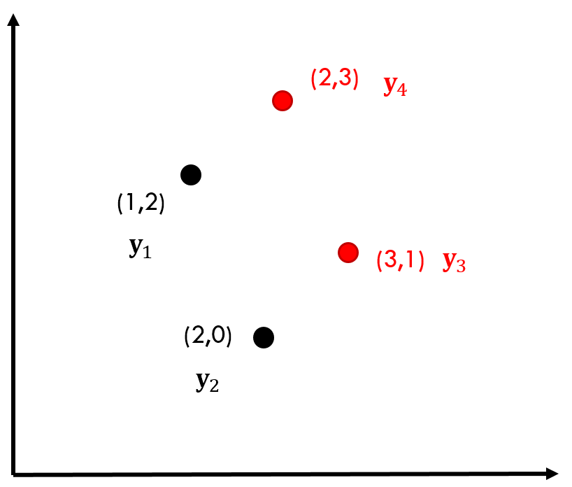{width=100%}

Set up our matrix \$\\mathbf{Y}\$:

\$\\mathbf{Y}=
\\begin{pmatrix}
1  \& 1  \&  2 \\\\
1  \& 2  \&  0 \\\\
-1 \& -3 \& -1 \\\\
-1 \& -2 \& -3
\\end{pmatrix}\$

Class labels (+1 for \$\\omega\_{1}\$, -1 for \$\\omega\_{2}\$)

Solve for the pseudoinverse:

\$\\mathbf{Y}\^{\\dagger}=
\\begin{pmatrix}
\\frac{5}{4} \& \\frac{13}{12} \& \\frac{3}{4} \& \\frac{7}{12} \\\\
-\\frac{1}{2} \& -\\frac{1}{6} \& -\\frac{1}{2} \& -\\frac{1}{6} \\\\
0 \& -\\frac{1}{3} \& 0 \& -\\frac{1}{3}
\\end{pmatrix}\$

## Example MSE Solution

{width=100%}

\$\\mathbf{Y}\^{\\dagger}=
\\begin{pmatrix}
\\frac{5}{4} \& \\frac{13}{12} \& \\frac{3}{4} \& \\frac{7}{12} \\\\
-\\frac{1}{2} \& -\\frac{1}{6} \& -\\frac{1}{2} \& -\\frac{1}{6} \\\\
0 \& -\\frac{1}{3} \& 0 \& -\\frac{1}{3}
\\end{pmatrix}\$

Arbitrarily, we let all margins be equal, i.e. \$\\mathbf{b}=(1,1,1,1)\^{T}\$, so
our solution is:

\$ \\mathbf{a}=\\mathbf{Y}\^{\dagger}\\mathbf{b}=\\left(\\frac{11}{3}, -\\frac{4}{3}, -\\frac{2}{3}\\right)\^{T} \$

This leads to the decision boundary on the left.

## Sometimes We Need Something Else

One of the conditions for computing the pseudoinverse \$\\mathbf{Y}\^{\dagger}\$ are
that the matrix \$\\mathbf{Y}\^{T}\\mathbf{Y}\$ be nonsingular. If it **is**
singular, we can't compute the pseudoinverse.

Also, if we have a lot of training samples (which is common), then computing
\$\\mathbf{Y}\^{T}\\mathbf{Y}\$ is very difficult.

In these cases, we can avoid the pseudoinverse by going back to gradient descent
and using that to obtain our optimized criterion function \$J\_{s}(\\mathbf{a})
= ||\\mathbf{Ya-b}||\^{2}\$.

## Least Mean Squared Procedure

Recall the gradient \$\\Delta J\_{s} = 2 \\mathbf{Y}\^{T}(\\mathbf{Ya-b})\$ and set our
update rule:

\$ \\mathbf{a}\_{k+1} = \\mathbf{a}\_{k} + \\eta\_{k}\\mathbf{Y}\^{T}(\\mathbf{Y}\\mathbf{a}\_{k} - \\mathbf{b}) \$

We can consider samples sequentially and use the **LMS rule**:

\$ \\mathbf{a}\_{k+1} = \\mathbf{a}\_{k} + \\eta\_{k}(b\_{k} - \\mathbf{a}\_{k}\^{T}\\mathbf{y}\^{k})\\mathbf{y}\^{k} \$

## Least Mean Squares Procedure

\$ \\mathbf{a}\_{k+1} = \\mathbf{a}\_{k} + \\eta\_{k}(b\_{k} - \\mathbf{a}\_{k}\^{T}\\mathbf{y}\^{k})\\mathbf{y}\^{k} \$

Compare this with the relaxation rule from before:

\$ \\mathbf{a}\_{k+1} = \\mathbf{a}\_{k} + \\eta \\frac{ b - \\mathbf{a}\_{k}\^{T} \\mathbf{y}\^{k} } { ||\\mathbf{y}\^{k}||\^{2} } \\mathbf{y}\^{k} \$

What are the differences?

<ul>
<li class="fragment">Relaxation is an error-correction rule, so corrections will continue until all samples are classified.</li>
<li class="fragment">LMS is NOT concerned with perfect error-correction, so the hyperplane may NOT separate all the samples perfectly.</li>
<li class="fragment">Thus, LMS can be used when samples are **not linearly separable**.</li>
</ul>

## Minimum Squared Error vs. Least Mean Squares

{width=50%}

# 
## Support Vector Machines

## High-Dimensional Mapping Kernels

Recall how we replaced \$g(\\mathbf{x}) = \\mathbf{w}\^{T}\\mathbf{x} + w\_{0}\$ with
\$g(\\mathbf{x}) = \\mathbf{a}\^{T}\\mathbf{y}\$, where \$\\mathbf{a}\^{T}\$ is a
\$\\widehat{d}\$-dimensional weight vector and the \$\\widehat{d}\$ functions
\$y\_{i}(\\mathbf{x})\$ are arbitrary functions of \$\\mathbf{x}\$.

## Projections to Higher Dimensions

{width=100%}

{width=100%}

## Support Vector Machine Setup

Let's modify the notation a bit, and say that each sample 
\$\\mathbf{x}\_{k}\$ is transformed to \$\\mathbf{y}\_{k}=\\varphi(\\mathbf{x}\_{k})\$,
where \$\\varphi(\\cdot)\$ is a nonlinear mapping into high
dimension.

For each of the \$n\$ patterns, \$k=1,2,\\ldots,n\$, we let \$z\_{k}=\\pm 1\$, where the
sign indicates whether the pattern is in \$\\omega\_{1}\$ or \$\\omega\_{2}\$.

The linear discriminant in this space is:

\$ g(\\mathbf{y}) = \\mathbf{a}\^{T}\\mathbf{y} \$

where the weight and transformed pattern vectors are augmented (\$a\_{0}=w\_{0}\$
and \$y\_{0}=1\$).

## Separating Hyperplane Properties

A separating hyperplane ensures:

\$ z\_{k}g(\\mathbf{y}\_{k}) \\geq 1, k=1,\\ldots,n \$

Remember: the sign of \$g(\\mathbf{y}\_{k})\$ indicates the class. 

For a correctly
classified sample, \$g(\\mathbf{y}\_{k})\$ is positive (and \$z\_{k}=+1\$) if
\$\\mathbf{y}\$ belongs to \$\\omega\_{1}\$, and is negative (and \$z\_{k}=-1\$) if it
belongs to \$\\omega\_{2}\$.

## Maximizing the Margin

Previously, we set the margin to be \$b>0\$ and told our optimization functions to
find any solution within that margin. Now, we want to set the hyperplane such
that we **maximize** \$b\$.

Why does this make sense?

<ul>
<li class="fragment">**Generalization**!</li>
<li class="fragment">Hyperplanes close to the training samples are likely to misclassify subsequent testing data.</li>
</ul>

## Recall the Graphical Situation

{width=40%}

## Distance to the Hyperplane (Margin)

\$ z\_{k}g(\\mathbf{y}\_{k}) \\geq 1, k=1,\\ldots,n \$

The distance from the transformed pattern \$\\mathbf{y}\$ to the hyperplane is
\$\\frac{|g(\\mathbf{y})|}{||\\mathbf{a}||}\$.

The above equation implies:

\$ \\frac{ z\_{k} g(\\mathbf{y}\_{k})} {||\\mathbf{a}||} \\geq b \$

Assuming that a positive margin exists.

## Maximizing the Margin

\$ \\frac{ z\_{k} g(\\mathbf{y}\_{k})} {||\\mathbf{a}||} \\geq b \$

Our goal is to find the vector \$\\mathbf{a}\$ that maximizes \$b\$.

To avoid problems with arbitrary scaling, we add an additional constraint:
\$b||\\mathbf{a}||=1\$, thus forcing us to minimize \$||\\mathbf{a}||\^{2}\$ as
we maximize \$b\$.

## The "Support Vector" Part

**Support vectors** are samples for which the transformed vectors
\$\\mathbf{y}\_{k}\$ represent \$z\_{k}g(\\mathbf{y}\_{k}) = 1\$.

Since our hyperplane satisfies \$z\_{k}g(\\mathbf{y}\_{k}) \\geq 1\$, the support
vectors minimize the numerator above -- they are closest to the hyperplane, and
moreover they are all the same distance away.

This also means that they are the "most interesting" from a training point of
view, and most difficult to classify correctly from a testing point of view.

## Support Vector Machine Diagram

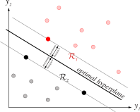{width=50%}

## SVM vs. Perceptron Training

Recall that when we trained the PCF, we looked at randomly misclassified
samples.

In an ideal case, with SVM, we look for the **worst-classified** samples --
the misclassified samples that are farthest away from the current hyperplane,
which constitute our support vectors.

## Selecting Our Kernels

We start out training by deciding on the form of our mapping functions or
**kernel**, \$\\varphi(\\cdot)\$.

Typically these are chosen either by the problem domain, or as arbitrary
polynomials, Gaussians, etc.

The dimensionality of the transformed space may be **arbitrarily high**,
though in practice is limited by computational resources.

## SVM Training

Start by recasting the minimization problem using Lagrange undetermined
multipliers.

From \$\\frac{z\_{k} g(\\mathbf{y}\_{k})}{||\\mathbf{a}||} \\geq b\$, and knowing
that we want to minimize \$||\\mathbf{a}||\$:

\$ L(\\mathbf{a}, \\boldsymbol{\\alpha}) = \\frac{1}{2}||\\mathbf{a}||\^{2} - \\sum\_{k=1}\^{n}\\alpha\_{k}\\left[z\_{k}\\mathbf{a}\^{T}\\mathbf{y}\_{k} - 1\\right] \$

## SVM Training

So we seek to minimize \$L(\\cdot)\$ with respect to \$\\mathbf{a}\$ and maximize it
with respect to the multipliers \$\\alpha\_{k}\\geq 0\$.

We reformulate the problem such that we only need to maximize according to
\$\\mathbf{a}\$:

\$ L(\\mathbf{a}) = \\sum\_{i=1}\^{n}\\alpha\_{k} - \\frac{1}{2}\\sum\_{k,j}\^{n}\\alpha\_{k}\\alpha\_{j}z\_{k}z\_{j}\\mathbf{y}\_{j}\^{T}\\mathbf{y}\_{k} \$

Subject to the constraints: \$\\sum\_{k=1}\^{n}z\_{k}\\alpha\_{k} = 0, \\alpha\_{k}\\geq
0, k=1,\\ldots,n\$

## SVM Example: XOR

{width=100%}

This is the simplest problem that cannot be solved using a linear discriminant.

We can map these to a higher dimension using an expansion up to the second
order:

\$ (1, \\sqrt{2}x\_{1}, \\sqrt{2}x\_{2}, \\sqrt{2}x\_{1}x\_{2}, x\_{1}\^{2}, x\_{2}\^{2}) \$

where \$\\sqrt{2}\$ is chosen for convenient normalization.

Thus we translate each of the points to a six-dimensional space.

## SVM Example: XOR

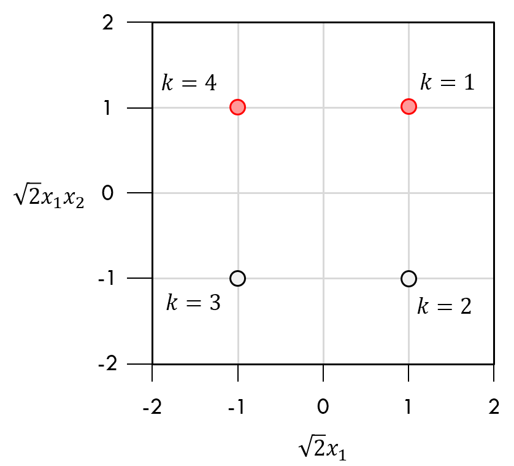{width=100%}

This is a two-dimensional representation of that projection, where we're looking at two out of the six dimensions.

The only thing that changed is the y-axis is now the \$x\_{1}\$ value times the \$x\_{2}\$ value (times \$\\sqrt{2}\$).

<ul>
<li class="fragment">\$\\mathbf{y}\_{1}\$ was at \$(1, 1)\$, so \$x\_{1}x\_{2} = 1\$</li>
<li class="fragment">\$\\mathbf{y}\_{2}\$ was at \$(1,-1)\$, so \$x\_{1}x\_{2} = -1\$</li>
<li class="fragment">\$\\mathbf{y}\_{3}\$ was at \$(-1,1)\$, so \$x\_{1}x\_{2} = -1\$</li>
<li class="fragment">\$\\mathbf{y}\_{4}\$ was at \$(-1,-1)\$, so \$x\_{1}x\_{2} = 1\$</li>
</ul>

## SVM Example: XOR

{width=100%}

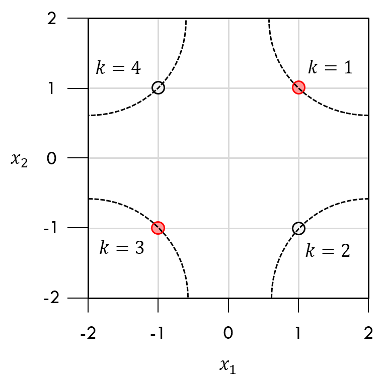{width=100%}

# 
## Summary

## Linear Discriminant Functions

This is a huge topic, but it provides a very solid foundation for decision
theory.

If your samples are linearly separable, you can very easily create a hyperplane
that achieves perfect classification.

Try to select your features such that you have a very good separation between
your training classes - this makes classification trivial!

For small problems, you can develop an analytic solution where you use the
pseudoinverse to calculate your weight vectors directly.

For larger problems, select an appropriate criterion function and solve using
gradient descent.

## What Was Covered?

Different cost functions to minimize:

- Perceptron Criterion: \$J\_{p}\$
- Squared Error Criterion: \$J\_{q}\$
- Batch Relaxation: \$J\_{r}\$

## What Was Covered?

How to "nudge" your parameter set:

- Iteration-based: \$\\eta\_{k} = \\frac{||\\Delta J||\^{2}}{\\Delta
  J\^{T}\\mathbf{H}\\Delta J}\$
- Constant: If \$J\$ is quadratic everywhere, then \$\\eta\_{k}\$ is the same for all
  \$k\$.
- Batches: Update \$\\mathbf{a}\$ using "batches" of misclassified samples.
- Relaxation: \$\\eta\_{k}\\sum\_{\\mathbf{y}\\in\\mathcal{Y}}
  \\frac{b-\\mathbf{a}\^{T}\\mathbf{y}}{||\\mathbf{y}||\^{2}}\\mathbf{y}\$

## What Was Covered?

When to stop your algorithm?

- Threshold: Stop when \$\\Delta J(\\mathbf{a}) < \\theta\$, where you choose \$\\theta\$.
- Batch Sample: Stop when \$\\mathcal{Y}=\emptyset\$, where \$\\mathcal{Y}\$ is the set of misclassified samples.
- Margin: Stop when \$\\mathbf{a}\^{T}\\mathbf{y}\^{k} > b\$.

## Support Vector Machines

For complex problems, you can transform your features into a high-dimensional
space and try to find a linearly separable set of dimensions for classification.

You must choose your mapping functions appropriately.

If you have non-convex solution regions, you may need to choose a different
classification method altogether.

# 
## Next Class

## Parameter Estimation

We will return to the world of Bayes and Gaussian distributions.

How do we estimate the values of the parameters we need from our training data?

<ul>
<li class="fragment">**Maximum Likelihood Parameter Estimation**, which assumes the parameters are fixed quantities that we just don't know.</li>
<li class="fragment">**Bayesian Parameter Estimation**, which assumes the parameters are random variables drawn from some kind of distribution.</li>
</ul>

You can use these methods in a large number of fields, not just for
classification -- this is a general statistical technique for investigating the
structure of your data!

