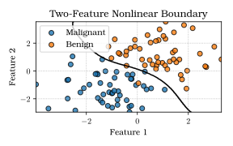
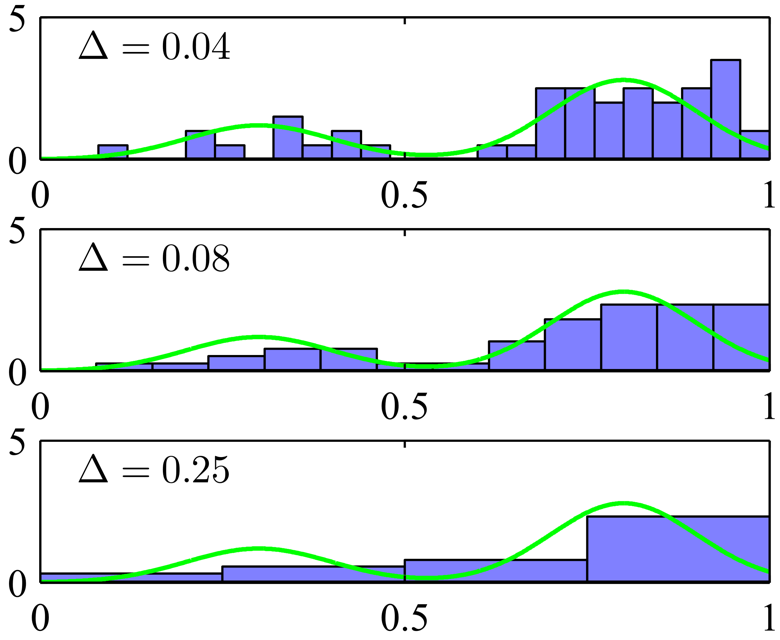
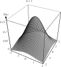
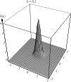
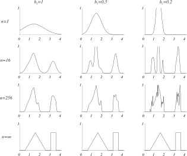
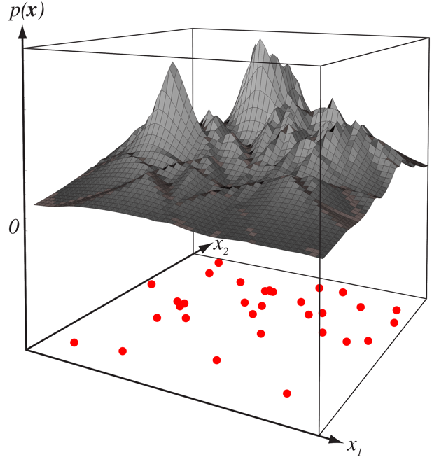
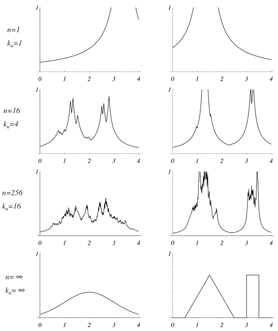
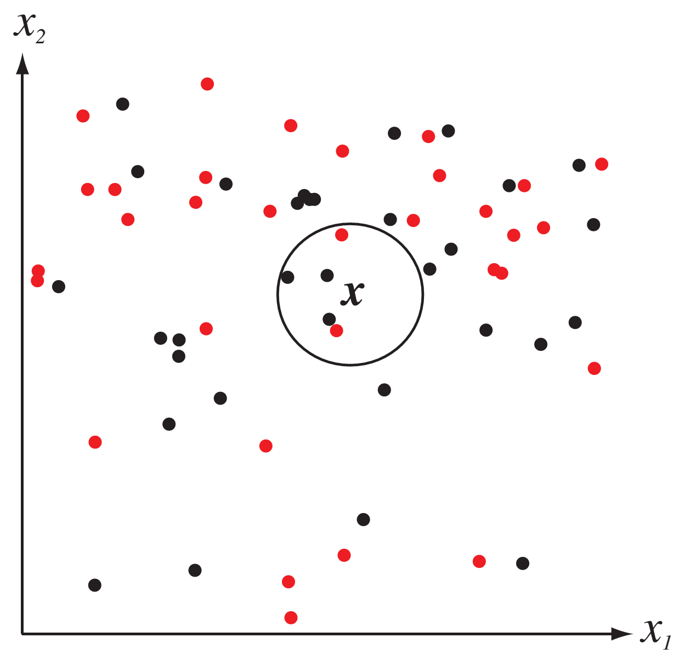
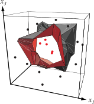

# 
## Recap

## Recap: Parameter Estimation Foundations

Core assertion in model-building and parameter estimation: Values of a random variable are observed according to a known probability law.

"Randomness" refers to the **unpredictable variations** in an observed value.

These variations can occur with a specific, pre-determined likelihood -- the **probability law**.

## Recap: Parameter Estimation Foundations

The probability law (i.e. distribution) is **known** or assumed. 

This distribution governs the general pattern of observed variations.

We can estimate the parameters of the distribution (denoted \$\\boldsymbol{\\theta}\$).

## Recap: Relating Data to a Model

{width=100%}

<ul>
<li class="fragment">Collect samples of the random variable.</li>
<li class="fragment">Decide on a model (typically Gaussian).</li>
<li class="fragment">Identify the parameter set (if Gaussian, \$\\boldsymbol{\\theta}=(\\mu, \\Sigma)\$).</li>
<li class="fragment">Finally, we assume that samples in \$\\mathcal{D}\_{i}\$ give no information about \$\\boldsymbol{\\theta}\_{j}\$ if \$i\\neq j\$.</li>
<li class="fragment">Thus our task is to estimate a total of \$c\$ parameter sets \$\\boldsymbol{\\theta}\_{i}\$, \$i\\in\\{1,\\ldots,c\\}\$.</li>
</ul>

## Recap: Two Approaches to Parameter Estimation

**Maximum Likelihood Estimation (MLE)**

- \$\\boldsymbol{\\theta}\_{i}\$ is a set of fixed, unknown quantities that we are trying to discover.
- The estimated values are those that maximize the probability of observing our training data.

**Bayesian Estimation (BAY)**

- \$\\boldsymbol{\\theta}\_{i}\$ is a set of random variables, each with a known prior distribution.
- Training data observations turn these priors into posterior densities.
- More training "sharpens" the density near the true values of the parameters
-- this is known as **Bayesian Learning**

## Recap: MLE vs. BAY

<ul>
<li class="fragment">**Computational Efficiency**: MLE is simpler</li>
<li class="fragment">**Interpretability**: MLE yields single values, BAY yields a distribution</li>
<li class="fragment">**Model Confidence**: MLE relies on a good model, BAY explicitly accounts for uncertainty</li>
<li class="fragment">**Bias-Variance**: MLE can correct for bias-variance, BAY handles the tradeoff through  uncertainty</li>
<li class="fragment">**Overall**: MLE is simpler, BAY uses more information</li>
</ul>

## Recap: BAY Estimation Tied to Sample Size

Our sample-size-dependent estimation of parameters:

\\begin{align}
\\mu\_{n} \&= \\left( \\frac{n\\sigma\_{0}\^{2}}{n\\sigma\_{0}\^{2} + \\sigma\^{2}} \\right) \\widehat{\\mu}\_{n} + \\frac{ \\sigma\^{2} }{ n\\sigma\_{0}\^{2} + \\sigma\^{2} } \\mu\_{0} \\\\
\\sigma\_{n}\^{2} \&= \\frac{ \\sigma\_{0}\^{2} \\sigma\^{2} }{ n\\sigma\_{0}\^{2} +
\\sigma\^{2} }
\\end{align}

If \$\\sigma\_{n}\^{2}\$ is our "uncertainty", as \$n \\rightarrow \\infty\$, our
uncertainty goes towards zero: More samples means less uncertainty.

If \$\\mu\_{n}\$ is our "best guess", as \$n \\rightarrow \\infty\$, it is a linear
combination of \$\\widehat{\\mu}\_{n}\$ (the sample mean) and \$\\mu\_{0}\$ (our best
prior guess for \$\\mu\$).

As long as \$\\sigma\_{0}\^{2} \\neq 0\$, then \$\\mu\_{n}\$ approaches the sample mean as
\$n \\rightarrow \\infty\$.

# 
## Nonparametric Introduction

## Check Our Assumptions

The core assumption for parametric techniques relies on a known parameterized probability law.

What if we have **no idea** what model governs our sample values, or if our model is a poor match for our samples?

In other words, we either have **no model** or a **poorly fit model**.

We will examine a few nonparametric techniques, where we assume essentially "arbitrary distributions" (those without a form) or unknown distributions.

## Histogram Methods

{width=100%}

Recall our training: \$\\mathcal{D} = \\{x\_{1}, \\ldots, x\_{N}\\}\$.

Our goal is to model \$p(x)\$ from \$\\mathcal{D}\$.

In a nonparametric setting, we can choose a bin size, \$\\Delta\_{i}\$, and count
the number of points falling into bin \$i\$.

To convert into a normalized density, divide by the total number of observations
\$N\$ and the width \$\\Delta\_{i}\$:

\$p\_{i} = \\frac{ n\_{i} }{ N\\Delta\_{i} } \$

Hence, the model for the density is constant over each bin (typically all
\$\\Delta\_{i}\$ are equal).

## Histograms By Width

{width=100%}

- Green: True density (Gaussians)
- Purple: Randomly-observed values

Choosing a bin width that is too small (top) or too large (bottom) give
inaccurate representations.

**It's hard to select \$\\Delta\$ properly.**

Remember: \$N\$ is often small, and we don't know the real distribution.

## Histogram Methods

We can continuously estimate \$p(x)\$ as we collect training.

Binning introduces discontinuities at the edges of the bin, and scales poorly as the dimensionality increases.

Thus we should do the following:

<ul>
<li class="fragment">Break the feature domain into "regions", and  consider sample observations within some "neighborhood".</li>
<li class="fragment">Choose a "bin width" or smoothness parameter to accurately represent the feature density.</li>
</ul>

The process of calculating the density across a region is known as **density estimation**.

# 
## Density Estimation

## General Density Estimation

Just as we did with the histograms, we assume that our sample values fall within
some region \$\\mathcal{R}\$; the probability that a point falls within
\$\\mathcal{R}\$ is:

\$ P = \\int\_{\\mathcal{R}} p(\\mathbf{x}\^{\\prime}) d\\mathbf{x}\^{\\prime} \$

If we observe \$n\$ samples, then the probability that \$k\$ fall within
\$\\mathcal{R}\$ is given by the **binomial distribution**:

\$ P\_{k} = {n \\choose k} P\^{k} (1 - P)\^{n - k}, \\qquad {n \\choose k} = \\frac{ n! }{ k!(n - k)!} \$

And the expected value of \$k\$ is thus:

\$ \\mathcal{E}[k] = nP \$

## General Density Estimation

{width=100%}

\$P\_{k}\$ peaks sharply around the mean, so we expect that \$k/n\$ is a pretty good
estimate of \$P\$.

This estimate gets more and more accurate as \$n\$ increases (i.e. as we observe
more samples).

## General Density Estimation

{width=100%}

If we assume that \$p(\\mathbf{x})\$ is continuous and \$\\mathcal{R}\$ is really small so \$p(\\mathbf{x})\$ does not vary appreciably within it, then we have:

\$ \\int\_{\\mathcal{R}} p(\\mathbf{x}\^{\\prime}) d\\mathbf{x}\^{\\prime} \\simeq p(\\mathbf{x})V \$

\$V\$ is the volume enclosed by \$\\mathcal{R}\$.

## Pratical Concerns

We combine the previous equations to get:

\$ p(\\mathbf{x}) \\simeq \\frac{ k/n }{ V } \$

However, this leaves some problems.

We said that \$\\mathcal{R}\$ is small, so \$p(\\mathbf{x})\$ doesn't vary, but it
should be large enough that the number of points falling inside it yields a
sharply peaked binomial.

We can fix the volume \$V\$ and increase the number of training samples, but this
will only yield an estimate of the space-averaged density \$P/V\$ (we want the
actual \$P\$).

Also, since \$V\$ is the space enclosed by \$\\mathcal{R}\$, if it is TOO small, then
no points will fall inside it and we'll end up with \$p(\\mathbf{x}) \\simeq 0\$.

## Getting Around our Limitations

So let's start by assuming we have an infinite number of samples.

To estimate the density at \$\\mathbf{x}\$, first form a sequence of regions
\$\\mathcal{R}\_{1}, \\mathcal{R}\_{2}, \\ldots\$ where \$\\mathcal{R}\_{1}\$ contains 1
sample, \$\\mathcal{R}\_{2}\$ contains two, and so on.

We can write \$V\_{n}\$ as the volume of \$\\mathcal{R}\_{n}\$, and \$k\_{n}\$ is the
number of samples falling in \$\\mathcal{R}\_{n}\$:

\$ p\_{n}(\\mathbf{x}) = \\frac{ k\_{n} / n }{ V\_{n} } = \\frac{ k\_{n}  }{ nV\_{n} } \$

As \$n \\rightarrow \\infty\$, we want \$p\_{n}(\\mathbf{x})\$ (the density dependent on
our sample size) to converge to \$p(\\mathbf{x})\$ (the true density around
\$\\mathbf{x}\$).

For this to happen, we must satisfy a few conditions as \$n \\rightarrow \\infty\$.

## Convergence Requirements

\$ p\_{n}(\\mathbf{x}) = \\frac{ k\_{n} }{ nV\_{n} } \$

Here are our conditions:

<ul>
<li class="fragment">\$\\lim\_{n\\rightarrow\\infty} V\_{n} = 0\$ ensures the space-averaged \$P/V\$ will converge to \$p(\\mathbf{x})\$.</li>
<li class="fragment">\$\\lim\_{n\\rightarrow\\infty} k\_{n} = \\infty\$ ensures that the frequency ratio will converge to \$P\$, e.g. that the binomial distribution will be sufficiently peaked.</li>
<li class="fragment">\$\\lim\_{n\\rightarrow\\infty} k\_{n} / n = 0\$ is required for \$p\_{n}(\\mathbf{x})\$ to converge at all; by specifying that as \$n\\rightarrow\\infty\$, the region \$\\mathcal{R}\_{n}\$ will get a large amount of samples, but they form a very small fraction of the overall number of samples.</li>
</ul>

## Two Methods for Convergence

So how do we build a region that specifies these conditions?

**Parzen Windows**: Shrink a region by specifying volume \$V\_{n}\$ as a function
of \$n\$, such as \$V\_{n} = 1/\\sqrt{n}\$. Then, we'll show that \$p\_{n}(\\mathbf{x})\$
converges to \$p(\\mathbf{x})\$.

**K-Nearest Neighbor**: Specify \$k\_{n}\$ as a function of \$n\$, such as \$k\_{n} =
\\sqrt{n}\$. Then, the volume \$V\_{n}\$ is grown until it encloses \$k\_{n}\$ neighbors
of \$\\mathbf{x}\$.

Both of these methods converge (of course, as \$n\\rightarrow\\infty\$).

## Two Methods for Convergence

{width=100%}

# 
## Parzen Windows

## Parzen Windows

Let's start by assuming the region \$\\mathcal{R}\$ is a \$d\$-dimensional hypercube,
with \$h\_{n}\$ being the length of an edge. Thus the volume is given by:

\$ V\_{n} = h\_{n}\^{d} \$

We can obtain an analytic expression for \$k\_{n}\$, the number of samples falling
in the hypercube, by defining a **window function**:

\$ \\varphi(\\mathbf{u}) =
\\begin{cases}
1 \& \\quad |u\_{j}| \\leq 1/2 \\quad \\forall j \\\\
0 \& \\quad \\text{otherwise}
\\end{cases} \$

This function defines a unit hypercube centered at the origin.

## Window Function

\$ \\varphi(\\mathbf{u}) =
\\begin{cases}
1 \& \\quad |u\_{j}| \\leq 1/2 \\quad \\forall j \\\\
0 \& \\quad \\text{otherwise}
\\end{cases} \$

We can see that if \$\\mathbf{u} = (\\mathbf{x} - \\mathbf{x}\_{i})/h\_{n}\$, then
\$\\varphi(\\mathbf{u})\$ is equal to 1 if \$\\mathbf{x}\_{i}\$ falls within the
hypercube of volume \$V\_{n}\$ centered at \$\\mathbf{x}\$, and is zero otherwise.

The number of samples in the hypercube is given by:

\$ k\_{n} = \\sum\_{i=1}\^{n} \\varphi\\left(\\frac{\\mathbf{x} - \\mathbf{x}\_{i}}{ h\_{n} } \\right) \$

Recall that \$p\_{n}(\\mathbf{x}) = \\frac{ k\_{n} }{ nV\_{n} }\$, so we get:

\$ p\_{n}(\\mathbf{x}) = \\frac{ 1 }{ n } \\sum\_{i=1}\^{n} \\frac{ 1 }{ V\_{n} } \\varphi \\left( \\frac{ \\mathbf{x} - \\mathbf{x}\_{i} }{ h\_{n} } \\right) \$

## Probability Estimate

\$ p\_{n}(\\mathbf{x}) = \\frac{ 1 }{ n } \\sum\_{i=1}\^{n} \\frac{ 1 }{ V\_{n} } \\varphi \\left( \\frac{ \\mathbf{x} - \\mathbf{x}\_{i} }{ h\_{n} } \\right) \$

We can make \$\\varphi\$ -- the **Parzen window** function -- to be any function
of \$\\mathbf{x}\$, controlling how to weight samples in \$\\mathcal{D}\$ to determine
\$p(\\mathbf{x})\$ at a specific \$\\mathbf{x}\$.

The equation for \$p\_{n}(\\mathbf{x})\$ is an **average of functions** of
\$\\mathbf{x}\$ and \$\\mathbf{x}\_{i}\$.

Thus the **window function** is being used for **interpolation**.

We can ensure the density is "regular" (non-negative, sums to 1) by the
conditions:

\$ \\varphi(\\mathbf{x}) \\geq 0 \$

\$ \\int \\varphi(\\mathbf{u}) d\\mathbf{u} = 1 \$

## Effect of Window Width

As before, we must consider the effect of the window width \$h\_{n}\$ on
\$p\_{n}(\\mathbf{x})\$.

Define the function:

\$ \\delta\_{n}(\\mathbf{x}) = \\frac{ 1 }{ V\_{n} } \\varphi\\left(\\frac{ \\mathbf{x} }{ h\_{n} } \\right) \$

Substituting this into our equation for the density, we get:

\$ p\_{n}(\\mathbf{x}) = \\frac{ 1 }{ n } \\sum\_{i=1}\^{n} \\delta\_{n}( \\mathbf{x} - \\mathbf{x}\_{i} ) \$

Since \$V\_{n} = h\_{n}\^{d}\$, the width \$h\_{n}\$ clearly affects both the amplitude
and the width of \$\\delta\_{n}(\\mathbf{x})\$.

## Effect of Window Width

{width=100%}

## Effect of Window Width

{width=100%}

## Effect of Window Width

{width=70%}

The relationship between \$h\_{n}\$ and the amplitude of \$\\delta\_{n}\$ is inverse.

If \$h\_{n}\$ is large, then the amplitude of \$\\delta\_{n}\$ is small, and
\$\\mathbf{x}\$ must be far from \$\\mathbf{x}\_{i}\$ before \$\\delta\_{n}( \\mathbf{x} -
\\mathbf{x}\_{i})\$ deviates from \$\\delta\_{n}(\\mathbf{0})\$.

If \$h\_{n}\$ is small, then the peak value of \$\\delta\_{n}(\\mathbf{x} -
\\mathbf{x}\_{i})\$ is large and occurs close to \$\\mathbf{x} = \\mathbf{x}\_{i}\$
(i.e. \$\\delta\_{n}(\\mathbf{0})\$).

## Effect of Window Width

{width=70%}

The relationship between \$h\_{n}\$ and the amplitude of \$\\delta\_{n}\$ is inverse.

If \$h\_{n}\$ is large, then the amplitude of \$\\delta\_{n}\$ is small, and
\$\\mathbf{x}\$ must be far from \$\\mathbf{x}\_{i}\$ before \$\\delta\_{n}( \\mathbf{x} -
\\mathbf{x}\_{i})\$ deviates from \$\\delta\_{n}(\\mathbf{0})\$.

If \$h\_{n}\$ is small, then the peak value of \$\\delta\_{n}(\\mathbf{x} -
\\mathbf{x}\_{i})\$ is large and occurs close to \$\\mathbf{x} = \\mathbf{x}\_{i}\$
(i.e. \$\\delta\_{n}(\\mathbf{0})\$).

## Effect of Window Width

For any value of \$h\_{n}\$, the distribution is normalized:

\$ \\int \\delta\_{n}(\\mathbf{x} - \\mathbf{x}\_{i}) d\\mathbf{x} = \\int \\frac{ 1 }{ V\_{n} } \\varphi\\left( \\frac{ \\mathbf{x} - \\mathbf{x}\_{i} }{ h\_{n} } \\right) d\\mathbf{x} = \\int \\varphi(\\mathbf{u})d\\mathbf{u} = 1 \$

This means that as \$h\_{n}\$ gets smaller and smaller, \$\\delta\_{n}(\\mathbf{x} -
\\mathbf{x}\_{i})\$ approaches a Dirac delta function centered at \$\\mathbf{x}\_{i}\$,
and \$p\_{n}(\\mathbf{x})\$ approaches a superposition of deltas centered at the
samples.

When that happens, you'll need more and more samples to approximate the true
distribution of \$p(\\mathbf{x})\$!

## Revisiting the Gaussian

{width=50%}

## Multimodal Distribution Estimation

{width=50%}

## Classification Using Parzen Windows

{width=80%}

<ul>
<li>We can estimate the densities for each class and classify a test point by assigning it to the class with the maximum posterior.</li>
<li class="fragment">The Parzen window-based classifier depends heavily on the form of the kernel function.</li>
<li class="fragment">The error can be made arbitrarily low by selecting a tiny \$h\_{n}\$, but what does this lead to?</li>
</ul>

## Classification Using Parzen Windows

{width=80%}

<ul>
<li>We can estimate the densities for each class and classify a test point by assigning it to the class with the maximum posterior.</li>
<li>The Parzen window-based classifier depends heavily on the form of the kernel function.</li>
<li>The error can be made arbitrarily low by selecting a tiny \$h\_{n}\$, but what does this lead to?</li>
</ul>

## Summary of Parzen Windows

If you get confused about the densities, think in terms of building a histogram.

You want to know how many samples fall within each range of x-values.

You have to choose the bin width parameter to properly reveal the underlying
distribution.

Having more samples will lead you to a better estimation of the density; an
infinite number of samples will lead to a perfect estimation (convergence).

This is a simple method, but without much else to go on, it may give you a good
way of looking at your data.

# 
## K-Nearest Neighbors

## Second Method for Convergence

{width=100%}

**K-Nearest Neighbor**: Specify \$k\_{n}\$ as a function of \$n\$, such as \$k\_{n} =
\\sqrt{n}\$. Then, the volume \$V\_{n}\$ is grown until it encloses \$k\_{n}\$ neighbors
of \$\\mathbf{x}\$.

## Limitation of Parzen Windows

Selecting the window size is typically done \\textit{ad hoc}.

Instead of picking a window size and then seeing how the data fits, why not use the training data to dictate the size of the window?

K-NN allows the window size to be a function of observed samples:

<ul>
<li class="fragment">Center the window on \$\\mathbf{x}\$</li>
<li class="fragment">Let the window grow until it captures \$k\_{n}\$ nearby samples, where \$k\_{n}\$ is a function of \$n\$.</li>
<li class="fragment">The samples within the window are the \$k\_{n}\$ "nearest neighbors" of \$\\mathbf{x}\$.</li>
</ul>

If density is high, then the window is small -- high resolution.

If density is low, then the window is large (but stops at an appropriate size).

## K-Nearest Neighbors

\$ p\_{n}(\\mathbf{x}) = \\frac{ k\_{n} }{ nV\_{n} } \$

Recall our convergence discussion from last time...

We want \$\\lim\_{n\\rightarrow\\infty}{k\_{n}} = \\infty\$, assuring that \$k\_{n}/n\$ will estimate \$p\_{n}(\\mathbf{x})\$.

We also want \$\\lim\_{n\\rightarrow\\infty}{k\_{n}/n} = 0\$, ensuring \$k\_{n}\$ grows more slowly than \$n\$.

These conditions ensure that \$p\_{n}(\\mathbf{x})\$ converges to \$p(\\mathbf{x})\$.

## Examples of K-NN Densities

{width=50%}

## Examples of K-NN Densities

{width=40%}

## K-NN Estimation from a Single Sample

If \$n=1\$ and \$k\_{n} = \\sqrt{n} = 1\$, our estimate becomes:

\$ p\_{n}(\\mathbf{x}) = \\frac{ 1 }{ 2 |x - x\_{1}|}  \$

This diverges (as opposed to converging) to infinity -- so it's a poor estimate of \$p(\\mathbf{x})\$.

However, the density never reaches 0 in the finite-sample case, because instead of defining the density by some arbitrary window, we define it by the nearest possible values of the random variable (which is always nonzero).

Since \$n\$ never actually reaches infinity, this is an okay tradeoff in most scenarios.

## K-Nearest Neighbor Estimates

{width=45%}

## Limitations of K-NN

We saw in Parzen windows we had to choose the width carefully so that we generalized well without overfitting.

Here, we select \$k\_{n}\$, e.g. the number of neighbors we use to grow the region to reach.

When training is limited, \$k\_{n}\$ can drastically alter the form of the density.

As with everything else, the choice of \$k\_{n}\$ is done based on what gives the best results (which can be evaluated in terms of classifier accuracy).

# 
## Classification using K-NN

## Estimation of A Posteriori Probabilities

We can directly estimate the posterior probabilities \$P(\\omega\_{i} | \\mathbf{x})\$ from a set of \$n\$ labeled samples by using them to estimate the densities.

Suppose we place a window of volume \$V\$ around \$\\mathbf{x}\$ and capture \$k\$ samples, \$k\_{i}\$ of which are labeled \$\\omega\_{i}\$.

Then we estimate the joint probability \$p(\\mathbf{x}, \\omega\_{i})\$ as:

\$ p\_{n}(\\mathbf{x}, \\omega\_{i}) = \\frac{ k\_{i}/n }{ V } = \\frac{ k\_{i} }{ nV } \$

And so we use Bayes law to get the estimate for \$P(\\omega\_{i} | \\mathbf{x} )\$:

\$ P\_{n}( \\omega\_{i} | \\mathbf{x} ) = \\frac{ p\_{n}(\\mathbf{x}, \\omega\_{i}) }{ \\sum\_{j=1}\^{c} p\_{n}(\\mathbf{x}, \\omega\_{j} ) } = \\frac{ k\_{i} }{ k } \$

## Classification Using K-NN

{width=70%}

\$ P\_{n}(\\omega\_{i} | \\mathbf{x} ) = \\frac{ p\_{n}(\\mathbf{x}, \\omega\_{i}) }{ \\sum\_{j=1}\^{c} p\_{n}(\\mathbf{x}, \\omega\_{j}) } = \\frac{ k\_{i} }{ k } \$

Thus, the probability that we observe \$\\omega\_{i}\$ given \$\\mathbf{x}\$ is simply
the fraction of randomly-observed samples within the neighborhood of
\$\\mathbf{x}\$ that are labeled \$\\omega\_{i}\$.

## Classification Using K-NN

{width=45%}

## Classification Using K-NN

{width=35%}

# 
## Parting Words

## K-NN For Density Estimation

k-NN is a conceptually simple method: it says that samples are likely to belong
to the class of other samples that are nearby.

While technically it is a density estimation method, k-NN is often used to skip
straight to performing classification.

I'm sparing you some details about convergence and proof of the error bounds,
because they typically follow from the discussion about convergence with Parzen
Windows.

The book has the details if you're interested.

# 
## Next Class

## Supervised vs. Unsupervised Classification

So far, we have assumed that we knew the labels associated with our samples:
\$\\mathcal{D}\_{1}\$ contains samples from \$\\omega\_{1}\$, and so on.

Obviously, this is not always (or even usually) the case.

If we just have a cloud of points, how do we decide how to best cluster and
classify points?

The next class, we will discuss clustering, expectation maximization, and some
methods for unsupervised classification.

