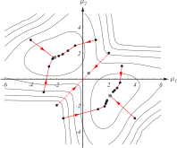
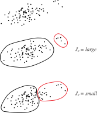

# 
## Recap

## Recap: Why Use Unlabeled Data?

<ul>
<li>Samples are cheap to collect, costly to label.</li>
<li class="fragment">Clustering gives you a free(ish) look at the structure of your data.</li>
<li class="fragment">Clustering does not preclude performing hands-on labeling later.</li>
<li class="fragment">Unsupervised methods adapt to new trends in the data over time.</li>
<li class="fragment">Some methods learn features as well as class labels.</li>
</ul>

## Recap: Component Densities and Mixing Parameters

\$p(\\mathbf{x}|\\boldsymbol{\\theta})=\\sum\_{j=1}\^{c}p(\\mathbf{x}|\\omega\_{j},\\boldsymbol{\\theta}\_{j})P(\\omega\_{j})\$

In this form, \$p(\\mathbf{x}|\\boldsymbol{\\theta})\$ is known as a **mixture
density**.

Conditional densities \$p(\\mathbf{x}|\\omega\_{j},\\boldsymbol{\\theta\_{j}})\$ are the
**component densities**.

Priors \$P(\\omega\_{j})\$ are the **mixing parameters**.

## Recap: Component Densities and Mixing Parameters

{ width=80% }

## Recap: Component Densities and Mixing Parameters

{ width=80% }

## Recap: Normal Mixtures and Additional Assumptions

We've already assumed we know the form of each mixture density (namely, they
are Gaussian).

There are four parameters that we may not know:

<ul>
<li class="fragment">\$\\boldsymbol{\\mu}\_{i}\$, the multivariate mean;</li>
<li class="fragment">\$\\boldsymbol{\\Sigma}\_{i}\$, the covariance matrix;</li>
<li class="fragment">\$P(\\omega\_{i})\$, the prior probability; and</li>
<li class="fragment">\$c\$, the total number of classes.</li>
</ul>

We CAN evaluate the system if we don't know anything.

## Recap: Estimating our Parameter Sets for Clustering

Our strategy for finding \$c\$ and \$P(\\omega\_{i})\$ is simply to estimate them from
the domain (similar to how we estimate \$P(\\omega\_{i})\$ in the Bayesian case).

\$c\$ can be optimized by looking at the clustering criteria (later in this
lecture).

Typically (as in Bayes), we select non-informative \$P(\\omega\_{i})\$ -- what
happens if we select unequal priors?

## Recap: Unequal Prior Values

{width=80%}

## Recap: Unequal Prior Values

{ width=80% }

## Recap: MLE: Estimating \$\\boldsymbol{\\theta}\_{i}\$

For \$\\boldsymbol{\\mu}\_{i}\$ and \$\\boldsymbol{\\Sigma}\_{i}\$, we find the derivative
of our mixture likelihoods with respect to the parameters, set equal to zero,
and iteratively find the **most likely** parameter set that would give us
our training data.

If our mixture density is this:

\$p(\\mathbf{x}|\\boldsymbol{\\theta})=\\sum\_{j=1}\^{c}p(\\mathbf{x}|\\omega\_{j},\\boldsymbol{\\theta}\_{j})P(\\omega\_{j})\$

And we assume that each \$p(\\mathbf{x}|\\omega\_{j},\\boldsymbol{\\theta}\_{j})\$ is
Gaussian, then we can differentiate the natural logarithm with respect to each
parameter in turn and calculate the maximum likelihood estimate.

## Recap: MLE: Solving for \$\\boldsymbol{\\Sigma}\$

There's a lot of tricky math and derivations, but at the end of the day we can get an estimate for \$\\hat{P}(\\omega\_{i}|\\mathbf{x}\_{k},\\hat{\\boldsymbol{\\theta}})\$:

\$\\require{color}
\\hat{P}(\\omega\_{i}|\\mathbf{x}\_{k},\\hat{\\boldsymbol{\\theta}}) = \\frac{ |\\boldsymbol{\\hat{\\Sigma}}_{i}|\^{-\\frac{1}{2}}\\exp\\left[-\\frac{1}{2}
\\colorbox{lightblue}{\$(\\mathbf{x}\_{k}-\\hat{\\boldsymbol{\\mu}}\_{i})\^{T}\\hat{\\boldsymbol{\\Sigma}}\_{i}\^{-1}(\\mathbf{x}\_{k}-\\hat{\\boldsymbol{\\mu}}\_{i})\$}
\\right]\\hat{P}(\\omega\_{i})}{\\sum\_{j=1}\^{c}|\\hat{\\boldsymbol{\\Sigma}}\_{j}|\^{-\\frac{1}{2}}\\exp\\left[-\\frac{1}{2}(\\mathbf{x}\_{k}-\\hat{\\boldsymbol{\\mu}}\_{j})\^{T}\\hat{\\boldsymbol{\\Sigma}}\_{j}\^{-1}(\\mathbf{x}\_{k}-\\hat{\\boldsymbol{\\mu}}\_{j})\\right]\\hat{P}(\\omega\_{j})}\$

With this long, ugly thing, we can estimate the likelihood that a point \$\\mathbf{x}\_{k}\$ belongs to \$\\omega\_{i}\$.

Simple explanation: if the squared Mahalanobis distance, \$\\colorbox{lightblue}{\$(\\mathbf{x}\_{k}-\\hat{\\boldsymbol{\\mu}}\_{i})\^{T}\\hat{\\boldsymbol{\\Sigma}}\_{i}\^{-1}(\\mathbf{x}\_{k}-\\hat{\\boldsymbol{\\mu}}\_{i})\$}\$, is small, then \$\\hat{P}(\\omega\_{i}|\\mathbf{x}\_{k},\\hat{\\boldsymbol{\\theta}})\$ is large.

## Recap: \$k\$-Means Clustering

If we replace the Mahalanobis with the squared Euclidean distance
\$\|\\mathbf{x}\_{k}-\\hat{\\boldsymbol{\\mu}}\_{i}\|\^{2}\$, we can find the mean
\$\\hat{\\boldsymbol{\\mu}}\_{m}\$ nearest to \$\\mathbf{x}\_{k}\$.

Thus we can approximate
\$\\hat{P}(\\omega\_{i}|\\mathbf{x}\_{k},\\hat{\\boldsymbol{\\theta}})\$ as:

\$ \\hat{P}(\\omega\_{i}|\\mathbf{x}\_{k},\\hat{\\boldsymbol{\\theta}}) \\simeq
\\begin{cases}
1 \& \\quad \\textrm{if }i=m \\\\
0 \& \\quad \\textrm{otherwise.} \\\\
\\end{cases}\$

Then we can plug this into the equation we got before and solve for
\$\\hat{\\boldsymbol{\\mu}}\_{1},\\cdots,\\hat{\\boldsymbol{\\mu}}\_{c}\$.

We can "initialize" by selecting \$c\$ class centroids at random from the
unlabeled data, and then iterating.

## Recap: \$k\$-Means In Sample Space

{width=80%}

## Recap: \$k\$-Means In Sample Space

{width=80%}

## Recap: \$k\$-Means In Sample Space

{width=80%}

## Recap: \$k\$-Means Hill-climbing

{width=80%}

## Recap: Comparing MLE and \$k\$-Means

{width=80%}

{width=80%}

Comparison of MLE and \$k\$-Means. Since the overlap between the components is
relatively small, we arrive at basically the same answers for \$\\mu\_{1}\$ and
\$\\mu\_{2}\$.

## Recap: \$k\$-Means Summary

\$k\$-Means is a staple of unsupervised clustering methods.

It is simple and fast.

When does it fail?

<ul>
<li class="fragment">If we are wrong about the number of clusters, we will converge on parameters that don't "mean" anything.</li>
<li class="fragment">If the clusters are too close to one another, there may not be enough samples to properly "ascend" to the true value of \$\\mu\$.</li>
</ul>

Remember: **everything** is dependent on your features!

# 
## Data Description and Clustering

## How Well Did We Cluster?

\$k\$-Means finds the parameters \$\\boldsymbol{\\theta}\$ of the underlying processes that control our samples.

**Clusters** and **Classes** are NOT synonymous!

<ul>
<li class="fragment">Some classes are multi-modal: "Atypical" nuclei can be too small OR too large.</li>
<li class="fragment">Some features are bad: If \$\\boldsymbol{\\theta}\_{1} \\approx \\boldsymbol{\\theta}\_{2}\$, the feature cannot distinguish \$\\omega\_{1}\$ and \$\\omega\_{2}\$.</li>
</ul>

## Examples of Misleading Parameters

{width=80%}

## Identifying the "True" Clusters

{width=40%}

## Clustering vs. Classification

{width=100%}

<ul>
<li>A class is a label that **you** decide on, and is not necessarily synonymous with clusters.</li>
<li class="fragment">If we don't have class labels, we **cannot** say that \$\\mathcal{R}\_{1}\$ on the left is the same decision region as \$\\mathcal{R}\_{1}\$ on the right.</li>
</ul>

## Illustration of Clustering Methods

{width=70%}

## The First Major Issue: Defining Similarity

Unlabeled samples rely **completely** on their descriptive features.

We need to quantitatively say that samples in one cluster are "more similar" to each other than they are to samples in another cluster.

This is a **similarity metric**.

## Distance as Inverse Similarity

**Distance** may represent the inverse of **similarity**: High distance = low similarity

In Euclidean space, \$\\mathbf{x}\_{a}\$ is **more similar** to \$\\mathbf{x}\_{b}\$ than \$\\mathbf{x}\_{c}\$ if \$\|\\mathbf{x}\_{a}-\\mathbf{x}\_{b}\|\^{2}<\|\\mathbf{x}\_{a}-\\mathbf{x}\_{c}\|\^{2}\$.

We can cluster points by setting a threshold \$d\_{0}\$, where two points \$\\mathbf{x}\_{a}\$ and \$\\mathbf{x}\_{b}\$ belong to the same cluster if \$\|\\mathbf{x}\_{a}-\\mathbf{x}\_{b}\|\^{2} < d\_{0}\$.

## Examples of Distance Thresholding: High Threshold

{width=100%}

{width=100%}

{width=100%}

## Choosing a Similarity Metric

**Discrete Metric:**

\$ d(\\mathbf{x,y}) = \\begin{cases}
1 \& \\text{if } \\mathbf{x\\neq y}\\\\
0 \& \\text{if } \\mathbf{x=y}\\\\
\\end{cases}\$

**Euclidean Metric:**

\$ d(\\mathbf{x,y}) = \\sqrt{(x\_{1}-y\_{1})\^{2}+\\cdots+(x\_{d}-y\_{d})\^{2}} \$

**Taxicab Metric:**

\$ d(\\mathbf{x,y}) = \\sum\_{i=1}\^{d}|x\_{i}-y\_{i}| \$

## Illustration of Distances

{width=45%}

## Choosing a Similarity Metric: Invariance to Transforms

Euclidean distance is a good first choice:

\$ D(\\mathbf{x},\\mathbf{x}\^{\\prime}) = \\sqrt{\\sum\_{k=1}\^{d}(x\_{k} - x\_{k}\^{\\prime})\^{2}} \$

<ul>
<li class="fragment">**Isotropy**: distances in all dimensions must be equivalent.</li>
<li class="fragment">**Smoothness**: distances in all feature ranges are equivalent.</li>
<li class="fragment">**Linearity**: data should be observed throughout the feature space.</li>
</ul>

Euclidean distance is robust to rigid transformations of the feature space
(rotation and translation), but are NOT robust to **arbitrary linear
transformations** which distort distance relationships.

## Rotation's Effect on Cluster Groupings

{width=40%}

## Alternative Distance Metrics

We generalize from the Euclidean to the **Minkowski** metric:

\$ D(\\mathbf{x},\\mathbf{x}\^{\\prime})=\\left( \\sum\_{k=1}\^{d}|x\_{k}-x\_{k}\^{\\prime}|\^{q}\\right)\^{\\frac{1}{q}} \$

If \$q=2\$, then this is Euclidean; if \$q=1\$, this is the **city block** metric.

You can also look at **Mahalanobis** distance,
\$(\\mathbf{x}-\\mathbf{x}\^{\\prime})\^{T}\\Sigma\^{-1}(\\mathbf{x}-\\mathbf{x}\^{\\prime})\$,
which depends on the data itself to define the distance.

We can even abandon distance and define an arbitrary symmetric function
\$s(\\mathbf{x},\\mathbf{x}\^{\\prime})\$ as some measurement of "similarity", e.g.
the angle between two vectors:

\$ s(\\mathbf{x},\\mathbf{x}\^{\\prime})=\\frac{\\mathbf{x}\^{T}\\mathbf{x}\^{\\prime}}{\|\\mathbf{x}\|\|\\mathbf{x}\^{\\prime}\|} \$

# 
## Criterion Functions

## The Second Major Issue: Evaluation

Suppose we've got our unlabeled training set
\$\\mathcal{D}=\\{\\mathbf{x}\_{1},\\ldots,\\mathbf{x}\_{n}\\}\$.

We want to divide this into exactly \$c\$ disjoint subsets
\$\\mathcal{D}\_{1},\\ldots,\\mathcal{D}\_{c}\$, which represent cluster memberships.

All samples in \$\\mathcal{D}\_{a}\$ should be more alike to each other than
to those in \$\\mathcal{D}\_{b}\$, \$a\\neq b\$.

Let's define ourselves a **criterion function** that is simply used to
evaluate how good a given partition is; our task will then be to find a
partition that "extremizes" our function.

## Sum-of-Squared-Error Criterion

The **sum-of-squared-error** criterion is defined as the difference between
the samples and the mean of the assigned cluster:

\$ J\_{e}=\\sum\_{i=1}\^{c}\\sum\_{\\mathbf{x}\\in\\mathcal{D}\_{i}}\|\\mathbf{x}-\\mathbf{m}\_{i}\|\^{2}\$

where:

\$ \\mathbf{m}\_{i}=\\frac{1}{n\_{i}}\\sum\_{\\mathbf{x}\\in\\mathcal{D}\_{i}}\\mathbf{x} \$

The optimal partition is the one that minimizes \$J\_{e}\$.

The idea is that it measures the error incurred if all of the samples in
\$\\mathcal{D}\_{i}\$ were represented by the cluster center \$\\mathbf{m}\_{i}\$.

## Sum-of-Squared-Error Criterion

This works very well if we have clusters that are: 

<ul>
<li class="fragment">Equally evenly spread</li>
<li class="fragment">Far apart from each other</li>
</ul>

If one cluster is spread out and one is small, this criterion may end up trying
to "even out" the differences by selecting a non-optimal partition.

## Sum-of-Squared-Error Criterion

{width=35%}

## Related Minimum Variance Criterion

We can wrangle the mean vectors out of the expression for Sum-of-Squared-Error
and get the equivalent expression:

\$ J\_{e}=\\frac{1}{2}\\sum\_{i=1}\^{c}n\_{i}\\bar{s}\_{i}\$

Where \$\\bar{s}\_{i}\$ can be formed into whatever kind of similarity function we
want:

\\begin{align}
\\bar{s}\_{i} \&= \\frac{1}{n\^{2}_{i}}\\sum\_{\\mathbf{x}\\in\\mathcal{D}\_{i}}\\sum\_{\\mathbf{x}\^{\\prime}\\in\\mathcal{D}\_{i}}\|\\mathbf{x}-\\mathbf{x}\^{\\prime}\|\^{2}\\\\
\\bar{s}\_{i} \&= \\frac{1}{n\_{i}\^{2}}\\sum\_{\\mathbf{x}\\in\\mathcal{D}\_{i}}\\sum\_{\\mathbf{x}\^{\\prime}\\in\\mathcal{D}\_{i}}s(\\mathbf{x},\\mathbf{x}\^{\\prime})\\\\
\\bar{s}\_{i} \&= \\min\_{\\mathbf{x},\\mathbf{x}\^{\\prime}\\in\\mathcal{D}\_{i}}s(\\mathbf{x},\\mathbf{x}\^{\\prime}) \\
\\end{align}

## Scatter Criteria

We can calculate a bunch of values that relate to the "scatter" of the data in
each cluster.

We'll come back to these when we discuss PCA, but here is a list of six
quantities that are useful to know.

## Mean Vectors and Scatter Matrices

<table>
<tr>
<td>Name</td>
<td>Equation</td>
</tr>
<tr>
<td>Mean vector for the \$i\$th cluster</td>
<td>\$\\mathbf{m}\_{i}=\\frac{1}{n\_{i}}\\sum\_{\\mathbf{x}\\in\\mathcal{D}\_{i}}\\mathbf{x}\$</td>
</tr>
<tr>
<td>Total mean vector</td>
<td>\$\\mathbf{m}=\\frac{1}{n}\\sum\_{\\mathcal{D}}\\mathbf{x}=\\frac{1}{n}\\sum\_{i=1}\^{c}n\_{i}\\mathbf{m}\_{i}\$</td>
</tr>
<tr>
<td>Scatter matrix for the \$i\$th cluster</td>
<td>\$\\mathbf{S}\_{i}=\\sum\_{\\mathbf{x}\\in\\mathcal{D}\_{i}}(\\mathbf{x}-\\mathbf{m}\_{i})(\\mathbf{x}-\\mathbf{m}\_{i})\^{T}\$</td>
</tr>
<tr>
<td>Within-cluster scatter matrix</td>
<td>\$\\mathbf{S}\_{W}=\\sum\_{i=1}\^{c}\\mathbf{S}\_{i}\$</td>
</tr>
<tr>
<td>Between-cluster scatter matrix</td>
<td>\$\\mathbf{S}\_{B}=\\sum\_{i=1}\^{c}n\_{i}(\\mathbf{m}\_{i}-\\mathbf{m})(\\mathbf{m}\_{i}-\\mathbf{m})\^{T}\$</td>
</tr>
<tr>
<td>Total scatter matrix</td>
<td>\$\\mathbf{S}\_{T}=\\sum\_{\\mathbf{x}\\in\\mathcal{D}}(\\mathbf{x}-\\mathbf{m})(\\mathbf{x}-\\mathbf{m})\^{T}\$</td>
</tr>
<tr>
<td></td>
<td>\$\\mathbf{S}\_{T} = \\mathbf{S}\_{W} + \\mathbf{S}\_{B}\$</td>
</tr>
</table>

## Trace Criterion

We need a scalar measure of the "size" of the scatter matrix, so we know if
one set of points is more or less scattered than another.

One measure is the **trace** of the within-cluster scatter matrix, which is
the sum of its diagonal elements.

Minimizing this turns out to be the sum-of-squared-error criterion:

\$ \\operatorname{Tr}\\left[\\mathbf{S}\_{W}\\right] = \\sum\_{i=1}\^{c}\\operatorname{Tr}\\left[\\mathbf{S}\_{i}\\right]=\\sum\_{i=1}\^{c}\\sum\_{\\mathbf{x}\\in\\mathcal{D}\_{i}}\|\\mathbf{x}-\\mathbf{m}\_{i}\|\^{2}=J\_{e} \$

Note that \$\\operatorname{Tr}\\left[\\mathbf{S}\_{T}\\right]\$ is independent of the partitioning (i.e. it
doesn't change), and this is equal to \$\\operatorname{Tr}\\left[\\mathbf{S}\_{W}\\right] +
\\operatorname{Tr}\\left[\\mathbf{S}\_{B}\\right]\$.

Therefore, minimizing \$\\operatorname{Tr}\\left[\\mathbf{S}\_{W}\\right]\$ also maximizes
\$\\operatorname{Tr}\\left[\\mathbf{S}\_{B}\\right]\$.

## Determinant Criterion

The determinant measures the square of the scattering volume.

\$\\mathbf{S}\_{B}\$ is singular if the number of clusters is less than or equal to
the number of dimensions, so we don't want to use it for our criterion function.

If we assume that \$\\mathbf{S}\_{W}\$ is nonsingular, we can have:

\$ J\_{d} = |\\mathbf{S}\_{W}| = |\\sum\_{i=1}\^{c}\\mathbf{S}\_{i}| \$

The trace and determinant criteria do not need to be the same, although they
often are.

## Invariant Criterion

We may want to look at the ratio of between-cluster and within-cluster matrices,
\$\\mathbf{S}\_{W}\^{-1}\\mathbf{S}\_{B}\$, as an optimal partition would ideally have
small clusters that are also spread far apart.

This can be done by finding partitions that result in the eigenvalues of
\$\\mathbf{S}\_{W}\^{-1}\\mathbf{S}\_{B}\$ are large.

Since the trace of a matrix is the sum of its eigenvalues, we can maximize a
criterion function as:

\$ \\operatorname{Tr}\\left[\\mathbf{S}\_{W}\^{-1}\\mathbf{S}\_{B}\\right] = \\sum\_{i=1}\^{d}\\lambda\_{i} \$

## Invariant Criterion

By using the relation \$\\mathbf{S}\_{T} = \\mathbf{S}\_{W} + \\mathbf{S}\_{B}\$, we can
derive the following invariant criterion functions:

\$
J\_{f}=\\operatorname{Tr}\\left[\\mathbf{S}\_{T}\^{-1}\\mathbf{S}\_{W}\\right] =
\\sum\_{i=1}\^{d}\\frac{1}{1+\\lambda\_{i}}\$

\$ \\frac{|\\mathbf{S}\_{W}|}{|\\mathbf{S}\_{T}|}=\\prod\_{i=1}\^{d}\\frac{1}{1+\\lambda\_{i}} \$

## Comparing Criterion Examples

{width=35%}

## Comparing Criterion Examples: Two Clusters

{width=100%}

{width=100%}

{width=100%}

## Comparing Criterion Examples: Three Clusters

{width=100%}

{width=100%}

{width=100%}

# 
## Hierarchical Clustering

## Introduction to Hierarchical Clustering

So far, we've been interested in **disjoint subsets**; that is,
\$\\mathcal{D}\_{a}\\cup\\mathcal{D}\_{b}=\\emptyset\$.

However, remember that our classes are things that **we** define,
and some objects can be associated with more than one class.

<ul>
<li class="fragment">kingdom = animal</li>
<li class="fragment">phylum = Chordata</li>
<li class="fragment">...</li>
<li class="fragment">family = Salmonidae</li>
<li class="fragment">genus = Oncorhynchus</li>
<li class="fragment">species = Oncorhynchus kisutch</li>
</ul>

## Hierarchical Definitions

Data description is **flat** in disjoint partitioning.

In hierarchical clustering, we have a **sequence** of partitions. The approach is:

<ol>
<li class="fragment">Partition the data into \$n\$ clusters (each data point is its own cluster).</li>
<li class="fragment">Merge clusters one at a time based on some criteria until we only have \$1\$ cluster.</li>
</ol>

Level \$k\$ in the sequence is when \$c=n-k+1\$.

We select a minimum number of clusters, \$c\$, to stop the algorithm. If we set \$c=1\$, we get a dendrogram.

In this setup, every two samples \$\\mathbf{x}\$ and \$\\mathbf{x}\^{\\prime}\$ will be grouped eventually.

## Dendrogram Tree

{width=100%}

Cluster similarity is visualized as the distance from one level to the next.

Large distances imply here is a natural clustering at that level.

We can visualize this setup as text brackets:

\$\\{\\{\\mathbf{x}\_{1},\\{\\mathbf{x}\_{2},\\mathbf{x}\_{3}\\}\\},\\{\\{\\{\\mathbf{x}\_{4},\\mathbf{x}\_{5}\\},\\{\\mathbf{x}\_{6},\\mathbf{x}\_{7}\\}\\},\\mathbf{x}\_{8}\\}\\}\$.

## Alternative Representation: Venn Diagrams

{width=60%}

Venn diagrams can also be used to see these relationships.

This is less quantitative, but represents how the different samples are grouped in the feature space.

## Two Approches to Hierarchical Clustering

There are two related approaches to hierarchical clustering:

<ul>
<li class="fragment">**Agglomerative**: bottom-up, starting with \$n\$ singleton clusters and grouping up.</li>
<li class="fragment">**Divisive**: top-down, start with 1 all-encompassing cluster and then splitting.</li>
</ul>

We will focus on the former, which typically has a simpler (but oft-repeated) calculation at each hierarchical level.

## Agglomerative Clustering

<pre id="hello-world-code" style="display:hidden;">
\begin{algorithm}
\caption{Agglomerative Hierarchical Clustering}
\begin{algorithmic}
\INPUT Target clusters \$c\$
\STATE Set current clusters to number of points \$n\$
\REPEAT 
    \STATE Decrease number of current clusters by 1
    \STATE Find the two nearest clusters, \$D\_{i}\$ and
    \$D\_{j}\$
    \STATE Merge \$D\_{i}\$ and \$D\_{j}\$
\UNTIL{Current cluster number equals \$c\$}
\RETURN \$c\$ clusters
\end{algorithmic}
\end{algorithm}
</pre>

## Agglomerative Procedure

Define measurements of cluster relationships:

\\begin{align}
    d\_{min}(\\mathcal{D}\_{i},\\mathcal{D}\_{j}) \&= \\min\_{\\substack{\\mathbf{x}\\in\\mathcal{D}\_{i} \\\\ \\mathbf{x}\^{\\prime}\\in\\mathcal{D}\_{j}}}\|\\mathbf{x}-\\mathbf{x}\^{\\prime}\| \\\\
    d\_{max}(\\mathcal{D}\_{i},\\mathcal{D}\_{j}) \&= \\max\_{\\substack{\\mathbf{x}\\in\\mathcal{D}\_{i} \\\\ \\mathbf{x}\^{\\prime}\\in\\mathcal{D}\_{j}}}\|\\mathbf{x}-\\mathbf{x}\^{\\prime}\| \\\\
    d\_{avg}(\\mathcal{D}\_{i},\\mathcal{D}\_{j}) \&= \\frac{1}{n\_{i}n\_{j}}\\sum\_{\\mathbf{x}\\in\\mathcal{D}\_{i}}\\sum\_{\\mathbf{x}\^{\\prime}\\in\\mathcal{D}\_{j}}\|\\mathbf{x}-\\mathbf{x}\^{\\prime}\| \\\\
    d\_{mean}(\\mathcal{D}\_{i},\\mathcal{D}\_{j}) \&= \|\\mathbf{m}\_{i}-\\mathbf{m}\_{j}\| \\\\
\\end{align}

## Computational Complexity

Suppose we have \$n\$ samples in \$d\$-dimensional space; we want \$c\$ clusters with \$d\_{min}\$.

We'll need to calculate \$n(n-1)\$ distances, each of which is an \$O(d)\$ calculation.

For the first step, the complexity is \$O(n(n-1)(d+1))=O(n\^{2}d)\$.

At each step we are merging points, so the number of calculations goes down.
 

For each step, we just need to calculate \$n(n-1)-\\hat{c}\$ "unused" distances in the list.

The full time complexity is thus \$O(cn\^{2}d)\$.

## Nearest-Neighbor Algorithm

When the distance between clusters is \$d\_{min}(\\cdot,\\cdot)\$, it's called the
**nearest-neighbor** clustering algorithm.

Imagine each \$\\mathbf{x}\$ is a node in a graph, with edges connecting nodes in
the same cluster, \$\\mathcal{D}\_{i}\$. The merging of \$\\mathcal{D}\_{i}\$ and
\$\\mathcal{D}\_{j}\$ corresponds to adding an edge between the nearest pair of
nodes in \$\\mathcal{D}\_{i}\$ and \$\\mathcal{D}\_{j}\$.

Because of the way we add edges, we won't have any closed loops or circuits.
Therefore it generates a tree -- this is a **spanning tree** is when all the
subsets are linked.

Moreover, this algorithm will create a **minimum spanning tree**: the sum of
edge lengths is lower than for all spanning trees.

## Example of Chaining Effect

{width=50%}

{width=50%}

## Stepwise-Optimal Clustering

Previously we looked at the "nearest" clusters and merged them.

As we saw in the discussion about clustering evaluation, we need a way to define the "nearest" (i.e. most-similar) samples.

To do this, we can replace "nearest" with a criterion function which changes the least with each merger.

This gives us a new algorithm, and a new "distance" whose minimum value indicates the optimal merger:

\$d\_{e}(\\mathcal{D}\_{i},\\mathcal{D}\_{j})=\\sqrt{\\frac{n\_{i}n\_{j}}{n\_{i}+n\_{j}}}\|\\mathbf{m}\_{i}-\\mathbf{m}\_{j}\| \$

# 
## Principal Component Analysis

## Dimensionality Reduction

**Component analysis** is used both for dimensionality reduction and clustering.

We will start with linear techniques, and these will lend naturally to nonlinear approaches later.

There are two common linear approaches to component analysis: Principal Component Analysis and Multiple Discriminant Analysis.

PCA seeks a projection to **represent** the data, while MDA seeks a projection to **separate** the data.

## Principal Component Analysis: Basic Approach

We have a \$d\$-dimensional mean \$\\boldsymbol{\\mu}\$ and a \$d\\times d\$ covariance \$\\boldsymbol{\\Sigma}\$ for our data set \$\\mathcal{D}\$.

Compute eigenvectors and eigenvalues of \$\\boldsymbol{\\Sigma}\$ and sort columns by decreasing eigenvalues.

Choose the \$k\$ largest eigenvalues, and form a \$d\\times k\$ matrix \$\\mathbf{A}\$ of the \$k\$ associated eigenvectors.

The data is then projected onto the \$k\$-dimensional subspace according to:

\$ \\mathbf{x}\^{\\prime}=\\mathbf{F}\_{1}(\\mathbf{x})=\\mathbf{A}\^{T}(\\mathbf{x}-\\boldsymbol{\\mu}) \$

## PCA in Detail

Imagine we want to represent all samples in \$\\mathcal{D}\$ with a single vector \$\\mathbf{x}\_{0}\$.

\$\\mathbf{x}\_{0}\$ should minimize the sum of the squared distances between itself and each sample:

\$ J\_{0}(\\mathbf{x}\_{0})=\\sum\_{k=1}\^{n}\|\\mathbf{x}\_{0}-\\mathbf{x}\_{k}\|\^{2} \$

We can assume that this criterion function will be minimized by the sample mean:

\$ \\mathbf{x}\_{0}=\\mathbf{m}=\\frac{1}{n}\\sum\_{k=1}\^{n}\\mathbf{x}\_{k} \$

## Dimensionality of Our Representation

The sample mean is a "zero-dimensional" representation of the data, and can correspond to many different sample distributions, as we've seen.

## Similar Means Can Represent Different Distributions

{ width=80% }

## Dimensionality of Our Representation

Let's say we want to "project" the data onto a **one**-dimensional representation (a line) running through the sample mean.

If \$\\mathbf{e}\$ is a unit vector in the direction of the desired line, each sample can be written as:

\$ \\mathbf{x}\_{k}=\\mathbf{m}+a\_{k}\\mathbf{e} \$

... where \$a\_{k}\$ represents the distance of sample point \$\\mathbf{x}\_{k}\$ from the mean \$\\mathbf{m}\$.

## Obtaining the Optimal Set of Coefficients

We can get optimal coefficients \$a\_{1},\\ldots,a\_{n}\$ by minimizing the criterion:

\\begin{align}
J\_{1}(a\_{1},\\cdots,a\_{n},\\mathbf{e}) \&= \\sum\_{k=1}\^{n}\|(\\mathbf{m}+a\_{k}\\mathbf{e})-\\mathbf{x}\_{k}\|\^{2}\\\\
\& = \\sum\_{k=1}\^{n}\|a\_{k}\\mathbf{e}-(\\mathbf{x}\_{k}-\\mathbf{m})\|\^{2}\\\\
\& = \\sum\_{k=1}\^{n}a\_{k}\^{2}\|\\mathbf{e}\|\^{2}-2\\sum\_{k=1}\^{n}a\_{k}\\mathbf{e}\^{T}(\\mathbf{x}\_{k}-\\mathbf{m})+\\sum\_{k=1}\^{n}\|\\mathbf{x}\_{k}-\\mathbf{m}\|\^{2} \\\\
\\end{align}

Get the derivative with respect to \$a\_{k}\$, set it to zero, and solve:

\$ a\_{k}=\\mathbf{e}\^{T}(\\mathbf{x}\_{k}-\\mathbf{m}) \$

## Return to the Scatter Matrix

We have the distances to the line, but what direction is it in?

It passes through the mean in infinitely many directions.

Recall our scatter matrices that we've been using:

\$ \\mathbf{S}=\\sum\_{k=1}\^{n}(\\mathbf{x}\_{k}-\\mathbf{m})(\\mathbf{x}\_{k}-\\mathbf{m})\^{T} \$

If we plug our equation for \$a\_{k}\$ into the criterion function \$J\_{1}\$, we get:

\$ J\_{1}(\\mathbf{e})=-\\mathbf{e}\^{T}\\mathbf{S}\\mathbf{e}+\\sum\_{k=1}\^{n}\|\\mathbf{x}\_{k}-\\mathbf{m}\|\^{2} \$

## Solving for the Direction of \$\\mathbf{e}\$

\$ J\_{1}(\\mathbf{e})=-\\mathbf{e}\^{T}\\mathbf{S}\\mathbf{e}+\\sum\_{k=1}\^{n}\|\\mathbf{x}\_{k}-\\mathbf{m}\|\^{2} \$

We can solve for the optimal \$\\mathbf{e}\$ using the method of Lagrange multipliers, subject to \$\|\\mathbf{e}\|=1\$:

\$ \\underbrace{u}\_{L(\\mathbf{e},\\lambda)}=\\underbrace{\\mathbf{e}\^{T}\\mathbf{S}\\mathbf{e}}\_{f(\\mathbf{e})}-\\lambda\\underbrace{(\\mathbf{e}\^{T}\\mathbf{e}-1)}\_{g(\\mathbf{e})} \$

Differentiate with respect to \$\\mathbf{e}\$, set to zero, and we get \$\\mathbf{S}\\mathbf{e}=\\lambda\\mathbf{e}\$.

Since \$\\mathbf{e}\^{T}\\mathbf{S}\\mathbf{e}=\\lambda\\mathbf{e}\^{T}\\mathbf{e}=\\lambda\$, maximizing \$\\mathbf{e}\^{T}\\mathbf{S}\\mathbf{e}\$ involves selecting the eigenvector corresponding to the largest eigenvalue of \$\\mathbf{S}\$.

## Extending to Multiple Dimensions

One-dimensional representations are kind of boring.

If we want to obtain a \$d\^{\\prime}\$-dimensional representation, where
\$d\^{\\prime}\\leq d\$, we can estimate \$\\mathbf{x}\$ as:

\$ \\mathbf{x}=\\mathbf{m}+\\sum\_{i=1}\^{d\^{\\prime}}a\_{i}\\mathbf{e}\_{i} \$

This makes our criterion function:

\$ J\_{d\^{\\prime}}=\\sum\_{k=1}\^{n}\\left\|\\left(\\mathbf{m}+\\sum\_{i=1}\^{d\^{\\prime}}a\_{ki}\\mathbf{e}\_{i}\\right)-\\mathbf{x}\_{k}\\right\|\^{2} \$

## Why It's Called PCA

That criterion function is minimized when
\$\\mathbf{e}\_{1},\\ldots,\\mathbf{e}\_{d\^{\\prime}}\$ are the \$d\^{\\prime}\$
eigenvectors of the scatter matrix with the largest eigenvalues.

These are also orthogonal, since \$\\mathbf{S}\$ is real and symmetric.

In linear algebra, they form a **basis** for representing
\$\\mathbf{x}\$.

The coefficients \$a\_{i}\$ are the components of \$\\mathbf{x}\$ in that basis, and
are called the **principal components**.

# 
## Parting Words

## Drawbacks to PCA

PCA is a fairly simple approach, but it does the job in linear spaces.

PCA seeks an **optimal projection**: that is, it tries to represent the variation in the data.

If our subspace is non-linear, we need additional approaches to properly separate out our data (as we saw in the criterion functions).

If we know that our data is coming from multiple sources, then we may want to seek an **independent component** set that splits apart those signals.

## Next Class

We will wrap up our discussion of clustering with **dimensionality reduction**, which is a way to visualize and handle data that exists in too high of a dimension.

We will also cover **nonlinear** methods of reduction, which do not rely on a Euclidean space distribution of the samples.

After that, we will begin a discussion of deep learning and artificial intelligence with our first lecture on neural networks.

