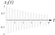
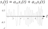
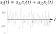
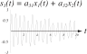
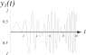
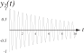
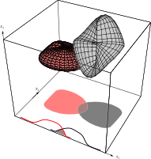
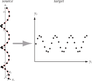

# 
## Recap

## Recap: Principal Component Analysis

PCA is a method of projecting data by calculating a set of vectors that captures the variance or "spread" of the data.

Recall that eigenvectors and eigenvalues can represent the **direction** and **magnitude** (respectively) of something represented in a matrix.

If our matrix is the covariance matrix \$\\boldsymbol{\\Sigma}\$, then the eigenvectors represent the direction of the data "spread", while the eigenvalues are the magnitude of that spread.

Thus we can express the data as a lower-dimensional projection by choosing a set of eigenvectors corresponding to the largest eigenvalues.

## Recap: Are Principal Components Always Orthogonal?

The covariance matrix \$\\boldsymbol{\\Sigma}\$ is always positive and symmetric, having dimension \$d\\times d\$ where \$d\$ is the number of dimensions.

We can prove that because of this, it has \$d\$ **distinct, positive eigenvalues**, each of which corresponds to an **orthonormal** eigenvector.

# 
## Independent Component Analysis

## Motivation for ICA

PCA tries to represent data by an optimized projection of the data using the covariance of the samples.

ICA seeks out independent **generating components** of the data.

Suppose you have \$d\$ independent, **noiseless** source signals \$x\_{i}(t)\$ for \$i=1,\\\cdots,d\$, where \$t\$ is our time component \$1\\leq t\\leq T\$.

We denote by \$\\mathbf{x}(t)\$ the \$d\$ values of the mixed signal at time \$t\$, and assume that the mean of \$\\mathbf{x}\$ over time is zero.

The multivariate density function is then written as:

\$ p\\left[\\mathbf{x}(t)\\right]=\\prod\_{i=1}\^{d}p\\left[x\_{i}(t)\\right] \$

## Illustration of Source Signals \$\\mathbf{x}(t)\$

{width=100%}

{width=100%}

Example of two source signals, \$x\_{1}(t)\$ and \$x\_{2}(t)\$.

## Sources and Signals

The source signals are detected by a \$k\$-dimensional sensor:

\$ \\mathbf{s}(t)=\\mathbf{A}\\mathbf{x}(t) \$

where \$\\mathbf{A}\$ is a \$k\\times d\$ matrix representing the individual modulation of the \$d\$ source signals with respect to the \$k\$ detectors.

**Example**: If \$\\mathbf{x}\$ is a set of sound waves produced by \$d\$ instruments, and \$\\mathbf{s}\$ is an array of \$k\$ microphones that are recording the sound, then \$\\mathbf{A}\$ might represent the distance between each specific microphone and instrument.

**Goal**: Extract the \$d\$ components in \$\\mathbf{s}\$ that are independent.

Note that we're ignoring the effects of noise, time delay, and possible dependence of one signal on another.

## Illustration of Detected Signals \$\\mathbf{s}(t)\$

{width=100%}

{width=100%}

{width=100%}

The source signals are sensed by an array of \$k\$ detectors, each of which receives a different mixture of \$x\_{1}(t)\$ and \$x\_{2}(t)\$.

## Jacobian Matrix

The distribution in the output signals is related to the distribution:

\$ p\_\\mathbf{y}=\\frac{p\_{\\mathbf{s}}(\\mathbf{s})}{|\\mathbf{J}|} \$

where \$\\mathbf{J}\$ is the Jacobian matrix:

\$ \\mathbf{J}=\\left(
\\begin{matrix}
\\frac{\\partial y\_{1}}{\\partial s\_{1}} \& \\cdots \& \\frac{\\partial y\_{d}}{\\partial s\_{1}} \\\\
\\vdots \& \\ddots \& \\vdots \\\\
\\frac{\\partial y\_{1}}{\\partial s\_{d}} \& \\cdots \& \\frac{\\partial y\_{d}}{\\partial s\_{d}}
\\end{matrix}\\right) \$

and

\$ |\\mathbf{J}|=\\left| |\\mathbf{W}|\\prod\_{i=1}\^{d}\\frac{\\partial y\_{i}}{\\partial s\_{i}}\\right| \$

## Reconstructed Output Signal

The final stage is modeled as a linear transform of the source signals, plus a static nonlinearity:

\$ \\mathbf{y}=f[\\mathbf{Ws}+\\mathbf{w}\_{0}] \$

where \$\\mathbf{w}\_{0}\$ is a bias vector and \$f[\\cdot]\$ is some kind of function (e.g. a sigmoid).

The goal in ICA is to find \$\\mathbf{W}\$ and \$\\mathbf{w}\_{0}\$ so as to make the outputs \$y\_{i}\$ as independent from one another as possible.

This is motivated by the fact that **we know** (i.e. we assume) the original signals themselves were independent.

## Finding \$\\mathbf{W}\$

So to find our matrix, we can calculate \$\\mathbf{W}\$ and \$\\mathbf{w}\_{0}\$ iteratively, by defining a cost function, finding the derivative, and setting that to zero.

The goal is to find the set of components which are **maximally independent**, so our "cost" function should be a measure of independence for signals that we can try to maximize.

## Illustration of Recovered Source Signals

{width=100%}

{width=100%}

The reconstructed source signals are found by transforming the detected signals
by a set of learned weights \$\\mathbf{W}\$.

## Compare Source and Recovered Signals

{width=100%}

{width=100%}

The reconstructed source signals are found by transforming the detected signals
by a set of learned weights \$\\mathbf{W}\$.

## Compare Source and Recovered Signals

{width=100%}

{width=100%}

The reconstructed source signals are found by transforming the detected signals
by a set of learned weights \$\\mathbf{W}\$.

## Finding \$\\mathbf{W}\$: Measuring Independence

We use **joint entropy** to measure independence:

\\begin{align}
H(\\mathbf{y}) \&= -\\mathcal{E}[\\ln{p\_{\\mathbf{y}}(\\mathbf{y})}] \\\\
\&=\\mathcal{E}[\\ln{|\\mathbf{J}|}]-\\underbrace{\\mathcal{E}[\\ln{p\_{\\mathbf{s}}(\\mathbf{s})}]}_{\\textrm{independent of weights}} \\
\\end{align}

\$\\mathcal{E}\$ is the expected value across all \$t=1,\\ldots,T\$.

Through gradient descent we find the learning rule for \$\\mathbf{W}\$:

\$ \\Delta\\mathbf{W}\\propto\\frac{\\partial H(\\mathbf{y})}{\\partial\\mathbf{W}}=\\frac{\\partial}{\\partial\\mathbf{W}}\\ln{|\\mathbf{J}|}=\\frac{\\partial}{\\partial\\mathbf{W}}\\ln{|\\mathbf{W}|}+\\frac{\\partial}{\\partial\\mathbf{W}}\\ln{\\prod\_{i=1}\^{d}\\left|\\frac{\\partial y\_{i}}{\\partial s\_{i}}\\right|} \$

## Finding \$\\mathbf{W}\$: Cofactors and Inverse Matrices

In component form we can write the first term as:

\$ \\frac{\\partial}{\\partial W\_{ij}}\\ln{|\\mathbf{W}|}=\\frac{\\textrm{cof}[W\_{ij}]}{|\\mathbf{W}|} \$

where \$\\textrm{cof}[W\_{ij}]\$ is the cofactor of \$W\_{ij}\$, or \$(-1)\^{i+j}\$ times
the determinant of the \$(d-1)-by-(k-1)\$-dimensional matrix gotten by deleting
the \$i\$th row and \$j\$th column of \$\\mathbf{W}\$.

This gives us:

\$ \\frac{\\partial}{\\partial \\mathbf{W}}\\ln{|\\mathbf{W}|}=[\\mathbf{W}\^{T}]\^{-1} \$

Which, in turn, gives the weight update rule for \$\\mathbf{W}\$:

\$ \\Delta\\mathbf{W}\\propto[\\mathbf{W}\^{T}]\^{-1}+(\\mathbf{1}-2\\mathbf{y})\\mathbf{s}\^{T}\_{g} \$

## Bias \$\\mathbf{w}\_{0}\$ Learning Rule

It can be shown that with the same sets of assumptions, the learning rule for
the bias weights is:

\$ \\Delta\\mathbf{w}\_{0}\\propto\\mathbf{1}-2\\mathbf{y} \$

It's difficult to know how many components we should try to reconstruct; if the
number is too high, ICA may be sensitive to numerical simulation and may be
unreliable.

This is a potentially useful alternative to PCA, if we suspect that our classes are elongated in parallel.

## Full Illustration of ICA

{width=70%}

# 
## Curse of Dimensionality

## Problems with High Dimensional Visualization

Using "similarity" instead of "distance" loses some intuitive interpretation
about our data's structure.

When this data is in very high dimensions, it's impossible for us to visualize,
even if the mathematics works perfectly.

We'd like to figure out a way to represent data in a low number (1-3) of
dimensions while preserving the similarity between points.

<ul>
<li class="fragment">We can see the data in a way that makes sense to us (i.e. using distance as a reliable surrogate of similarity).</li>
<li class="fragment">We can see the data at all (in three or fewer spatial dimensions).</li>
</ul>

## Motivation for Low-Dimensional Representation

First: Why do we NEED to see things in low dimensions?

Will a classifier work the same on the low-dimensional representation as it does
on the high-dimensional one?

Are these methods only to help us humans visualize the data?

**No!** We are always constrained by the curse of dimensionality.

We've discussed it before, but now let's examine it in detail.

## Accuracy in High Dimensions

The curse of dimensionality seems paradoxical at first: if features are
statistically independent, and the class means are different, shouldn't we
**always** do better?

Consider the two class case where \$p(\\mathbf{x}|\\omega\_{j})\\sim
N(\\boldsymbol{\\mu}\_{j},\\boldsymbol{\\Sigma})\$ for \$j=1,2\$.

**Assuming equal priors** (just to make it simple), the Bayes error rate is:

\$ P(e)=\\frac{1}{\\sqrt{2\pi}}\\int\_{r\/2}\^{\\infty}e\^{-\\frac{r\^{2}}{2}}du \$

where \$r\^2\$ is the Mahalanobis distance between the class means:

\$ r\^{2}=(\\boldsymbol{\\mu}\_{1}-\\boldsymbol{\\mu}\_{2})\^{T}\\boldsymbol{\\Sigma}\^{-1}(\\boldsymbol{\\mu}\_{1}-\\boldsymbol{\\mu}\_{2}) \$

## Accuracy in High Dimensions

\$ P(e)=\\frac{1}{\\sqrt{2\pi}}\\int\_{\\frac{r}{2}}\^{\\infty}e\^{-\\frac{r\^{2}}{2}}du \$

How does our probability of error change as the distance between the class means
\$r\$ increases?

Assuming conditional indpenedence,
\$\\boldsymbol{\\Sigma}=diag(\\sigma\_{1}\^{2},\\ldots,\\sigma\_{d}\^{2})\$ and:

\$ r\^{2}=\\sum\_{i=1}\^{d}\\left(\\frac{\\mu\_{i1}-\\mu\_{i2}}{\\sigma\_{i}}\\right)\^{2} \$

How does this change as \$d\$ gets larger?

**We are adding more components, and thus (potentially) increasing \$r\$**.

## Illustration of Increasing Dimensionality

{width=80%}

In the one-dimensional space, there is some significant overlap (i.e. Bayes
error) between the features.

When we add dimensions, we see a reduction in this overlap; in the third
dimensions, the class spaces are completely separate, and the Bayes error is
zero.

## Theory vs. Reality

**In theory**, the worst feature will have identical class means, so that
\$\\mu\_{i1}-\\mu\_{i2}=0\$, so \$r\$ will not increase at that point in the sum.

If \$r\$ is increased without limit, then our error should theoretically approach
zero! (Which obviously doesn't happen.)

**So what's wrong?** The reason not all classifiers are perfect comes down to
one of these:

<ul>
<li class="fragment">Our assumption that the features are independent is wrong.</li>
<li class="fragment">Our underlying model for our distributions is wrong.</li>
<li class="fragment">Our training samples are finite, so we cannot accurately estimate the distributions.</li>
</ul>

**Dimensionality reduction** methods seek to address these issues by
projecting the data into a low-dimensional space, combining dependent variables
and ignoring non-informative ones.

# 
## Multidimensional Scaling

## Simple Case Example

Let \$\\mathbf{y}\_{i}\$ be a projection of a sample \$\\mathbf{x}\_{i}\$.

\$\\delta\_{ij}\$ (delta) is the distance between \$\\mathbf{x}\_{i}\$ and
\$\\mathbf{x}\_{j}\$, and \$d\_{ij}\$ (lowercase "d")is the distance between
\$\\mathbf{y}\_{i}\$ and \$\\mathbf{y}\_{j}\$.

Thus we want to find how to arrange \$\\mathbf{y}\_{1},\\ldots,\\mathbf{y}\_{n}\$ such
that the distances \$d\_{ij}\$ are as close as possible to \$\\delta\_{ij}\$.

## Simple Case Illustration

{ width=80%}

## Criterion Functions for MDS

We can set up a few criterion functions:

<table>
<tr>
<td>**Equation**</td>
<td>**Characteristic**</td>
</tr>
<tr>
<td>\$J\_{ee}=\\frac{\\sum\_{i<j}(d\_{ij}-\\delta\_{ij})\^{2}}{\\sum\_{i<j}\\delta\_{ij}\^{2}}\$</td>
<td>Emphasizes large error, regardless of original distance</td>
</tr>
<tr>
<td>\$J\_{ff}=\\sum\_{i<j}\\left(\\frac{d\_{ij}-\\delta\_{ij}}{\\delta\_{ij}}\\right)\^{2}\$</td>
<td>Emphasizes proportional error, regardless of actual error</td>
</tr>
<tr>
<td>\$J\_{ef}=\\frac{1}{\\sum\_{i<j}\\delta\_{ij}}\\sum\_{i<j}\\frac{(d\_{ij}-\\delta\_{ij})\^{2}}{\\delta\_{ij}}\$</td>
<td>Compromise between the two</td>
</tr>
</table>

All are invariant to rigid transforms and are normalized.

## Gradients for Criterion Functions

Gradients are easy to compute: The gradient of \$d\_{ij}\$ with respect to
\$\\mathbf{y}\_{i}\$ is a unit vector in the direction of
\$\\mathbf{y}\_{i}-\\mathbf{y}\_{j}\$:

\$ \\boldsymbol{\\nabla}\_{\\mathbf{y}\_{k}}J\_{ef}=\\frac{2}{\\sum\_{i<j}\\delta\_{ij}}\\sum\_{j\\neq k}\\frac{d\_{kj}-\\delta\_{kj}}{\\delta\_{kj}}\\frac{\\mathbf{y}\_{k}-\\mathbf{y}\_{j}}{d\_{kj}} \$

Example: 30 points spaced at unit intervals along a spiral, which circles around the \$x\_{3}\$ axis:

\\begin{align}
x\_{1}(k) \&= \\cos{\\left(\\frac{k}{\\sqrt{2}}\\right)} \\\\
x\_{2}(k) \&= \\sin{\\left(\\frac{k}{\\sqrt{2}}\\right)} \\\\
x\_{3}(k) \&= \\frac{k}{\\sqrt{2}} \\\\
\\end{align}

## Illustration of Spiral MDS

{ width=80% }

## Wrapup of Linear Methods

One thing to keep in mind is that these methods are **linear** -- they cannot
encode nonlinear relationships between datapoints.

A nonlinear dataset is one in which linear distances (e.g. Euclidean distance)
between points is **not** a reliable measure of similarity.

What are some examples?

## Examples of Nonlinear Datasets

{width=80%}

## How to Know if Datasets are Nonlinear?

As we've seen, unsupervised methods rely on data structure to "tell a story" --
therefore, if your linear method is applied to a nonlinear dataset, and you just
get a big blob, how do you know what's wrong?

You need a **large number** of samples before you can conclude that your
dataset is nonlinear (and for nonlinear methods to work at all).

The swiss roll is nonlinear in 3 dimensions, but if your data is nonlinear in a
million dimensions, it'll be tough to know ahead of time.

Therefore, validation of these methods will require **some** amount of
labeling or ground truth.

# 
## Locally Linear Methods

## Various Manifold Methods

If you have a lot of data, you can assume it lies on a well-defined manifold --
that is, the points form a "sheet" in high-dimensional space.

The only distances that are valid are those between a point and its close
neighbors; everything else is invalid (i.e. the distance is "infinite").

Think of houses on switchback streets: if you're in a car, and not driving over
people's lawns, you have to travel the road to get to your neighbor's house.

## Common Themes

There are a lot of these methods, but they all make some pretty basic
assumptions:

<ul>
<li class="fragment">Points in high-dimensional space lie on a manifold;</li>
<li class="fragment">There are enough points in the datasest to "define" that manifold;</li>
<li class="fragment">You can set a neighborhood parameter to define how far apart points can be without "hopping" onto another part of the manifold;</li>
<li class="fragment">It's possible to devise a mapping such that \$\\delta\_{ij}\$ and \$d\_{ij}\$ are similar for pairs of points \$\\mathbf{x}\_{i}, \\mathbf{x}\_{j}\$ and their projections \$\\mathbf{y}\_{i}, \\mathbf{y}\_{j}\$</li>
</ul>

## Do It Yourself!

There are a lot of nonlinear methods. 

<ul>
<li class="fragment">**Isometric mapping** (ISOMAPS)</li>
<li class="fragment">**Locally Linear Embedding** (LLE)</li>
<li class="fragment">**DBSCAN**</li>
<li class="fragment">**t-Distributed Stochastic Neighbor Embedding** (t-SNE)</li>
<li class="fragment">**UMAP**</li>
</ul>

We will cover the last two, as they are what most people gravitate towards these
days, and it's implemented in MATLAB.

# 
## t-Distributed Stochastic Neighbor Embedding

## Formulation of t-SNE

This is a relatively new method developed in 2008 by:

<ul>
<li class="fragment">Geoffrey Hinton, who has done great foundational work in neural networks</li>
<li class="fragment">Laurens van der Maaten, who has written extensively on dimensionality reduction</li>
</ul>

It is a **nonlinear, probabilistic** technique which is also solved through
numerical optimization (i.e., gradient descent).

This means that running t-SNE multiple times may give you **different
embeddings**.

## How Does t-SNE Work?

Let's assume we have our \$d\$-dimensional dataset, \$\\{\\mathbf{x}\_{1},
\\mathbf{x}\_{2}, \\ldots, \\mathbf{x}\_{N}\\}\$.

We assume that \$d\$ is fairly large, and that all features are relevant to
describing the dataset.

The goal is to find a mapping where **similarity between points is
preserved**, which in t-SNE is done by modeling between-point similarity as a
probability distribution (and a Gaussian, no less). 

## Similarity as a Probability

If we assume the points are distributed as a Gaussian in high-dimensional space,
then the probability, \$p\_{j|i}\$, is understood as the likelihood that point
\$\\mathbf{x}\_{i}\$ would have \$\\mathbf{x}\_{j}\$ as its "neighbor" (in other words,
that the points would be close together). 

\$ p\_{j|i} = \\frac{\\exp\\left[-|\\mathbf{x}\_{i} - \\mathbf{x}\_{j}|\^{2}/ 2\\sigma\^{2}\_{i}\\right]}{\\sum\_{k\\neq i}\\exp\\left[-|\\mathbf{x}\_{i} - \\mathbf{x}\_{k}|\^{2} / 2\\sigma\^{2}_{i}\\right]} \$

If you look closely, this is just a Gaussian where one of the points serves as
the "mean". The value of \$\\sigma\$ is a parameter that can be derived from the
"complexity" of the data, and is a tunable parameter.

## Similarity as a Probability

By normalizing by the number of all points, we get a measure of point similarity:

\$ p\_{ij} = \\frac{p\_{i|j} + p\_{j|i}}{2N} \$

## Similarity in the Low Dimensional Space

Next, we define a similar point-wise probability for the points in **low**
dimensional space as well. Here, high-dimensional point \$\\mathbf{x}\_{i}\$ is
referred to in low-dimensional space as \$\\mathbf{y}\_{i}\$.

Low-dimensional probability is defined as:

\$ q\_{ij} = \\frac{\\left(1 + |\\mathbf{y}\_{i} - \\mathbf{y}\_{j}|\^{2}\\right)\^{-1} }{\\sum\_{k\\neq i}\\left(1 + |\\mathbf{y}\_{i} - \\mathbf{y}\_{k}|\^{2}\\right)\^{-1}} \$

This is NOT a Gaussian modeling: this is a Student-t distribution (hence,
"t-distributed SNE").

## Why Use Different Distributions?

The paper goes into detail for each of their choices, but the use of two
different distributions addresses some issues where outlier points have
incorrect amounts of influence on the resulting mapping.

The Student-t distribution works like an inverse square law for large distances,
meaning that the scale of the mapping doesn't affect the result.

## Putting it Together

So we have a probability distribution on the data in high dimensions, \$p\_{ij}\$,
which we can calculate. We also have a form for the low-dimensional
distribution, \$q\_{ij}\$, but we can't calculate that because we don't know what
\$\\mathbf{y}\$ should be.

To find the location of the points \$\\mathbf{y}\$, we minimize the
Kullback-Leibler Divergence, which is defined as:

\$ KL(P||Q) = \\sum\_{i\\neq j}p\_{ij}\\log{\\frac{p\_{ij}}{q\_{ij}}} \$

The KL Divergence is basically how you calculate the difference between two
probability distributions.

How do we minimize? Gradient descent!

## Parameters, Parameters Everywhere

As with any numerical optimization approach, we have to think about:

<ul>
<li class="fragment">Our **learning rate**</li>
<li class="fragment">Our **search time**</li>
<li class="fragment">Our **initial conditions** (i.e. local vs. global minima)</li>
</ul>

Because of this, t-SNE can give you different results if run multiple times
(because of local minima), and selection of parameter values is **critically
important**.

So interpreting your results should be done with a fair amount of caution. Make
sure you test robustness by running the algorithm multiple times with different
parameter sets on data you know is clean.

## Still More Parameters 

In addition, t-SNE has its own tunable parameters:

<ul>
<li class="fragment">"Perplexity", which is related to the bandwidth of the Gaussians used to model probability densities in high dimensions</li>
<li class="fragment">Similarity metric, which in the original formulation is Euclidean</li>
</ul>

Again: you need to check that what you're getting makes sense for your own data
and assumptions.

Interpreting dimensionality reduction methods should be done with extreme
caution.

# 
## Parting Words

## Tip of the Iceberg

Unsupervised methods, clustering, and DR are obviously a HUGE topic.

They are typically the first thing you can do when you start collecting data.

Cheap, (somewhat) fast, and give you an idea of how well your calculated
features are doing.

There are a ton of variations of what we've discussed, but if you are
interested, this is a good starting point.

## Next Topic

Neural networks are an extension of linear machines and will serve as the basis for deep learning.

Next class, we will begin building the foundations we'll need for understanding these complex classifiers.

