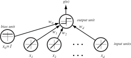
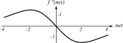
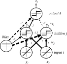

# 
## Recap

## Recap: Linear Discriminants

We can classify using a set of \$c\$ discriminants:

\$ g\_{i}(\\mathbf{x}) = \\mathbf{w}\_{i}\^{T}\\mathbf{x}+w\_{i0}, i\\in\\{1,2,\\ldots,c\\} \$

Our classification rule is thus:

\$ g\_{i}(\\mathbf{x}) > g\_{j}(\\mathbf{x}) \\textrm{ for all } j\\neq i \$

This is a **linear machine**.

## Recap: Individual Discriminant Function

{width=100%}

## Recap: Combination of Discriminant Functions

{width=80%}

## Recap: Linear Discriminant Functions

We can continue to add terms to represent higher-order (polynomial) discriminant
functions, until we have a generalized function:

\$ g(\\mathbf{x})=\\sum\_{i=1}\^{d}a\_{i}y\_{i}(\\mathbf{x}) \$

\$ g(\\mathbf{x})=\\mathbf{a}\^{T}\\mathbf{y} \$

Here, \$\\mathbf{a}\$ is a \$\\hat{d}\$-dimensional weight vector and
\$y\_{i}(\\mathbf{x})\$ are \$\\hat{d}\$ functions of \$\\mathbf{x}\$.

By choosing \$y\_{i}(\\mathbf{x})\$ carefully, we can approximate a discriminant
function that is not linear in \$\\mathbf{x}\$ but **is** linear in
\$\\mathbf{y}\$.

## Recap: Mapping to High-Dimensional Space

{width=100%}

{width=90%}

## Recap: Motivation for Mapping Functions

In theory, ANY function -- no matter how complex -- can be modeled in a high enough space.

How do we calculate these weight vector \$\\mathbf{a}\$?

**Gradient descent!** Set up the sum-of-squared-error criterion function, and take the gradient with respect to \$\\mathbf{a}\$.

\$ J\_{s}(\\mathbf{a}) = \|\\mathbf{Ya}-\\mathbf{b}\|\^{2} \$

\$ \\nabla J\_{s} = 2\\mathbf{Y}\^{T}(\\mathbf{Ya}-\\mathbf{b}) \$

## Recap: Least-Mean-Squared Rule

If we consider updating the estimate of \$\\mathbf{a}\$ using a sequence of observed values, we have:

\\begin{align}
\\mathbf{a}(1) \&= \\textrm{arbitrary} \\\\
\\mathbf{a}(k+1) \&=\\mathbf{a}(k)+\\eta(k)(b(k) - \\mathbf{a}\^{T}(k)\\mathbf{y}\^{k})\\mathbf{y}\^{k}
\\end{align}

\$\\eta(k)\$ is the learning rate at iteration \$k\$, and \$b(k)\$ is the bias vector.

The LMS rule is useful because it doesn't try to maximize training performance, but instead minimizes overall deviation from the hyperplane.

This typically yields a more generalizable model.

## Recap: LMS Algorithm

\\begin{algorithm}[H]\\footnotesize
    \caption{Least-Mean-Squared Algorithm}
    \\emph{begin initialize \$\\mathbf{a}, \\mathbf{b}, \\textrm{ threshold } \\theta, \\eta(\\cdot), k\\leftarrow 0\$}\;
    \\Repeat{\$|\\eta(k)(b\_{k}-\\mathbf{a}\^{t}\\mathbf{y}\^{k})\\mathbf{y}\^{k}|<\\theta\$}{
        \$k\\leftarrow k+1\$\;
        \$\\mathbf{a}\\leftarrow\\mathbf{a}+\\eta(k)(b\_{k}-\\mathbf{a}\^{t}\\mathbf{y}\^{k})\\mathbf{y}\^{k}\$\;
    }
    \\KwRet{\$\\mathbf{a}\$}
\\end{algorithm}

## Recap: LMS Example Results

{width=50%}

# 
## Neural Network Architecture

## Introduction to Neural Nets

Neural networks are an extension of linear discriminants.

Neural networks are made up of "neurons", or computational units, originally
called **perceptrons** when they were developed back in the 50s.

A perceptron simply takes several inputs and computes a single output. Think of
a neuron receiving various inputs (action potentials, chemical gradients, etc.)
and then calculating an "output".

The main difference with discriminants is that while discriminants output a real
number, **perceptrons outputs are binary**, mimicking the biological action
potential they're based on.

## Perceptron Illustration

{width=100%}

{width=100%}

## Expressive Power of Perceptrons

{
width=80% }

## Extending Neural Nets

This setup has the same descriptive power as a linear discriminant. To extend
its **representational capacity**, we can add additional layers between the
input and the final output.

These are called "hidden" layers, since they are hidden to the outside world --
they transform the inputs into the outputs, but the actual "content" of the
nodes is not readily apparent.

## Nature of Hidden Layers

You can think of hidden layers as providing a level of "abstraction" -- in other
words, they get us closer to modeling of highly nonlinear or complex input
spaces.

The simplest architecture of a neural network (a "fully connected network") is
that every input is connected to every hidden node, and every hidden node is
connected to every output node.

## Three-layer Schematic

{width=55%}

## Expressive Power of Hidden Layers

{
width=80% }

## Expressive Power: Approximation of Any Function

There is a proof that for any continuous function \$g(\\mathbf{x})\$ defined on the unit hypercube \$I\^{n}\$, where \$I=[0,1]\$ and \$n\\geq 2\$, we can write:

\$ g(\\mathbf{x}) = \\sum\_{j=1}\^{2n+1}\\Xi\_{j}\\left(\\sum\_{i=1}\^{d}\\psi\_{ij}(x\_{i})\\right) \$

In neural network terms, the \$2n+1\$ hidden units take a sum of \$d\$ nonlinear
functions, one for each feature \$x\_{i}\$, as input.

Hidden units emit a nonlinear function \$\\Xi\$ of the total input.

The output unit emits the sum of the hidden units' contributions.

Another proof comes from Fourier, who showed that any function \$g(\\mathbf{x})\$
can be represented by an infinite harmonic series of functions.

## Expressive Power: Approximation of Any Function

{width=70%}

# 
## Using Neural Networks

## Net Activation

The inputs are presented to the input layer, and each hidden unit computes its scalar **net activation** which is denoted as \$net\$:

\$ net\_{j} = \\sum\_{i=0}\^{d}x\_{i}w\_{ji}\\equiv \\mathbf{w}\_{j}\^{T}\\mathbf{x} \$

(Recall **augmentation**, where the bias term is included in the weight vector.)

The subscript \$i\$ indexes the input layer units (i.e. input dimensionality), \$j\$ is the hidden layer units, and \$w\_{ji}\$ is the input-to-hidden layer weights at \$j\$.

## Net Activation

Each hidden unit's output is a nonlinear function of activation, also called
(conveniently) an **activation function**:

\$ y\_{j} = f(net\_{j}) \$

In the past, \$f(net)\$ was just a sign function:

\$ f(net) = \\textrm{Sgn}(net)\\equiv \\begin{cases}
1 &\\quad \\textrm{if } net \\geq 0 \\\\
-1 &\\quad \\textrm{if } net < 0\\\\
\\end{cases}\$

This function \$f(\\cdot)\$ serves the same purpose as the kernel function \$\\phi\$
for SVMs, or the mapping functions \$\\mathbf{y}\$ in linear discriminants.

## Network Output Layers

Each **output node** computes its activation based on input from hidden units:

\$ net\_{k} = \\sum\_{j=0}\^{n\_{H}}w\_{kj}y\_{j} = \\mathbf{w}\_{k}\^{T}\\mathbf{y} \$

So now we have the output units, indexed by \$k\$, and the \$n\_{H}\$ hidden units
creating a similar net activation just like we had for the hidden units and the
input layer.

## Network Output Layers

We can have \$k\$ output units, with output \$z\_{k}\$, calculated as:

\$ z\_{k}=f(net\_{k}) \$

We use the same \$f(\\cdot)\$ for the hidden-to-output net as we did for the
input-to-hidden net, although this isn't necessary.

## Choosing the Activation Function

There are **many different activation functions**: sigmoid, logistic,
arctangent, hyperbolic tangent, rectified linear units (RELU), error function...

You can create any activation function you want, but they must have some basic
properties: 

<ul>
<li class="fragment">**Smoothness and continuous differentiation**: This helps in calculating the gradient during training, which we'll discuss in a minute</li>
<li class="fragment">**Nonlinearity**: Nonlinear functions enable us to capture relationships between the data inputs, the same way projection works with linear discriminants</li>
</ul>

## Smoothness and Continuous Differentiation

During training, the smoothness requirement allows \$f(net)\$ to avoid "exploding"
inputs that you might get if you just keep adding stuff together.

This process is sometimes called **regularization**, and the activation
function is sometimes called a **squashing** function (because it squishes
extreme values to be between -1 and 1, or sometimes 0 and 1).

## Activation Functions and Limits of Linearity

{ width=40% }

The activation function \$f(net)\$ is an anti-symmetric sigmoid; in this case, the
function is nearly linear for \$-1<net<+1\$ and the second derivative has extrema
near \$net\\approx\\pm 2\$.

## Activation Functions and Limits of Linearity

{ width=40% }

The activation function \$f(net)\$ is an anti-symmetric sigmoid; in this case, the
function is nearly linear for \$-1<net<+1\$ and the second derivative has extrema
near \$net\\approx\\pm 2\$.

## Activation Functions and Limits of Linearity

{ width=40% }

The activation function \$f(net)\$ is an anti-symmetric sigmoid; in this case, the
function is nearly linear for \$-1<net<+1\$ and the second derivative has extrema
near \$net\\approx\\pm 2\$.

## Feedforward Operation

By combining the previous equations, we can get a general output expression:

\$ g\_{k}(\\mathbf{x}) \\equiv z\_{k} = f\\left(\\sum\_{j=1}\^{n\_{H}} w\_{kj} f\\left(\\sum\_{i=1}\^{d}w\_{ji}x\_{i}+w\_{j0}\\right)+w\_{k0}\\right) \$

Evaluating this expression, from inputs to outputs, is called the **feedforward operation**.

# 
## Example Problem: XOR

## XOR Problem

{width=50%}

## XOR: Network Diagram

{width=50%}

## XOR: Network Responses

{ width=80% }

## XOR: Computations

{width=100%}

<ul>
<li class="fragment">Hidden unit 1 boundary: \$1 * x\_{1} + 1 * x\_{2} + 0.5 = 0\$</li>
<li class="fragment">If \$x\_{1}+x\_{2}+0.5\\geq 0\$, then \$y\_{1}=1\$, otherwise \$y\_{1}=-1\$</li>
<li class="fragment">Hidden unit 2 boundary: \$1 * x\_{1} + 1 * x\_{2} - 1.5 = 0\$</li>
<li class="fragment">Output unit boundary: \$0.7 * y\_{1} - 0.4 * y\_{2} - 1 = 0\$</li>
<li class="fragment">\$z\_{1} = +1\$ if \$y\_{1} = +1\$ and \$y\_{2} = +1\$, and \$-1\$ otherwise.</li>
</ul>

# 
## Neural Network Training

## Training the Weights

{width=50%}

## Training Basics: Backpropagation

How do we set the weights so that we can get our desired output?

**Backpropagation** is the most-used method.

In the two-layer (discriminant function) case, we adjusted the weights based on
the output error -- but how do we do this when there's an input-to-hidden layer
"error" we need to figure out?

This is the **credit assignment** problem -- the hidden layer is by
definition an "intermediate" step between the input and the output, so how do
we know if it's doing poorly?

Backpropagation allows us to come up with an effective error for the hidden
layer by computing gradients through multiple applications of the chain rule.

## Backpropagation Overview

**Feedforward** is when you stuff inputs into the network and it gives you an output.

**Training** is when you tune the network to bring the outputs closer to the target values.

The approach to learning is as follows:

<ul>
<li class="fragment">Present training data to the network and calculate the feedforward op</li>
<li class="fragment">Compare outputs to the targets and figure out the errors</li>
<li class="fragment">Adjust the network weights to reduce the measure of error</li>
<li class="fragment">Optimal weights are achieved when the output error is minimized</li>
</ul>

## Example Three-Layer Network

{width=60%}

\note{Example of a fully-connected network. Each hidden unit computes \$net\_{j}\$ as the
inner product of the input-layer signals with weights \$w\_{ji}\$. They emit
\$y\_{j}=f(net\_{j})\$, and the output layer does the same. The result is compared
with the \$c\$-dimensional target vector, \$\\mathbf{t}\$.}

## Training Error

Training error is calculated differently depending on our problem -- Are we seeking a classification label, or an output signal? 

The error criterion we use is typically called a **loss function**, where higher loss means we're "farther away" from the correct answer:

\$ J(\\mathbf{w})=\\frac{1}{2}\\sum\_{k=1}\^{c}(t\_{k}-z\_{k})\^{2}=\\frac{1}{2}\|\\mathbf{t}-\\mathbf{z}\|\^{2} \$

## Gradient Descent

Backpropagation, like most of our learning algorithms, is based on gradient descent:

\$ \\Delta\\mathbf{w}=-\\eta\\frac{\\partial J}{\\partial\\mathbf{w}} \qquad \\Delta w\_{kj}=-\\eta\\frac{\\partial J}{\\partial w\_{kj}} \$

Again, \$\\eta\$ is the learning rate that indicates the size of the change in the
weights, and our update rule is:
\$\\mathbf{w}(m+1)=\\mathbf{w}(m)+\\Delta\\mathbf{w}(m)\$.

## Evaluating the Error: Hidden-to-Output

How can we evaluate our weight updating?

We must differentiate using the chain rule, because the error is not explicitly
dependent upon \$w\_{ji}\$ (the weights between the input and hidden layers).

Consider the hidden-to-output layer weights first, \$w\_{kj}\$.

\$ \\frac{\\partial J}{\\partial w\_{kj}} = \\frac{\\partial J}{\\partial net\_{k}}\\frac{\\partial net\_{k}}{\\partial w\_{kj}} = -\\delta\_{k}\\frac{\\partial net\_{k}}{\\partial w\_{kj}} \$

Here, \$\\delta\_{k}\$ is the sensitivity of output unit \$k\$ and describes how the error changes with the unit's activation.

## Weight Update Derivatives

We can calculate \$\\delta\_{k}\$ by differentiating \$J(\\mathbf{w})\$ with respect to \$net\_{k}\$:

\$ \\delta\_{k} = -\\frac{\\partial J}{\\partial net\_{k}} = -\\frac{\\partial J}{\\partial z\_{k}} \\frac{\\partial z\_{k}}{\\partial net\_{k}} = (t\_{k}-z\_{k})f\^{\\prime}(net\_{k}) \$

Finally, we can calculate the last derivative as:

\$ \\frac{\\partial net\_{k}}{\\partial w\_{kj}} = y\_{j} \$

Putting this all together, we can calculate the learning rule for the
hidden-to-output weights:

\$ \\Delta w\_{kj} = \\eta\\delta\_{k}y\_{j} = \\eta(t\_{k}-z\_{k})f\^{\\prime}(net\_{k})y\_{j} \$

If the output is linear (\$f(net\_{k}) = net\_{k}\$ and \$f\^{\\prime}(net\_{k})=1\$),
then this is just the LMS rule.

## Learning Rule for Input-to-Hidden Weights

We follow a similar derivation to find \$w\_{ji}\$:

\$ \\frac{\\partial J}{\\partial w\_{ji}} = \\frac{\\partial J}{\\partial y\_{j}} \\frac{\\partial y\_{i}}{\\partial net\_{j}}\\frac{\\partial net\_{j}}{\\partial w\_{ji}} \$

I'll skip the math for the derivation, but the first term on the right is:

\$ \\frac{\\partial J}{\\partial y\_{j}} = -\\sum\_{k=1}\^{c}(t\_{k}-z\_{k})f\^{\\prime}(net\_{z})w\_{kj} \$

This links the hidden unit output, \$y\_{j}\$, to the output unit error, \$(t\_{k} - z\_{k})\$.

## Sensitivity of the Hidden Unit

Now we calculate the sensitivity of the hidden unit as:

\$ \\delta\_{j}\\equiv f\^{\\prime}(net\_{j}) \\sum\_{k=1}\^{c}w\_{kj}\\delta\_{k} \$

Thus the hidden unit sensitivity is the sum of the output unit sensitivities,
weighted by \$w\_{kj}\$ and multiplied by \$f\^{\\prime}(net\_{j})\$.

## Learning Rule for Input-to-Hidden Weights

The final learning rule for the input-to-hidden unit weights is:

\$ \\Delta w\_{ji} = \\eta x\_{i}\\delta\_{j} = \\eta x\_{i}\\underbrace{\\left[\\sum\_{k=1}\^{c}w\_{kj}\\delta\_{k}\\right] f\^{\\prime}(net\_{j})}_{\\delta\_{j}} \$

With this, we now have a way for training weights at both the input-to-hidden
and hidden-to-output layers.

This is essentially just gradient descent in a layered model, where you use the
chain rule to calculate derivatives of the criterion functions.

## Backpropagation Illustration

{width=40%}

Backpropagation is named because the error at the output layer is propagated
back to the hidden layer, where it is used to perform training of the
input-to-hidden layer weights.

## Practical Concerns

Weights are usually initialized randomly (as with most gradient descent methods).

We want to do this to ensure fast and uniform learning, i.e. the weights should all reach equilibrium at about the same time.

To do this, we set the weights according to the distribution \$-\\tilde{w} < w < +\\tilde{w}\$, for some value of \$\\tilde{w}\$.

We need to set \$\\tilde{w}\$ such that it yields a net activation at the hidden units in the range of \$-1 < net\_{j} < +1\$.

## Extensions to General Networks

Our case was very simple, but it can easily be extended to other networks.

Backpropagation can be generalized to feed-forward networks in which:

<ul>
<li class="fragment">Input units include a bias unit</li>
<li class="fragment">Input units are connected directly to output as well as hidden units</li>
<li class="fragment">There are more than three layers</li>
<li class="fragment">There are different nonlinearities \$f(\\cdot)\$ for different layers</li>
<li class="fragment">Each unit has its own nonlinearity</li>
<li class="fragment">Each unit has a different learning rate</li>
</ul>

Some of these situations are more complex than others, but the training
protocols and basic ideas remain the same.

# 
## Next Class

## Continue with Neural Nets

So adding a hidden layer allows us to model complex input spaces. 

What if we add two hidden layers? Or three? Or 50?

Chain-rule still works, so backpropagation should still give us gradients to calculate...

## Continue with Neural Nets

In general, **deep networks** refer to neural networks with a large number of hidden layers.

In the next class we'll start covering deep learning, which are some of the recent developments in machine learning and AI.

We'll also start discussing a special type of network: **convolutional neural networks**, which are a type of deep network specific for image analysis.

