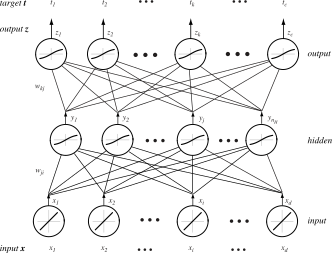
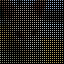

# 
## Recap Last Lecture

## Recap: Perceptrons

{width=70%}

## Recap: Archetypal Three-Layer Network

{width=60%}

## Recap: Net Activation

If the hidden layer has units indexed by \$j\$, and the input layer is indexed by
\$i\$, then the net activation is:

\$ net\_{j} = \\sum\_{i=1}\^{d}x\_{i}w\_{ji}+w\_{j0}=\\sum\_{i=0}\^{d}x\_{i}w\_{ji}\\equiv \\mathbf{w}\_{j}\^{T}\\mathbf{x} \$

The output layer (indexed by \$k\$) has a unique set of weights operating on the
results of the hidden layer (denoted in total by \$\\mathbf{y}\$):

\$ net\_{k} = \\sum\_{j=1}\^{n\_{H}}y\_{i}w\_{kj}+w\_{k0} = \\sum\_{j=0}\^{n\_{H}}y\_{j}w\_{kj}=\\mathbf{w}\_{k}\^{T}\\mathbf{y} \$

## Recap: Nonlinearities

In addition to the weights, a unit has a nonlinear function it operates on its
net activation, which dictates its emitted result:

\$ y\_{j} = f(net\_{j}) \\qquad z\_{k}=f(net\_{k}) \$

Combining equations yields our familiar discriminant function:

\$ g\_{k}(\\mathbf{x}) \\equiv z\_{k} = f\\left(\\sum\_{j=1}\^{n\_{H}} w\_{kj} f\\left(\\sum\_{i=1}\^{d}w\_{ji}x\_{i}+w\_{j0}\\right)+w\_{k0}\\right) \$

## Recap: Example of Nonlinear Decision Regions \$\\mathcal{R}\_{1},\\mathcal{R}\_{2}\$

{width=80%}

## Recap: Example of Nonlinear Decision Regions \$\\mathcal{R}\_{1},\\mathcal{R}\_{2}\$

{width=80%}

## Recap: XOR Problem

{width=80%}

{width=80%}

## Recap: XOR Network Responses

{width=40%}

## Recap: Expressive Power in Approximating Any Function

Hidden layers increase the **expressive power** over and above linear
machines or their nonlinear variants.

Any continuous function (i.e. the nonlinear decision regions) should be
learnable as a combination of functions; compare our output function with
Kolmogorov's proof:

\$ g\_{k}(\\mathbf{x}) \\equiv z\_{k} = f\\left(\\sum\_{j=1}\^{n\_{H}} w\_{kj} f\\left(\\sum\_{i=1}\^{d}w\_{ji}x\_{i}+w\_{j0}\\right)+w\_{k0}\\right) \$

\$ g(\\mathbf{x}) = \\sum\_{j=1}\^{2n+1}\\Xi\_{j}\\left(\\sum\_{i=1}\^{d}\\Psi\_{ij}(x\_{i})\\right) \$

... as well as Fourier's theorem.

## Approximation of Any Function

{width=40%}

Given a set of inputs arranged in opposition, we can take a series of S-shaped
curves to approximate a "bump" (may or may not be Gaussian). Given a
sufficiently large number of these, we could in theory approximate any function.

## Recap: Backpropagation for Learning Weights

**Backpropagation** is the most general method for setting the weights between
units.

Since the hidden layer is an intermediate step, we need an "effective error" we
can use to optimize the weights -- the **credit assignment** problem.

This is done during the **learning** mode (as opposed to the **feedforward**
mode used for classification).

<ul>
<li class="fragment">Present training patterns to the network and determine the output</li>
<li class="fragment">Compare outputs to the targets and figure out the errors</li>
<li class="fragment">Adjust the network weights to reduce the measure of error</li>
<li class="fragment">Optimal weights are achieved when the output error is minimized</li>
</ul>

## Recap: Training Error

Training error is calculated as the squared difference between the output and
the target vector, just as in the LMS algorithm:

\$ J(\\mathbf{w})=\\frac{1}{2}\\sum\_{k=1}\^{c}(t\_{k}-z\_{k})\^{2}=\\frac{1}{2}\|\\mathbf{t}-\\mathbf{z}\|\^{2} \$

Backpropagation learning, like most of our learning algorithms, is based on
gradient descent:

\$ \\Delta\\mathbf{w}=-\\eta\\frac{\\partial J}{\\partial\\mathbf{w}} \qquad \\Delta w\_{kj}=-\\eta\\frac{\\partial J}{\\partial w\_{kj}} \$

To solve \$\\Delta\\mathbf{w}\$, we must differentiate using the chain rule -- first
to find the hidden-to-output weights (since we have an output to compare to),
and then the input-to-hidden weights.

# 
## Deep Learning Introduction

## What is Deep Learning?

"Deep Learning" is an extension of regular neural networks. 

In general, it refers to stacking many hidden layers between inputs and outputs to model a very complex decision space (MUCH more complex than our simple XOR example).

## What is Deep Learning?

Thus, deep learning is not new.

What **is** new is that:

<ul>
<li class="fragment">Labeled datasets have gotten much bigger;</li>
<li class="fragment">Hardware has gotten much faster (also we figured out how to use GPUs);</li>
<li class="fragment">Tricks were discovered to cheat how we design very complex networks.</li>
</ul>

## Network Architecture Design

The process of designing architecture, calculating backpropagation, etc. are the same for deep networks as for traditional neural networks.

The added layers provide the ability to describe increasingly nonlinear decision spaces.

The **universal approximation theorem** postulates that even a single hidden layer, given enough units, can represent almost any continuous function.

## Network Architecture Design Dangers

The problem is that **fully connected deep networks** rarely work in practice. 

They suffer from a few major drawbacks:

<ul>
<li class="fragment">**Unstable Gradients**: It is tough to keep the gradients "meaningful" when you've got too many layers interacting.</li>
<li class="fragment">**Insufficient Training**: These classifiers are trying to learn a very complex, high-dimensional dataset -- having enough data to fully train is critical.</li>
<li class="fragment">**Computational Complexity:** Training these networks takes a very, very, VERY long time.</li>
</ul>

There is a relationship between the **depth** of the network, the **size**
of the training set, and the **computational complexity** (i.e. training time)
required to fully train the network without overfitting. 

## Answers to Computational Complexity

To assist in training these systems, we can add layers while at the same time
using "tricks" to reduce the number of connections we need to worry about.

The first of these gives rise to **Convolutional Neural Nets**, which are
based around the description and classification of images.

# 
## Convolutional Neural Networks

## Disclaimer

CNNs are focused on "natural" images, but these are the datasets that have had a TON of machine learning research poured into them over the years.

The concepts extend to medical datasets as well, with a few caveats (medical images are often **rotationally invariant**, etc.).

## Issues with Dimensionality

Practically speaking, what do our input units represent?

\$\\mathbf{x}=(x\_{1},\\ldots,x\_{n})\^{T}\$; for each input feature, we have an input
node. Imagine we want to build a neural network to identify images of objects --
each of the inputs would be a data point in the image (i.e. a pixel).

The CIFAR-10 dataset, a benchmark dataset of natural images, is made of images
just 32x32 pixels. For 3-channel color images (R,G,B), this means **3,072**
neurons... at the input layer.

## Example of CIFAR-10 Images

{ width=50% } 
{ width=50% }

{ width=50% } 
{ width=50% }

{ width=50% } 
{ width=50% }

## CIFAR-10 Cat Exploded

{width=80%}

{width=80%}

## Pixel Encodings

{width=80%}

{width=80%}

## Scalability of Traditional Neural Nets

The number of inputs balloons very quickly: a 200x200 image would result in 120,000 weights.

Moreover, each of these must be mapped to hidden units -- so our weight vector is 120,000 multiplied by some (likely larger) number of hidden units.

And that's all for one layer, and for a dataset of just 200x200x3 images, which are quite small.

## Modifications for Image Inputs

Images have a few characteristics that allow us to constrain the network architecture.

<ul>
<li class="fragment">**Spatially-localized inputs:** The upper-left corner of an image is probably not related to the lower-right corner of an image.</li>
<li class="fragment">**Information at Scale:** You can separate the data that is used to distinguish pixel-by-pixel features from those used to distinguish region-by-region features</li>
</ul>

Thus, instead of having a fully-connected network (where every neuron is connected to all the neurons in the previous layer), we constrain each input to a geographic regions surrounding it.

Convolution nets have layers arranged as **volumes**, which in turn transform
the 3D input to a 3D output volume of activations.

## Example of Convolutional Nets

{width=90%}

## Example of Convolutional Nets

{width=100%}

## Layers for Building Convolutional Neural Nets

There are several types of layers in CNNs which process the input data. The
order, number, and size of these layers is the **architecture** of the
network, and is the main difference between LeNet, AlexNet, GoogLeNet, etc.

Here are the most basic layers and their abbreviations:

<ul>
<li class="fragment">**Convolutional Layers**</li>
<li class="fragment">**Rectified Linear Units**</li>
<li class="fragment">**Pooling Layers**</li>
<li class="fragment">**Fully-Connected Layers**</li>
</ul>

There are other types of layers, but these are the main ones to know.

## Convolutional Layers

**Convolutional Layers** are the main descriptive element of CNNs. They
operate by convolving a filter set across the image, generating a set of outputs
for each receptive field. We will cover these in detail in a few slides.

If our input is [32x32x3], and we select a set of 12 space-preserving filters
(more on that in a second), then our output will be [32x32x12].

## Activation Layers

**Activation Layers** apply a straightforward function to the inputs, leaving the input dimensionality unchanged. There are several types of activation layers, the most commonly-used of which is the **Rectified Linear Unit**, which applies the function \$\\max{0,x}\$ to the input \$x\$.

In our example, the [32x32x12] input from the CONV layer is unchanged in size, but any values less than 0 are set to 0.

## Pooling Layers

**Pooling Layers** perform downsampling operations, which reduce the size of
the previous layer's input in the spatial dimensions. The most common
operation is **max pooling**, where the greatest value in a kernel size is
used to determine the output.

Thus an input of [32x32x12] will be turned into a reduced size [16x16x12] layer, assuming we are using a 2x2 kernel (leading to an output that is half the input size).

## Fully Connected Layers

**Fully-Connected Layers** are the same kind of layers we saw in classical
neural networks, where each neuron is connected fully to the previous layer and
fully to the next layer. 

In our example, these layers essentially do away with the spatial information in
the image, and now we consider each "pixel" as one input like we would for
regular nets. If we have 10 output classes, then the [16x16x12] input to this
layer would be converted into a [1x1x10] output (after passing it to some large number of hidden fully-connected units).

## Parameterization

Pooling and activation layers perform fixed operations, while the convolutional and fully-connected layers have a set of parameters (weights and biases) that are learned as before, with gradient descent and backpropagation.

## Example of Convolutional Nets Operating on an Image

{width=80%}

# 
## Layer Details

## CONV: Convolutional Layer

**Convolutional Layers** consist of a set of learnable image filters, which
are convolved with the image to produce a map of responses at each local
neighborhood.

The size of the result of this layer depends on a number of factors:

<ul>
<li class="fragment">**Receptive Field** \$\\mathbf{F}\$: equivalent to the filter's **kernel size**</li>
<li class="fragment">**Depth** \$\\mathbf{K}\$: the number of filters that "looks" at each region of the input</li>
<li class="fragment">**Stride** \$\\mathbf{S}\$: how the filter moves across the image</li>
<li class="fragment">**Padding** \$\\mathbf{P}\$: how we handle the edges of the spatial input volume</li>
</ul>

The **Receptive Field**, **Stride**, and **Padding** affect the "spatial"
output dimensions (height and width), while the **Depth** affects the, well,
"depth" output dimension.

## Example of a Convolutional Layer

{width=50%}

## Animation of a Filter Output

](img/no_padding_no_strides.gif){width=30%}

## CONV: Receptive Field Parameter

The spatial extent of a neuron's connectivity is called the **receptive
field** of the neuron, which is treated as a hyperparameter. This is equivalent
to the convolutional filter's kernel size.

Each neuron handles a limited spatial location but is connected through the full
depth of the input volume; i.e. the neurons corresponding to the color channels
of the same receptive field are all connected with one another.

So if we have an input size of [32x32x3], and we set our kernel size (receptive
field) of the [CONV] layer to 5, then each neuron in the [CONV] layer will have
weights connecting to a 5x5x3 region of the input volume, so each neuron would
have 75 weights and one bias term.

## CONV: Depth, Stride, and Padding Parameters

The following three parameters controls how the filter operates across the input
image:

<ul>
<li class="fragment">**Depth** controls how many neurons look at the same spatial region but different "aspects", like edges or colors. Increasing this has no effect on the height and width of the output volume, just the depth.</li>
<li class="fragment">**Stride** controls the overlap of neighboring receptive fields. A stride of 1 means the filter moves one pixel at a time, 2 looks at a pixel and then leapfrogs the next, etc. More overlap means more neurons and potentially more redundancy, but also a more descriptive input space.</li>
<li class="fragment">**Zero-padding** refers to how we treat the borders of the input (same as with regular signal / image processing). We can use this to determine what happens at the border, to make input volumes "fit" the network, and to precisely control the size of the output of the CONV layer.</li>
</ul>

## CONV: Spatial Size of the Output

The size of the output (height and width) is a function of the input size in the
spatial dimension (\$\\mathbf{W}\$), the receptive field size (\$\\mathbf{F}\$), the
stride (\$\\mathbf{S}\$), and the zero-padding (\$\\mathbf{P}\$):

\$ \\frac{\\mathbf{W}-\\mathbf{F}+2\\mathbf{P}}{\\mathbf{S}}+1 \$

So if we designed a CONV layer that operates on our [32x32x3] input
(\$\\mathbf{W}=32\$), and we used a filter size of 3 (\$\\mathbf{F}=3\$), a padding of
2 (\$\\mathbf{P}=2\$), and a stride of 3 (\$\\mathbf{S}=3\$), then we would have an
output of size:

\$ \\frac{32 - 3 + (2 \\times 2)}{3} + 1 = 12 \$

Thus the output volume would have a spatial size of 12x12. Note that the actual
volume of the output would be 12x12x\$\\mathbf{K}\$, which includes the depth (each
of the filter outputs is 12x12, so stacking up \$\\mathbf{K}\$ filters gives you
the depth dimension.

## CONV: Crafting the Output

It's important to note that these parameters are **not** chosen at random;
they have to be selected such that they evenly and smoothly cover the input
space.

The use of zero-padding and some other tricks can help you "fit" the layers
together.

## CONV: Effect of Strides

{width=50%}

{width=50%}

## CONV: Effect of Padding

{width=50%}

{width=50%}

## Parameter Sharing

Research team Krizhevsky, et al. used image sizes of \$227\\times 227\\times 3\$,
with \$\\mathbf{F}=11\$, \$\\mathbf{S}=4\$, \$\\mathbf{P}=0\$, and depth \$\\mathbf{K}=96\$,
yielding an output volume of \$55\\times 55\\times96 = 290,400\$ neurons!

With a field size of \$11\\times11\\times3\$, this yields \$363\$ weights (plus one
bias term) **per neuron**, or \$290,400 \\times (363 + 1)=105,705,600\$ parameters...
on just the first layer. **Each and every one** of these parameters has to be
estimated through gradient descent and backpropagation!

However, we can reduce this by making a simplifying assumption: Weights are not
likely to change dramatically from one region to the next!

Thus, even though the first layer has \$55\\times55\\times96\$ neurons, if we say
that all of the spatial \$55\\times55\$ neurons can share the same parameter, then
we just have \$96\$ weights, multiplied over the region size:
\$96\\times11\\times11\\times3=34,848\$.

Much better!

## Simplifying the Parameter Space

If all neurons in a depth slice use the same weight, then the neurons' weights
are **convolved** with the corresponding input volume.

The result is an activation map of the region (e.g. \$55\\times55\$), and the
output volume is just this multiplied by the depth slices (e.g. \$96\$).

## Visualizing Learned Kernels

{width=100%}

## Pooling Layer

The **Pooling layer** acts to reduce the spatial size of the representation,
which in turn reduces the parameters, computation, and overfitting.

Its primary operation is to take the maximum of a \$2\\times2\$ filter with a
stride of \$2\$, which gets rid of 75\% of the least-important activations.

Since this is a single operation, it requires no new parameters! Only
hyperparameters \$\\mathbf{F}\$ (spatial extent) and \$\\mathbf{S}\$ (stride).

You can generalize the size of the filter and the stride, but typically
\$\\mathbf{F}=3,\\mathbf{S}=2\$ or \$\\mathbf{F}=2,\\mathbf{S}=2\$.

Note that there's no "real" reason the maximum operation is used; you could
average together (like you do with image resizing), perform a decimation, etc.,
but the max pooling approach seems to work better.

## Example of Maximum Pooling

{width=50%}

## Example of Maximum Pooling

{width=70%}

## Fully-Connected Layers

The **fully-connected layers** have are connected to all activations in the
previous layer and are essentially the same as regular neural network layers.

Since there's no modulation of the inputs, these can also be optimized / trained
the same way.

Since convolutional layers are simply modulated by their inputs (they function
the same way), a convolutional layer is a subset of the connections in a
fully-connected layer.

For example, setting a convolutional layer with stride equal to 1 and the depth
equal to the number of inputs is essentially the same as a fully-connected
layer.

# 
## Design Guidelines

## Size Considerations

Some rules of thumb in terms of size:

<ul>
<li class="fragment">**Input layers** should be divisible by 2 and should be equal to the size of the input space (in the case of images).</li>
<li class="fragment">**Convolution layers** should use small filters (\$3\\times3\$ or \$5\\times5\$), a stride of 1, and padding should ensure the input size doesn't change.</li>
<li class="fragment">**Pool layers** typically use a filter size of \$2\\times2\$ and a stride of \$2\$, which discards 75\% of the activations in an input volume.</li>
</ul>

## Practical Tips

Keep downsampling limited to pooling layers by designing convolutional layers
such that they preserve the spatial dimensions of the input.

You can impose harsher restrictions if needed: A \$224\\times224\\times3\$ image,
with three \$3\\times3\$ convolution layers and \$64\$ filters in each would create
three activation volumes of \$224\\times224\\times64\$.

This is equivalent to around 10 million activations, or 72 MB of memory -- for
one image. This is quite rare to see in practice.

Remember: **Start Simple**! Only move onto more complex approaches if you
absolutely need to!

# 
## Parting Words

## Deep Learning Ahoy!

Next class, we will finish up CNNs and discuss some recent departures in the
literature from this simple setup. I will also show some examples of CNNs in my
own research, and give some software resources where you can play with these
networks.

