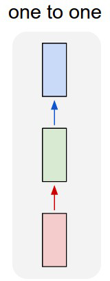
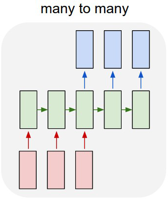
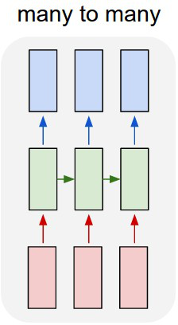
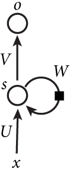
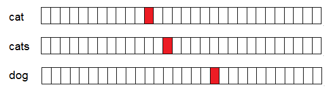

# 
## Recurrent Neural Networks

## Outside Resources

Andrej Karpathy: "The Unreasonable Effectiveness of Recurrent Neural Networks" 2015 

[https://karpathy.github.io/2015/05/21/rnn-effectiveness/](https://karpathy.github.io/2015/05/21/rnn-effectiveness/)

Christopher Olah: "Understanding LSTM Networks", 2015 

[https://colah.github.io/posts/2015-08-Understanding-LSTMs/](https://colah.github.io/posts/2015-08-Understanding-LSTMs/)

## Limitations of Neural Nets

CNNs were created to exploit structured input data, but have limitations:

<ul>
<li class="fragment">They accept a **fixed-size input** (the image);</li>
<li class="fragment">They produce a **fixed-size output** (classes or images);</li>
<li class="fragment">They operate using a **fixed-size number of operations** (layers);</li>
</ul>

<p class="fragment">This works if your data is fixed, but not all data is.</p>

## Unfixed Data Examples

<ul>
<li class="fragment">Genomic sequences;</li>
<li class="fragment">Translation between languages;</li>
<li class="fragment">Time series data;</li>
<li class="fragment">Classifying variable input sequences</li>
</ul>

## Sequence Examples

<div class="l-double">
<div>
**One-to-One**:

- One input, one output (class)
- Example: Part of speech classification
  - Input: "Think"
  - Output: "Verb"

</div>
<div>
{height=100%}
</div>
</div>

## Sequence Examples: One-to-Many

<div class="l-double">
<div>
**One-to-Many**:

- Single input, variable-length output (sequence)
- Example: Sentence completion
  - Input: "Hello"
  - Output: "Hello, how are you?"

</div>
<div>


{height=100%}

</div>
</div>

## Sequence Examples: Many-to-One

<div class="l-double">
<div>
**Many-to-One**:

- Variable-length input, single output (class)
- Example: Sequence classification
  - Input: "I didn't like this movie, it was terrible."
  - Output: "Negative"

</div>
<div>


{height=100%}

</div>
</div>

## Sequence Examples: Many-to-Many (Delayed)

<div class="l-double">
<div>
**Many-to-Many (Delayed)**:

- Variable-length input, variable-length output
- Example: Translation
  - "Hello, my name is Scott."
  - "Hola, me llamo Scott."

</div>
<div>


{height=100%}

</div>
</div>


## Sequence Examples: Many-to-Many (Synchronized)

<div class="l-double">
<div>
**Many-to-Many (Synchronized)**:

- Variable-length input, synchronized output
- Example:
  - Input: Video Sequence
  - Output: Real-time Tracking Locations

</div>
<div>
{height=100%}
</div>
</div>

## Modifications Needed for Sequence Processing

Sequence data processing requires **memory**.

<p class="fragment">
As you read this sentence, the words only make sense in the context of what's come before it.
Even the words are pronounced based on the sequence of the letters, rather than an independent processing of each unit of input.
</p>

<p class="fragment">So there is a **preserved state** that is updated and changed based on the sequence of inputs.</p>

## Diagram of Recurrent Neural Network

<div class="l-double">
<div>
{width=45%}
</div>
<div>

<ul>
<li>\$x\$ is the input, \$o\$ is the output.</li>
<li class="fragment">\$s\$ is the "hidden state" of the network, updated at each timestep.</li>
<li class="fragment">\$\\mathbf{W}\$ is the weight of the hidden state.</li>
<li class="fragment">\$\\mathbf{U}\$ and \$\\mathbf{V}\$ are the weights of the input-to-hidden and hidden-to-output layers, respectively.</li>
<li class="fragment">Each time we "loop around" \$\\mathbf{W}\$, we have another timestep in the sequence.</li> 
</ul>

<p class="fragment">So we can modify this architecture by "unrolling" it to give us a similar, traditional neural network architecture.</p>

</div>
</div>

## Diagram of Recurrent Neural Network

{width=100%}

## Explanation of RNN Calculations

<div class="l-double">
<div>
{width=100%}
</div>
<div>

<ul>
<li>\$x\_{t}\$ is the input at time step \$t\$ (e.g. the \$t\$-th word in a sentence).</li>
<li class="fragment">\$s\_{t}\$ is the "hidden state" at \$t\$, where: \$ s\_{t} = f(\\mathbf{U}x\_{t} + \\mathbf{W}s\_{t-1})\$ and where \$f(\\cdot)\$ is a nonlinearity.</li>
<li class="fragment">\$o\_{t}\$ is the output at step \$t\$. If we're predicting the next word in a sentence, it is a vector of probabilities across all possible words in a vocabulary.</li>
</ul>

</div>
</div>

## Defining Terms

\$s\_{t}\$ is the "memory" of the network, capturing information at all previous timesteps. The output \$o\_{t}\$ is computed based on the memory at \$t\$.

<p class="fragment">Traditional deep networks use different parameters at each layer, but RNNs share parameters \$\\mathbf{U}, \\mathbf{V}, \\mathbf{W}\$ across all time steps.</p> 

<p class="fragment">This means that we don't have to train a unique network on every single input (which would be overfitting).</p>

<p class="fragment">Outputs depend on the purpose: Many-to-one networks may only be interested in the final output.</p>

# 
## RNNs for NLP

## Text Generation

Simple problem: Given a sequence of words, can we predict the most likely next word?

<ul>
<li class="fragment">Input: Sequence of words</li>
<li class="fragment">Output: Next predicted word</li>
</ul>

<p class="fragment">This is a **Many-to-One** problem, or a **Many-to-Many (Delayed)** problem if we want to generate a sequence of words from a "starting" sequence.</p>

## First: How Do We Represent Text?

In images, an RGB pixel with values [0, 255, 0] (green) is more similar to a pixel [0, 250, 0] (slightly darker green) than to a pixel [255, 0, 0] (red). 

<p class="fragment">With language, this doesn't hold.</p> 

<p class="fragment">**Car[d]** vs. **Car[e]**: "d" and "e" are right next to each other in the alphabet, but these two words have nothing in common.</p>

<p class="fragment">So we want to translate words into a vector representation of some kind that can give us greater descriptive power over what the words mean (and how they might be related to one another).</p>

## Types of Word Representations

**Vector space models** (VSMs): Embed words into a continuous vector space, where distance is proportional to similarity in meaning.

<p class="fragment">One method is to represent words in a sparse, high-dimensional form called a **one-hot** vector, where each word is a vector with dimensionality equal to the vocabulary size.</p>

<p class="fragment">The vector is zeros everywhere except the location that represents the word of interest.</p>

## One-Hot Vector Illustration

{width=100%}

## Alternate Representations

Problems: Large vocabularies lead to large, very sparse dimensional spaces (most of the elements are zero). 

<p class="fragment">Alternative representations of words, such as **word2vec**, attempt to create a vector representation of a word based on its use in actual language (how often it appears next to other words or in different contexts).</p>

<p class="fragment">If you are interested in word embeddings and search-and-retrieval, it's worth looking at the **[Tensorflow Tutorial on word2vec: https://www.tensorflow.org/tutorials/word2vec](https://www.tensorflow.org/tutorials/word2vec)**</p>

# 
## Training RNNs

## Training Sequence Data

Training is done through  **Backpropagation Through Time** (BPP): Since parameters are shared by all time steps in the network, we have to take into account all previous timesteps in order to calculate the gradient at time \$t\$.

## Defining Terms

Our hidden state (memory) and the output of a single unit are, respectively:

<div class="l-double">
<div>
{width=80%}
</div>
<div>
\\begin{align}
s\_{t} \&= \tanh(\\mathbf{U}x\_{t} + \\mathbf{W}s\_{t-1}) \\\\
o\_{t} \&= \\textrm{softmax}(\\mathbf{V}s\_{t})
\\end{align}
</div>
</div>

## Defining Error

Gradient descent and backpropagation require an error function. If \$\\hat{o}\$ is the "correct" output, then:

<p class="fragment">
\\begin{align}
E\_{t}(\\hat{o}\_{t},o\_{t}) \&= -\\hat{o}\_{t}\\log o\_{t} \\\\
E(\\hat{o},o) \&= \\sum\_{t} E\_{t}(\\hat{o}\_{t}, o\_{t}) \\\\
\&= -\\sum\_{t} \\hat{o}\_{t}\\log o\_{t}
\\end{align}
</p>

<p class="fragment">\$\\hat{o}\_{t}\$ is the correct word at time step \$t\$, and \$o\_{t}\$ is our prediction. This is the **cross-entropy loss function**, and is calculated over all timesteps (since we typically treat one full sentence as a training exmaple).</p>

## Summing Error Partials

Since we're learning the gradient of the error with respect to the parameters, we can sum over the timesteps for each of \$\\mathbf{U}, \\mathbf{V}, \\mathbf{W}\$:

\\begin{align}
\\frac{\\partial E}{\\partial \\mathbf{V}} \&= \\sum\_{t}\\frac{\\partial E\_{t}}{\\partial
\\mathbf{V}} \\\\
\\frac{\\partial E}{\\partial \\mathbf{U}} \&= \\sum\_{t}\\frac{\\partial E\_{t}}{\\partial
\\mathbf{U}} \\\\
\\frac{\\partial E}{\\partial \\mathbf{W}} \&= \\sum\_{t}\\frac{\\partial E\_{t}}{\\partial
\\mathbf{W}} \\\\
\\end{align}

## Calculating Backpropagation: \$\\mathbf{V}\$

We calculate the chain rule working backwards from the output \$o\_{t}\$. So starting with \$\\mathbf{V}\$:

<div class="l-double">
<div>
{width=80%}
</div>
<div>
\\begin{align}
\\frac{\\partial E\_{t}}{\\partial \\mathbf{V}} \&= \\frac{\\partial
E\_{t}}{\\partial o\_{t}}\\frac{\\partial o\_{t}}{\\partial\\mathbf{V}} \\\\
\&=\\frac{\\partial E\_{t}}{\\partial o\_{t}}\\frac{\\partial o\_{t}}{\\partial
z\_{t}}\\frac{\\partial z\_{t}}{\\partial\\mathbf{V}} \\\\
\&=(o\_{t} - \\hat{o}\_{t}) \\otimes s\_{t}
\\end{align}
</div>
</div>

where \$z\_{t} = \\mathbf{V}s\_{t}\$ and \$\\otimes\$ is the outer product. The error at time \$t\$ depends only on the last line, \$\\hat{o}\_{t}, o\_{t}, s\_{t}\$.

## Calculating Backpropagation: \$\\mathbf{W}\$

Now we calculate the gradient for \$\\mathbf{W}\$, the weights carried between the hidden states:

<div class="l-double">
<div>
{width=80%}
</div>
<div>
\$ \\frac{\\partial E\_{t}}{\\partial \\mathbf{W}} = \\frac{\\partial
E\_{t}}{\\partial o\_{t}}\\frac{\\partial o\_{t}}{\\partial
s\_{t}}\\frac{\\partial s\_{t}}{\\partial\\mathbf{W}} \$
</div>
</div>

Now, since \$s\_{t} = \tanh(\\mathbf{U}x\_{t} + \\mathbf{W}s\_{t-1})\$, and we're taking the derivative with respect to \$\\mathbf{W}\$, we can no longer ignore the fact that \$s\_{t}\$ relies on \$s\_{t-1}\$ which in turn relies on \$s\_{t-2}\$ and so on.

## Calculating Backpropagation Through Time

So in reality, if we apply the chain rule again, we end up summing across all
timepoints up to the current one:

\$ \\frac{\\partial E\_{t}}{\\partial\\mathbf{W}} = \\sum\_{k=0}\^{t}\\frac{\\partial
E\_{t}}{\\partial \\hat{y}\_{t}}\\frac{\\partial\\hat{y}\_{t}}{\\partial
s\_{t}}\\frac{\\partial s\_{t}}{\\partial s\_{k}}\\frac{\\partial
s\_{k}}{\\partial\\mathbf{W}} \$

<p class="fragment">Since \$\\mathbf{W}\$ is used in every step up until the step we're interested in, we sum up throughout the network.</p>

## Illustration of BPTT

{width=80%}

## Difficulties in Training RNNs

A similar BPTT process is used for calculating \$\\frac{\\partial E\_{t}}{\\partial\\mathbf{U}}\$.

<p class="fragment">As our sequences get longer, we calculate more and more gradients -- equivalent to stacking more layers in the network.</p>

<p class="fragment">Thus RNNs have difficulty with long sequences, both because of the amount of computation needed as well as another problem which we will discuss next.</p>

<p class="fragment">These are the same problems as with "very deep" convolutional networks.</p>

# 
## Vanishing Gradient Problem

## Meaning of Deep Layers in RNNs

As deep networks grow, gradients tend to get lost as they are propagated back from the outputs to the inputs.

<p class="fragment">In CNNs, additional layers correspond to learning "higher-level" features.</p>

<p class="fragment">In RNNs, more layers correspond to more timepoints, we're talking about learning connections between inputs (word embeddings) at widely varied timepoints (words that are very far apart from each other).</p>

## Example of Word Distance and Meaning

> It was the Dover road that lay, on a Friday night late in November, before the
> first of the persons with whom this history has business.

## Example of Word Distance and Meaning

> It was the Dover road that lay, on a Friday night late in November, before the
> first of the persons with whom this history has business.

This is a line from the beginning of "A Tale of Two Cities"; it's an example of a sentence where word distances have a lot of meaning:

<ul>
<li class="fragment">There is a road (a road in Dover, a town in Kent in England);</li>
<li class="fragment">The description includes a time: Friday night in late November;</li>
<li class="fragment">There is a person;</li>
<li class="fragment">The road is "before" the person (here, "before" means "in front of");</li>
<li class="fragment">The person is the "first" involved in the story, implying that there may be others.</li>
</ul>

## Example of Word Distance and Meaning

> It was the Dover road that lay, on a Friday night late in November, before the
> first of the persons with whom this history has business.

There are 15 words between "road" and "persons", so understanding the relationship between the two (the road is in front of the person) requires at least 15 timepoints (layers, with their chained gradients).

<p class="fragment">You can imagine that as the timesteps increase, the layer stacks get larger and larger -- eventually larger than ResNet!</p>

## Extending Gradients Gets Worse

\$ \\frac{\\partial E\_{t}}{\\partial\\mathbf{W}} = \\sum\_{k=0}\^{t}\\frac{\\partial
E\_{t}}{\\partial o\_{t}}\\frac{\\partial o\_{t}}{\\partial
s\_{t}}\\frac{\\partial s\_{t}}{\\partial s\_{k}}\\frac{\\partial
s\_{k}}{\\partial\\mathbf{W}} \$

The \$\\mathbf{W}\$ gradient includes the term \$\\frac{\\partial
 s\_{t}}{\\partial s\_{k}}\$, which itself expands to a chain rule.
 
<p class="fragment">So for \$t=3, k=1\$:</p>

<p class="fragment">\$ \\frac{\\partial s\_{3}}{\\partial s\_{1}} = \\frac{\\partial s\_{3}}{\\partial s\_{2}}\\frac{\\partial s\_{2}}{\\partial s\_{1}}\$</p>

<p class="fragment">And so on; as \$t\$ increases, then the distance between \$t\$ and 1 increases, so we end up with more and more terms in the gradient.</p>

## Jacobian Matrix

Since \$\\frac{\\partial s\_{t}}{\\partial s\_{k}}\$ is a partial derivative of
a vector function with respect to a vector input, the result is a **Jacobian
matrix** whose elements are pointwise derivatives. 

<p class="fragment">We can rewrite the gradient as:</p>

<p class="fragment">
\$ \\frac{\\partial E\_{t}}{\\partial \\mathbf{W}} = \\sum\_{k=0}\^{t}\\frac{\\partial E\_{t}}{\\partial o\_{t}}\\frac{\\partial o\_{t}}{\\partial
s\_{t}}\\left(\\prod\_{j=k+1}\^{t}\\frac{\\partial s\_{j}}{\\partial
s\_{j-1}}\\right)\\frac{\\partial s\_{k}}{\\partial \\mathbf{W}} \$
</p>

<p class="fragment">The 2-norm of this matrix has an upper bound of 1, since our activation function (\$\\tanh\$) maps all the inputs to between \$[-1, 1]\$. The derivative, \$\\frac{\\partial \\tanh(x)}{\\partial x} = 1 - \\tanh\^{2}(x)\$, is bounded above by 1 as well.</p>

## Activation Function and Its Derivative

{width=70%}

## Consequences of Gradient Functions

<div class="l-double">
<div>
{width=100%}
</div>
<div>
Recall that the purpose of the activation function is twofold:

<ol>
<li class="fragment">Model nonlinear interactions between inputs, and</li>
<li class="fragment">"Squash" the inputs \$x\$ into a specified range, typically \$[0, 1]\$ or \$[-1, 1]\$.</li>
</ol>

<p class="fragment">
However, the **derivative** of \$\tanh\$ approaches 0 as the inputs become larger. This means that as you perform BPTT, your gradient calculations include multiplication by very small numbers.
</p>
</div>
</div>

## Consequences of Vanishing Gradients

If the gradients go to zero, that means that **you aren't altering your weights based on errors generated at large timesteps**.

> At the library, patrons are able to select and take home a wide variety of
> [BLANK].

<p class="fragment">In training, the predicted word [BLANK] is compared with the actual word of the training sentence; so if the actual sentence ended with "books", but the classifier returns "puppies", that would be an error. We would then start calculating our gradient.</p>

<p class="fragment">**This is an error is due to the word "library", which is 12 words away!** If the gradients vanish before they get to that point in the BPTT, then we won't use the information at the beginning of the sentence to adjust to the prediction at the end.</p>

## Vanishing vs. Exploding Gradients

There is a similar problem of **exploding gradients**, but:

<ul>
<li class="fragment">Exploding gradients will crash your program, so it's obvious; and</li>
<li class="fragment">You can fix exploding gradients by clipping them if they get too large.</li>
</ul>

<p class="fragment">Conversely, vanishing gradients won't crash your computer,
they will just cause your RNN to train very poorly.</p> 

<p class="fragment">So you may not notice that that's the problem unless you look for it.</p>

## Solutions to Vanishing Gradients

Luckily, the solutions to this problem are pretty simple:

<ol>
<li class="fragment">Initialize \$\\mathbf{W}\$ carefully;</li>
<li class="fragment">Regularize the results of gradient calculations to prevent vanishing;</li>
<li class="fragment">Don't use an activation function with this problem (the RELU unit we discussed earlier has derivatives of just 0 or 1);</li>
<li class="fragment">Use a non-vanilla implementation of RNNs that don't suffer from this issue.</li>
</ol>

<p class="fragment">Solutions 3 and 4 are the most popular; in fact, RNNs are rarely used in vanilla form nowadays because of their limited sequence capacity.</p>

# 
## Example Results of RNNs

## Stealing Others' Examples

The following examples are from Andrej Karpathy's website, where he implements a **character-level RNN**: instead of predicting words, he's predicting the next letter or symbol in a sequence.

<p class="fragment">In each case, the training set is just a text file, and the classifier is given a "starter word" to initialize. Then it predicts character-by-character what should come next.</p>

<p class="fragment">Also, he's using a **long-short term memory (LSTM)** network, which we'll cover next lecture.</p>

## English Text

The first sample is a set of essays on startups and business. This is a 1MB text file, which contains about 1 million characters (a fairly small sample size for this kind of work).

<p class="fragment">Here's a sample produced by the RNN:</p>

<p class="fragment">
```
The surprised in investors weren't going to raise money. I'm not the company
with the time there are all interesting quickly, don't have to get off the
same programmers. There's a super-angel round fundraising, why do you can do.
If you have a different physical investment are become in people who reduced
in a startup with the way to argument the acquirer could see them just that
you're also the founders will part of users' affords that and an alternation
to the idea. [2] Don't work at first member to see the way kids will seem in
advance of a bad successful startup. And if you have to act the big company
too.
```
</p>

## Shakespeare's Plays {.fragile}

Next is a set of Shakespeare's plays, which are a 4.4MB text file.

```
PANDARUS:
Alas, I think he shall be come approached and the day
When little srain would be attain'd into being never fed,
And who is but a chain and subjects of his death,
I should not sleep

Second Senator:
They are away this miseries, produced upon my soul,
Breaking and strongly should be buried, when I perish
The earth and thoughts of many states.

DUKE VINCENTIO:
Well, your wit is in the care of side and that.
```

## Wikipedia Text

The RNN can also produce markup. Here it's trained on Wikipedia markup text.

```
Naturalism and decision for the majority of Arab countries' capitalide was grounded
by the Irish language by [[John Clair]], [[An Imperial Japanese Revolt]], associated
with Guangzham's sovereignty. His generals were the powerful ruler of the Portugal
in the [[Protestant Immineners]], which could be said to be directly in Cantonese
Communication, which followed a ceremony and set inspired prison, training. 
Many governments recognize the military housing of the
[[Civil Liberalization and Infantry Resolution 265 National Party in Hungary]],
that is sympathetic to be to the [[Punjab Resolution]]
(PJS)[http://www.humah.yahoo.com/guardian.
cfm/7754800786d17551963s89.htm Official economics Adjoint for the Nazism, Montgomery
was swear to advance to the resources for those Socialism's rule,
was starting to signing a major tripad of aid exile.]]
```

## From Text to Code: LaTeX

Let's get more complex and generate a mix of code and text, like a \LaTeX document.

{width=50%}

## From Text to Code: LaTeX

One of these is from the RNN, and the other is from a previous lecture that I wrote.

```
\section{Recap Last Lecture}\label{recap-last-lecture}
\\begin{frame}{Recap: Rationale for Deep Networks}
In theory, neural networks can replicate any function (decision
surface), no matter how complicated. "In theory".
In reality, this would require an unreasonable number of:
\\begin{itemize}
\tightlist
\item \\textbf{\\emph{Input nodes}}, to describe increasingly large data
  types;
\item \\textbf{\\emph{Input samples}}, to accurately describe a complex,
  varied class space;
\item \\textbf{\\emph{Hidden nodes}}, to capture the nonlinear relationship
  between the inputs and desired outputs;
\item \\textbf{\\emph{Hours}}, to fully train a network on all this data;
\item \\textbf{\\emph{Dollars}}, to buy the hardware required for such a
  massive undertaking.
\\end{itemize}
```

## From Text to Code: LaTeX

One of these is from the RNN, and the other is from a previous lecture that I wrote.

```
\\begin{proof}
We may assume that \$\\mathcal{I}\$ is an abelian sheaf on \$\\mathcal{C}\$.
\item Given a morphism \$\\Delta : \\mathcal{F} \to \\mathcal{I}\$
is an injective and let \$\mathfrak q\$ be an abelian sheaf on \$X\$.
Let \$\\mathcal{F}\$ be a fibered complex. Let \$\\mathcal{F}\$ be a category.
\\begin{enumerate}
\item \hyperref[setain-construction-phantom]{Lemma}
\label{lemma-characterize-quasi-finite}
Let \$\\mathcal{F}\$ be an abelian quasi-coherent sheaf on \$\\mathcal{C}\$.
Let \$\\mathcal{F}\$ be a coherent \$\\mathcal{O}\_X\$-module. Then
\$\\mathcal{F}\$ is an abelian catenary over \$\\mathcal{C}\$.
\item The following are equivalent
\\begin{enumerate}
\item \$\\mathcal{F}\$ is an \$\\mathcal{O}\_X\$-module.
\\end{lemma}
```

## The Ultimate Test: Source Code

By training on the Linux source code, the RNN can almost write a program.

```
/*
 * Increment the size file of the new incorrect UI\_FILTER group information
 * of the size generatively.
 */
static int indicate\_policy(void)
{
  int error;
  if (fd == MARN\_EPT) {
    /*
     * The kernel blank will coeld it to userspace.
     */
    if (ss->segment < mem\_total)
      unblock\_graph\_and\_set\_blocked();
    else
      ret = 1;
    goto bail;
  }
```

# 
## Parting Words

## More with Recurrent Nets

Next lecture we will go over extensions to RNNs, including **Long-Short Term Memory (LSTM)** and **Gated Recurrent Unit (GRU)** networks -- these are designed to explicitly account for vanishing gradients, allowing them to train much longer sequences.

<p class="fragment">Just like ResNet has kind of taken over as the "default" CNN, LSTM networks have done the same for RNNs in recent papers.</p>
