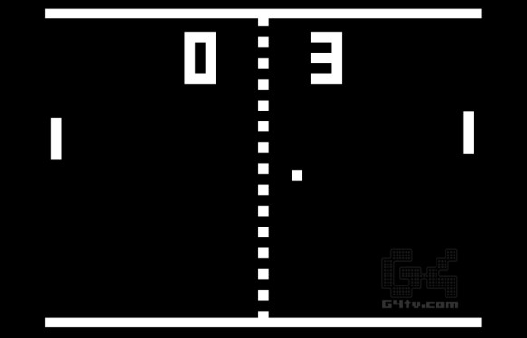
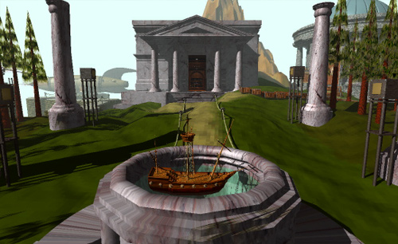
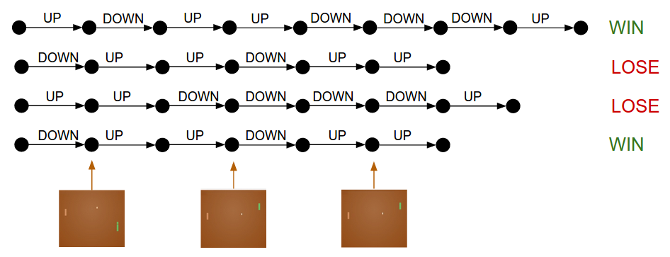
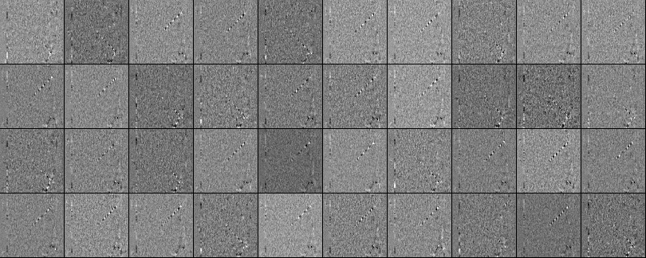

# 
## Reinforcement Learning
## Learning Strategies

Think about how neural networks (and people!) learn to do complex tasks.

We use **error functions**: measuring how well or how poorly we can accomplish
a task.

In neural nets, we try to minimize the error function through backpropagation:

<ul>
<li class="fragment">Differentiate the error function</li>
<li class="fragment">Update parameters (weights and biases)</li>
<li class="fragment">Re-calculate error</li>
<li class="fragment">Repeat</li>
</ul>

## Human Learning

**Positive** and **Negative** reinforcement: learn behavior through a
combination of **rewards** or **punishments**, respectively.

Through a process of trial-and-error, an **agent** (the learner) tries to
maximize its reward and minimize its punishment.

In neural nets, this process is known as **reinforcement learning**, or RL for
short.

## Reinforcement Learning to a Common Task

RL is interesting because it is able to learn progressively more difficult tasks
with simple reward mechanisms.

It's precisely the same principle that has been used to train mice to pull
levers for food pellets.

Or, if you're like me...

## Video Games as Environments for RL

Video games provide a reward / punishment mecahnism for playing properly.

Different games operate on different levels, but even the most basic of games
(e.g. Pong) has a scoring system and a win / lose effect that allows the agent
(player) to know what actions to take to maximize their score.

As games get more complex, the relationship between action and reward may be
more obscure...

## Pong

{width=70%}

## Super Mario Brothers

{width=70%}

## The Legend of Zelda

{width=70%}

## Final Fantasy VI

{width=60%}

## World of Warcraft

{width=45%}

## Complexity, Boiled Down

Games have a finite set of possible actions (controls) that the agent
can perform, in an environment described by the pixels on the screen (plus audio
cues, plus force feedback...).

There are different goals in each, but there is some way of keeping track of
what's going on (e.g. a score counter, an experience level, a progression
through the storyline) and a direction to go in.

To keep things simple, let's use Pong as an example.

## Pong, The Grandparent of Gaming

{width=100%}

<ul>
<li class="fragment">A small environment: 210x160x3 screen</li>
<li class="fragment">The agent has two inputs: UP or DOWN</li>
<li class="fragment">Reward: +1 point for passing the opponent's paddle</li>
<li class="fragment">Punishment: -1 score if the ball passes your own paddle</li>
<li class="fragment">If the ball contacts a paddle, it changes velocity based on
some physics rules (angle of contact and velocity of the paddle).</li>
</ul>

## Pong, The Grandparent of Gaming

{width=100%}

The game state changes with each timestep, both by the rules of the game and by
user actions.

**Training goal**: For a given game state, choose an action that maximizes the
eventual reward. 

# 
## Policy Network
## Policy Network

The first thing we need to do is construct our "agent". This will be in the form
of a **policy network**: it describes the agent's decision-making process.

For Pong, the "decision" is which action to take (go UP or DOWN).

For more complex games, the decision might be a multiclass network: LEFT, RIGHT,
JUMP, ATTACK.

The policy network has 2 layers and takes in the raw image pixels
(\$210\\times160\\times3 = 100,800\$) as input and produces a single probability
of moving UP.

This probability distribution is **sampled** to get the actual move -- i.e.
instead of taking the softmax and always moving UP if the probability is greater
than 0.5, we flip a **biased** coin and take the appropriate action.

## Mathy Description

So we have:

<ul>
<li class="fragment">The input \$\\mathbf{x}\$, a \$d=100,800\$-dimensional vector.</li>
<li class="fragment">The weights \$\\mathbf{W}\_{1}\$, a \$100,800 \\times H\$ matrix (where \$H\$ is the number of hidden nodes)</li>
<li class="fragment">The nonlinearity, in this case RELU, which thresholds the inputs</li>
<li class="fragment">The weights \$\\mathbf{W}\_{2}\$, a \$H \\times 1\$ matrix</li>
<li class="fragment">A sigmoid function \$\\sigma\$ to yield a probability</li>
</ul>

## Intuitive Explanations

The weight matrices are initialized randomly, and the sigmoid produces an output
in the range of \$[0, 1]\$. 

\$\\mathbf{W}\_{1}\$ (hidden layer weights) encode various game situations (location
of opponent, ball, and agent) while \$\\mathbf{W}\_{2}\$ encodes the decision-making
process.

We pass the network "difference frames" as inputs, so the network understands
the motion of the ball from one timepoint to the next.

Now, our goal is to train the weights \$\\mathbf{W}\_{1}\$ and \$\\mathbf{W}\_{2}\$ to
play Pong.

## Credit Assignment Problem

{width=60%}

Have you ever played a game where you had no idea what you were supposed to do?

## Credit Assignment Problem

The problem we have is somewhat sparse:

<ul>
<li class="fragment">How do we know that moving UP on frame 72 (represented by 100k weights) led to us receiving a point on frame 203?</li>
<li class="fragment">What if some actions, like spastically moving the paddle up and down, appear to provide a benefit when in reality they have nothing to do with the eventual outcome?</li>
</ul>

This is similar to the problem facing LSTMs (far-apart inputs affecting error).
To address this, we use the idea of **policy gradients**.

# 
## Policy Gradients
## Comparison with Supervised Learning

In traditional supervised learning, we have a "true" output label that we assign
to each forward pass of the network.

Pong Example: If we somehow "knew" that, given a particular environment
(the ball is coming at us at an oblique angle) the optimal move is to go UP,
then we could build an error function that measures how "wrong" each decision is
and uses backpropagation to correct the parameters that led to the incorrect
action.

## Supervised Learning Scenario

{width=100%}

## Reinforcement Learning

In RL, we don't have a label for each **action**. Instead, we are
trying to maximize **eventual total reward.**

So let's say that the output probability is 0.7, meaning that the agent is 70%
likely to move UP (and it does so).

**We don't yet know if going UP is actually beneficial.** So we have to hold
onto that decision until the end of the game, see whether we won, and then
update the parameters accordingly.

If we win, then for each input frame that led to a specific output decision, the
corresponding weights are updated to make those decisions more likely in the
future.

If we lose, then it does the opposite.

## Reinforcement Learning

{width=100%}

## Reinforcement Learning: Rollouts

Playing through a single game (i.e. from the start to the acquisition of the
reward / punishment) is called a **rollout**.

Again, like a human, the system plays thousands of rollouts to learn which sets
of actions are most likely to lead to rewards.

# 
## Training in RL
## How to Train

First, randomly initialize \$\\mathbf{W}\_{1}\$ and \$\\mathbf{W}\_{2}\$.

Then play a hunred games of Pong.

Assuming each game is 200 frames, we've made \$200\\times 100 = 20,000\$
decisions; for each decision, we know the parameter gradient, which tells us
how to modify the parameters (depending on the eventual result).

So now we can label every decision as either good or bad, and adjust parameters
accordingly. The label comes from the outcome of the game (+1 for winning, -1
for losing), so each of the input / action pairs that was taken in the
winning episode becomes slightly encouraged in the future, and each of the
input/action pairs in the losing episodes becomes discouraged.

Then you repeat the process with our updated policy, and do that a bajillion
times.

## Schematic of RL Learning

{width=100%}

## Training is Exhausting

Training is hard because of the length of the sequences and the unpredictability
of action \$\\rightarrow\$ reward.

Good actions do not always lead to positive eventual outcomes, but **over the
course of millions of games, good actions should be encouraged more than
discouraged**.

You also end up with a lot of "neutral" actions that legitimately do not affect
the outcome, and so they won't be overly encouraged / discouraged.

## Discounted Rewards

We can generalize our reward feedback by saying that at timestep \$t\$ we should
receive some reward \$r\_{t}\$. We can choose instead to use a discounted reward:

\$ R\_{t} = \\sum\_{k=0}\^{\\infty} \\gamma\^{k}r\_{t+k}\$

where \$\\gamma\^{k}\\in[0, 1]\$ called a discount factor. Thus, the reward at time
\$t\$ is a function of **all successive timepoints** rather than a static reward
applied to each action in a rollout.

In this formulation, later rewards are less important -- that is, the reward
assigned to your first action should be more closely tied to the second, third,
and forth action than to the hundredth action.

## Policy Gradient Derivations

Policy Gradients are **score function gradient estimators**. Consider the expected
value of a scalar score function \$f(x)\$ (our reward function) under a
probability distribution \$p(x|\\theta)\$ (our policy network) parameterized by
\$\\theta\$:

\$ E\_{x~p(x|\\theta)}[f(x)]\$

## Policy Gradient Derivations

So how should we shift the distribution through its parameters to obtain a
higher reward? **Gradient descent**, of course:

\\begin{align}
\\nabla\_{\\theta}E\_{x}[f(x)] \&=
\\nabla\_{\\theta}\\sum\_{x}p(x)f(x)\&\\quad\\textrm{definition of expectation}\\\\
\&=\\sum\_{x}\\nabla\_{\\theta}p(x)f(x)\&\\quad\\textrm{swap sum and gradient} \\\\
\&=\\sum\_{x}p(x)\\frac{\\nabla\_{\\theta}p(x)}{p(x)}f(x)\&\\quad\\textrm{multiply and
divide by }p(x) \\\\
\&=\\sum\_{x}p(x)\\nabla\_{\\theta}\\log(p(x))f(x)\&\\quad\\nabla\_{\\theta}\\log(z)=\\frac{1}{z}\\nabla\_{\\theta}z \\\\
\&=E\_{x}[f(x)\\nabla\_{\\theta}\\log(p(x))]\&\\quad\\textrm{definition of expectation}\\\\
\\end{align}

## Policy Gradient Derviation

\$\\nabla\_{\\theta}E\_{x}[f(x)]= E\_{x}[f(x)\\nabla\_{\\theta}\\log(p(x))]\$

The term \$\\nabla\_{\\theta}\\log(p(x))\$ gives us the direction and magnitude of the
gradient according to the log of our policy network output \$p(x)\$ (i.e. the driver of
our decision-making process), given a sampled action \$x\$.

The term \$f(x)\$ tells us whether the action \$x\$ is associated with a positive or
negative outcome.

So a negative outcome will **reverse** the gradient values -- in other words,
it modifies parameter values to cause **the opposite of \$x\$** to be more
likely.

## Gradient Illustration

{width=100%}

# 
## Implementation and Examples
## Community to the Rescue!

The OpenAI Gym _[(link)](https://gym.openai.com/)_ has been set up to provide a
number of different environments to test reinforcement learning. Check out the
games people have taught AI to play!

Karpathy posted a 130-line Python script
_[(here)](https://gist.github.com/karpathy/a4166c7fe253700972fcbc77e4ea32c5)_
that implements a 2-layer network with 200 hidden layer units which learns to
play Pong fairly well after 200,000 games (8,000 episodes). You can see a video
of the computer player _[here](https://www.youtube.com/watch?v=YOW8m2YGtRg)_.

Atari games are pretty popular for RL due to their limited input space (usually
a single, small, static screen) and possible action space (discrete, limited
inputs). Games like PacMan
([**link**](https://www.youtube.com/watch?v=QilHGSYbjDQ)) are another example
of a nice, well-defined RL scenario.

One question to ask: Just like with CNNs, what are the networks actually
"learning"? Let's look at the learned weights!

## Learned Weights

{width=100%}

## Unleash the Gamers

In 2016, the mad scientists at Google DeepMind
([**link**](https://deepmind.com)) published a paper in Nature
([**link**](https://storage.googleapis.com/deepmind-media/alphago/AlphaGoNaturePaper.pdf))
describing their process for teaching a reinforcement agent how to play Go,
which they called AlphaGo.

Then, in 2017, another AI group, OpenAI ([**link**](https://openai.com/)),
managed to train a system that could beat DOTA 2
([**link**](https://openai.com/blog/more-on-dota-2/), [**video
1**](https://www.youtube.com/watch?v=cLC\_GHZCOVQ), [**video
2**](https://www.youtube.com/watch?v=yEOEqaEgu94)).

THEN, last year, DeepMind developed an agent that plays Starcraft 2, which (of
course) they called AlphaStar
([**link**](https://deepmind.com/blog/alphastar-mastering-real-time-strategy-game-starcraft-ii/),
[**video**](https://www.youtube.com/watch?v=DMXvkbAtHNY)).

# 
## Parting Words
## Why Did We Do This?

Reinforcement Learning isn't really about teaching computers to play video games
(as awesome as that is).

The idea is to define a very general algorithm to take in a reward / punishment
mechanism and develop a complex set of human-like behavior to try and maximize
rewards.

Instead of a high score, what if we wanted to maximize an investment portfolio?

Or patient responses to treatment?

Or...

## Reinforcement Learning... In 1983

{width=80%}
