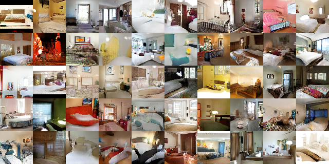
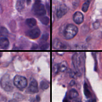

# 
## Recap: (Variational) Autoencoders
## Recap: Image Manifold

{width=75%}

## Recap: Image Manifold Sampling

{width=75%}

## Recap: Autoencoders

Autoencoders do two things:

<ol>
<li class="fragment">Build an image-space manifold</li>
<li class="fragment">Sample the manifold to generate samples</li>
</ol>

## Recap: Autoencoder Diagram

{width=90%}

## Recap: Undercomplete Autoencoders

If \$\\mathbf{x} \\in \\mathbb{R}\^{d}\$, then making
\$\\mathbf{h}\\in\\mathbb{R}\^{\\widehat{d}}\$, where \$\\widehat{d}<d\$, forces the
encoder to "learn" the most important parts of \$\\mathbf{x}\$.

This is **bottlenecking** or **limited bandwidth**, and results in an
**undercomplete autoencoder**.

## Recap: Training

**Regularization** takes on many forms:

<ul>
<li class="fragment">**Loss Function**: \$L(\\mathbf{x}, g(f(\\mathbf{x})))\$</li>
<li class="fragment">**Sparse Autoencoder**: \$L(\\mathbf{x}, g(f(\\mathbf{x}))) + \\Omega(\\mathbf{h})\$</li>
<li class="fragment">**Contractive Autoencoder**: \$L(\\mathbf{x}, g(f(\\mathbf{x}))) + \\Omega(\\mathbf{h}, \\mathbf{x})\$</li>
<li class="fragment">**Denoising Autoencoders**: \$L(\\mathbf{x}, g(f(\\widetilde{\\mathbf{x}})))\$</li>
</ul>

## Recap: VAE

**Variational Autoencoders** (VAEs) define the encoder and decoder
probabilistically:

\$ q\_{\\phi}(\\mathbf{h}|\\mathbf{x}) \\qquad \\textrm{Encoder} \$

\$ p\_{\\theta}(\\widetilde{\\mathbf{x}} | \\mathbf{h}) \\qquad \\textrm{Decoder} \$

To avoid degenerate solutions, we force the system to implement
a **conjugate prior** in the form of a spherical unit Gaussian:

\$ \\mathbf{h}\\sim\\mathcal{N}(0,I) \$

## Recap: MNIST Dataset

{width=35%}

## Example: Epoch 10

{width=100%}

{width=70%}

## Example: Latent Walks

{width=45%}

# 
## Adversarial Networks
## Adversarial Training Overview
**Regularization**: The goal is to ensure that we learn a hidden latent space
without over-training (just copying things over).

There's another way to train these kinds of networks, and that's using
**Adversarial** training.

## Adversarial Training Intuition

Ever hear of the **Turing test**?

Video: [Brian Christian, "The Most Human Human"](https://youtu.be/lFIW8KphZo0?t=40)

## Judging Generated Outputs

{width=80%}

When we see the results of a generative network (e.g. an autoencoder), how do we
judge how "good" it is?

In other words: what is the loss function that we are trying to optimize?

## Turing Loss Function

In training generative networks, we compare the input image to the output. 

But in inference or testing, humans look at the output and try to guess whether
an AI "drew" the sample, or if it is a real one.

If it can fool us, then we would say that the network has successfully been
trained.

What if we use that feedback to **train** the network in the first place? We
might call this a "Turing Loss" function.

## Human Judges

Obviously, for image-based autoencoders, we can't have a person sift through
millions of generated samples hundreds of times just to provide a numeric loss
function for each output in terms of whether or not it's a "real" or "fake"
generated sample.

## Any Volunteers?

{width=45%}

## Human Judges

That would be tedious, expensive, time-consuming, and error-prone.

If only there was a robot who could sit around and judge generated samples all
day...

## It's AI All the Way Down

{width=90%}

## Training GANs

The "generator" \$G\$ is just like the "decoder" that we saw previously.

The "discriminator" \$D\$ is a standard CNN, where the inputs are images and the
outputs are labels of "authenticity".

## Training GANs

Here are the steps a GAN takes:

<ol>
<li class="fragment">The generator \$G\$ takes in a random vector with \$\\widehat{d}\$ dimensions and spits out an image.</li>
<li class="fragment">The image is fed into the discriminator \$D\$, with label \$0\$, along with a stream of real images, each with label \$1\$.</li>
<li class="fragment">The discriminator generates a probability for each input as to whether it is "real" (1) or "fake" (0).</li>
</ol>

## Training GANs

We have **two** networks in this scenario that we are trying to train
simultaneously.

We switch back-and-forth between training the discriminator and training the
generator, each time keeping the other steady.

The loss of the discriminator causes it to **get better at spotting fake
images**, while the loss of the generated causes it to **get better at
generating fake images**.

## Training GANs

Since now we're generating two deep networks at once, these take a **long**
time to train.

There's no real way around this, but the upside is that we can start to see some
franky scary results...

# 
## Examples

## Example Results

You can find implementations of GANs throughout the internet.

I'll show a few different example results, along with links so you can try this
out yourself.

## Neural Face

{width=35%}

[Neural Face Project](https://carpedm20.github.io/faces/): **https://carpedm20.github.io/faces/**

[code](https://github.com/carpedm20/DCGAN-tensorflow): **https://github.com/carpedm20/DCGAN-tensorflow**

## Neural Face Latent Walk

{width=100%}

The latent walk in the "face-space" shows that it really is learning
higher-level features -- like different facial expressions!

## DC-GAN

{width=80%}

[DC-GAN](https://github.com/Newmu/dcgan_code): **https://github.com/Newmu/dcgan_code**

## DC-GAN

{width=80%}

[DC-GAN](https://github.com/Newmu/dcgan_code): **https://github.com/Newmu/dcgan_code**

## Bedroom Latent Walk

{width=40%}

[DC-GAN](https://github.com/Newmu/dcgan_code):
**https://github.com/Newmu/dcgan_code**

## Bedroom Latent Walk

{width=100%}

## Latent Space Arithmetic

So this latent space... Is it like any other space? Like, can you add and
subtract components of the latent space?

And if those "vectors" refer to image "features"...

## Latent Space Arithmetic

{width=90%}

## Nvidia StyleGAN

Want to never trust anything you see ever again?

- [This Person Does Not Exist](https://thispersondoesnotexist.com/)
- [Nvidia StyleGAN Demonstration](https://www.youtube.com/watch?v=kSLJriaOumA)

## Biology Examples

Okay, so... "Biomedical Data"...

Generative networks are interesting for biology because:

<ol>
<li class="fragment">They allow us some insight into what a network actually learns</li>
<li class="fragment">They can be used to perturb the image space to generate "fake", but realistic, learning examples for classification</li>
<li class="fragment">The features they pick up on could indicate previously unknown morphological types</li>
</ol>

Also, they're just... cool.

## Which of These are Real?

{width=80%}

{width=80%}

## Which of These are Real?

{width=80%}

{width=80%}

## Which of These are Real?

{width=80%} 

{width=80%}

## Variations on a Theme

{width=80%} 

{width=80%}

## How Many Nuclei?

{width=80%} 

{width=80%}

## How Many Nucleoli?

{width=80%} 

{width=80%}

