# 
## Recap: CNNs

## Diagram of CNN In Action: Input

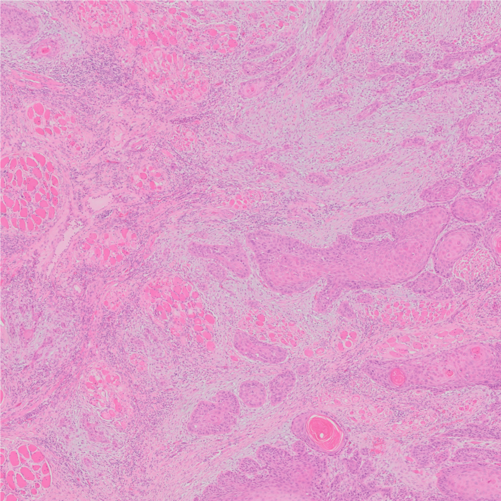{width=80%}

{width=80%}

 
## Diagram of CNN In Action: CONV 1

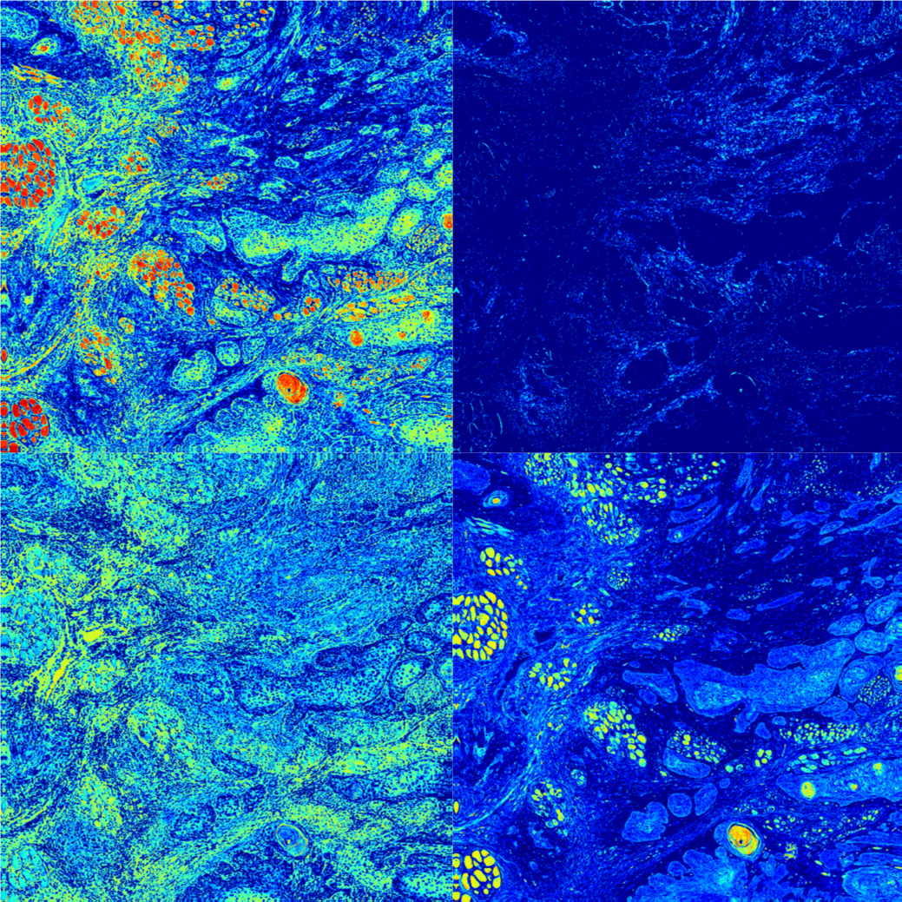{width=80%}

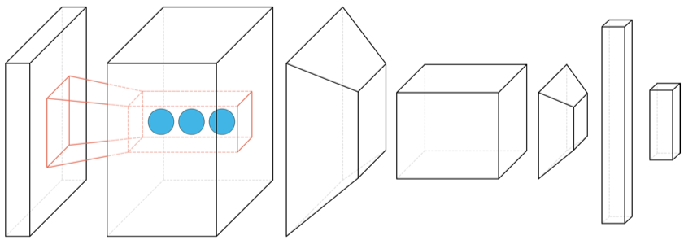{width=80%}

 
 
## Diagram of CNN In Action: POOL 1 

{width=80%}

{width=80%}

 
 
## Diagram of CNN In Action: CONV 2 

{width=80%}

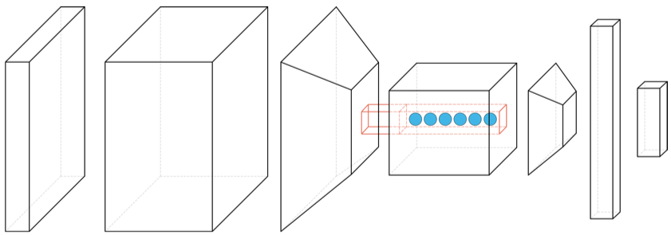{width=80%}

 
 
## Diagram of CNN In Action: POOL 2 

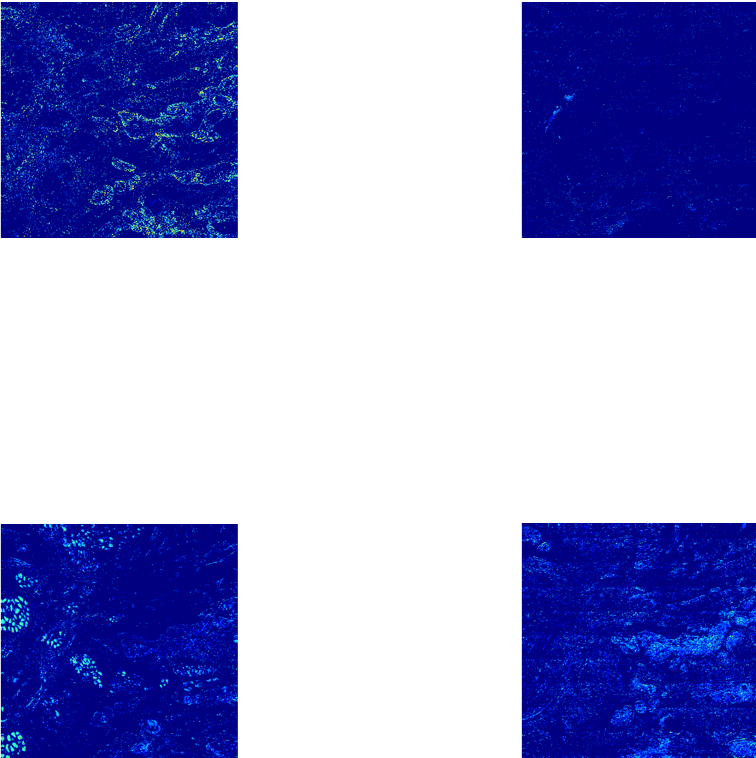{width=80%}

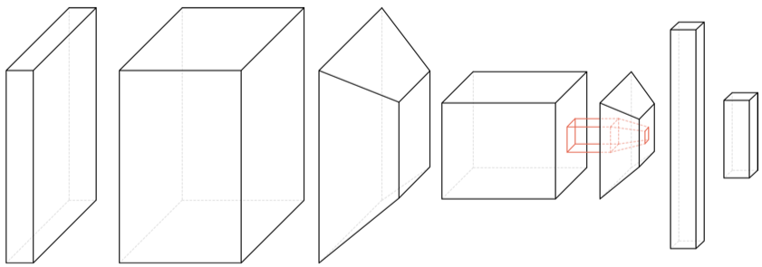{width=80%}

 
 
## Diagram of CNN In Action: FC 1 

{width=80%}

{width=70%}

 
 
## Diagram of CNN In Action: SOFTMAX

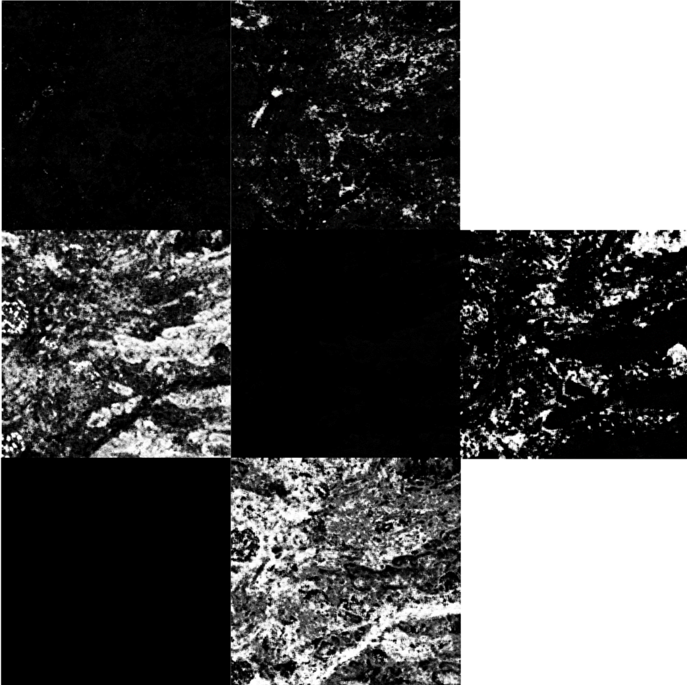{width=80%}

{width=80%}

 
 
## Diagram of CNN In Action: Output Mapping

{width=80%}

{width=80%}

# 
## Generative Models

## CNNs: Behind the Layers

So far, we've looked at CNNs for **classification**.

Central idea: they learn how to generalize the data they see (training) to
apply labels to a broad, unseen testing set.

They do this by understanding **higher-order** relationships between the input
data (pixel values).

Meaningful relationships between inputs and groups of inputs are learned,
essentially, through trial-and-error (i.e. backpropagation): Using errors in
classification to modify the "assumptions" (weights and biases) in the hidden
layers.

## Image Space and Manifolds

Think about the life of a CNN: the only thing it knows about the universe is
what is contained in the training data.

The CNN is trying to learn a **part of the image space** related to our
problem, which is defined by the training data.

## Image Space and Manifolds

The input **image space** is finite, meaning there is a limit to how many images you
can create given a fixed grid size. Within that grid, every image -- from birds
to faces to nuclei to genomic arrays -- can be constructed. 

You can think of this image space as a **manifold**, where similar images
appear close to one another and dissimilar images appear far apart (sound familiar?).

## Image Manifold Example

{width=75%}

## Understanding what CNNs "Know"

The question we have to ask is: Has the CNN **actually** learned these
relationships? Does it "know" what a tumor patch looks like, or is its idea of a
tumor patch fundamentally different from ours?

It would be great if we could ask the system to **draw** for us what it thinks
a particular class is like. 

## Image Manifold Sampling

{width=75%}

## Interpreting the Output

Has the classifier learned an "image manifold"?

What relationships between data exist in this manifold space?

Can we use this space to create realistic (but "imagined") additional samples?

## Enter: Variational Autoencoders

How do we build these systems? We need a setup that can do two things:

<ol>
<li class="fragment">Build an underlying manifold of image space given a set of training data;</li>
<li class="fragment">Sample from the underlying manifold to reconstruct sample inputs.</li>
</ol>

In this lecture we'll talk about **Variational Autoencoders** as the way to do
this. 

# 
## Autoencoders

## Second Things First: Autoencoders

Let's start by understanding an "autoencoder". 

Simply put, it's a neural network designed to take an input sample and
reconstruct it. So if you have an input \$\\mathbf{x}\$, the autoencoder will spit
out \$\\hat{\\mathbf{x}}\$, which is it's attempt to recreate \$\\mathbf{x}\$. 

Sounds simple, right?

## Autoencoder Generalizability

An autoencoder consists of: 

<ul>
<li class="fragment">An **encoder**, \$\\mathbf{h} = f(\\mathbf{x})\$: transforms input \$\\mathbf{x}\$ into a **code** (hidden layer); and</li>
<li class="fragment">A **decoder**, \$\\mathbf{r}=g(\\mathbf{h})\$, which produces a reconstruction.</li> 
</ul>

If we want to copy the inputs exactly, we could just say that the hidden layer
has the same dimensionality as the input, and the decoder has the same
dimensionality as the hidden layer, and then set all the weights to 1.

What would this look like?

## Meaningless Autoencoder

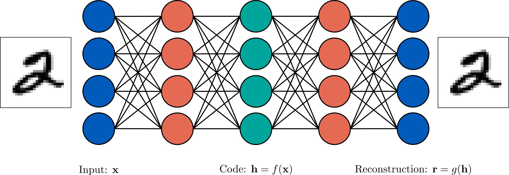{width=100%}

## Designed Imperfection

Obviously that isn't what we want. Instead, we restrict -- or **regularize**
-- the autoencoder so that we can't perfectly replicate the input data.

By doing this, we force the system to learn only the **most important parts**
of the input, so that it can achieve "pretty good" reconstruction using as
little information as possible.

## Bottlenecking

Example: You are moving from your parents' house into a new apartment. You like
your current bedroom, so you try to build a perfect replica in your new place. 

If you could bring everything you own -- if the "bandwidth" of the moving van
allowed you to bring all your possessions -- then you could build a 1:1 replica
of your room in your new place.

But if we impose a **bottleneck** -- for example, you can't afford a moving
van and have to cram everything into a tiny car -- then you have to pick and
choose what to bring with you to create the closest possible replica. 

It won't be perfect, but **what** you choose to bring says a lot about what
you think is important in the "concept" of what your bedroom is like.

## Undercomplete Autoencoders

One easy way to bottleneck is to specify that our encoder function
\$\\mathbf{h}=f(\\mathbf{x})\$ must have a lower dimension than the input
\$\\mathbf{x}\$. Thus, we are by definition throwing away some data when going from
\$\\mathbf{x}\\rightarrow\\mathbf{h}\$. 

## Autoencoder: Diagram

{width=100%}

## Undercomplete Loss Function

This is called an **undercomplete** autoencoder, and as with all neural
networks, it's trained by defining a loss function: 

\$ L(\\mathbf{x}, g(f(\\mathbf{x}))) \$

... which penalizes the system if the reconstruction output is dissimilar from
the input.

## Generalization of PCA

If \$L\$ is the mean squared error and the decoder function is linear, then the
subspace learned by the autoencoder is similar to PCA. 

If the decoder function is nonlinear, then we can build a more generalizable and
powerful version of PCA -- this is good!

But if the encoder and decoder have too much **capacity**, then they will not
extract any useful data from the training. Instead, they will just "memorize"
the training set, mapping each input to a single value in the hidden layer --
this is bad!

So... how do we know how much capacity to give our network?

# 
## Regularization

## Motivations for Regularization

By designing our system cleverly, we can address the issue of "capacity" by
making sure that our system has the right goals (defined by the loss function)
to learn important features of the input data **without** memorizing them. 

There are a bunch of ways to do this, and a lot of them involve changing the
loss function so that the network needs to learn to do something **in
addition** to copying the inputs.

## Sparse Autoencoders

**Sparse Autoencoders** add a sparsity term to the loss, so that the loss
function becomes: 

\$ L(\\mathbf{x}, g(f(\\mathbf{x}))) + \\Omega(\\mathbf{h})\$

The sparsity term \$\\Omega(\\mathbf{h})\$ is designed such that it forces the
system to **learn classification** in addition to the reconstruction.

## Denoising Autoencoders

**Denoising Autoencoders** work by modifying the loss function to be:

\$ L(\\mathbf{x}, g(f(\\widetilde{\\mathbf{x}}))) \$

where \$\\widetilde{\\mathbf{x}}\$ is a copy of \$\\mathbf{x}\$ with some random noise added to
it. So now, the second task is to **remove the noise component from the
sample** as well as reconstruct it from the code layer.

## Denoising Autoencoder Example

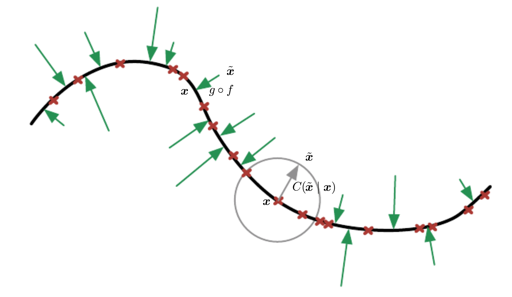{width=80%}

## Penalizing Derivatives

You can also create a version of a sparse encoder where the error term
takes both \$\\mathbf{x}\$ and \$\\mathbf{h}\$ as parameters:

\$ L(\\mathbf{x}, g(f(\\mathbf{x}))) + \\Omega(\\mathbf{h}, \\mathbf{x}) \$

In this version, \$\\Omega(\\mathbf{h}, \\mathbf{x})\$ is of the form:

\$ \\Omega(\\mathbf{h}, \\mathbf{x}) = \\gamma \\sum\_{i} |\\nabla\_{\\mathbf{x}} h\_{i}|\^{2} \$

What this means is that if the gradient of \$\\mathbf{x}\$ is small, then the
sparsity term is small and the classifier is close to calculating the
reconstruction loss exclusively. If the gradient is large, then the
loss will have to include a giant term, leading to more regularization.

This is called a **contractive autoencoder**.

## Autoencoders Galore

As you can imagine, there are a bunch of different ways you can try to
manipulate autoencoders to give you what you want: A meaningful representation
of the input data, encoded as \$\\mathbf{h}\$, that represents a low-dimensional
set of features related to the "image-space".

However, you can do more than just add terms to the loss function...

# 
## Variational Autoencoders

## VAE: Bayesian Approach

So far, the autoencoders are **deterministic** -- meaning that a particular
input is always mapped to the same code, and the same code is always mapped to a
particular output.

A VAE takes a slightly different approach by defining the encoder and decoder
probabilistically: 

\$ q\_{\\phi}(\\mathbf{h}|\\mathbf{x}) \\qquad \\textrm{Encoder} \$

\$ p\_{\\theta}(\\widetilde{\\mathbf{x}} | \\mathbf{h}) \\qquad \\textrm{Decoder} \$

This means that, given an input \$\\mathbf{x}\$, there is a **probability** that
we will observe \$\\mathbf{h}\$, and given a particular \$\\mathbf{h}\$, there is
another probability that we will observe \$\\widetilde{\\mathbf{x}}\$. These
probabilities are parameterized by \$\\phi\$ and \$\\theta\$, respectively.

## Conjugate Priors

We still need to "regularize", since the probabilities could learn to be
arbitrarily small (i.e. the distributions governing the mapping could just
become delta functions, with zero variance). So we force the system to implement
a **conjugate prior** in the form of a spherical unit Gaussian:

\$ \\mathbf{h}\\sim\\mathcal{N}(0,I) \$

Why is this useful?

## Bayesian Inference

In a Bayesian world, the things that we observe are random variables. This means
that there is some underlying distribution or "law" that says that certain
observations -- like a particular nuclear radius -- occur with a specific
probability. 

The goal in Bayes is to try and estimate that probability through observation or
training. 

## Image Features, Abstracted

By applying this process to autoencoders, we're saying that each image is a
**sample of a distribution** of possible images, and the dimensions of the
latent space encode **salient features of the image**. 

This means that in our low-dimensional code \$\\mathbf{h}\$, one dimension might
refer to the "tilt" of the numbers, one might refer to the sharpness of its
corners, etc.

## Sampling the Code

So now, we can do two things:

<ul>
<li class="fragment">First, we can view a low-dimensional representation of the input image data</li>
<li class="fragment">Second, we can **sample** this low-dimensional space and have the system generate samples that are maximally-likely to have come from that region</li>
</ul>

I think some examples are in order...

## Example: MNIST

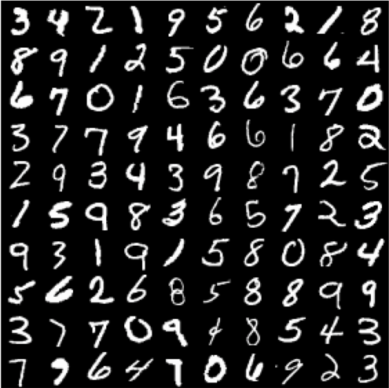{width=35%}

## Example: VAE model

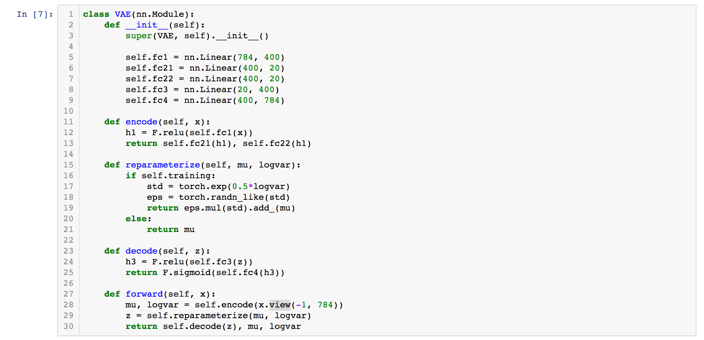{width=90%}

## Example: Training

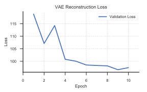{width=75%}

## Example: Epoch 1

{width=100%}

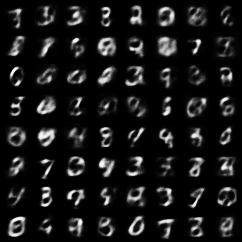{width=70%}

## Example: Epoch 5

{width=100%}

{width=70%}

## Example: Epoch 10

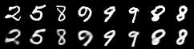{width=100%}

{width=70%}

## Example: Latent Walks

Finally, we can do something pretty cool: let's pick a set of continuous points
in the latent space, and generate samples from an evenly-spaced grid going from
one section to another and generating a continuous set of samples from the
space.

This helps us to visualize how the network "thinks" the universe appears, based
on the training data!

## Example: Latent Walks

{width=45%}

## Example: Latent Walks

{width=45%}

## Example: Latent Walks

{width=45%}

# 
## Parting Words

## Parting Words

These methods are very interesting, but we can make them even better by pitting
them against each other!

In the next lecture we'll talk about **adversarial networks**, where two
classifiers "fight it out" so that each gets better at creating new samples.

