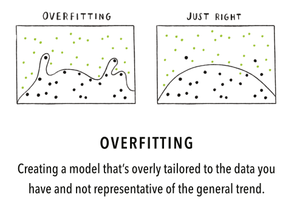
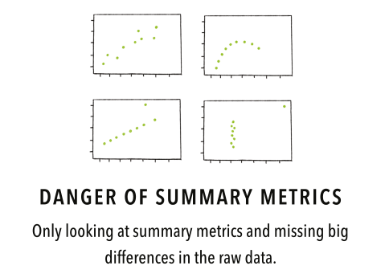
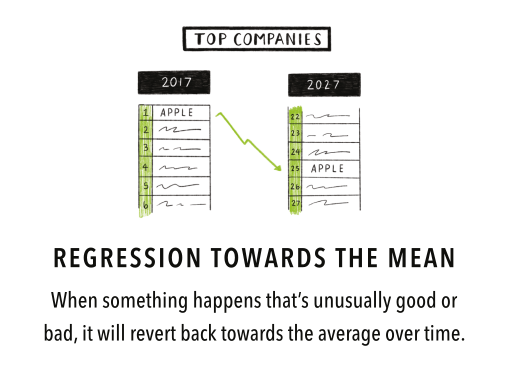
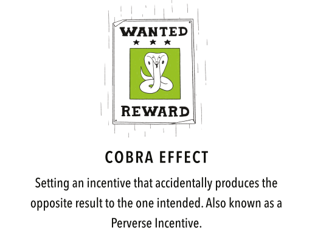
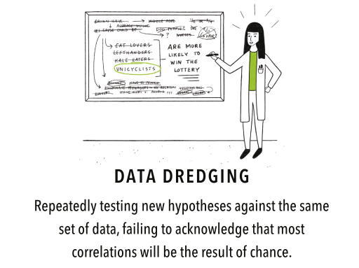
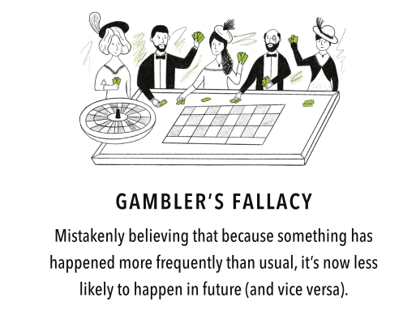
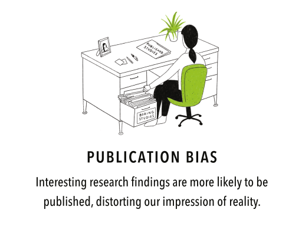
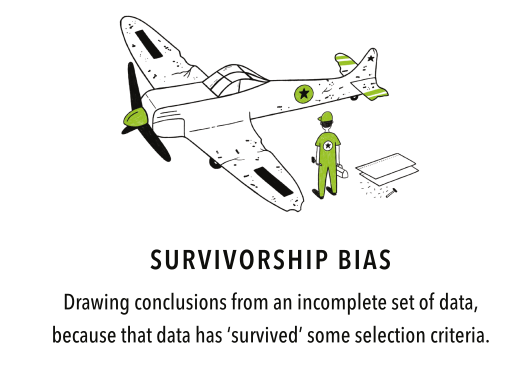

# 
## Announcements

## Final Project Details

The final writeup will be a journal manuscript-style report detailing the
project you've been working on.

It should be written formally, with a set of sections, references, figures, etc.

The other assignment pages will remain open, so if there's anything you're
missing, please submit it ASAP!

## Final Project: Outline

- Title
- Author List (and affiliations)
- Abstract
- Introduction / Previous Work
- Materials and Methods
- Experimental Setup
- Results
- Discussion / Conclusion

## Some Hints

- Intro / Previous Work should include details of any studies that have used this data,
  including a few citations on the background of the problem. 
- Materials / Methods is where you describe your data, any pre-processing steps,
  your classifiers, what do they do, and why you chose them. This should be in
  two sections: Supervised vs. Unsupervised.
- Experimental Setup is where you describe the process of classification --
  cross-validation, train/test splits, etc.
- Results and Discussion can be merged, but this is where you go through all the
  results that you've got so far and what those results mean **in the context of
  your chosen problem.**

# 
## Engineering Responsibility

## Biases, Biases Everywhere

When working with data, it's easy to think that because you're "doing science,"
you are being objective and free from bias.

**This is dangerous and wrong!**

## Dangers of Mathematics

\\begin{block}{Cathy O'Neil, "Weapons of Math Destruction"}
\\textit{Models are opinions embedded in mathematics.}

\\textit{We're weaponizing math, because people are afraid of math, and they trust math, and they stop asking questions when they see formulas…}
\\end{block}
  
## Responsibility to the Client

As engineers, we have a **responsibility** to be clear about how our methods
work, as well as the biases and potential pitfalls in applying our algorithms to
real-world data, where there are real consequences.

We cannot predict all of our mistakes and biases, but we can try to steer clear
of some of the biggest ones.

# 
## Data Fallacies

## Source of the List

There are different types of fallacies -- logical, philosophical, etc. -- but
here we deal with "data" fallacies, those that arise from misinterpretation
(either intentional or unintentional) of data.

This list originated from the [Data Literacy
Guide](https://www.geckoboard.com/learn/data-literacy/) on Geckoboard.com (no
affiliation), and provides a nice pictoral overview of some common data
fallacies.

## Overfitting

{width=60%}

## Summary Statistics

{width=60%}

## Cherry Picking

{width=60%}

## Sampling Bias

{width=60%}

## Regression Towards the Mean

{width=60%}

## Cobra Effect

{width=60%}

## Data Dredging

{width=60%}

## False Causality

{width=60%}

## Gambler's Fallacy

{width=60%}

## Gerrymandering

{width=60%}

## McNamara Fallacy

{width=60%}

## Hawthorne Effect

{width=60%}

## Publication Bias

{width=60%}

## Simpson's Paradox

{width=60%}

## Survivorship Bias

{width=60%}
